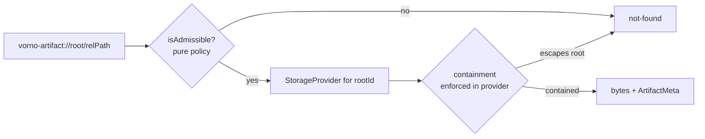

# Artifact Storage Providers

*Contributor reference for anyone adding a storage backend to the artifact plane.*

This document specifies the `StorageProvider` contract — the one path from a
`vorno-artifact://` URI to bytes — the containment invariant every backend must
honor, and the pure `isAdmissible` policy predicate that sits in front of it. It
is the reference for authoring a **future** backend (object store, in-memory,
presign-capable, …). It does **not** describe a second built-in provider: as of
C2 the only implementation is `FilesystemStorageProvider`, and the optional
capability interfaces ship as *types only*.

**Governance:** the seam is [ADR-0018](../roadmap/decisions/0018-storage-provider-seam-and-pure-admissibility.md)
(provider seam + pure admissibility). The config shape that lets a new kind be
declared without a migration is [ADR-0019](../roadmap/decisions/0019-storage-root-config-schema-and-provider-kind-namespace.md)
/ [PLAN-029](../roadmap/plans/planned/PLAN-029-storage-provider-config-and-management-surfaces.md).
The URI scheme and open namespaces are [ADR-0016](../roadmap/decisions/0016-artifact-uri-scheme-and-open-type-registry.md).

**Source of truth (do not let this doc drift from it):**

- Interfaces — [`packages/shared/src/artifacts/storage/provider.ts`](../packages/shared/src/artifacts/storage/provider.ts)
- Filesystem impl — [`packages/shared/src/artifacts/storage/filesystem.ts`](../packages/shared/src/artifacts/storage/filesystem.ts)
- Admissibility — [`packages/shared/src/artifacts/admissibility.ts`](../packages/shared/src/artifacts/admissibility.ts)
- Root registry / factory — [`packages/shared/src/artifacts/roots.ts`](../packages/shared/src/artifacts/roots.ts)
- Capability descriptor — `StorageCapabilities` in [`packages/core/src/types/artifacts.ts`](../packages/core/src/types/artifacts.ts)

---

## 1. The picture



Two gates, deliberately separate:

- **`isAdmissible`** — a pure predicate over the canonical URI. Policy only:
  *is this URI even eligible to be read?* No I/O, no enumeration, order-independent.
- **The provider** — owns all I/O **and** containment. It converts a URI to
  bytes and is the sole authority on whether the target physically lives inside
  the root. A URI that passes admissibility can still be denied by containment.

A backend author implements the provider. Admissibility is shared and you do not
touch it.

---

## 2. `StorageProvider` — the required core

Every backend implements exactly this (`provider.ts`):

```ts
export interface StorageProvider {
  readonly kind: string;               // 'filesystem' | 'object-store' | 'memory' | '<prefix>:<name>'
  readonly capabilities: StorageCapabilities;
  stat(uri: string): Promise<Result<ArtifactMeta>>;
  read(uri: string, opts?: ReadOpts): Promise<Result<{ bytes: Buffer; meta: ArtifactMeta }>>;
  /** Files only, recursive, lazily; throws StorageOpError on an unservable root. */
  list(opts?: ListOpts): AsyncIterable<ArtifactMeta>;
  exists(uri: string): Promise<boolean>;
}
```

Contract notes:

- **No method returns a raw physical path.** This is the containment boundary
  (ADR-0018 door 2). `ArtifactMeta` carries the canonical `uri`, size, times, and
  optional validators (`contentHash`, `etag`, `version`, `gitSha`) — never an
  absolute path. A leaked path is a bug, not an optimization.
- **`Result<T>` for stat/read/exists-adjacent ops**, `err(kind, retryable?)` /
  `ok(value)` helpers. `list` is an `AsyncIterable` (a `Result` doesn't fit an
  iterator), so it throws `StorageOpError` on an unservable root instead.
- **Errors** are a fixed small set (`StorageErrorKind`): `'not-found'`,
  `'too-large'`, `'unsupported'`, `'io'`. `retryable` is orthogonal to kind
  (OpenDAL convention) — a transient `io` may be retried.
- **`not-found` is overloaded on purpose.** Containment-denied returns
  `not-found` — a caller must **not** be able to distinguish "absent" from
  "outside the root," or the error itself becomes a path-probing oracle.
- **`read` fills `contentHash`** (sha256 lowercase hex, ADR-0016 §5). `stat` may
  leave it undefined. `ReadOpts.maxBytes` makes `read` reject with `too-large`
  rather than read past the cap; `ReadOpts.withVersion` opts into
  provider-native version info (filesystem: a `gitSha` subprocess).
- **`list` policy stays with the caller.** `ListOpts.skipDir` /`maxDepth`/`prefix`
  let the index apply *its* shape policy; the provider just walks. Index policy
  is not storage policy.

### `ArtifactMeta` — the storage-agnostic stat shape

```ts
interface ArtifactMeta {
  uri: string;                 // canonical vorno-artifact:// URI
  type: 'file' | 'dir';
  sizeBytes: number;
  mtimeMs?: number;
  contentHash?: string;        // sha256 lowercase hex — filled by read (ADR-0016 §5)
  etag?: string;               // object-store native validator, opaque (NOT a content hash)
  version?: string;            // object-store versionId when versioning is on
  gitSha?: string;             // filesystem-native version info, best-effort
}
```

Fields beyond the first three are backend-native and optional; fill what your
address space actually provides. Do **not** put an `etag` in `contentHash` — one
is an opaque validator (RFC 9110 §8.8), the other a real hash of the bytes.

---

## 3. Optional capabilities

Extra abilities are additive interfaces (Go `io/fs` pattern) — never bolted onto
the core, always type-guarded:

```ts
interface WriteCapable   { write(uri, bytes): Promise<Result<ArtifactMeta>>; delete(uri): Promise<Result<void>>; }
interface CopyCapable    { copy(from, to): Promise<Result<ArtifactMeta>>; }
interface PresignCapable { presignRead(uri, ttlSec): Promise<Result<string>>; }
```

Two-track negotiation (a remote client cannot type-assert a server-side object):

1. **In-process** — narrow with the exported type guards before calling:

   ```ts
   if (isWriteCapable(provider)) await provider.write(uri, bytes);
   ```

   (`isWriteCapable` / `isCopyCapable` / `isPresignCapable`.)

2. **On the wire** — the serializable `StorageCapabilities` descriptor rides
   `vorno:artifacts:roots:list` so a remote client learns what a root can do:

   ```ts
   interface StorageCapabilities {
     read: boolean; stat: boolean; list: boolean; contentHash: boolean;
     write: boolean; delete: boolean; copy: boolean; presign: boolean;
   }
   ```

**Declare capabilities honestly.** The descriptor must match reality: if
`capabilities.write` is `true`, the provider must implement `WriteCapable`, and
vice versa. A config never grants a capability the provider lacks
(ADR-0019 §3) — capability is provider-authoritative, always.

> **C2 status:** the artifact plane is **read-only**. `WriteCapable` /
> `CopyCapable` / `PresignCapable` ship as *interfaces only*; nothing implements
> them yet, and `FilesystemStorageProvider` reports `write/delete/copy/presign:
> false`. They exist so a future write path (or a hosted object store) is
> additive, not a breaking change.

---

## 4. The containment invariant (ADR-0018 door 2)

> **A resolved physical location never leaves the provider, and every access is
> proven to fall inside the root before bytes are returned.**

This is the artifact-plane trust boundary (root bindings, ADR-0016 §2). The
predicate is one idea expressed in two address spaces:

| Backend | Containment check |
|---------|-------------------|
| **Filesystem** | `realpath(target)` must equal the root or start with `realpath(root) + separator`. Realpath first — so symlinks, `..`, and sibling-prefix roots (`/data/foo` vs `/data/foobar`) can't escape. |
| **Object store** | `key` must fall under `prefix + delimiter` (exact prefix + trailing `/`), the same predicate translated to a flat keyspace. |

Same invariant, evaluated **inside** the provider, on **every** `stat`/`read`/
`exists`/`list` element. Rules for an author:

- Resolve and containment-check in a **private** method; the resolved path/key is
  local to the class and never returned, logged to the wire, or put in
  `ArtifactMeta`.
- A target that escapes the root resolves to `not-found` — indistinguishable
  from absent (see §2).
- Apply the size cap (`ReadOpts.maxBytes`) at read time inside the provider, not
  in a caller.

`FilesystemStorageProvider` is the worked example; its containment tests live in
`packages/shared/src/artifacts/__tests__/storage.test.ts` (symlink escape,
sibling-prefix, `..` traversal, TOCTOU). A new backend brings its own
equivalent behavioral tests.

---

## 5. The pure `isAdmissible` precondition (ADR-0018 door 1)

`isAdmissible` (`admissibility.ts`) is the **one** gate in front of every read —
both `read` and `exportObsidianVault` call exactly this predicate, so the gate
can never diverge again (the SEC-1 fix):

```ts
export function isAdmissible(
  uri: string,
  providers: Map<string, StorageProvider>,
  pinned: (uri: string) => boolean,
): boolean
```

It is **pure**: a function of the canonical URI plus the bound-root set. No I/O,
no directory enumeration, order-independent. The formula (ADR-0016 door 4):

> readable ⟺ **bound root** ∧ ( **indexed location** ∧ **registered extension** ) ∨ **pinned**

- **Bound root** — `parsed.rootId` is in the `providers` map.
- **Indexed location** — `isIndexedLocation`: a pure path-shape test matching the
  shape the scanner surfaces (workspace root → `sessions/<id>/(plans|data)/**`
  within the session depth cap; a configured root → anywhere within the corpus
  depth cap; skipped dir names — `node_modules`, `.git`, dot-dirs — exclude).
  The shape constants are **shared with the scanner**, so gate ≡ scan surface by
  construction.
- **Registered extension** — the final segment's lowercase ext is in the open
  type registry.
- **Pinned** — an explicit pin bypasses the location/extension shape test.

Two hard rules for a backend author:

1. **PRECONDITION: the URI must be canonical** (`canonicalizeArtifactUri`,
   ADR-0016 §5) before it reaches this predicate. The module never normalizes —
   it rejects. `parseArtifactUri` is the sole admission point.
2. **`GLOBAL_FILE_CAP` is a *listing* bound only** (it lives in `scan.ts`). It
   never gates readability — an admissible URI stays readable even if the volume
   cap dropped it from a listing (the SEC-2 fix). Do not re-introduce a
   volume-dependent read gate.

Admissibility is **policy**; containment + size cap are **enforcement** (§4). Do
not merge them: a backend author implements enforcement and inherits policy
unchanged.

---

## 6. Wiring a root: the factory seam

Bindings resolve through `resolveRootBindings` (`roots.ts`) into a
`Map<rootId, StorageProvider>`. The `workspace` root is always present
(zero-config); configured roots come from workspace settings and are the
trust boundary — **binding config never rides the wire** (ADR-0016 §2).

Today `resolveRootBindings` constructs a `FilesystemStorageProvider` per entry.
PLAN-029 introduces the single plug-in point where a new kind registers — a
provider **factory** dispatched on `kind`:

```ts
// Shape introduced by ADR-0019 / PLAN-029 — the one registration point.
function createProvider(rootId: string, cfg: RootBindingConfig): StorageProvider | null {
  switch (cfg.kind) {
    case 'filesystem':   return new FilesystemStorageProvider(rootId, cfg.path); // absolute-path check here
    // case 'object-store': return new ObjectStoreProvider(rootId, cfg);          // future — one case
    default:             return null; // unknown/prefixed kind: skip + debug, never throw
  }
}
```

Resolution stays **tolerant**: an unknown kind is skipped and debug-logged, never
thrown, so a newer config never bricks an older Vorno. (Strict rejection of a bad
kind happens server-side on *save*, not at resolution — see PLAN-029.)

---

## 7. Adding a new backend — checklist

1. **Implement `StorageProvider`** in `packages/shared/src/artifacts/storage/`
   (`stat`/`read`/`list`/`exists` + `kind` + `capabilities`). Return `Result`,
   never throw across the core boundary (except `list`'s `StorageOpError`).
2. **Own containment** inside the provider (§4). Resolve to a private
   location; escapes → `not-found`; never leak a physical path.
3. **Declare `capabilities` honestly** (§3) and implement any optional
   capability interface you advertise. Read-only? Everything write/copy/presign
   is `false`.
4. **Pick a `kind`** in the reserved ADR-0016 §3 open-string space: un-prefixed
   names (`filesystem`, `object-store`, `memory`) are reserved for system
   built-ins; a third-party backend uses a registered `<prefix>:<name>`
   (lowercase-kebab).
5. **Add the config variant** — a `RootBindingConfig` arm (ADR-0019 §1) and a
   `createProvider` case (§6). No config migration: existing string paths stay
   filesystem shorthand.
6. **Secrets go to the vault, never inline.** A secret-bearing kind references a
   vault key resolved server-side (ADR-0013 path); it does **not** carry inline
   secrets, and secrets never ride the REMOTE_ELIGIBLE wire (ADR-0019 §4). This
   mechanism is gated on the hosted track (PLAN-023).
7. **Inherit admissibility unchanged** (§5) — do not add a backend-specific read
   gate. If your address space needs a new *shape*, that is a scanner change +
   ADR, not a per-provider bypass.
8. **Bring behavioral tests** mirroring the filesystem suite (containment
   escapes, size cap, not-found overloading) and keep the 100+ artifact tests +
   typecheck + build check green.

---

## See also

- [ADR-0018](../roadmap/decisions/0018-storage-provider-seam-and-pure-admissibility.md) — provider seam + pure admissibility (the two doors this doc formalizes)
- [ADR-0019](../roadmap/decisions/0019-storage-root-config-schema-and-provider-kind-namespace.md) — config schema + provider-kind namespace
- [ADR-0016](../roadmap/decisions/0016-artifact-uri-scheme-and-open-type-registry.md) — URI scheme, canonicalization, open registries, root-binding trust boundary
- [PLAN-029](../roadmap/plans/planned/PLAN-029-storage-provider-config-and-management-surfaces.md) — config / management / documentation surfaces
- User-facing help: [Artifact Roots and Storage](user-guide/artifact-roots-and-storage.md)
