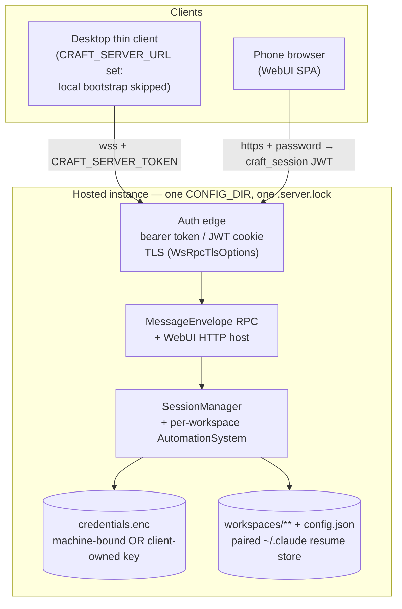
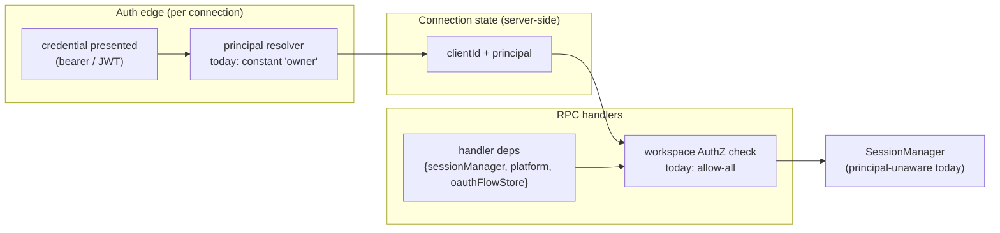
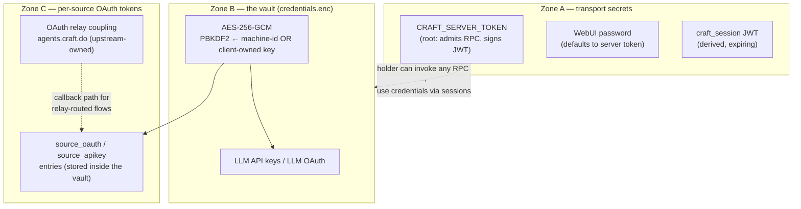
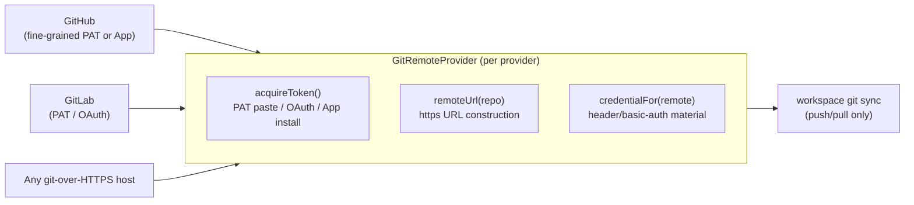

# Hosted Workspace Server — AuthN/AuthZ & Instance/Workspace Architecture

**Status:** Phase 0 design (PLAN-023). Design only — nothing here ships code.
**Companion ADR:** [ADR-0013](../roadmap/decisions/0013-hosted-workspace-authn-authz-architecture.md).
**Reviewed against:** ADR-0005 (config-dir / `~/.claude` pairing), ADR-0008 (trigger deployment unit), ADR-0012 (`vorno:*` additive namespace).

This document is the "boxes and arrows" for hosting a user's workspaces on a self-hosted app-server (`packages/server` via `bootstrapServer`), with the desktop app attaching as a thin client and phones reaching the same workspaces over the WebUI. Every claim is grounded in the code as of this writing; line numbers drift, symbol names don't.

---

## 1. System overview

Two server stacks exist and stay distinct (ADR-0008): `apps/server` is the machine-to-machine **trigger surface**; `packages/server` + `packages/server-core` is the **app-server** that hosts workspaces, serves the WebUI SPA, and speaks the full `MessageEnvelope` RPC. The hosted-workspace unit is the app-server: `bootstrapServer()` (`packages/server-core/src/bootstrap/headless-start.ts:266`) wires the `SessionManager`, acquires the single-writer `{CONFIG_DIR}/.server.lock` (`headless-start.ts:122`), and starts the WS RPC + WebUI HTTP host.



Grounding:

- **Thin client:** when `CRAFT_SERVER_URL` is set, Electron skips all server-side initialization (no local `SessionManager`, no credential checks) and connects via `WsRpcClient` (`apps/electron/src/main/index.ts:509`, transport client in `packages/server-core/src/transport/client.ts`). Self-signed certs are accepted only for the exact configured origin (`index.ts:276`).
- **Phone:** the WebUI SPA (`apps/webui/src/App.tsx`) fetches `/api/config`, gets a same-origin `wss://host/ws` URL, and rides the single-port WS proxy — the WebUI port proxies `/ws` to the loopback RPC listener (`apps/electron/src/main/webui/handler.ts:81` for the packaged app; the headless app-server serves both from `packages/server-core/src/webui/http-server.ts`).
- **Lock:** one `bootstrapServer` per CONFIG_DIR. ADR-0008's standalone trigger server also takes this lock, so a trigger deployment and a hosted app-server on the *same* CONFIG_DIR are mutually exclusive by construction — coexistence on one host requires distinct config dirs.

## 2. Server instance identity

**What exists today: nothing durable.** `serverId` is a bootstrap option defaulting to `'headless'` (`headless-start.ts:319`), stamped on outgoing envelopes for event routing. The lock file holds only `{pid, startedAt}`. The machine id (`getStableMachineId()`) is used *only* for vault key derivation — it is not, and must not become, an instance identifier (it would leak hardware identity onto the wire).

**Design: a persistent instance identity, additive under `vorno:*` (ADR-0012).**

- A hosted instance generates `instance.json` in its CONFIG_DIR on first boot: `{ instanceId: <random UUID>, displayName: <user-editable>, createdAt }`. Random, not hardware-derived; survives restarts and container rebuilds (it lives on the volume); regenerated only if the file is absent.
- The existing `serverId` handshake/envelope field carries `instanceId` instead of `'headless'` — this reuses a field already on the wire (`packages/shared/src/protocol/types.ts`, `serverId?: string`), so upstream-compatible clients are unaffected.
- Richer instance metadata (display name, version, capabilities) is served over a new additive RPC channel, `vorno:server:info`. Clients that don't speak it work unchanged (ADR-0012 §3). **Binding rule (ADR-0013 §5, accepted 2026-07-19):** `serverId` carries exactly the opaque `instanceId` UUID and nothing else, forever — all metadata growth rides `vorno:server:info` (additive response fields), and anything hypothetically needed at handshake time gets a new `vorno:*` handshake extension, never a `serverId` format change.
- **Uses:** connection URLs and QR codes (Phase 3), the desktop's "known instances" list (instance identity is the stable key; URL and display name are attributes that may change), and disambiguating events when a desktop is attached to a hosted instance while also running local workspaces.
- **Distinct from user identity by design:** an instance is a *place* (one CONFIG_DIR); a user is a *principal*. Today they are 1:1; the multi-user future makes them 1:N without touching instance identity.

## 3. User identity — single-user now, multi-user as a named future

### 3.1 Today's model (unchanged by this design)

Single-user, two doors into the same authority:

| Door | Mechanism | Grounding |
|---|---|---|
| WS RPC (desktop thin client, CLI) | Bearer `CRAFT_SERVER_TOKEN`, checked at handshake: `validateToken: async (t) => t === serverToken` | `headless-start.ts:269`, wired at `:317` |
| WebUI (phone browser) | Password (`CRAFT_WEBUI_PASSWORD`, falling back to the server token) → `POST /api/auth` → JWT in `craft_session` cookie; the cookie also validates the WS upgrade | `packages/server-core/src/webui/http-server.ts:191–288`, cookie name in `webui/auth.ts`; `validateSessionCookie` wiring in `packages/server/src/index.ts:173` |

Both doors admit *the* user; there is no principal concept anywhere past the edge. Note the coupling: the JWT is signed with the server token, and the WebUI password defaults to it — so today the server token is the root secret of the transport zone (see §4).

### 3.2 The multi-user seam (design constraint, not implementation)

Multi-user AuthN and per-workspace AuthZ are **explicitly out of scope to build** (PLAN-023 non-goal). The Phase 0 obligation is to show where a principal *would* thread so nothing we ship forecloses it.



The threading points, grounded:

1. **Edge → principal.** `bootstrapServer` already accepts `validateToken` / `validateSessionCookie` callbacks (`headless-start.ts`, options; `transport/server.ts:79–114`). The multi-user shape is the same callbacks returning a *principal* instead of a boolean — a widening of a return type at an existing seam, not a new surface. The widening is `⇒ Promise<Principal | null>` where **`Principal = { iss, sub, claims, expiresAt }`**, keyed on `(iss, sub)` — never email/username (OIDC Core §5.7: `iss`+`sub` are the only stable identifier). Today's implementation returns the constant `{ iss: 'local', sub: 'owner' }`. Fixing the shape now is deliberate: stored principal keys are load-bearing for every future AuthZ row, and retrofitting `(iss, sub)` keying after principals persist is a data migration (ALIGN D-1).
   - **The OIDC edge, when it lands, is an HTTP redirect endpoint — not the WS handshake.** Authorization-code + PKCE needs a browser round-trip (`/auth/login` → IdP → `/auth/callback`) *before* any token exists; that flow cannot run inside a WS `onopen` frame. The redirect endpoint mints the session; the WS callbacks *validate* the resolved principal. The WebUI already has this shape (HTTP `/api/auth` → cookie → WS validates cookie). **App-embedded OIDC RP is the product AuthN target; reverse-proxy forward-auth (oauth2-proxy/Authelia/Pomerium) is an optional operator deployment, never the only path** — forward-auth assumes a browser-with-cookie and breaks for the desktop/CLI/WS client mix (ALIGN D-3).
   - **The `craft_session` cookie is a BFF session wrapper, not the identity token.** Identity derives from a validated credential (today the password check; later a JWKS-validated RS256/ES256 IdP token — the existing `jose` dependency already supports JWKS). The cookie format stays free to evolve without a breaking change (ALIGN D-4).
2. **Principal rides connection state, not the envelope.** `MessageEnvelope` (`packages/shared/src/protocol/types.ts:20–63`) carries `token` only at handshake and has no identity field — correct, and we keep it that way. The server already assigns `clientId` per connection; principal is server-side state keyed the same way. **Nothing multi-user ever needs a wire change**, which keeps ADR-0012's additive rule intact.
3. **AuthZ unit = workspace.** `SessionManager` scopes config watchers and `AutomationSystem` per workspace; the trigger server already established per-key *workspace scoping* as the fork's authorization vocabulary (`apps/server/src/config.ts`, `ApiKeyPermissions`). Per-workspace ACLs (`principal → workspace → role`) sit at the point where handlers resolve a `workspaceId` to a workspace — one choke point, before `SessionManager` is invoked. `SessionManager` itself stays principal-unaware in the single-user phase; if multi-user lands, it receives the principal as an argument at its public methods, not as constructor state (it is a per-CONFIG-DIR singleton, `packages/server/src/index.ts:207`).
   - **IdP groups are translated, never adopted.** There is no standard `groups` claim — Auth0 uses namespaced arrays, WorkOS org+role slugs, Keycloak `resource_access.<client>.roles`, Entra opaque GUIDs with a 200-group overage. An external group must never *be* a workspace role; the design is an explicit, per-issuer, configurable-claim-path mapping table **`(iss, external_group) → workspace → role`** with a default/no-match role, sitting between the principal's claims and the workspace choke point (ALIGN ARCH-003).
4. **What we must not do now:** no per-user vault partitioning, no per-user config dirs, no principal field on the wire. Each would be speculative structure (and the vault one is a genuine one-way door — see §4.3).

## 4. Token & credential trust boundaries

Three zones, drawn explicitly. Compromise analysis is the point: what does each secret admit?



### 4.1 Zone A — transport secrets

`CRAFT_SERVER_TOKEN` admits full RPC (every workspace, every session), and because the JWT secret and default WebUI password both derive from it, **Zone A currently has exactly one root secret**. Compromise ⇒ full *use* of the instance: an attacker can run sessions that exercise every credential, but cannot *exfiltrate* Zone B/C secrets directly (the vault never leaves the server; the RPC has no "dump credentials" surface). Rotation = restart with a new token + re-pairing clients. A hosted instance should split the WebUI password from the server token as deployment guidance (already supported: `CRAFT_WEBUI_PASSWORD`, `packages/server/src/index.ts:141`) so the phone-facing secret is rotatable independently of the desktop pairing. Future multi-user replaces "the token" with per-principal credentials at this same edge — Zone A is where multi-user AuthN lives, and *only* here.

**Named zero-trust gaps, carried deliberately (ALIGN SEC findings):** the single-root-secret coupling above is **SEC-001** (Phase 1 splits the WebUI password in code, not just guidance); one-handshake connection-lifetime auth with no re-validation or revocation is **SEC-003** (acceptable for a static token; needs an in-band re-auth or close-on-expiry signal over `vorno:*` before OIDC-expiring tokens exist); and the cookie-authed WS upgrade currently performs **no `Origin` validation** — **SEC-005**, the textbook Cross-Site WebSocket Hijacking setup. The `Origin` allowlist is a Phase-1 hardening line: a few lines of code, independent of OIDC, to land before any hosted instance ships.

### 4.2 Zone B — the vault

`credentials.enc` in CONFIG_DIR: AES-256-GCM, key = PBKDF2(100k, SHA-256) over a hash of `getStableMachineId()` (`packages/shared/src/credentials/backends/secure-storage.ts:67–101, 321–335`). Machine id per platform: macOS IOPlatformUUID, Windows MachineGuid, Linux dbus/etc machine-id — with a **weak fallback of `username:homedir`** when none resolves, which is exactly what happens in a container without a bind-mounted machine-id (ADR-0008 flagged this). Compromise of the vault *file alone* is useless without the key material; compromise of file + host machine-id ⇒ every LLM and source credential. The vault is machine-bound by design, which is also why it is the one non-portable artifact in migration (PLAN-023 §portability).

### 4.3 The client-owned key option (zero-trust direction)

Alongside the machine-bound default, an **opt-in client-owned vault key**:

```mermaid
sequenceDiagram
  participant U as User (browser/desktop UI)
  participant S as Hosted instance
  participant V as credentials.enc
  U->>S: enable client-owned key
  S->>S: generate 256-bit key
  S-->>U: key shown ONCE, limited window<br/>(explicit "lost key = re-auth everything" consent)
  S->>V: re-encrypt vault, header marks key-mode + KDF params
  Note over S: key held in memory for the process lifetime,<br/>never written to disk
  U->>S: (after restart) supply key to unlock
  S->>V: decrypt; wrong/lost key → vault reset + re-auth all sources
```

Design commitments:

- **Machine-bound stays the default; client-owned is opt-in.** Non-technical users keep the zero-ceremony path.
- The vault file gains a small versioned header recording key-mode (`machine` | `client`) and KDF parameters. This is the one *format* change, and it must be versioned from day one — retrofitting a header onto an unversioned format is the trap. **Accepted 2026-07-19 with the additive-only evolution rule (ADR-0013 §4a):** the header is a versioned, self-describing envelope; future changes add fields (readers ignore unknown fields) or bump the version while still parsing all prior versions; fields are never repurposed or removed; a vault written by version N is readable by every version ≥ N.
- **Authentication ≠ decryption, permanently (ADR-0013 §4b).** IdP/OIDC login — when it exists — authenticates the principal and never unlocks the vault. Recovery is user-held (recovery codes / user-managed key backup), never IdP escrow: "log in with your IdP to recover your vault" would silently recreate exactly the trust this option removes, and is prohibited without a superseding ADR. (Bitwarden's auth≠decryption separation is the reference model.)
- The key is generated server-side, displayed once in the UI within a limited window, then never again; retention is the user's responsibility. **Lost key = re-auth everything** — the UI must make the consequence unmistakable at reveal time, not in docs.
- Consequences that make this the zero-trust/migration-friendly path: the vault becomes host-independent (restorable from backup onto a new host; solves the container weak-fallback problem outright), and a host image/volume leak no longer yields credentials without the user-held key.
- After restart the vault is locked until the key is supplied — a hosted instance's automations can't touch sources until unlock. That operational cost is inherent to the model and must be stated in the enable flow.

### 4.4 Zone C — per-source OAuth tokens

Stored inside the vault (`source_oauth` / `source_apikey` / `source_bearer` / `source_basic`, `packages/shared/src/sources/credential-manager.ts:311–330`) but a distinct trust zone because their *blast radius* is external: compromise grants the user's Google/GitHub/etc. accounts to the token's scope, independent of Vorno. Two acquisition paths exist today (`credential-manager.ts:414`, `prepareOAuth`):

- `callbackPort` (desktop): loopback `http://localhost:<port>/callback` — no third party. (The host is deliberately `localhost`, not `127.0.0.1` — `callback-server.ts:30–32` — which matters for host-exact redirect-URI allowlists.)
- `callbackUrl` (WebUI): the provider-facing `redirect_uri` is pinned to the **upstream-owned relay** `OAUTH_RELAY_CALLBACK_URL` = `https://agents.craft.do/auth/callback` (`packages/core/src/branding.ts:68, 96`; wrap in `packages/shared/src/auth/oauth-relay.ts:77`), which bounces to the local `/api/oauth/callback` (`http-server.ts:306`).

For a hosted instance the relay coupling is a trust leak (authorization codes transit an upstream-owned host) and a hidden availability dependency — a live zero-trust violation, named **SEC-004**, not merely a Phase-2 TODO. The sharpened blast radius: only the *initial* WebUI authorization code transits the relay (token refresh is direct-to-provider, `credential-manager.ts:925–1262`), and the outer relay `state` envelope is base64url-encoded but **unsigned** — `returnTo` integrity rests entirely on the out-of-repo relay worker. Phase 2 removes it: Vorno-owned OAuth client IDs with the hosted instance's own origin as `redirect_uri` where providers allow it, a Vorno-owned relay only where they don't. The architecture point for Phase 0: **the token must land in the *server's* vault regardless of which browser ran the flow** — the plumbing (`prepareOAuth({callbackUrl})` + server-side `/api/oauth/callback`) already writes server-side; only the relay ownership and origin wiring change.

## 5. Onboarding surface — "connect to your online Vorno"

Today thin-client mode is env-var-only (`CRAFT_SERVER_URL`); there is no persisted "known server" and no onboarding path to one. The first-run wizard (`apps/electron/src/main/onboarding.ts`; steps in the renderer registry) runs Welcome → ProviderSelect → Credentials → Completion, entirely about *local* LLM credentials.

Design (feeds Phase 3):

- **The fork in the road goes at ProviderSelect.** First-run offers two modes: *"Set up this computer"* (existing flow, unchanged) and *"Connect to your online Vorno"* — which collects instance URL + pairing token (Phase 3: QR encoding both, stamped with the `instanceId` from §2), verifies via the existing `WsRpcClient` handshake, and **skips local credential setup entirely** (a thin client runs no local `SessionManager` and needs no local LLM key; `apps/electron/src/main/index.ts:509` behavior, made persistent).
- **Known instances are config, not env.** A `vorno`-namespaced entry in local desktop config persists `{instanceId, url, displayName}`; `CRAFT_SERVER_URL` remains the escape hatch and always wins (mirroring ADR-0005's env-override discipline). The pairing token is a Zone A secret and belongs in the *desktop's* local vault, not plaintext config.
- **The connection-error screen is the same surface.** PLAN-022's `ConnectionErrorScreen` (`apps/electron/src/renderer/components/ConnectionErrorScreen.tsx`) already distinguishes "server unreachable" from "first run"; a hosted-instance connection failure routes there with the instance's display name, with "retry / switch to local" affordances rather than dumping the user into the local-setup walkthrough.
- Local and hosted are **not exclusive**: a desktop with local workspaces can also attach to a hosted instance. Instance identity (§2) is what keeps the two sources of workspaces disambiguated in the UI. The desktop keeps its own CONFIG_DIR (`~/.vorno-agent`, ADR-0005); the server owns its CONFIG_DIR volume; the two never alias (PLAN-023 Phase 1 verifies this).

## 6. Pluggable git-remote providers

**Nothing exists today** — a code sweep finds no workspace git-sync in production code, so this is a green-field interface, designed provider-agnostic before the first provider ships (the plan's hard rule: **git push/pull is the only sanctioned sync fabric; never file-sync working trees**).



- **Transport is git-over-HTTPS universally.** No SSH-key management in scope; HTTPS + token is the one path every provider supports and the only one whose credential fits the existing vault model.
- **The provider interface is exactly three concerns:** token acquisition (provider-specific ceremony), remote-URL construction, and credential presentation to git. Everything downstream — clone/push/pull orchestration, conflict posture, what syncs — is provider-blind and defined once.
- **Tokens are Zone C credentials**: a git-provider token is stored in the vault like any `source_apikey`/`source_oauth`, acquired via the same `prepareOAuth`/prompt machinery where applicable, covered by the same machine-bound/client-owned key story. No new secret store.
- **GitHub is first but not privileged**: nothing in the interface may assume GitHub semantics (App installations, `x-access-token` basic-auth convention are *implementations* of `acquireToken`/`credentialFor`). GitLab is the proving second provider (Phase 2 acceptance).

## 7. One-way doors — decided 2026-07-19

All four flagged doors were signed off by Jeff on 2026-07-19; the binding conditions live in ADR-0013 (accepted):

1. **Vault file format versioning** (§4.3) — **accepted**, conditional on the additive-only header evolution rule (ADR-0013 §4a) and the permanent auth≠decryption separation (§4b).
2. **`instanceId` in the `serverId` wire field** (§2) — **accepted**, conditional on `serverId` staying an opaque single identifier with all metadata growth on `vorno:server:info` (ADR-0013 §5).
3. **Workspace as the AuthZ unit** (§3.2) — **accepted**, widened toward richer identity/RBAC semantics: fixed `Principal = {iss, sub, claims, expiresAt}` shape, the `(iss, external_group) → workspace → role` mapping tier, the HTTP-redirect OIDC edge with app-embedded RP as target, and the BFF session-wrapper cookie (ADR-0013 §2a–2e).
4. **Git-over-HTTPS only** (§6) — **accepted** as written; SSH is deferred-not-rejected and requires its own ADR to revisit.

## 8. Explicit non-goals (restated from PLAN-023)

Multi-user *implementation*; horizontal scaling / multi-node; managed cloud / billing / SSO-as-a-service; replacing the ADR-0008 trigger deployment; any file-sync of working trees.
