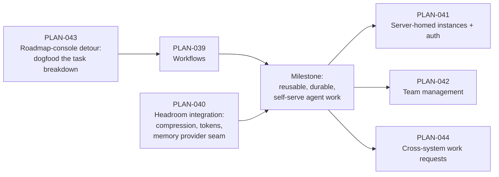

# Direction 5 — Durable Workflows & Headroom

> *"Don't rebuild a second engine. Define what's missing as a first-class extension —
> a declarative workflow contract a session must satisfy, not a prompt."*

**This is the current top roadmap priority.** The next milestone has two major
pieces — **Workflows** (PLAN-039) and **Headroom integration** (PLAN-040) —
and one sequel
milestone deliberately staged behind it: **server-homed instances with auth and
team management** (PLAN-041, PLAN-042, both stubs until this milestone lands).

**Sequence.** One deliberate detour runs *first*: **PLAN-043** upgrades the
roadmap console into an interactive work surface that decomposes plans into
runnable tasks — dogfooding that discovers the workflow structure's real
requirements and becomes PLAN-039's test harness. Then PLAN-039 → PLAN-040
(the milestone), then the staged stubs (PLAN-041/042/044). PLAN-045 is a
scheduled roadmap-reduction pass (2026-08-29) that trims the surrounding
surface so this direction stands on longer poles.

## The bet

Vorno already contains a durable workflow engine. The Conductor (`TaskRunner`)
executes a declarative DAG spec with dependency edges, `${nodes.<id>.output}`
data flow, bounded failure-aware retry, an append-only event-sourced run log,
cross-restart replay, token budgets, and a verification/repair loop. Typed
steps, append-only log, replay on crash — the properties a workflow service
sells are already load-bearing in the session runtime.

What's missing is not engine capability. It is that **a workflow definition does
not exist as a thing a user can hold**. `tasks/<slug>/task.yaml` *is* the
instance: the slug is the folder is the board card is the orchestrator session
binding. Definition and instance are the same object, so reuse isn't
unimplemented — it's *unrepresentable*. The evidence from our own workspace
corpus (see PLAN-039) is stark: every task ever authored was authored once, run
at most once, and used only the eight node fields the editor exposes. The
schema's entire control-flow half (`when`, `loop`, `for_each`, `retry`,
`params`, `outputs`, `aggregate`, `approval`) has **zero** authored uses —
dead surface, because no authoring or viewing UI can reach it.

The second half of the bet is **context discipline, by integration**:
[Headroom](https://github.com/headroomlabs-ai/headroom) (Apache-2.0, ~67k
stars; Rust core with TS/Python SDKs, a local proxy, and an MCP server) enters
Vorno's supply chain as *the* context-discipline layer — content-aware
reversible compression, token measurement and management, and multi-layer
cross-agent memory. **We are not building a library.** Vorno's work is
integration (vetted, pinned, flag-gated, reversible) plus one deliberate build
item: a **pluggable extension interface for additional memory storage formats
and querying** — interface first, pursued as an upstream contribution to
Headroom — behind which Vorno's existing gated memory engine plugs in as a
backend rather than living beside it.

## Why these two together

A reusable workflow that runs unattended on a schedule or a server is exactly
the workload that exhausts context and needs durable memory across runs.
Workflows make agent work *repeatable*; Headroom makes repeated work
*sustainable*. Shipping them as one milestone means the first scheduled
workflow re-run already has disciplined context behavior, instead of
discovering the ceiling in production.

## Seeing the work: ask → task → project

A workflow that runs unattended is only trustworthy if you can *see where
things stand*. This direction carries an explicit **visualization
requirement**: during a workflow run, a zoomable, legible view of where a
given ask sits — the **ask**, the **task** executing it, and the **project**
(an overall body of work) it belongs to. This has immediate application
beyond Vorno itself in a sibling Swagatar product.

- **Near term:** "lanes of work" composed from primitives Vorno already has —
  projects, labels, and the kanban board. No new surface; sharper use of the
  existing ones.
- **Long term, stated plainly:** kanban starts to fall apart once workflows
  exist, because it cannot show **information flows** — processes flowing
  *through* agents, including work arriving from other departments or
  external systems (PLAN-044's inbound work requests are exactly such
  flows). The board shows where cards sit; it cannot show what is moving
  between them. The DAG projection (PLAN-039 W3) is the first artifact on
  the path to a flow-native view, and its interactivity bar (clickable
  nodes that open the underlying session or artifact) is the stepping stone
  toward DIR-04 dynamic workspaces and, eventually, a node-graph editor.

## The audience bar

Every surface this direction ships must be usable by a **technical information
worker** — someone comfortable with a spreadsheet formula, not a YAML schema.
Concretely:

- **Schema→form is the one mechanism bought once and spent three times**: the
  run dialog (a definition's params render as a typed form), node output
  contracts, and settings. The worker sees fields, never YAML.
- **Schemas are inferred, not composed.** Run a node once, inspect what it
  returned, offer "lock this shape." Confirmation, not authorship.
- **The DAG view starts as a projection, not an editor — but not a static
  one.** Vorno renders Mermaid natively; a definition compiles to a graph with
  decision diamonds for `when` and back-edges for `loop`. Legible on day one,
  before any node-graph editor is attempted. A static picture is not the end
  state, though: PLAN-039 W3 sets an **interactivity bar** (click a node →
  open its session/artifact; collapse/expand groups), built on the seams the
  shell's renderer already exposes.

## What sits behind this milestone

Once workflows are reusable objects and context/memory discipline is handled
by the integrated Headroom layer, the natural next question is *where
workflows live and who runs them*. That is the sequel milestone, staged deliberately behind this one:

- **Server-homed instances with auth** (PLAN-041, stub) — the headless server
  (PLAN-013, shipped) becomes the home for workspaces and workflow definitions,
  with per-instance authentication. Carries the Hosted Workspace Server work
  forward: PLAN-023's Phase 0 architecture and ADR-0013 remain authoritative, and
  its unbuilt Phases 1-3 were relocated here by PLAN-045 Pass 1 before PLAN-023
  itself was archived (2026-08-22).
- **Team management** (PLAN-042, stub) — users, roles, and sharing within an
  instance, so a definition authored once can be run by a team.
- **Cross-system work requests** (PLAN-044, stub) — dynamically generated
  inbound webhooks that ask an instance for a body of work, with async
  responses and an A2A-protocol evaluation.

These stubs exist so the workflow-definition data model is designed with
multi-user, server-homed ownership in mind — not so that any of it is built
now. Storage stays file-backed and single-writer for this milestone;
coordination (run leases, instance ownership) is a PLAN-041 concern. The
user-facing halves of that future — instance-level user awareness, access
control on workflow files, workflow versioning — land **incrementally via
ADRs and guiding principles** as this milestone's design decisions are made,
not as one big build afterward.

**Hostable unit (business note, post-milestone).** Once PLAN-041 makes an
instance a real deployment unit, the same artifact becomes a *trustable
hostable unit* we can shop to deploy-target platforms: ship first-class
`fly.toml` / `render.yaml` definitions and pursue referral/partnership
arrangements per instance started. Deliberately brief here — it is a
business opportunity contingent on the milestone and PLAN-041 landing well,
not a work item in it.

**Lifecycle chores follow ADR-0027 ("lean on the OS").** Everything this
direction accumulates on disk — run directories, instance folders, workflow
artifacts — gets its retention and pruning from filesystem + OS-scheduler
recipes per ADR-0027, with app code involved only where quiescence needs
app semantics (PLAN-038's precedent). No in-app lifecycle subsystem gets
built for workflows.

## Non-goals for this direction

- **No second engine.** The Conductor is the engine; workflows are a first-class
  extension of it.
- **No external database.** Durability is already solved by the append-only run
  log + atomic node outputs. Postgres/PGlite would buy multi-writer
  coordination we don't need until PLAN-041 — and PGlite (single-writer
  embedded) wouldn't buy it even then.
- **No general-purpose workflow marketplace.** Sharing definitions beyond a
  workspace is a DIR-02 (skill contributions) conversation, later.
