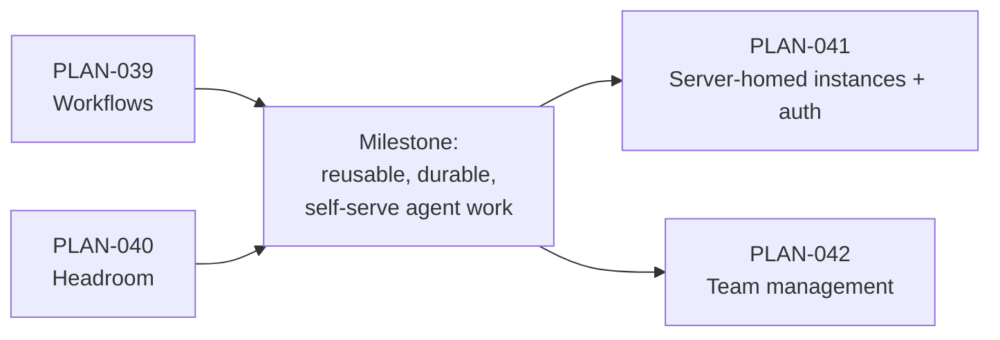

# Direction 5 — Durable Workflows & Headroom

> *"Don't rebuild a second engine. Define what's missing as a first-class extension —
> a declarative workflow contract a session must satisfy, not a prompt."*

**This is the current top roadmap priority.** The next milestone has two major
pieces — **Workflows** (PLAN-039) and **Headroom** (PLAN-040) — and one sequel
milestone deliberately staged behind it: **server-homed instances with auth and
team management** (PLAN-041, PLAN-042, both stubs until this milestone lands).

## The bet

Vorno already contains a durable workflow engine. The Conductor (`TaskRunner`)
executes a declarative DAG spec with dependency edges, `${nodes.<id>.output}`
data flow, bounded failure-aware retry, an append-only event-sourced run log,
cross-restart replay, token budgets, and a verification/repair loop. Typed
steps, append-only log, replay on crash — the properties a workflow service
sells are already load-bearing in the session runtime.

What's missing is not engine capability. It is that **a workflow definition does
not exist as a thing a user can hold**. `tasks/<slug>/task.yaml` *is* the
instance: the slug is the folder is the board card is the orchestrator session
binding. Definition and instance are the same object, so reuse isn't
unimplemented — it's *unrepresentable*. The evidence from our own workspace
corpus (see PLAN-039) is stark: every task ever authored was authored once, run
at most once, and used only the eight node fields the editor exposes. The
schema's entire control-flow half (`when`, `loop`, `for_each`, `retry`,
`params`, `outputs`, `aggregate`, `approval`) has **zero** authored uses —
dead surface, because no authoring or viewing UI can reach it.

The second half of the bet: the context disciplines Vorno had to build to keep
long-running agent work alive — token headroom accounting, budget thresholds,
context trimming, and gated durable memory — are not Vorno-specific. They are a
**library other harnesses need too**, and per the project charter
(harness-agnosticism), extracting them as an OSS library both hardens Vorno's
own implementation and stakes an open position: **Headroom**, a token + memory
library with pluggable storage and no heavy runtime dependency.

## Why these two together

A reusable workflow that runs unattended on a schedule or a server is exactly
the workload that exhausts context and needs durable memory across runs.
Workflows make agent work *repeatable*; Headroom makes repeated work
*sustainable*. Shipping them as one milestone means the first scheduled
workflow re-run already has disciplined context behavior, instead of
discovering the ceiling in production.

## The audience bar

Every surface this direction ships must be usable by a **technical information
worker** — someone comfortable with a spreadsheet formula, not a YAML schema.
Concretely:

- **Schema→form is the one mechanism bought once and spent three times**: the
  run dialog (a definition's params render as a typed form), node output
  contracts, and settings. The worker sees fields, never YAML.
- **Schemas are inferred, not composed.** Run a node once, inspect what it
  returned, offer "lock this shape." Confirmation, not authorship.
- **The DAG view starts as a projection, not an editor.** Vorno renders Mermaid
  natively; a definition compiles to a graph with decision diamonds for `when`
  and back-edges for `loop`. Legible on day one, before any node-graph editor
  is attempted.

## What sits behind this milestone

Once workflows are reusable objects and context/memory management is a
portable library, the natural next question is *where workflows live and who
runs them*. That is the sequel milestone, staged deliberately behind this one:

- **Server-homed instances with auth** (PLAN-041, stub) — the headless server
  (PLAN-013, shipped) becomes the home for workspaces and workflow definitions,
  with per-instance authentication. Builds on the Hosted Workspace Server work
  (PLAN-023, in progress).
- **Team management** (PLAN-042, stub) — users, roles, and sharing within an
  instance, so a definition authored once can be run by a team.

These stubs exist so the workflow-definition data model is designed with
multi-user, server-homed ownership in mind — not so that any of it is built
now. Storage stays file-backed and single-writer for this milestone;
coordination (run leases, instance ownership) is a PLAN-041 concern.

## Non-goals for this direction

- **No second engine.** The Conductor is the engine; workflows are a first-class
  extension of it.
- **No external database.** Durability is already solved by the append-only run
  log + atomic node outputs. Postgres/PGlite would buy multi-writer
  coordination we don't need until PLAN-041 — and PGlite (single-writer
  embedded) wouldn't buy it even then.
- **No general-purpose workflow marketplace.** Sharing definitions beyond a
  workspace is a DIR-02 (skill contributions) conversation, later.
