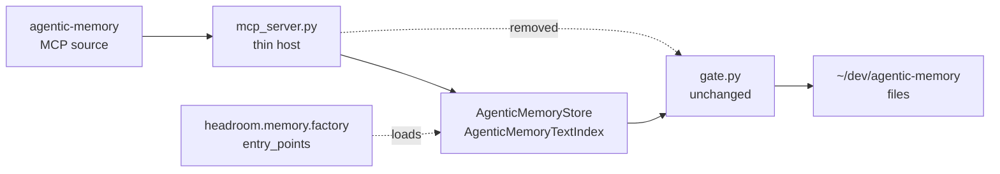

# SUV-0031 — the plugged backend, and its honest gap list

This closes SUV-0031's acceptance item 4 and answers **PLAN-040 open question 3**:

> *"How much of the v2 memory engine's gated behavior (PRG trims, retrieval
> logging, archive markers) expresses cleanly as a backend behind Headroom's
> interface vs. needing interface support upstream."*

**Answer, now measured rather than reasoned about: all of the behavior the v2
server ever mechanized expresses cleanly. Everything that did not express was
already outside what the server mechanized, and every one of those maps to a gap
already filed in [#3287](https://github.com/headroomlabs-ai/headroom/issues/3287)
— no new upstream ask was needed.** Three implementation-level frictions did
surface that #3287 does not cover; they are in §4, separated, and are offered as
additions to the same issue rather than smuggled in as findings.

---

## 0. The headline, and a correction owed to SUV-0030

SUV-0030 left this SUV facing an apparent blocker: gap **D**, *"a TypeScript path
or an explicit statement that memory is Python/CLI-only"*, filed and unanswered.
The reading was that a "registered backend" might be unreachable from Vorno.

**Gap D does not block this SUV, and the reason is worth recording.** The
`headroom-ai` **Python** distribution is on PyPI at the *same version the Vorno
side is pinned to* (`packages/shared/package.json` → `headroom-ai: 0.36.5`), and
that release ships `headroom/memory/{ports,config,factory}.py` — the entire seam,
installable, not merely present on `main`. Both sides of this particular
integration are Python: the v2 engine is Python, and the `agentic-memory` MCP
source is a Python stdio server. So the backend is a *real* registered backend
loaded by upstream's own `factory._load_external_backend`, not a shape-alike.

Gap D remains open and remains real — **for Vorno's TypeScript session loop**,
which still has no memory API (SUV-0029, blocked). It was never a constraint on a
Python host talking to a Python engine. SUV-0030's §7 follow-up dates stand
unchanged.



---

## 1. What landed

All code is in the engine repo, `Swagatar-LLC/agentic-memory-template`, commit
**`1f51329`** on `main` (committed, not pushed). Nothing product-side changed in
this repo: Vorno's TypeScript never called the v2 engine, so there was no call
site here to re-point. §5 says why the split falls that way.

| Piece | Where |
|---|---|
| The backend — `MemoryStore` + `TextIndex` over the gate | `lib/agentic_memory/headroom_backend.py` |
| Entry-point registration under `headroom.memory_store` / `headroom.memory_text` | `pyproject.toml` |
| The MCP source reduced to a host | `server/mcp_server.py` |
| Delegation tripwire (acceptance 1, as a test) | `mcp_server._check_delegation()` |
| Differential parity suite (acceptance 2) | `headroom_backend._selftest()` — 40 checks |
| This gap list (acceptance 4) | here |

The live source now runs on the interpreter carrying the backend
(`~/dev/agentic-memory-template/.venv/bin/python3`); the prior config is kept at
`config.json.bak-suv0031-20260827`.

**The gate is byte-for-byte unchanged.** SUV-0031 puts *"changes to the v2
engine's own semantics"* out of scope, so the trims, banners, search ranking and
log-record builder are the same code; the backend calls them. Parity is not
asserted in prose — the selftest computes each result twice, once through the
Protocol and once through `gate` directly on the same fixture, and compares.

---

## 2. The eleven v2 behaviors, re-walked against a real implementation

SUV-0030 §3 walked these on paper and predicted 4 expressible / 5 blocked on gap
A / 1 on C / 1 on A+B / 1 out of remit. **The implementation agrees with the
paper walk in every row.** The column that changed is the last one: how the
backend behaves *given* the gap, which on paper was unspecified.

| # | v2 behavior | Expressed? | Gap | How the backend behaves today |
|---|---|---|---|---|
| 1 | **Scope trim** (ancestry wall) | ✅ | — | The backend owns query execution and applies ancestry itself. Verified against `gate` for four targets incl. sibling, unrelated-tree and parent cases. |
| 2 | **Visibility trim** vs destination | ✅ *in practice* | A | Works because the destination reaches the backend — **through `metadata_filters`, not a typed field** (§3.1). Gap A would make this a typed contract instead of a convention. |
| 3 | **Subject trim** | ✅ | — | `subjects` → `entity_refs`, as designed. Filterable upstream with no schema change. |
| 4 | **No-pollution rule** | ✅ substantively; ❌ reporting | **B** | The backend never returns trimmed content, which is stronger than asking a caller not to look. The *"say so and stop"* half needs an envelope — implemented locally as `search_gated()` in gap B's proposed shape. A stock caller using `query()` still gets a silently-shortened list. |
| 5 | **Subagent isolation** | ✅ *in practice* | A | Same mechanism and same caveat as row 2. |
| 6 | **Write-side inheritance** | n/a here | — | Write-path behavior; this backend is read-only by design. `promoted_from` / `promotion_chain` remain the right carriers when writes are ever plugged in. |
| 7 | **Citation discipline** | ❌ | (C) | Outside a backend's remit, as SUV-0030 said. Unchanged. |
| 8 | **Audience-aware destination** | ✅ *in practice* | A | Same as rows 2 and 5. |
| 9 | **Retrieval logging** | ✅ **fully** | — | The backend sees every query *and* the declared target, so the log line is complete — target, loaded, trimmed, files. Asserted field-for-field identical to the engine's own record. On paper this was "half the tuple without gap A"; the `metadata_filters` carrier closes it in practice. |
| 10 | **Archive / cold storage** | ✅ exclusion + opt-in; ❌ marker survival | **C** | Exclusion-by-default and opt-in-by-name are a backend predicate. The uncertainty marker is attached to the body the backend returns, and the selftest asserts the returned bytes match the engine's. What is *not* guaranteed is the marker surviving **downstream compression** — that is gap C, and it is a property of the compression path, not of this backend. |
| 11 | **Refusal** vs empty | ✅ *via the local envelope* | **A + B** | `GatedSearchResult` carries `refused` and the reasons. The host renders them. A stock `query()` caller cannot tell a refusal from a miss. |

**Tally: 8 of 11 fully expressed, 2 partially (4 and 10 — each missing exactly
the half its gap names), 1 out of remit (7).** The paper walk's prediction that
five behaviors were *blocked* on gap A proved pessimistic: they are blocked on a
**typed** context, not on a context. `metadata_filters` is an open extension
carrier and carries one. The distinction matters and is not cosmetic — see §3.1.

---

## 3. What could not express — the acceptance-4 list

Four items. Each names the gap that unblocks it, and each gap is already filed.

### 3.1 A retrieval context that is part of the contract — gap **A**

Every trim this backend applies is a function of the declared target, and
`MemoryFilter` has no field for one. The target therefore rides in
`metadata_filters["retrieval_context"]`.

This *works*, and it is worth being precise about what is missing rather than
overstating it: what cannot express is not the behavior but **the obligation**.
A dict key is a convention between this backend and this host. Nothing tells a
third caller that a filter without it will be refused, nothing type-checks it,
and nothing stops a future upstream caller from constructing a `MemoryFilter`
and getting a `GateError` it has no way to have anticipated. The backend
fail-closes rather than defaulting — an undeclared filter is refused, never
inferred — which converts a silent-leak risk into a loud one, but a loud
workaround is still a workaround.

**Unblocked by:** gap A's `RetrievalContext` on the three filter dataclasses.
The change here would be mechanical: delete the pack/unpack helpers, read the
typed field.

### 3.2 Withheld and refused, distinguishable from absent — gap **B**

`MemoryStore.query()` returns `list[Memory]`. A backend that trimmed three of
eight returns five; one that refused returns `[]`. The v2 server has always
reported both, so the envelope is implemented as `search_gated()` — *exactly the
sibling-method shape proposed upstream* — and the host calls it.

The cost is precise: **any caller that goes through the Protocol's own method
loses the counts and the refusal**, silently. That is not hypothetical; it is
what a stock Headroom memory pipeline would do with this backend today. Counts
are reported by reason and never by path, matching the no-pollution rule; the
selftest asserts no filename appears in the withheld report.

**Unblocked by:** gap B landing `search_gated` (or equivalent) upstream, at which
point the local class is deleted and upstream's imported.

### 3.3 A by-id read cannot be gated on its own terms — gap **A**, sharpest form

`get(memory_id)` carries no filter and therefore no context, so a governed store
has nothing to gate on. The alternatives were to admit an ungated by-id read —
a hole straight through the wall — or to fail closed. It fails closed: `get()`
answers only for ids admitted by a preceding gated query **on that store
instance**, and a fresh store answers nothing.

That is safe and it is verified in both directions (a fresh store refuses; a
store that has loaded target A refuses a path belonging to sibling B). It is also
**stateful in a way the Protocol does not describe** — upstream's contract reads
as though `get()` is a pure lookup, and a caller reasonably expecting that will
find this backend uncooperative.

**Unblocked by:** gap A, threaded to the by-id read path as well as to `query`.
Worth adding to #3287 explicitly: the issue currently proposes the context on the
*filter* dataclasses, which does not reach `get()`.

### 3.4 The cold-storage marker surviving compression — gap **C**

The mandatory uncertainty banner is attached by the backend and travels with the
content it returns. Whether it survives *downstream* — once that content enters
a compression path — is not something a storage backend can guarantee, and this
one does not claim to. SUV-0030 identified `computeBiases` as the natural
mechanism and found it inert (finding H1).

**Unblocked by:** gap C, or simply by `computeBiases`' return value being
forwarded, which would need no new API. **Until then this is enforced above the
adapter or not at all** — and today, in Vorno, memory content does not enter the
compression path, so nothing is currently unsafe. If SUV-0029 ever unblocks and
memory reaches the session loop, this becomes live and must be re-checked.

---

## 4. Three frictions #3287 does not cover

Separated deliberately: acceptance 4 asks that behaviors map to *named* gaps, and
these three are not behaviors — they are contract mismatches found by writing the
implementation. Recorded here, and offered as additions to the same issue rather
than as new asks.

1. **No settings channel for an EXTERNAL backend.** `MemoryConfig` gives a
   third-party backend `store_backend_name` and `db_path` — a *file* path — and
   nothing else. A directory-shaped store has nowhere typed to be told where it
   lives. The backend reads `db_path` when it happens to name a memory repo and
   otherwise falls back to the engine's own resolution. A
   `store_backend_options: dict` would settle it.
2. **Identity must be derivable from the store.** The v2 corpus assigns no ids,
   so the repo-relative path is the id — which upstream's own contract warns
   against, because it breaks when a file moves. Minting stable ids is a change
   to the engine's semantics and out of this SUV's scope. Named here so nobody
   later reads path-as-id as an endorsement.
3. **Read-only is not expressible.** Every write method must exist for the
   `runtime_checkable` Protocol to be satisfied, so all seven exist and all seven
   raise. There is no way to *declare* a read-only backend, so a caller learns it
   by exception. A `supports_writes` property, or a narrower read-only Protocol,
   would make the refusal part of the type rather than part of the runtime.

None of the three affected what shipped. All three cost more explanation than
they should have.

---

## 5. Why the diff is where it is

Recorded because it is a judgment call a reviewer should be able to re-examine.

The backend, the host and their tests are in
`Swagatar-LLC/agentic-memory-template`, not here. Three reasons:

1. **The code being changed lives there.** The v2 engine and the `agentic-memory`
   MCP server are both in that repo; this repo has never held a line of either.
   A `grep` of `apps/` and `packages/` for the engine returns nothing — which
   also makes acceptance 1's "no session or workflow path calls it directly"
   trivially true *here*, and non-trivially true *there*, which is why the
   tripwire is a test in the host rather than a grep in this repo's CI.
2. **It is Python.** Vorno is a Bun monorepo with no Python toolchain, no Python
   CI job and one deliberately-single Headroom seam
   (`packages/shared/src/headroom/sdk-adapter.ts`, guarded by
   `scripts/check-headroom-boundary.ts`). A second Headroom seam, in a second
   language, with no runner, would be dead code here and a second owner of the
   boundary there.
3. **It is the private policy layer.** The adapter encodes PRG semantics over a
   personal vault. That belongs with the engine.

What that leaves in this repo is this document and the SUV's status log — which
is the correct residue, not a shortfall. PLAN-040's acceptance line
(*"agentic-memory v2 runs as a plugged backend behind that interface; the MCP
source is a thin host over it"*) is a statement about a system, and the system it
describes is now in that state.

---

## 6. Reproduction

Every command below was run on **2026-08-27** and the comment after it is the
output that was actually observed on that run, not an expected value. Where a
claim was previously asserted in prose, it has been re-derived here from the
primary source; §7 records the one figure that did not survive that pass.

```bash
cd ~/dev/agentic-memory-template

# --- the seam is real, at the version the TS side is pinned to -------------
grep -n '"headroom-ai"' ~/dev/craft-agents-oss/packages/shared/package.json
#   100:    "headroom-ai": "0.36.5",
curl -s https://pypi.org/pypi/headroom-ai/0.36.5/json | python3 -c \
  "import json,sys; d=json.load(sys.stdin); print(d['info']['name'], d['info']['version'])"
#   headroom-ai 0.36.5          <- the Python distribution exists on PyPI at that version
ls .venv/lib/python3.14/site-packages/headroom/memory/{ports,config,factory}.py
#   all three present; the dist-info carries no direct_url.json, i.e. index-installed

# --- registration ----------------------------------------------------------
./.venv/bin/python -c "from importlib.metadata import entry_points as e; \
  print([x.name for x in e(group='headroom.memory_store')], \
        [x.name for x in e(group='headroom.memory_text')], \
        [x.name for x in e(group='headroom.memory_vector')])"
#   ['agentic-memory'] ['agentic-memory'] []
# The three group names are upstream's own constants — factory.py:28-30.

# --- upstream's factory loads it, and it satisfies the Protocol ------------
./.venv/bin/python -c "
from headroom.memory.config import MemoryConfig, StoreBackend
from headroom.memory.factory import _create_store
from headroom.memory.ports import MemoryStore
s = _create_store(MemoryConfig(store_backend=StoreBackend.EXTERNAL,
                               store_backend_name='agentic-memory'))
print(type(s).__module__, type(s).__name__, isinstance(s, MemoryStore))"
#   agentic_memory.headroom_backend AgenticMemoryStore True

# --- acceptance 2: differential parity, and its red case -------------------
./.venv/bin/python -m agentic_memory.headroom_backend selftest
#   SELFTEST PASS (40 checks, 0 failed)      exit 0

# Sabotage: in headroom_backend.py's single gate call site (the `res = _gate.gate(`
# line inside the one method that touches the gate), replace
# `include_archive=include_archive` with `include_archive=True`, then re-run:
#   FAIL: gated load returns exactly what the gate returns (6 items)
#   FAIL: withheld counts match the gate's, by reason
#   FAIL: cold storage is excluded from a routine load
#   FAIL: the archive trim is counted, not silent
#   FAIL: the log record is identical to the engine's, field for field
#   SELFTEST FAIL (40 checks, 5 failed)      exit 1
# Restore the line; back to 40/0, exit 0. The parity checks are load-bearing.

# --- acceptance 1 + 3: the host delegates ----------------------------------
grep -nE "^\s*(import|from)\s" server/mcp_server.py
#   json, os, re, subprocess, sys, and `from agentic_memory import headroom_backend
#   as backend` — stdlib plus the plugged backend, nothing else.

./.venv/bin/python server/mcp_server.py selftest
#   SELFTEST PASS (53 checks, 0 failed)      exit 0

# The tripwire, run against both hosts — this is the red/green for acceptance 3:
git show 04aba2f:server/mcp_server.py > /tmp/pre_mcp_server.py
./.venv/bin/python -c "
import importlib.util as u
spec = u.spec_from_file_location('m','server/mcp_server.py')
m = u.module_from_spec(spec); spec.loader.exec_module(m)
print(m.FORBIDDEN_ENGINE_MODULES)
print('pre :', m._check_delegation(open('/tmp/pre_mcp_server.py').read()))
print('post:', m._check_delegation(open('server/mcp_server.py').read()))"
#   ('gate', 'config', 'preflight')
#   pre : ['gate', 'config', 'preflight']
#   post: []

# The 53 checks are the 50 pre-existing ones plus 3, verified by set difference
# rather than by counting:
./.venv/bin/python /tmp/pre_mcp_server.py selftest | grep "^  ok:" | sort > /tmp/pre.txt
./.venv/bin/python server/mcp_server.py       selftest | grep "^  ok:" | sort > /tmp/post.txt
comm -23 /tmp/pre.txt /tmp/post.txt   # empty — no pre-existing check was dropped or reworded
comm -13 /tmp/pre.txt /tmp/post.txt   # exactly 3:
#     ok: and the tripwire that asserts it actually catches a violation
#     ok: the one engine import is the plugged backend
#     ok: this server reaches for no engine module directly

# Acceptance 1, as the grep the SUV asks for (exit 1 = no hits)
grep -nE "^[[:space:]]*(from|import)[[:space:]]+agentic_memory.*\b(gate|config|preflight)\b|\b(gate|config|preflight)\.[a-zA-Z_]" \
  server/mcp_server.py; echo "exit=$?"                                 # exit=1
git show 04aba2f:server/mcp_server.py | grep -cE "\bgate\.[a-zA-Z_]"   # 15  (the red case)

# --- the gate is byte-for-byte untouched -----------------------------------
git rev-parse 04aba2f:lib/agentic_memory/gate.py 1f51329:lib/agentic_memory/gate.py
#   0a28daf7a7585470a5e2c8665d32590501fae25a
#   0a28daf7a7585470a5e2c8665d32590501fae25a      <- identical blob, not merely absent from --stat

# --- the rest of the engine still passes -----------------------------------
for m in archive config control_manifest decay decide digest evals gate \
         harvest_batches policy_audit preflight retrieval_report; do
  ./.venv/bin/python -m agentic_memory.$m selftest; done
#   11 pass (gate 69, decay 54, digest 45, retrieval_report 33, archive 28,
#   config 22, policy_audit 19, decide 14, preflight 12, control_manifest 7, and
#   harvest_batches which reports "selftest: 0 failures" in its own format).
#   `evals` is the twelfth and has no selftest subcommand — rc=2, prints usage.
#   Pre-existing and untouched by this SUV. See §7.

# --- live, against the real vault, through the plugged backend -------------
LOG=~/dev/agentic-memory/MEMORY/OBSERVABILITY/retrieval-log.jsonl
wc -l < "$LOG"                                                          # 106
printf '%s\n' \
  '{"jsonrpc":"2.0","id":1,"method":"initialize","params":{}}' \
  '{"jsonrpc":"2.0","id":2,"method":"tools/list","params":{}}' \
  '{"jsonrpc":"2.0","id":3,"method":"tools/call","params":{"name":"status","arguments":{}}}' \
  | ~/dev/agentic-memory-template/.venv/bin/python3 \
      ~/dev/agentic-memory-template/server/mcp_server.py \
      --data-root ~/dev/agentic-memory
#   exit 0; tools/list -> ['load_context', 'retrieve', 'status'];
#   status answers with head/branch/tree/scopes/retrieval-log lines.
wc -l < "$LOG"                                                          # 106 — status logs nothing

# --- nothing in Vorno calls the engine, before or after --------------------
cd ~/dev/craft-agents-oss && grep -rn "agentic.memory" apps/ packages/ ; echo "exit=$?"  # exit=1
```

---

## 7. Corrections from the 2026-08-27 re-verification

Every figure in this document and in SUV-0031's status log was re-derived from
the primary source on 2026-08-27. All of them held except one, recorded here
rather than silently edited:

- **"All twelve other engine module selftests still pass"** (SUV-0031 status log,
  2026-08-27 entry) is self-contradictory, because the same sentence notes that
  `evals` has no `selftest` subcommand. The measured result: of the twelve engine
  modules other than `headroom_backend`, **eleven run a selftest and all eleven
  pass**; `evals` is the twelfth and exits 2 with a usage message. Both facts are
  pre-existing and neither was touched by `1f51329`. A second, smaller wrinkle in
  the same row: `harvest_batches` passes but prints `selftest: 0 failures` rather
  than a `SELFTEST PASS (n checks)` line, so a grep for `SELFTEST PASS` across
  the engine finds ten, not eleven.

Claims that were re-derived and **held unchanged**: the PyPI availability of
`headroom-ai==0.36.5` and the `packages/shared/package.json` pin it matches; the
presence of `ports.py` / `config.py` / `factory.py` in that distribution; the
three entry-point group names against `factory.py`'s own constants; the factory
load and `isinstance(s, MemoryStore) is True`; 40 backend checks and the five
that go red under the archive sabotage; 53 host checks of which exactly 50 are
the pre-existing labels, unmodified; the tripwire's `['gate','config','preflight']`
→ `[]`; the 15 `gate.` references in the pre-change host; `gate.py`'s identical
blob hash; and the empty `grep -rn "agentic.memory" apps/ packages/`.

Related: [`memory-extension-interface-design.md`](./memory-extension-interface-design.md)
(SUV-0030, the interface), [`headroom-memory-surface-audit.md`](./headroom-memory-surface-audit.md)
(SUV-0029, why the TS side is blocked), `~/dev/agentic-memory/POLICY.md` §§3–7.
