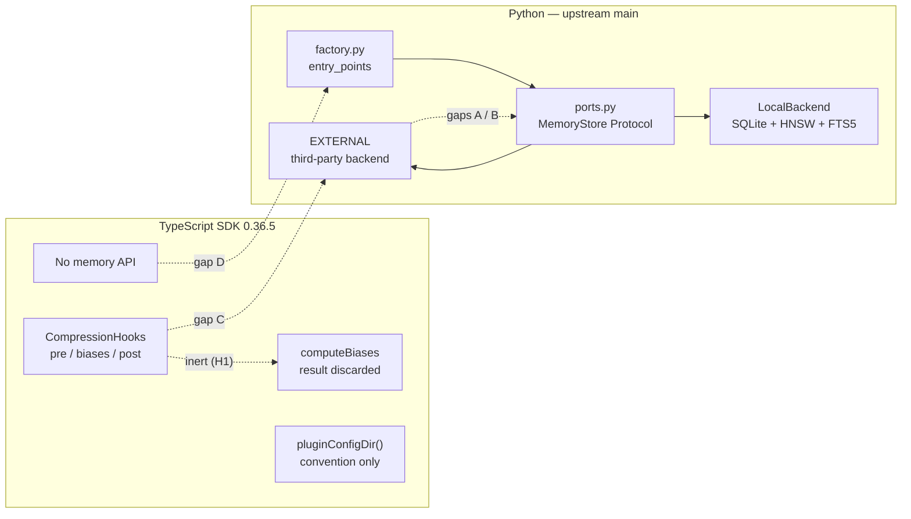

# Memory extension interface — design and upstream contribution

**Upstream contribution:**
[headroomlabs-ai/headroom#3287](https://github.com/headroomlabs-ai/headroom/issues/3287)
— filed 2026-08-27, open, no maintainer response yet. Follow-up plan in §7.

---

## 0. The headline, which reverses this SUV's premise

PLAN-040 calls a *"pluggable extension interface for additional memory storage
formats and querying"* **the priority build item of this plan**, and SUV-0030
asks for it to be designed and proposed upstream.

**Most of it already exists upstream, and has for some time.** Headroom's Python
package ships `headroom/memory/ports.py` — `Protocol` definitions for
`MemoryStore`, `VectorIndex`, `TextIndex`, `Embedder`, `MemoryCache` and
`GraphStore` — an `EXTERNAL` member on each of the three storage backend enums,
and a factory that loads third-party implementations from setuptools entry
points. That is precisely the seam this SUV set out to propose.

This is good news twice over. It removes the largest build item from the plan,
and it means the contribution is a much smaller, much likelier-to-land thing:
**four additive gaps** that stand between the existing seam and a *governed*
backend, plus the observation that the seam is entirely undocumented.

So this document is not a proposal for an interface. It is:

1. a verified specification of the interface **as it exists** (§1, §2.1);
2. the storage-format contract and query semantics a non-SQLite backend must
   satisfy to sit behind it (§2.2, §2.3);
3. the four gaps, with concrete additive shapes (§2.4) — the upstream ask;
4. the on-paper walk showing agentic-memory v2's gated behaviors behind it,
   each one marked *expressible* or *needs upstream support* (§3).

It also corrects two stale premises PLAN-040 still carries (§4).

> **Scope fence.** No backend is implemented here — that is SUV-0031. Nothing is
> forked or vendored (PLAN-040 non-goal). No code lands in this repo under this
> SUV; §8 records the one thing that was considered and deliberately left out.

---

## 1. What was verified

Every claim below is re-derivable from §9. Two different artifacts were read:
the **pinned TypeScript SDK bytes** in `node_modules/`, and **upstream `main`**
via the GitHub API. They are distinguished throughout, because they disagree
about what exists.

### 1.1 The pinned TypeScript SDK — `headroom-ai@0.36.5`

| Seam | Status | Evidence |
|---|---|---|
| **`CompressionHooks`** — `preCompress` / `computeBiases` / `postCompress`, supplied via `CompressOptions.hooks` | **Real and invoked.** The only user-supplied extension point in the package. | `dist/types-BTrX7__W.d.ts:35–49`; call sites `dist/chunk-2NXG6XPP.js:1076–1103` |
| **Provider slices** — subpath exports `headroom-ai/{openai,anthropic,gemini,vercel-ai}` | **Real, but wrappers — not a registry.** `withHeadroom(client)` intercepts one method. `headroomMiddleware()` (Vercel AI) is the one middleware-*shaped* contract, and it is that SDK's shape, not Headroom's. | `package.json` `exports`; `dist/adapters/*.d.ts` |
| **Plugin path convention** — `pluginConfigDir(name)`, `pluginWorkspaceDir(name)` | **A convention with no mechanism.** Returns `<configDir>/plugins/<name>` and `<workspaceDir>/plugins/<name>` after an `assertPluginName` guard. There is no loader, registry, or discovery anywhere in the package. | `dist/index.d.ts:850–851`; `dist/index.js:305–319` |
| **Memory path helpers** — `memoryDbPath()`, `nativeMemoryDir()` | **Path strings only.** `<workspace>/memory.db` and `<workspace>/memories`. The SDK makes no filesystem calls at all (SUV-0029 M5), so nothing reads or writes them. | `dist/index.js:253–260` |
| **Memory API** | **Absent.** Re-confirms SUV-0029 finding M1. | [`headroom-memory-surface-audit.md`](./headroom-memory-surface-audit.md) |

**Finding H1 — `computeBiases` is inert, and it is inert on `main` too.**
The hook is documented in the SDK README (§"Compression Hooks") and in
`wiki/typescript-sdk.md` as the way to steer per-message compression. In the
pinned bundle its return value is discarded:

```js
if (hooks) {
  await hooks.computeBiases(openaiMessages, ctx);
}
```

That could have been a minification artifact, so it was checked against source.
On upstream `main`, `sdk/typescript/src/compress.ts`:

```ts
// 4. Compute biases
let biases: Record<number, number> = {};
if (hooks) {
  biases = await hooks.computeBiases(openaiMessages, ctx);
}

// 5. Compress via proxy
const client = providedClient ?? new HeadroomClient(clientOptions);
const result = await client.compress(openaiMessages, { model, tokenBudget });
```

`biases` is assigned and never read; `client.compress()` receives only
`{ model, tokenBudget }`. The bundler simply eliminated a dead store. **The
finding is upstream behavior, not a packaging accident** — and it matters here
because `computeBiases` is the natural mechanism for gap C (§2.4).

**Finding H2 — `on_pipeline_event` does not exist in the TypeScript SDK.**
PLAN-040 §"What Headroom provides" lists *"pipeline lifecycle hooks
(`on_pipeline_event`)"* first among the extension seams. Grepping every `.d.ts`
and both bundles for `pipeline` yields exactly one hit: `pipelineTiming`, a
`Record<string, …>` field on a **stats** response (`dist/index.d.ts:367`). It is
telemetry, not a hook. Nothing in the package accepts a pipeline-event callback.
That bullet sits under the plan's own instruction to *"verify at integration
time, not from README claims"*; this is the verification, and it is negative.
The same bullet's "downstream MCP tools" is likewise not a seam of this package.

Net: of the four seams PLAN-040 names, **one** (compression hooks) is a real
extension point in the pinned TypeScript SDK. That is the honest foundation.

### 1.2 Upstream `main` — the Python package

This is where the interface actually lives.

- **`headroom/memory/ports.py`** — `runtime_checkable` `Protocol` classes:
  `MemoryStore`, `VectorIndex`, `TextIndex`, `Embedder`, `MemoryCache`,
  `GraphStore`; plus the filter dataclasses `MemoryFilter`, `VectorFilter`,
  `TextFilter` and the result types `MemorySearchResult`, `VectorSearchResult`,
  `TextSearchResult`.
- **`headroom/memory/config.py`** — `StoreBackend`, `VectorBackend` and
  `TextBackend` each carry an `EXTERNAL` member, each commented with the entry
  point group it resolves through, alongside a `*_backend_name` config field.
- **`headroom/memory/factory.py`** — `_load_external_backend()` resolves an
  implementation via `importlib.metadata.entry_points` under
  `headroom.memory_store`, `headroom.memory_vector`, `headroom.memory_text`,
  and instantiates it with the `MemoryConfig`. Its docstring notes the pattern
  is mirrored from `headroom.cache.compression_store`.
- **`headroom/memory/backends/`** — `LocalBackend` (SQLite + HNSW +
  `InMemoryGraph`, the default), `Mem0Backend`, `Mem0SystemAdapter`,
  `DirectMem0Adapter`.

**Finding H3 — the *registration mechanism* is undocumented; the Protocol layer
is not.** Corrected 2026-08-27 on re-verification — the original wording
("the extension point is undocumented", "a reader following the docs would
conclude no such seam exists") was too strong, and overstating it would have
oversold gap E to upstream.

`wiki/memory.md` (753 lines) **does** document the Protocol architecture: a
"Protocol-Based Design" section (L518) stating *"Headroom Memory uses **Protocol
interfaces** (ports) for all components, enabling easy swapping"*, a
component → Protocol → default-adapter table naming `MemoryStore` /
`SQLiteMemoryStore` (L553–555), and a "Protocol-based extensibility ✅" feature
row (L612).

What it **never** mentions is how to register a *third-party* implementation:
`EXTERNAL`, `entry_point`, `store_backend_name` and `ports.py` all return **0
occurrences** (case-sensitive; see §9 for why the case matters). So a reader
following the docs learns that backends are swappable and cannot learn how to
supply one — they would have to read `factory.py`, which is how it was found
here. That narrower claim is what gap E addresses.

### 1.3 The seam map



---

## 2. The interface, specified

### 2.1 Adopted as-is — no change requested

`MemoryStore` is the storage-format seam. A backend implementing these satisfies
the Protocol; nothing about SQLite is baked in.

| Operation | Contract |
|---|---|
| `save(memory)` / `save_batch(memories)` | Persist; id is caller-assigned and stable |
| `get(id)` / `get_batch(ids)` | Retrieve by identity |
| `query(filter: MemoryFilter)` | Structured retrieval — the format-independent query surface |
| `count(filter)` | Cardinality without materialisation |
| `record_access(ids)` | One retrieval recorded per distinct id |
| `delete(id)` / `delete_batch(ids)` | Removal |
| `supersede(...)` / `detach_supersession(...)` / `get_history(...)` | Temporal versioning chain |
| `clear_scope(...)` | Scope-wide removal |

`VectorIndex` and `TextIndex` are **separately** pluggable. That separation is
load-bearing for us: a backend can decline vector search entirely — supplying a
`TextIndex` and no meaningful `VectorIndex` — without pretending to embeddings
it does not have. It also means PLAN-040's *"Vector-DB / RAG infrastructure"*
non-goal survives adoption: the vector index is a slot we need not fill.

### 2.2 Storage-format contract

What a non-SQLite backend must guarantee, derived from the Protocol's own
semantics:

1. **Identity is stable and caller-assigned.** `Memory.id` is a caller-supplied
   string (defaulted to a UUID). A file-backed store must map id → location
   durably; deriving id from a path breaks when a file moves.
2. **Round-trip fidelity on the typed fields.** `content`, the four scope fields,
   the three temporal fields, `importance`, the four lineage fields,
   `access_count` / `last_accessed`, `entity_refs`. What a store cannot represent
   it must persist opaquely, not drop.
3. **`metadata: dict[str, Any]` is the open extension carrier**, and it is
   already filterable via `MemoryFilter.metadata_filters`. This is the field that
   makes an arbitrary storage format expressible without an upstream schema
   change.
4. **Supersession is a graph, not a flag.** `supersedes` / `superseded_by` must
   be navigable in both directions; `get_history` walks the chain;
   `valid_until is None` means current.
5. **`record_access` is a write on the read path.** A read-only substrate cannot
   satisfy the Protocol, and access counts are the decay signal.
6. **Scope is hierarchical, not a string.** `scope_level` is *computed* from
   which of `turn_id` / `agent_id` / `session_id` is set. A backend with a
   different scope model maps into those fields, or into `metadata`, and accepts
   that upstream's `scope_levels` filter will see the mapped view.

**Frontmatter as already-structured data.** PLAN-040 asks for query semantics
that *"assume frontmatter is already structured data"* (SUV-0030 scope, from the
PLAN-045 salvage note). That holds — for a reason different from the one
recorded, see §4. The mapping needs no new upstream schema:

| Frontmatter key (agentic-memory v2) | Carrier | Filterable via |
|---|---|---|
| `subjects: [slug, …]` | `Memory.entity_refs` | `MemoryFilter.entity_refs` (any-of) |
| `scope: swagatar/mentorship/3sc` | `Memory.metadata["scope"]` | `metadata_filters` |
| `visibility: private\|scoped\|shared` | `Memory.metadata["visibility"]` | `metadata_filters` |
| `archived:` / `archive_reason:` | `Memory.metadata["archived"]` | `metadata_filters` |
| `updated:` | `Memory.valid_from` | `created_after` / `created_before` / `valid_at` |
| write-side scope inheritance | `promoted_from`, `promotion_chain` | `has_promoted_from` |

The body below the frontmatter is `Memory.content`. Nothing is invented; every
row lands on a field upstream already has and already filters on. The
`promotion_chain` fit was unexpected and is better than anything we would have
designed for the anti-laundering rule (§3, behavior 6).

Upstream's own `nativeMemoryDir()` → `<workspace>/memories` (a *directory*,
beside `memory.db`) suggests a directory-shaped store is anticipated, though
nothing in the TS SDK reads it. Weak evidence, recorded as such.

### 2.3 Query semantics

`MemoryFilter` already supplies a conjunctive filter algebra: scope fields,
`scope_levels`, temporal windows including point-in-time `valid_at`, an
importance band, `entity_refs` any-of, lineage predicates, `metadata_filters`,
pagination and ordering. For a frontmatter-shaped record that is sufficient to
express scope-ancestry, subject and archive predicates **with no upstream
change** — the backend owns query execution, so it can interpret
`metadata_filters["scope"]` as a path-ancestry test rather than string equality,
provided it documents that.

What the algebra cannot express is anything about **the retrieval itself**:

- *why* the query was issued and *where the results are going*;
- that results were **withheld**, as distinct from absent;
- that the query was **refused**;
- that a returned item carries an annotation which must not be compressed away.

Those four are §2.4.

### 2.4 The four gaps — the upstream ask

All additive, all optional, all no-ops for existing backends. Filed as
[#3287](https://github.com/headroomlabs-ai/headroom/issues/3287).

**A — thread a retrieval context to the backend.** The filters describe *what*
to match, never what the results are *for*. A governed store's answer is
destination-dependent: same query, same scope, different admissible set for
"main context" vs "subagent prompt" vs "an artifact leaving this machine". This
is the blocking gap — with it, most of §3 becomes expressible; without it, five
behaviors cannot be.

```python
@dataclass
class RetrievalContext:
    purpose: str | None = None
    destination: str | None = None   # "context" | "subagent" | "export"
    declared_scope: str | None = None
    audience: list[str] | None = None
```

as `context: RetrievalContext | None = None` on the three filter dataclasses.
Widening a dataclass with a defaulted field is how `MemoryFilter` already grew,
so this matches upstream's own precedent.

**B — a withheld/refused result envelope.** `search()` returns a plain list. A
backend that drops three of eight returns five; a backend that refuses returns
`[]` — indistinguishable from a genuine miss. Both distinctions are load-bearing:
a silently shortened list invites the caller to treat it as complete.

```python
@dataclass
class GatedSearchResult:
    results: list[MemorySearchResult]
    withheld_count: int = 0
    refused: bool = False
    reason: str | None = None
```

Proposed as a sibling method (`search_gated`) so no existing signature changes.
**A count, never identifiers** — naming what was withheld leaks it. This matches
the v2 server's existing behavior: trimmed items are counted, never named.

**C — annotations that survive compression.** Cold-storage content may only be
surfaced with an uncertainty marker attached, and the marker must travel with
the content into the model. Once memory content enters the compression path,
nothing guarantees that. `computeBiases` is the natural expression — "preserve
this span" — and it is inert (H1). **If biases were forwarded, gap C would need
no new API at all.** The issue flags this as separable and offers to split it.

**D — a TypeScript path, or an explicit boundary.** Entry points are a Python
mechanism; Vorno's host is TypeScript, and the SDK has no memory surface at all.
The issue asks which of three upstream considers intended — an HTTP memory
surface on the proxy, a memory client in the TS SDK, or "memory is Python/CLI
only, stated explicitly" — and offers to contribute the first two. The third is
a perfectly good answer and would settle SUV-0029.

**E — document the registration mechanism.** H3. The wiki already documents the
Protocol layer; what is missing is how a third party *supplies* an
implementation — the `EXTERNAL` enum members, the three entry-point groups, and
the `*_backend_name` config fields. Offered as a PR unconditionally, independent
of A–D. (Scope narrowed 2026-08-27 — see H3.)

---

## 3. agentic-memory v2 behind this interface — the on-paper walk

Acceptance item 2 asks that the v2 engine's gated behaviors either express as a
backend behind the interface, or that the ones needing upstream support be named
exactly. Source of record: `~/dev/agentic-memory/POLICY.md` §§3–7, and the
`agentic-memory` source guide for what the server mechanizes today.

| # | v2 behavior | Behind this interface | Needs |
|---|---|---|---|
| 1 | **Scope trim** — drop items whose scope is not ancestor-of-or-equal-to the target | **Expressible.** `metadata_filters["scope"]` interpreted by the backend as path ancestry; the backend owns query execution. | A, for the *declared target scope* — today it is implicit in the caller's head |
| 2 | **Visibility trim** — `private`→external never; `private`→subagent only if cleared; `scoped`→external only per-item | **Needs upstream support.** `visibility` is storable and filterable, but the rule is a function of `(visibility, destination)` and destination never reaches the backend. | **A** |
| 3 | **Subject trim** — drop items about other subjects | **Expressible.** `entity_refs` any-of is exactly this filter and already exists. | A, for audience-derived subject sets |
| 4 | **No-pollution rule** — trimmed content must not influence what follows | **Expressible in the half that matters** — the backend simply never returns it, which is stronger than asking a caller not to look. The *"say so and stop"* half needs a way to report the trim. | **B** |
| 5 | **Subagent isolation** — subagents get scoped extracts, never raw paths | **Needs upstream support.** A subagent prompt is a destination; the backend must be told. | **A** |
| 6 | **Write-side inheritance (anti-laundering)** — a derived write inherits the narrowest source scope | **Expressible, and upstream fits it well.** `promoted_from` + `promotion_chain` + `has_promoted_from` carry the lineage; the adapter computes the narrowest scope over the chain on `save()`. | — |
| 7 | **Citation discipline** — memory informs, is not quoted | **Not a backend concern** — it governs what the *host* does with content that passed the gate. Recorded so the list is complete. If the "do not quote" marker must travel with content, that is C. | (C, conditionally) |
| 8 | **Audience-aware destination** — destination is the *terminal* audience | **Needs upstream support.** Same shape as 2 and 5. | **A** |
| 9 | **Retrieval logging** — one JSONL line per gated retrieval: target, loaded, trimmed, promotions | **Expressible in substance** — the backend sees every query and is the right place to log. But without A it can log only half the tuple: it knows `loaded` and `trimmed`, not `(scope, purpose, destination)`. The optional `files` reinforcement field maps onto `record_access`, which upstream already has. | **A**, for a complete log line |
| 10 | **Archive / cold storage** — excluded from routine loads; reachable only by naming it; mandatory uncertainty marker | **Partially expressible.** Exclusion-by-default and opt-in are a `metadata_filters["archived"]` predicate the backend applies — no upstream change. The **marker's survival into the model** is the part that is not. | **C** |
| 11 | **Refusal** — external destination refuses `private` outright, and refuses `scoped` pending per-item approval | **Needs upstream support.** Requires knowing the destination *and* being able to say "refused" rather than returning `[]`. | **A + B** |

**Tally: 4 expressible today (1, 3, 6, and the substantive half of 4), 5 blocked
on A, 1 on C, 1 on A+B, 1 out of the backend's remit.** Nothing is unaddressed.

### 3.1 The limit worth stating plainly

PRG's own thesis is that *"filtering at storage or query time is not enough; the
check runs after retrieval, before use"* (POLICY §3). A storage-backend interface
is, definitionally, a **query-time** seam.

So even with A, B and C granted, this interface tops out at trims 1–3, archive
exclusion and logging. Trims 4–8 remain host and model discipline.

> **Corrected 2026-08-27.** This paragraph previously read *"can only mechanize
> what the v2 server already mechanizes: trims 1–3"* and quoted the source guide
> as *"The server mechanizes trims 1–2 only"*. Both were wrong. The guide says
> **backend**, not *server*, and it draws the line at **1–2**, not 1–3:
>
> > The backend mechanizes trims 1–2 only. PRG steps 3–8 in
> > `~/dev/agentic-memory/POLICY.md` §3 — subject trim, no-pollution, subagent
> > isolation, write-side inheritance, citation discipline, audience-aware
> > destination — remain your judgment.
>
> The ceiling of *this interface* (1–3) is therefore **one trim above** what v2
> mechanizes today, not equal to it: subject trim is expressible here because
> `entity_refs` is an any-of filter (§3, row 3), and v2 leaves it to judgment.
> The two must not be equated — the original sentence made the interface sound
> like a re-implementation of the status quo when it is a modest advance on it.

**This is a limit of the seam, not a gap to close upstream, and it should not be
argued with.** Asking Headroom for a post-retrieval-pre-use gate would be asking
it to own Vorno's policy layer. The correct division: the backend enforces what
is mechanically decidable at query time and *reports honestly* about what it
withheld (which is what A and B buy); the host enforces the rest. SUV-0031
should not attempt more.

---

## 4. Two stale premises in PLAN-040, corrected

**4.1 — "Default substrate: local markdown."** Already corrected in place by
SUV-0029; recorded here for continuity. The substrate is SQLite + HNSW + FTS5.

**4.2 — "The extension interface's query semantics should assume frontmatter is
already structured data"** (PLAN-040 §"Salvaged from prior plans", which
justifies it with *"Headroom's default memory substrate is local markdown"* —
the false claim from 4.1). SUV-0030's scope inherited the clause.

**The conclusion survives; the reasoning does not.** Frontmatter-as-structured-
data is the right query model — not because Headroom stores markdown (it does
not), but because `metadata_filters` and `entity_refs` make a frontmatter-shaped
record queryable *with no new schema*, which is what the PLAN-025 salvage note
was actually about. §2.2 is that mapping. The salvage note's justifying sentence
should be struck; its recommendation should stand.

**4.3 — the seam list.** PLAN-040 names `on_pipeline_event` and "downstream MCP
tools" as extension seams. Neither exists in the pinned TypeScript SDK (H2). The
real seams are §1.1 and §1.2.

---

## 5. The upstream contribution

| | |
|---|---|
| **URL** | https://github.com/headroomlabs-ai/headroom/issues/3287 |
| **Filed** | 2026-08-27, by `jhampton` |
| **Filed at** | `2026-08-27T04:20:38Z` (from the API, not interpolated) |
| **State at writing** | open, **0 comments** — no response |
| **Repo** | `headroomlabs-ai/headroom` — Apache-2.0, ~67.7k stars, ~550 open issues |

> Star and open-issue counts are live counters that drift between any two runs
> of §9 (67,721 → 67,730 across this document's two verification passes). They
> are recorded to an order of magnitude deliberately; a reader reproducing §9
> should expect a different exact number and should **not** read the difference
> as a discrepancy. `state`, `comments` and `created_at` are the stable fields.

**Why an issue and not a PR.** Plan open question 2 asks *what shape* upstream
accepts. Gaps A and B widen public dataclasses and a Protocol in a repo of this
size — writing them first and asking second wastes the work if the answer is
"put the context on a contextvar instead". The issue proposes concrete shapes
and asks for direction, and offers PRs for each. Gap E (docs) is offered
unconditionally because it cannot be the wrong shape.

**Duplicate check.** Searched open and closed issues for `storage adapter`,
`plugin interface` and `memory backend`. No existing proposal covers this. The
memory-backend hits are all **closed bug reports against shipped memory
backends**, which incidentally confirm the seam is in real use:

| | | |
|---|---|---|
| #2897 | closed | `DirectMem0Adapter.close` leaves async writes and client connections alive |
| #2898 | closed | Memory MCP stdio server never closes its initialized backend |
| #2947 | closed | sanitize `entity_refs` to prevent dict-shaped entries crashing search |

> **Corrected 2026-08-27.** These were previously described as *"bugs in the
> shipped Mem0 adapters"*. Only #2897 is Mem0-specific. #2898 is an MCP stdio
> server lifecycle bug and #2947 is an `entity_refs` sanitization fix in the
> shared search path — backend-agnostic, and it touches the very field §2.2 maps
> `subjects` onto. All three are closed; none is an open proposal.

---

## 6. What is NOT asked for

Recorded so the ask cannot drift:

- No new plugin mechanism. Upstream's entry-point pattern is adopted as-is.
- No change to `MemoryStore`'s existing method signatures.
- No request for a post-retrieval gate (§3.1) — that is Vorno's layer.
- No vector-database work. `VectorIndex` is a slot we decline to fill.
- No fork. Every item is an upstream contribution or a local adapter.

---

## 7. Open question 2 — what shape would upstream accept?

**Answer as of 2026-08-27: no response yet.** The issue is hours old.

**What is already known without a reply**, and it is more than nothing:

- The `Protocol` + `EXTERNAL` enum member + setuptools entry point pattern is
  **upstream's own choice**, and `factory.py`'s docstring says it was mirrored
  from `headroom.cache.compression_store` — i.e. it is a house pattern applied
  twice. A proposal *in that shape* is far likelier to land than one introducing
  a new mechanism. The issue is written accordingly.
- `MemoryFilter` has visibly grown by accreting defaulted fields. Gap A is
  proposed as one more, which is the change shape the file already tolerates.
- `LocalBackend` is "always available, no optional dependencies" while Mem0
  backends are lazily imported. Upstream already treats third-party backends as
  a supported, opt-in class rather than a special case.

**Dated follow-up plan:**

| Date | Action |
|---|---|
| **2026-09-03** | Bump the issue if no response. Offer the gap-E docs PR as a standalone, low-friction opener. |
| **2026-09-17** | If still silent, treat as decline-by-silence. Open an ADR to decide carry-a-patch vs. adapt-around. Do not let SUV-0031 wait past this date. |
| **Ongoing** | SUV-0014's monthly SDK bump review watches for a TS memory API — its appearance changes gap D's answer and unblocks SUV-0029. |

**Carry-a-patch rationale, pre-recorded** (so a decline does not require
re-deriving it): gaps A and B are ~40 lines of additive Python across two files
with no behavior change for existing backends — a genuinely small patch to carry
against a fast-moving upstream, and it rebases cleanly by construction since it
only *adds* defaulted fields and one new method. Gap C is not carryable — it
touches the compression path and would conflict constantly; if C is declined,
the cold-storage marker must be enforced host-side instead, above the adapter,
which is less safe but tractable. Gap D is not carryable at all: a TypeScript
memory client we maintain privately is the thing PLAN-040 forbids under
"building our own memory library". **If D is declined, Vorno's memory stays on
the Python/CLI side of the boundary or stays where it is** — that is an ADR
decision, not a patch.

---

## 8. What deliberately did not land in this repo

A tripwire test asserting H1 and H2 against the pinned SDK — matching the
pattern of `packages/shared/src/headroom/__tests__/sdk-memory-surface.test.ts`,
which SUV-0029 left behind for exactly this reason — was considered and **not
written**. SUV-0030's scope is a design doc plus an upstream contribution;
adding product test code would be an out-of-scope diff. If SUV-0031 relies on
H1 or H2 remaining true, it should carry the tripwire. §9 is the manual
equivalent.

---

## 9. Reproduction

```bash
cd /path/to/craft-agents-oss

# --- Pinned TypeScript SDK (headroom-ai@0.36.5) ---

# S1 — CompressionHooks exists and is invoked
sed -n '35,49p' node_modules/headroom-ai/dist/types-BTrX7__W.d.ts
grep -n "hooks" node_modules/headroom-ai/dist/chunk-2NXG6XPP.js

# H1 — computeBiases' return value is discarded in the bundle
sed -n '1076,1084p' node_modules/headroom-ai/dist/chunk-2NXG6XPP.js

# H2 — no pipeline hook; only a stats field
grep -rniE "pipeline|on_pipeline" node_modules/headroom-ai/dist/*.d.ts \
  node_modules/headroom-ai/dist/adapters/*.d.ts

# S3 — plugin dirs are a convention with no loader
grep -n "assertPluginName" -A15 node_modules/headroom-ai/dist/index.js

# S4 — memory paths are strings; nothing reads them
grep -n "function memoryDbPath" -A8 node_modules/headroom-ai/dist/index.js

# --- Upstream main (requires gh auth) ---

# H1 on source, not just the bundle
gh api repos/headroomlabs-ai/headroom/contents/sdk/typescript/src/compress.ts \
  --jq '.content' | base64 -d | sed -n '52,60p'

# §1.2 — the interface, the EXTERNAL enum members, the entry-point loader
gh api repos/headroomlabs-ai/headroom/contents/headroom/memory/ports.py \
  --jq '.content' | base64 -d | grep -n "^class \|    async def "
gh api repos/headroomlabs-ai/headroom/contents/headroom/memory/config.py \
  --jq '.content' | base64 -d | grep -n "EXTERNAL\|backend_name"
gh api repos/headroomlabs-ai/headroom/contents/headroom/memory/factory.py \
  --jq '.content' | base64 -d | grep -n "_MEMORY_.*_GROUP\|entry_points"

# H3 — the registration mechanism is undocumented, but the Protocol layer IS.
# NOTE: the -c/-i form printed here before 2026-08-27 was annotated "-> 0" and
# in fact returns 3 — case-insensitively, "EXTERNAL" matches the English word
# "external" in three prose lines about PostgreSQL/Mem0 being external services.
# It must be case-SENSITIVE to test the enum member. Both halves now shown.
gh api repos/headroomlabs-ai/headroom/contents/wiki/memory.md \
  --jq '.content' | base64 -d > /tmp/hr-memory-wiki.md
wc -l < /tmp/hr-memory-wiki.md                                          # -> 753

# negative half: no registration mechanism documented
grep -cE "EXTERNAL|entry_point|store_backend_name|ports\.py" /tmp/hr-memory-wiki.md   # -> 0

# positive half: the Protocol layer is documented (so H3 is not "no docs")
grep -nE "Protocol-Based Design|MemoryStore" /tmp/hr-memory-wiki.md      # -> L518, L529, L555

# The filed issue — stable fields only; star/issue counts drift (§5)
gh api repos/headroomlabs-ai/headroom/issues/3287 \
  --jq '"\(.html_url) \(.state) comments=\(.comments) created=\(.created_at)"'
# -> https://github.com/headroomlabs-ai/headroom/issues/3287 open comments=0 created=2026-08-27T04:20:38Z

# §3.1 — the source-guide quote, verified verbatim rather than paraphrased
grep -n "mechanizes" \
  ~/.craft-agent/workspaces/my-workspace/sources/agentic-memory/guide.md   # -> L19, "The backend mechanizes trims 1-2 only."
```

Vorno-side sources: [`headroom-memory-surface-audit.md`](./headroom-memory-surface-audit.md)
(SUV-0029), [`headroom-vetting-report.md`](./headroom-vetting-report.md) (SUV-0014),
`~/dev/agentic-memory/POLICY.md` §§3–7.

---

## 10. Independent re-verification, 2026-08-27

Every §9 command was re-run against primary sources — the pinned bytes in
`node_modules/` and the GitHub API — rather than against this document's own
prose. Results, stated as observed:

### 10.1 Confirmed exactly as written

| Claim | Observed |
|---|---|
| Pinned SDK is `headroom-ai@0.36.5`, pinned in `packages/shared/package.json:100` | ✅ |
| **S1** `CompressionHooks` = `preCompress` / `computeBiases` / `postCompress` | ✅ `types-BTrX7__W.d.ts:35–49` verbatim |
| **H1** `computeBiases`' return discarded in the bundle | ✅ `chunk-2NXG6XPP.js:1082` is a bare `await`; the next line calls `client.compress(openaiMessages, { model, tokenBudget })` |
| **H1** holds on upstream `main`, not just the bundle | ✅ `sdk/typescript/src/compress.ts`: `biases` declared L53, assigned L55, **never read**; `client.compress(…, { model, tokenBudget })` L60 |
| **H2** no pipeline hook | ✅ `pipelineTiming` at `index.d.ts:367` is the *only* `pipeline` hit in either `.d.ts`; `on_pipeline_event` = **0 occurrences package-wide** |
| Hook call sites within 1076–1103 | ✅ L1077 / L1082 / L1103 |
| Plugin dirs are convention-only | ✅ `index.js:305–319`; `assertPluginName` + `joinPath(configDir(),"plugins",name)`; no loader, registry or discovery |
| Memory paths are strings | ✅ `memoryDbPath()` → `<workspace>/memory.db`; `nativeMemoryDir()` → `<workspace>/memories` |
| Provider subpaths | ✅ `./openai ./anthropic ./gemini ./vercel-ai` |
| **§1.2** `ports.py` Protocols | ✅ `MemoryStore` L262, `VectorIndex` L459, `TextIndex` L556, `Embedder` L636, `MemoryCache` L685 — all `@runtime_checkable` |
| **§2.1** the eight `MemoryStore` operations | ✅ all present, signatures as tabled |
| **§1.2** `EXTERNAL` on all three enums | ✅ `config.py` L25/34/41, each commented with its entry-point group; `*_backend_name` L100/105/118 |
| **§1.2** entry-point loader | ✅ `factory.py` L28–30 groups, `_load_external_backend` L41, `entry_points` L57; docstring L50 cites `headroom.cache.compression_store` |
| **§1.2** backends present | ✅ `local.py`, `mem0.py`, `mem0_system_adapter.py`, `direct_mem0.py` |
| **§2.2** every `Memory` field claimed | ✅ `models.py`: id/content, 4 scope, 3 temporal, importance, 4 lineage, access_count/last_accessed, entity_refs, metadata; `scope_level` is a computed property; `valid_until is None` ⇒ current |
| **§2.3** `MemoryFilter` algebra | ✅ `scope_levels`, `valid_at`, importance band, `entity_refs` (*"Any of these entities"* — the any-of reading is upstream's own comment), `has_promoted_from`, `metadata_filters`, pagination, ordering |
| **§3** POLICY §§3–7 exist and say what is quoted | ✅ PRG §3 has exactly 8 numbered steps; §4 defines the JSONL line incl. the optional `files` reinforcement field; §6 makes the cold-storage marker mandatory and says it *"travels with the content everywhere it goes"* — which is precisely gap C |
| Issue #3287 open, unanswered, ours | ✅ `open`, `comments=0`, `user.login=jhampton`, `created=2026-08-27T04:20:38Z` |

### 10.2 Corrected — five defects, all in this document's own evidence hygiene

None of these changed a design conclusion; all of them would have failed a
reader trying to reproduce the work, which is the same thing as being wrong.

1. **§9's H3 command was annotated `-> 0` and returns `3`.** `grep -ci` matched
   the English word "external" in three prose lines. Command replaced with a
   case-sensitive form that genuinely returns 0. *This was the one defect that
   could have read as fabrication.*
2. **H3 was overstated.** `wiki/memory.md` **does** document the Protocol/ports
   layer (L518, L553–555, L612). Only the third-party *registration* mechanism
   is absent. H3 and gap E narrowed accordingly.
3. **§3.1 misquoted the source guide** — *"server"* for **backend**, and
   *"trims 1–2"* attributed as this interface's ceiling when the guide draws
   v2's line at 1–2 and this interface reaches 1–3. Corrected with the verbatim
   quote.
4. **§5 mischaracterized the duplicate-check hits** as *"bugs in the shipped
   Mem0 adapters"*; only #2897 is Mem0-specific. Replaced with the three actual
   titles and states.
5. **§5 pinned drifting counters** (67,721 stars / 549 open issues) as if they
   were stable evidence; they moved to 67,730 / 550 between passes. Recorded to
   order of magnitude with an explicit note.

### 10.3 Unchanged and still true

The four acceptance items hold. The headline stands and is the load-bearing
finding: **the storage-format seam this SUV set out to propose already exists
upstream**, so the contribution is four additive gaps plus a docs PR, not a new
interface. H1 and H2 — the two findings that most constrain PLAN-040 — were the
most heavily re-checked and both survived, H1 at source level on `main`.
