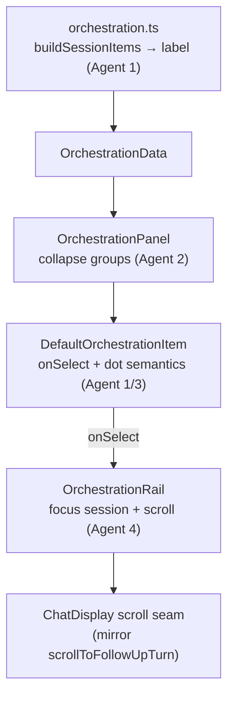

> **Archived 2026-07-08** — superseded by upstream v0.11.0 background-task/Conductor system; VORNO program paused. Retained for research only.

---
id: PLAN-009
title: Orchestration panel — Phase 1.5 client-only polish (titles, jump, collapse, dots, output)
status: done
direction: DIR-03
owner: jh
created: 2026-06-11
updated: 2026-06-11
related:
  - PLAN-007-orchestration-activity-panel.md
  - PLAN-008-orchestration-richer-progress.md
blocked-by: []
---

# PLAN-009 — Orchestration panel: Phase 1.5 client-only polish

> **Holistic overnight-build plan.** This is the source-of-truth document referenced by every
> implementation agent in the 2026-06-11 serial build. Phase 1 (PLAN-007) shipped a zero-wire,
> client-derived Activity panel. Phase 1.5 (this plan) fixes the rough edges that read as bugs —
> **without any protocol/wire change** — so it preserves upstream mergeability. The richer
> per-step/percent progress that *does* need the wire stays in PLAN-008 (planned; investigated but
> not implemented in this run).

## Goal

Make the Activity panel feel correct and useful: real titles instead of "Agent", clickable rows
that jump to the work in the session, collapsible per-session groups, an output affordance that
actually shows something, and status dots that mean something — all client-only, all behind the
existing `ORCHESTRATION_PANEL_ENABLED` flag.

## Why this is safe to ship autonomously

- **No wire/protocol change.** Everything derives from existing atoms (`sessionIdsAtom`,
  `sessionAtomFamily`, `backgroundTasksAtomFamily`) and existing message data. No
  `packages/shared/src/protocol/` edits, no new channels, no `MessageEnvelope` fields. Upstream
  mergeability is untouched (see `roadmap/upstream/compatibility.md`).
- **Behind the fork feature flag.** All UI stays gated by `ORCHESTRATION_PANEL_ENABLED`.
- **Matches existing conventions.** Strings stay **hardcoded English to match the existing panel**
  (the PLAN-007 components are not i18n'd). We deliberately do *not* introduce partial `t()` into a
  hardcoded component — that would be less consistent and would drag in the i18n parity/sort/coverage
  gates for no benefit. Revisit full-panel i18n as its own plan if desired. *(This is a documented,
  intentional deviation from the original Q6 assumption about seeding locale keys.)*

## The five symptoms → root causes → fixes

| # | Symptom | Root cause (file) | Fix (client-only) | Agent |
|---|---------|-------------------|-------------------|-------|
| 1 | Titles say "Agent" | `parent.intent/displayName/toolName` empty → panel falls back to `KIND_LABEL` "Agent" (`DefaultOrchestrationItem.tsx:49-57`) | Derive a real label from the Task's intent/description in `orchestration.ts buildSessionItems`; better fallback than "Agent <id8>" | 1 |
| 2 | Output always "no output yet" | subagent `id` is a tool-use id; `getTaskOutput(id)` only knows background tasks → empty → `'No output yet.'` (`OrchestrationRail.tsx:54-67`) | Subagent rows **jump to their work** (see #4 click-to-jump) instead of calling `getTaskOutput`; keep file output only for real background tasks | 4 |
| 3 | Dots always green, never "running" | running renders a spinner (not a dot); `done`=emerald; client-derived status collapses to `done` (`DefaultOrchestrationItem.tsx:42-77`) | Dot semantics: live pulse for running, **dimmed** done, distinct failed/stopped, + relative completion time | 3 |
| 4 | (ask) click row → jump to that spot | not implemented; rows have no onClick | `onSelect(item)` seam → focus `activeSessionIdAtom` + scroll to the tool-use message (mirror `scrollToFollowUpTurn`) | 1 (seam) + 4 (behavior) |
| 5 | (ask) collapsible per-session groups | groups always expanded (`OrchestrationPanel.tsx`) | persisted `Set<sessionId>` collapse + chevron header | 2 |

## Architecture / seams

**Foundation first (Agent 1):** the `onSelect(item)` prop is threaded through
`DefaultOrchestrationItem` → `OrchestrationPanel` → registry `OrchestrationItemRendererProps`, with
`OrchestrationRail` wiring a no-op placeholder. Agents 2–4 build on that committed seam. Because the
run is **serial and each agent branches from freshly-merged `main`**, there are no merge conflicts.

## Execution protocol (every implementation agent)

1. **Branch** from fresh `main`: `git checkout main && git pull --ff-only origin main && git checkout -b jh/2026-06-11_orch-<slug>`.
2. **Implement** only the assigned item. Do not gold-plate beyond the scoped change.
3. **GREEN GATE** (local substitute for CI, since we bypass PR):
   - `cd packages/ui && bunx tsc --noEmit` → **clean**
   - `cd packages/ui && npx eslint .` → **no new errors** vs. baseline
   - `cd packages/shared && bunx tsc --noEmit` → **clean** (only if shared touched)
   - `cd apps/server && bunx tsc --noEmit 2>&1 | grep -v TS6059 | grep error` → **empty**
   - `cd apps/electron && bun run typecheck 2>&1 | grep -cE "error TS"` → **≤ 116** (pre-existing baseline; must NOT increase)
   - `cd apps/electron && bun test src/renderer/atoms/__tests__/orchestration.test.ts` → **pass** (extend with cases for new derivation)
   - If any locale file touched: `bun run lint:i18n:parity && bun run lint:i18n:sorted && bun run lint:i18n:coverage` (we intend to touch **none**)
   - `bun build apps/server/src/index.ts --target=bun --outdir=/tmp/build-check --no-splitting` → **succeeds** (smoke)
4. **Merge** (no PR): `git checkout main && git merge --no-ff <branch> && git push origin main`. Commit/merge trailer: `Co-Authored-By: Craft Agent <agents-noreply@craft.do>`.
5. **Report** the gate transcript back to the orchestrator. **Do not merge anything red.**

**Failure policy:** if the gate cannot go green, do **not** merge; surface a precise diagnosis. The
orchestrator spawns a debugging agent to root-cause and fix in an architecturally-aligned way
(attempt 2). If that also fails, **stop the whole train cold** and report.

## Non-goals

- Any protocol/wire change, new RPC channel, or `MessageEnvelope` field (that's PLAN-008).
- Real per-phase/step/percent progress bars (PLAN-008).
- Full i18n of the panel (separate plan if desired).
- Pause/resume/priority control of subagents.

## Acceptance

- [ ] Titles show the Task's real intent/description, not "Agent".
- [ ] Clicking a row focuses its session and scrolls to the originating tool-use message.
- [ ] Per-session groups collapse/expand, state persisted across reloads.
- [ ] Output affordance shows real content (background tasks) or jumps to the work (subagents) — no dead "no output yet".
- [ ] Dots distinguish running (pulse) / done (dimmed) / failed / stopped, with relative time.
- [ ] All UI behind `ORCHESTRATION_PANEL_ENABLED`; no `packages/shared/src/protocol/` diff.
- [ ] Each item merged to `main` green per the gate above.

## Status log

- `2026-06-11` — created in `in-progress/` as the holistic Phase-1.5 plan; overnight serial build kicked off (5 agents). Baselines at start: `packages/ui` tsc clean, `apps/electron` typecheck = 116 errors, orchestration atom test 5 pass/0 fail, `main` unprotected (direct push enabled).
- `2026-06-11` — **DONE.** All 5 serial agents merged green directly to `main` (no PR, per the overnight authorization), each gated locally (CI bypassed): titles + `onSelect` seam (`aa3fe474`), collapsible groups (`ba516b18`), dot semantics (`14ae7792`), click-to-jump + output fix (`aaee2d95`), PLAN-008 finalized docs (`50965175`). Final state: `packages/ui`/`shared`/`apps/server` typecheck clean, `apps/electron` still 116 (no new errors), orchestration atom test 13 pass/0 fail, server bundle builds. **Zero `packages/shared/src/protocol/` or `i18n/locales/` changes across the whole run** — upstream mergeability preserved. Strings kept hardcoded to match the existing panel (documented deviation from the i18n-seeding assumption). Relative-"ago" time was intentionally NOT faked (no completion timestamp in client data); shows "ran 2m 3s" instead — a real "ago" awaits PLAN-008's additive timestamp.
