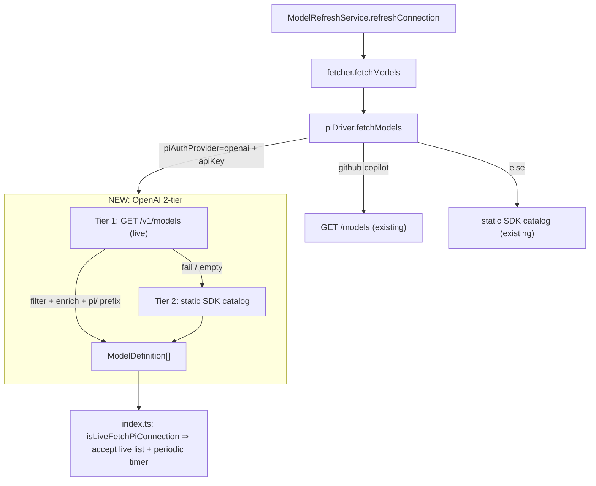

> **Archived 2026-07-08** — superseded by upstream v0.11.0 background-task/Conductor system; VORNO program paused. Retained for research only.

---
id: PLAN-010
title: Live model enumeration for OpenAI + Anthropic (stop falling behind on model drops)
status: in-progress
direction: none
owner: jh
created: 2026-06-09
updated: 2026-06-09
related: []
blocked-by: []
---

# PLAN-010 — Live model enumeration for OpenAI + Anthropic

## Goal

When OpenAI or Anthropic ship a new model, it appears in our model selector on the
next refresh **without a code change** — and with sane display metadata — so the
fork's model list stops going stale behind upstream drops.

## Problem (why we keep falling behind)

The `ModelRefreshService` already has a 3-layer fallback (live fetch → persisted
`connection.models` → `MODEL_REGISTRY` seed). But the two vendors behave very
differently:

| Vendor | Today | Result on a model drop |
|---|---|---|
| **Anthropic** (direct `providerType: 'anthropic'`) | Live `GET /v1/models`, paginated (`drivers/anthropic.ts`) | New model **appears**, but degraded: `/v1/models` carries no context window, so `getModelById()` enrichment misses and it defaults to `contextWindow: 200_000` (wrong for a 1M Opus), empty description, auto-derived shortName. Offline (Layer 3) it doesn't appear at all. |
| **OpenAI** (+ most Pi vendors, `providerType: 'pi'` + `piAuthProvider: 'openai'`) | Static `@mariozechner/pi-ai` SDK catalog (`getPiModelsForAuthProvider`), `PiModelFetcher.refreshIntervalMs = 0` | New model is **invisible** until the npm dependency is bumped. This is the painful one. |
| GitHub Copilot | Live `GET /models` (`drivers/pi.ts`) | Already fine — this plan mirrors its 2-tier pattern. |

OpenAI exposes `GET /v1/models`; we just never call it. That's the structural fix.

## Scope

### A. Live OpenAI enumeration (the high-leverage piece)

- **`packages/shared/src/agent/backend/internal/drivers/pi.ts`** — add a branch in
  `piDriver.fetchModels` for `connection.piAuthProvider === 'openai'` with a
  `credentials.apiKey`, mirroring the existing `github-copilot` 2-tier chain:
  - **Tier 1 — live**: `GET {baseUrl}/v1/models` (`baseUrl = connection.baseUrl || 'https://api.openai.com'`,
    `Authorization: Bearer <apiKey>`). Filter to chat/reasoning models (drop
    embeddings, `tts-*`, `whisper-*`, `dall-e-*`, `*-moderation*`, `realtime`,
    `transcribe`, `audio`, `image`, `babbage`/`davinci`, fine-tunes `ft:*`, and the
    existing `gpt-4` / `gpt-3.5` exclusions already encoded in `models-pi.ts`).
    Enrich each surviving id from the SDK catalog (`getModels('openai')`) by bare
    id; **prefix ids with `pi/`** so they route through the Pi backend exactly like
    the static catalog does. For ids not in the catalog, derive metadata (reasoning
    flag from `o*`/`gpt-5*` reasoning families; context window default).
  - **Tier 2 — fallback**: existing `getPiModelsForAuthProvider('openai')` static
    catalog, used when the live call fails or returns zero post-filter (same safety
    posture as Copilot's tier-2).
- **Pure helpers in `packages/shared/src/config/models-openai.ts`** (new) — the
  filter predicate, id→reasoning classification, and metadata derivation, kept
  pure and SDK-free so they're unit-testable in isolation. (Catalog enrichment via
  `getModels` stays in the driver / `models-pi.ts` to respect the
  "never import pi-ai from renderer" rule.)

### B. Periodic refresh for live-fetch Pi providers

- **`packages/server-core/src/model-fetchers/index.ts`** — today the refresh
  service special-cases only Copilot (`isCopilot`) for (1) a periodic timer and
  (2) bypassing the `userDefined3Tier` "don't overwrite user list" guard.
  Generalize both call-sites to a single `isLiveFetchPiConnection(conn)` predicate
  covering `github-copilot` **and** `openai`, so OpenAI connections get an interval
  and the live list is accepted over the static seed. Add `OPENAI_REFRESH_INTERVAL_MS`
  (6h — OpenAI's catalog moves far slower than Copilot policy).

### C. Harden Anthropic enrichment fallback

- **`packages/shared/src/config/models.ts`** — add `deriveModelMetadata(id, provider)`:
  infers `contextWindow` from family (`opus` → 1_000_000; `sonnet`/`haiku`/unknown
  → 200_000) and a humanized `name`/`shortName`. **`supportsFastMode` stays
  registry-only / `false` for unknown ids** — never infer a capability that, if
  wrong, makes the API reject the request.
- **`drivers/anthropic.ts`** — when `getModelById(m.id)` misses, fill
  `contextWindow`/`name`/`shortName` from `deriveModelMetadata` instead of the flat
  200k default + inline name-stripping.

### D. Tests + docs

- Unit tests (shared): OpenAI filter keeps reasoning/chat & drops non-chat;
  enrichment prefixes `pi/` and inherits catalog context window; tier-2 fallback on
  fetch failure (mocked `fetch`); Anthropic fallback derives 1M for an unknown
  `claude-opus-*`. Extend existing `drivers/anthropic.test.ts`.
- Note the OpenAI live fetcher in `roadmap/upstream/contribution-candidates.md`
  (clean upstream candidate — additive, no DTO change).

## Non-goals

- No new live fetchers for other Pi vendors (Google, xAI, Groq, …) — they stay on
  the SDK catalog. Only OpenAI gets a direct API in this plan; the generalized
  `isLiveFetchPiConnection` seam makes adding more cheap later.
- No `ModelDefinition` shape change, no DTO change → **wire-compat contract
  untouched, no ADR needed** (`roadmap/upstream/compatibility.md`).
- No UI or i18n changes — the selector already renders whatever models a connection
  carries; OpenAI entries fall back to `description` (no `descriptionKey`).
- Not touching the Bedrock/Vertex fetcher or `pi_compat` (manual-model) connections.
- No new feature flag — the tier-2 static-catalog fallback **is** the safety net.

## Approach

## Acceptance

- [x] OpenAI Pi connection with an API key enumerates live models via `GET /v1/models`
- [x] Live OpenAI list is filtered (no embeddings/tts/whisper/dall-e/moderation/sora/gpt-4/gpt-3.5) and `pi/`-prefixed
- [x] Live fetch failure falls back to the static SDK catalog (no regression for offline / bad key)
- [x] OpenAI connections get a periodic refresh, bypass the `userDefined3Tier` refresh guard, **and** are force-set to `automaticallySyncedFromProvider` in backfill — all via `isLiveFetchPiConnection` (see LEARNING-004)
- [x] Unknown Anthropic models derive correct context window (1M for `opus`); `supportsFastMode` stays registry-only/conservative
- [x] Tests added/updated; `packages/shared` (2899 pass / 0 fail) + `apps/server` (132 pass / 0 fail) suites green
- [x] `tsc --noEmit` clean (all CI packages); `bun build` succeeds for `apps/server` and `packages/pi-agent-server`
- [x] `roadmap/upstream/contribution-candidates.md` notes the OpenAI live fetcher
- [x] PR opened against `Swagatar-LLC/craft-agents-oss`; **all five `validate-pr.yml` checks green**

## Status log

- `2026-06-09` — created in `planned/`
- `2026-06-09` — moved from planned to in-progress; work starting on branch `jh/2026-06-09_live-model-enumeration`
- `2026-06-09` — implemented (`ab58f53c`): live OpenAI `/v1/models` fetcher + `models-openai.ts` helpers + `isLiveFetchPiConnection` refresh-service generalization + `inferAnthropicContextWindow`. All local validations green.
- `2026-06-09` — code review (staff-code-reviewer) + fixes (`d9dc1e5c`): sora denylist, `inferOpenAiContextWindow`, success-path log, and the backfill mode-force for live-fetch providers. Captured the non-obvious `inferModelSelectionMode` interaction as LEARNING-004.
- `2026-06-09` — PR [#36](https://github.com/Swagatar-LLC/craft-agents-oss/pull/36) opened; all six `validate-pr.yml` checks green. Awaiting review/merge.
