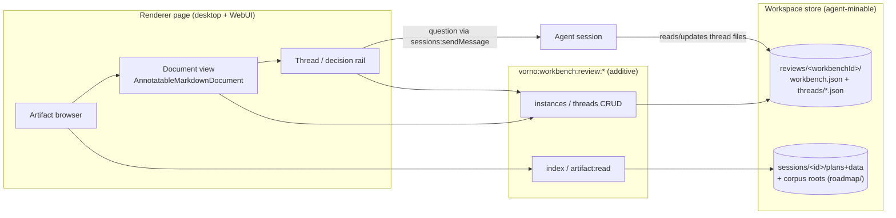

# PLAN-024 — Review Workbench — first dynamic workspace surface (v0.13.0)

## Goal

Ship an in-app, interactive review workbench — the first of Vorno's dynamic workspaces for working with larger volumes of data — that lets Jeff (and future workspace teams) read dense architecture/governance artifacts with native diagrams, comment inline on specific text, aggregate artifacts across sessions and the roadmap corpus, and run an anchored question/feedback loop with agent sessions. Target release: **v0.13.0** (Jeff cuts).

## Scope

- **Shared types** (`packages/core`): `ArtifactRef`, `ReviewThread`, `WorkbenchInstance`, artifact-version anchoring (`contentHash` + optional `gitSha`), reusing `AnnotationV1` for anchors/bodies.
- **Workspace review store** (`packages/shared`): plain-JSON files under `{workspaceRoot}/reviews/<workbenchId>/` — one file per thread, agent-minable by construction (Read/Grep), with session back-links (`sessionLinks`) so reviews surface back into sessions and agentic mining.
- **Artifact index** (`packages/shared`): on-demand scan of (a) session `plans/` + `data/` markdown across the workspace, (b) per-workbench configured corpus roots (e.g. `roadmap/`). No persistent index in v0.1.
- **`vorno:workbench:*` RPC channels** (`packages/server-core` handlers + transport registration): `vorno:workbench:review:index`, `:artifact:read`, `:instances:list|create|update`, `:threads:list|mutate`. Additive per ADR-0012/ADR-0014; instance ids ride payloads, not channel names.
- **Renderer page** (`apps/electron`, feature-flagged): workbench list + artifact browser rail, document view (`Markdown` renderer → native mermaid/tables/diffs) wrapped in `AnnotatableMarkdownDocument` for select-to-comment, thread/decision rail (open questions, one-way-door decisions, filters), stale-artifact badge when `contentHash` no longer matches.
- **Question loop**: route an annotation as a question into a chosen session via existing `sessions:sendMessage`, embedding artifact path, quoted anchor, and thread id; replies are linked back on the thread (`sessionLinks`).
- WebUI inherits the page automatically (shared renderer).
- Compatibility audit: record the `vorno:workbench:*` surface in `roadmap/upstream/compatibility.md`'s vorno-surface section.

## Non-goals

- Canvas/tldraw projection (DIR-01's spatial act comes later and consumes this plan's store + index).
- Push-notification of thread changes to other live clients (refetch-on-focus in v0.1; add `vorno:workbench:review:changed` push when multi-client editing demands it).
- Interactive corpus graph (generated mermaid only, v0.2).
- Promotion tooling (comment → ADR edit stays an explicit agent/human act).
- An MCP tool for reviews (the store is plain files agents already Read/Grep; a dedicated tool waits for demand).
- Cutting the release — the PR is the 0.13.0 candidate; Jeff cuts per release policy.

## Approach

Anchoring (ADR-0014): quote-anchored `AnnotationV1` targets + artifact `contentHash` (and `gitSha` for repo files). Stale versions badge, never silently re-anchor.

## Acceptance

- [ ] Open the PLAN-023 ALIGN artifacts (session 260719-noble-panther) in the workbench; mermaid diagrams and tables render natively
- [ ] Select text → add comment → thread persists under `{workspaceRoot}/reviews/` as plain JSON with content-hash anchor
- [ ] Ask a question from an annotation → message lands in a chosen session with artifact path + quote + thread id
- [ ] Stale-artifact badge appears when the underlying file changes
- [x] An agent can locate and read review threads with Read/Grep alone (no new tools — plain JSON under `{workspaceRoot}/reviews/`, verified by store tests)
- [x] Tests added/updated (19: store round-trip, corrupt-file skip, index scan, containment rejection, content-hash staleness)
- [x] Behind feature flag (`workspaceSettings.workbenchEnabled`, default off; toggle in Settings → Workspace)
- [x] `compatibility.md` vorno-surface entry; ADR-0014 recorded

## Status log

- `2026-07-19` — created in `planned/`
- `2026-07-19` — moved to `in-progress/`: build underway on branch plan-024-review-workbench
- `2026-07-19` — v0.1 built end-to-end (contract → store/index/handlers → renderer page → gates). CI-parity gates green: 6-package typecheck clean, shared 3180 tests 0 fail, server 190 tests 0 fail, doc-tools OK, i18n ×3 OK, branding gate clean, server build OK, electron tsc at 108 pre-existing baseline (0 new). Remaining unchecked acceptance items are runtime QA (Jeff): open the ALIGN artifacts, annotate, ask-agent round-trip, stale badge in UI.
- `2026-07-21` — PR #104 merged to main (`595a3bda`) after G1 quality review (session 260721-ivory-aspen, verdict green; feature-flagged dark, decoupled from v0.13.0 per ADR-0015 §9). Advisory findings A1–A6 carried into PLAN-025/C1. Per ADR-0015, the review workbench becomes a consumer of the generalized artifact plane (PLAN-025) — kernel generalization must keep this workbench functional with no data loss.
- `2026-07-24` — status reconciliation (no build activity). Two facts recorded here that had been missing from this log: (1) **strategic verdict (owner, 2026-07-21/22): the Workbench, as a standalone review surface, is *not* the answer** to the dynamic-workspaces question. The generalized artifact plane (PLAN-025/C1) and the DIR-04 program supersede it as the primary bet; this plan is retained as a *consumer* of the artifact plane, not as an independent DIR-01 build. (2) The kernel this plan seeded shipped: **PLAN-025/C1 merged to main via PR #106 (`e8b2fa41`) on 2026-07-24** (feature-flagged dark), so the workbench's store/annotation/anchor layers now live under the artifact plane. **Disposition is an OPEN OWNER DECISION** — keep-dark / salvage the store+annotation layers into C-ladder work / park.
- `2026-08-22` — moved from in-progress to blocked: code remains present behind `workbenchEnabled`, but the standalone surface was strategically superseded and four runtime acceptance items remain unchecked. Awaiting the recorded owner disposition; no active implementation is underway.
