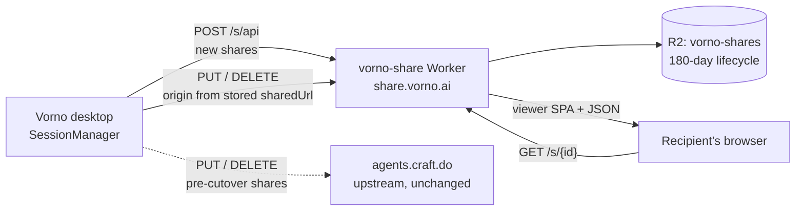

# PLAN-035 — Vorno-hosted session shares

**Decision:** [ADR-0024](../../decisions/0024-vorno-hosts-its-own-shared-sessions.md)

## Goal

**Share online** stores the user's transcript on infrastructure Swagatar operates, at a
`vorno.ai` URL, with a share id that cannot be guessed and a link that cannot be used by
its recipients to overwrite or delete the share — and every pre-cutover share stays
readable *and revocable* on Craft's infrastructure.

## Problem

`packages/server-core/src/sessions/SessionManager.ts` has four call sites against
`${VIEWER_URL}/s/api`, where `VIEWER_URL` is `SERVICE_BASE_URL` is
`https://agents.craft.do`. The shipped product's publish button `POST`s the entire
`StoredSession` — messages, tool calls, tool *results*, working directory — to upstream's
storage, unauthenticated. [vorno.ai/docs/sharing](https://vorno.ai/docs/sharing/)
discloses this accurately, which is what made it worth fixing rather than worth hiding.

Two defects come along for the ride and are in scope because shipping them onto our own
domain would be a choice:

- `PUT` and `DELETE` are authenticated by the share id alone, and the share id is in the
  URL the user forwards to other people. Any recipient can replace or delete the share.
- The revoke paths build their URL from the `VIEWER_URL` constant. Flipping the constant
  without fixing that strands every existing share: un-revocable, still public, on
  someone else's infrastructure.

## Scope

- A Cloudflare Worker (`vorno-share`) + R2 bucket (`vorno-shares`) on the Swagatar
  account, serving `POST|GET|PUT|DELETE /s/api[/:id]` plus the `apps/viewer` SPA.
- `VIEWER_URL` split out of `SERVICE_BASE_URL` in `packages/core/src/branding.ts`,
  following the ADR-0023 / PR #155 shape exactly.
- Client changes in `SessionManager.ts`: origin-derived API base for existing shares, and
  edit-token plumbing through session metadata.
- A rewrite of the `/docs/sharing` page in `vorno-site` (the source is
  `docs-src/pages/sharing.md` there, **not** in this repo).
- The provisioning list Jeff must action, and release-checklist verification.

## Non-goals

- `OAUTH_RELAY_CALLBACK_URL` / `SLACK_OAUTH_RELAY_CALLBACK_URL`. Separate lane,
  ADR-0025.
- Migrating existing shares off Craft. We hold only a URL, and rewriting `sharedUrl`
  would break links other people already have.
- Any account system, sign-in, or per-share password. The link stays the access control;
  the docs page says so and stays true.
- Redesigning the viewer. `apps/viewer` ships as-is.

## Approach



The one non-obvious arrow is the dotted one. `VIEWER_URL` is used **only to create**;
`updateShare`, `revokeShare`, and the revoke-on-delete path derive their origin from the
share's stored `sharedUrl`. That is what keeps old shares revocable.

### Worker contract

| Route | Auth | Behaviour |
|---|---|---|
| `POST /s/api` | none, rate-limited | 128-bit id → R2; returns `{ id, url, editToken }` |
| `GET /s/api/:id` | none | JSON body, `nosniff`, `no-store` |
| `PUT /s/api/:id` | `Bearer <editToken>` | replaces object, resets lifecycle age |
| `DELETE /s/api/:id` | `Bearer <editToken>` | deletes object |
| `GET /s/:id`, `/s/assets/*`, `/` | none | viewer SPA |

Bodies stream directly into R2 and are never parsed — the Workers free plan allows
**10 ms CPU per invocation**, which a multi-megabyte `JSON.parse` + re-serialise would
blow. Validation is therefore `Content-Length` (required, ≤ 8 MB) only; see ADR-0024.

## Lanes

Lanes 1 and 2 are inert — they change no shipped behaviour and can merge in any order.
Lane 4 is the cutover and **must merge last**.

### Lane 1 — the Worker (`Swagatar-LLC/vorno`)

- [ ] `apps/viewer/worker/index.js` — the four API routes + SPA fallback.
- [ ] `apps/viewer/wrangler.jsonc` — `vorno-share`, assets from `dist/`,
      `run_worker_first: true`, R2 binding `SHARES`, rate-limit binding, custom domain
      `share.vorno.ai`.
- [ ] `apps/viewer/worker/index.test.ts` — id entropy/charset, size-cap rejection,
      edit-token enforcement on `PUT`/`DELETE`, `nosniff` on reads, route matching.
- [ ] `apps/viewer/README.md` — build, deploy, and the post-deploy HTTP verification.
- [ ] Point the Vite dev proxy at the new Worker instead of `thecraftagents.com`.

### Lane 2 — client back-compat, no flip (`Swagatar-LLC/vorno`)

Separated from Lane 4 deliberately: this is the change that must be *right*, and it is
reviewable and mergeable while `VIEWER_URL` still points at Craft, where it is a no-op.

- [ ] `SessionManager.ts`: derive the API origin from `managed.sharedUrl` in
      `updateShare`, `revokeShare`, and the revoke-on-delete path in `deleteSession`;
      fall back to `VIEWER_URL` only when `sharedUrl` is absent or unparseable.
- [ ] `shareEditToken` in session metadata + `ShareResult`; sent as
      `Authorization: Bearer` on `PUT`/`DELETE` when present. Additive — upstream's
      backend ignores both, so old shares keep working.
- [ ] Tests: an existing `agents.craft.do` share revokes against `agents.craft.do` even
      when `VIEWER_URL` has been flipped. This is the regression that matters.

### Lane 3 — provisioning (**Jeff**) and deploy

the Swagatar Cloudflare account. R2 is already enabled (two
unrelated buckets exist), so no billing action is required. See *What Jeff must create*.

- [ ] R2 bucket `vorno-shares` + lifecycle rule: delete objects 180 days after creation.
- [ ] Worker `vorno-share` deployed with the R2 and rate-limit bindings.
- [ ] Custom domain `share.vorno.ai` (auto-creates the DNS record).
- [ ] **No Redirect Rule** on the `vorno.ai` zone for `share.*` — Redirect Rules run
      before Workers and silently shadow them.
- [ ] Verify over real HTTP before Lane 4 merges (`/usr/bin/curl`; the shell's `curl` is
      aliased to a missing binary):
      create → read → wrong-token `PUT` is 401 → correct-token `PUT` → delete → 404.

### Lane 4 — the flip (`Swagatar-LLC/vorno`) — **merges last**

- [ ] `packages/core/src/branding.ts`: `VIEWER_URL = 'https://share.vorno.ai'`,
      independent of `SERVICE_BASE_URL`; narrow the `SERVICE_BASE_URL` comment to the
      OAuth relay. Same shape as the `DOCS_URL` split in PR #155.
- [ ] Branding gate + full CI (all eight checks).
- [ ] Cut a release per `[skill:release-and-version]` (a `feat:` lands → minor). Attach
      the `ntfy` source to the release session.
- [ ] Add to release verification: `share.vorno.ai` serves the viewer, and a
      create/read/delete round-trip succeeds. This fails **silently** — the same shape as
      LEARNING-048 and the docs checks in PLAN-034.

### Lane 5 — disclosure (`Swagatar-LLC/vorno-site`) + legal (**Jeff**)

- [ ] Rewrite `docs-src/pages/sharing.md` "Where it goes": Swagatar operates the storage;
      the link is still the only access control; state the retention period. The
      "not operated by Swagatar, LLC" sentence becomes false on cutover.
- [ ] Keep both required footer lines (Craft Docs Ltd. non-affiliation, "Powered by
      Claude") — `npm run verify` fails the build without them.
- [ ] **Blocking, Jeff's call:** `vorno.ai` has no privacy policy (`/privacy`, `/terms`,
      `/legal` all 404, checked 2026-08-17). Swagatar becomes the data controller for
      user transcripts at cutover. Publishing a policy is a prerequisite for Lane 4, not
      a follow-up.
- [ ] **Jeff's call:** confirm or change the 180-day retention. Whatever ships must
      appear on the docs page.

## Ordering

```
Lane 1 (Worker) ──┐
Lane 2 (client)  ─┼──> Lane 3 (provision + deploy + verify) ──> Lane 4 (flip + release)
                  │                                              ▲
Lane 5 (docs + privacy policy) ───────────────────────────────────┘
```

**No shipped build may point at a backend that does not exist.** Lane 4 is the only
change that alters what a released binary talks to, and it merges only after Lane 3's
HTTP verification passes. Lanes 1–2 are safe to merge immediately: the Worker is not
referenced by any client, and the client change is a no-op while `VIEWER_URL` is
unchanged.

Lane 5's privacy policy gates Lane 4 for legal reasons, not technical ones. A build that
ships transcripts to Swagatar storage while the docs still say Swagatar does not hold
them is the one outcome worse than not doing this at all.

## What Jeff must create

No agent mints, installs, or requests these. Consolidate with ADR-0025's list — that lane
needs the same kind of Worker + custom domain.

| # | Thing | Where | Notes |
|---|---|---|---|
| 1 | R2 bucket `vorno-shares` | Cloudflare → R2 | R2 already enabled; free tier |
| 2 | Lifecycle rule: delete 180 days after creation | bucket → Settings | the retention policy; confirm the number |
| 3 | Worker `vorno-share` + `share.vorno.ai` custom domain | Cloudflare → Workers | auto-creates the DNS record |
| 4 | `CLOUDFLARE_API_TOKEN` for deploys | wherever deploys run | `wrangler whoami` is currently **not authenticated** |
| 5 | Decision: 180-day retention, or another number | — | must match the docs page |
| 6 | A privacy policy at `vorno.ai/privacy` | vorno-site | **blocks Lane 4** |

The workspace `cloudflare` source token reaches this account today, but it is
IP-allowlisted and the MCP client egresses over a rotating IPv6 privacy address, so it is
not a dependable deploy path. `bunx wrangler deploy` with a real token is the durable one.

## Acceptance

- [ ] A new share round-trips against `share.vorno.ai`: create → open in a browser →
      update → revoke → 404.
- [ ] A share id is 22 base64url characters and survives the viewer's `^/s/([a-zA-Z0-9_-]+)$`.
- [ ] `PUT`/`DELETE` with a wrong or absent edit token return 401 and do not mutate.
- [ ] A body over 8 MB returns 413 and the UI shows "Session file is too large to share".
- [ ] `GET /s/api/:id` responds `application/json` with `X-Content-Type-Options: nosniff`
      regardless of what was uploaded.
- [ ] **A pre-cutover `agents.craft.do` share still revokes successfully after the flip.**
- [ ] `/docs/sharing` contains no statement that is false, including retention.
- [ ] `vorno.ai/privacy` returns 200.
- [ ] All eight CI checks pass; branding gate clean.
- [ ] Release verification extended with the share round-trip.

## Status log

- `2026-08-17` — created in `in-progress/`; ADR-0024 proposed. Lane F pulled forward from
  ADR-0023 open thread #2 at Jeff's direction.
- `2026-08-22` — moved from in-progress to blocked: Lane 1 (Worker) and Lane 2 (client back-compat) merged as PRs #157/#159; the back-compat fix shipped in v0.18.0. The cutover PR #160 was closed without merging, `VIEWER_URL` still targets `agents.craft.do`, `share.vorno.ai` is not provisioned, and the privacy/retention gates remain Jeff decisions. Current shipping docs remain accurate.
