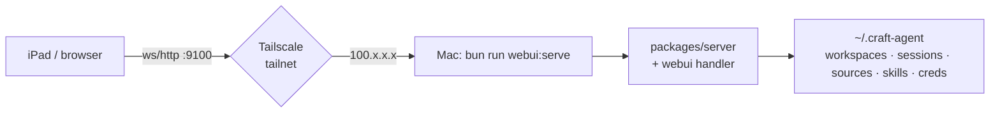

# PLAN-005 — WebUI Tailscale launcher script

## Goal

A `bun run webui:serve` command that spins up `packages/server` with the WebUI bundle, bound to the host's Tailscale IPv4 address on port 9100, sharing `~/.craft-agent` with the upstream desktop release — so the WebUI is reachable from an iPad (or any tailnet device) with the same workspaces, sessions, sources, skills, and credentials as the local desktop app.

## Scope

- New script: `scripts/webui-serve.ts`
  - Detect Tailscale IPv4 via `tailscale ip -4`. Fail with a clear message if Tailscale isn't running or returns no address.
  - Always run `webui:build` first (per user preference — no stale-bundle confusion).
  - Always run `server:build:subprocess` first (matches `server:prod`).
  - Spawn `packages/server/src/index.ts` with the env below.
  - Forward stdio + signal handling so Ctrl-C cleanly stops the server.
- New `package.json` script:
  - `webui:serve` — invokes `scripts/webui-serve.ts`
- Env baked into the launch:
  - `CRAFT_CONFIG_DIR=$HOME/.craft-agent` (shared with upstream desktop)
  - `CRAFT_RPC_HOST=<tailscale-ipv4>` (resolved at launch time)
  - `CRAFT_RPC_PORT=9100`
  - `CRAFT_WEBUI_DIR=apps/webui/dist`
  - `CRAFT_BUNDLED_ASSETS_ROOT=$PWD/apps/electron`
  - `CRAFT_SERVER_TOKEN=<static>` (from user shell env — script errors if unset)
  - `CRAFT_WEBUI_PASSWORD=<static>` (from user shell env — script errors if unset)
  - `CRAFT_WEBUI_WS_URL=ws://<tailscale-ipv4>:9100` (so the browser-side `/api/config` advertises the right WS endpoint)
- Pass `--allow-insecure-bind` to the server (Tailscale's WireGuard provides wire encryption; HTTP/WS in the clear inside the tunnel is acceptable).
- Print a one-line summary on startup:
  - `WebUI: http://<tailscale-ipv4>:9100  (config dir: ~/.craft-agent)`

## Non-goals

- TLS / HTTPS. Deferred — Tailscale already encrypts on the wire. A future plan can wire `tailscale cert` issuance.
- LAN-IP binding (192.168.x.x). Out of scope; `--allow-insecure-bind` over plain wifi is unsafe.
- iPad-optimized responsive layout. Out of scope; the existing desktop layout is reused as-is.
- Concurrent-writer protection between desktop + WebUI server against shared `~/.craft-agent`. The user has explicitly accepted this constraint and will not run both simultaneously.
- Auto-restart on crash, systemd-style daemonization, log rotation. Manual `Ctrl-C` / re-run is fine for v1.

## Approach

**Script flow** (`scripts/webui-serve.ts`):

1. Check `CRAFT_SERVER_TOKEN` and `CRAFT_WEBUI_PASSWORD` env vars; abort with usage hint if missing.
2. `Bun.spawnSync(['tailscale', 'ip', '-4'])` → grab the first IPv4. Abort if non-zero exit or empty.
3. Run `bun run server:build:subprocess` and `bun run webui:build` (sequential, fail-fast).
4. `Bun.spawn` the server with the env above + `--allow-insecure-bind`. Inherit stdio.
5. On `SIGINT`/`SIGTERM`, forward to child and exit when it does.

**Why static env in `package.json`-invoked script (not embedded in the script):** The user keeps the token + password in a vault and exports them in their shell profile. The script reads from `process.env`, so they live in one place (the vault → shell rc) and never get committed.

## Acceptance

- [ ] `bun run webui:serve` builds, prints the Tailscale URL, and starts the server.
- [ ] From an iPad on the same tailnet: opening the printed URL shows the login page, accepts the configured password, and loads the workspace list from `~/.craft-agent/workspaces/`.
- [ ] Existing sessions and sources from the upstream desktop install appear in the WebUI without migration.
- [ ] Missing `CRAFT_SERVER_TOKEN` or `CRAFT_WEBUI_PASSWORD` fails fast with an actionable error message.
- [ ] Tailscale not running fails fast with an actionable error message (mentioning `tailscale up`).
- [ ] `Ctrl-C` cleanly stops the child server (no orphaned bun process on the port).
- [ ] README note in `apps/webui/README.md` (or new section) covering: setup, env vars to export, how to use it, and the desktop-vs-WebUI mutual-exclusion warning.

## Extension — `daily-driver` orchestrator (added 2026-05-08)

`webui:serve` alone leaves the user juggling two terminals: the headless server, and a separately-launched Electron-in-thin-client-mode. Combine them.

**Architecture decision:** Electron embeds the same `bootstrapServer` as `packages/server` and acquires the same `~/.craft-agent/.server.lock`. They cannot coexist on the same config dir. Electron has a built-in **thin-client mode** triggered by `CRAFT_SERVER_URL` (`apps/electron/src/main/index.ts:444`) that skips server bootstrap entirely. Daily-driver uses this:

1. Build subprocesses, WebUI bundle, Electron bundle.
2. Spawn `packages/server` headless (with WebUI on Tailscale IP:9100). Wait for `CRAFT_SERVER_URL=` stdout marker (server is bound and ready).
3. Spawn local Electron with `CRAFT_SERVER_URL=ws://<tailscale-ip>:9100` + token → desktop UI joins as another client.
4. iPad/browser → `http://<tailscale-ip>:9100` → joins as yet another client.

**Credentials banner.** Print server token + WebUI password at startup so the user can grab them without spelunking through env exports.

**Clean shutdown.** `Ctrl-C` → SIGINT to both children → both await exit. The headless server's existing shutdown handler (`packages/server-core/.../headless-start.ts:378`) calls `releaseServerLock()`, with a `process.on('exit')` belt-and-suspenders at line 205. If either child dies on its own, take the other one with it (avoids zombies on rebuild).

**Replaces** the old one-line `daily-driver` package.json script (which only built + launched Electron with `CRAFT_CONFIG_DIR=$HOME/.craft-agent`).

## Status log

- `2026-05-07` — created in `planned/`
- `2026-05-07` — moved from planned to in-progress
- `2026-05-08` — extended: `daily-driver` script orchestrates headless server + Electron-thin-client + credentials banner + clean Ctrl-C shutdown
