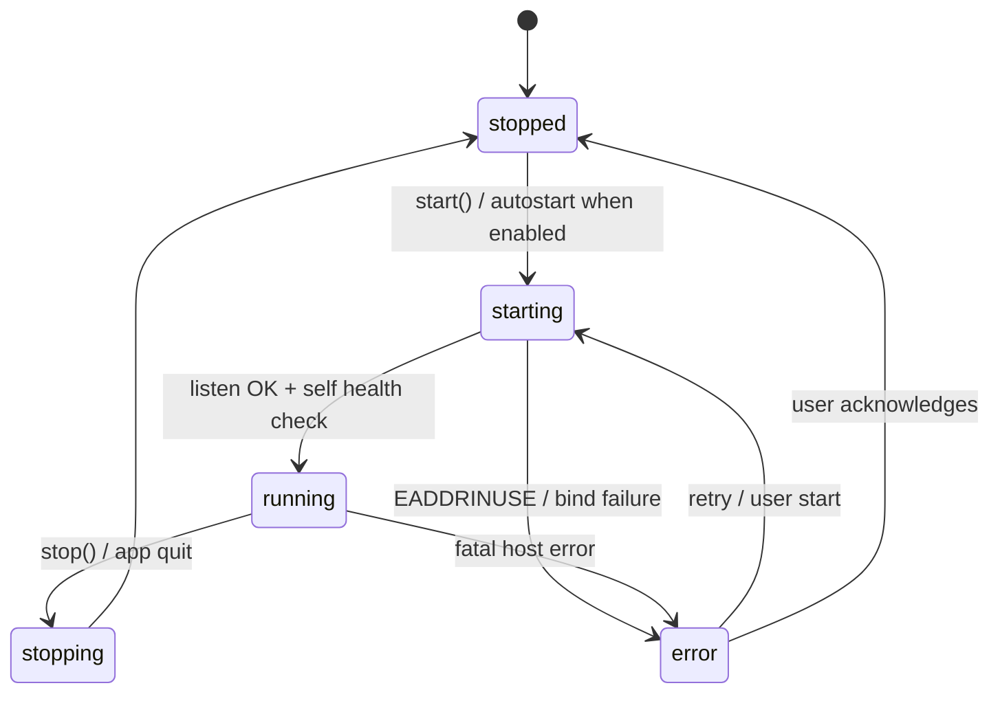

# PLAN-012 — Tray-based server supervision (embedded trigger-server host)

Design for a macOS menu-bar (tray) presence in the Electron desktop app that supervises the fork's HTTP trigger server (`apps/server`): start/stop/status with visible state, working in the **packaged** build. This plan defines the **Embedded host** from the approved "Inbound Webhooks & Headless Server — Design Spec" (internal spec, `vorno-internal`, approved by the maintainer 2026-07-06); the Standalone/headless host is the parallel track ("Headless server mode", referred to here as PLAN-013 scope).

Board tracking: design and implementation tracked internally. Implementation covers tray core + supervision (packaged DMG with working start/stop/status) and packaged-build smoke verification. Launch-at-login and tray-residency polish are tracked internally and are deliberately **out of scope** here.

This is a design doc only — no implementation code ships in this PR, except ADR-0007 which is included (see §3).

---

## Goal

From the menu bar, the maintainer can see whether the trigger server is running, start/stop it, and trust the same behavior in the packaged DMG — with the server's webhook/automation seam wired to the desktop's own `AutomationSystem`/`SessionManager` per the approved spec, and nothing precluding the standalone headless mode.

## Scope

- Tray (macOS menu bar first) with server status, start/stop, and quick actions.
- A supervised **embedded host** for the trigger server inside the Electron main process.
- Completion of the currently-unwired `RemoteAccessSettingsPage` seam (types + IPC handlers).
- `craft-fork:*` IPC surface for config/status/control.
- Packaged-build verification plan (`vorno-internal:learnings/LEARNING-011-*` (private) recipe).

## Non-goals

- Launch-at-login / login-item, dock hiding, single-instance tray polish (tracked internally).
- Windows/Linux tray parity (tracked as follow-up; design notes included).
- Webhook receiver implementation itself (tracked internally; this plan only guarantees the host seam it needs).
- Standalone/headless server packaging (PLAN-013 scope).
- SSO/IAM for the hosted offering (separate research spike per the spec).

---

## 1. Verified current state (all checked at ec74ea3e)

| Fact | Evidence |
|---|---|
| `apps/electron/src/main/server-lifecycle.ts` is dead code | Exports `startServer`/`stopServer`/`getServerInfo`/`cleanupServer`; zero imports anywhere in `apps/electron`. It spawns `apps/server/src/index.ts` **from TS source** via vendored bun — but `apps/server` source is not in the packaged bundle (`electron-builder.yml` `files:` includes only `dist/`, `resources/`, `vendor/bun`, and interceptor sources), so it can never work packaged. |
| `RemoteAccessSettingsPage` is an unwired scaffold | `apps/electron/src/renderer/pages/settings/RemoteAccessSettingsPage.tsx` calls seven `window.electronAPI.*RemoteAccess*` methods and imports four `RemoteAccess*` types from `shared/types` — none exist (`tsc` errors TS2305/TS2339, tolerated as pre-existing). No main-process handlers, no channel-map entries, no preload exposure. |
| `server-config.json` already exists with the right schema | `apps/server/src/config.ts`: `{ enabled, port (3847), host (127.0.0.1), apiKeys[], rateLimits }` under `CONFIG_DIR` (`~/.vorno-agent`, ADR-0005, `CRAFT_CONFIG_DIR` override). Keys are `craft_sk_*`, SHA-256 hashed at rest (`keyHash`), display prefix only (`keyPrefix`). |
| The trigger server core is runtime-thin | `apps/server/src/index.ts` is ~88 lines: `Bun.serve({ fetch: router, websocket })`. The router (`router.ts`) is fetch-style `(Request) => Response`; auth middleware, routes, SSE, session pool, client registry are all runtime-agnostic. Only `Bun.serve` itself and `ServerWebSocket` typing in `transport/ws-transport.ts` are Bun-specific. |
| `apps/server` bundles clean | `bun build apps/server/src/index.ts --target=bun --no-splitting` → single 14.6 MB file (verified locally; also a CI gate). No native deps, no `import.meta.dir`, no relative-path assumptions. |
| Node-hosted HTTP+WS already runs in Electron main | `packages/server-core/src/transport/server.ts` (`WsRpcServer`) hosts `ws` `WebSocketServer` over `node:http`/`https`, **with an optional `httpHandler` serving plain HTTP on the same listener** (`listen()` at :265–311) and `error` propagation for `EADDRINUSE`. The `ws` dependency is already bundled into `main.cjs` (esbuild `build:main` externalizes only `electron` and the Claude SDK). |
| The automation callback seam exists | `packages/shared/src/automations/automation-system.ts:52` `onPromptsReady?: (prompts: PendingPrompt[]) => void`, wired to the desktop `SessionManager` at `packages/server-core/src/sessions/SessionManager.ts:1699`. The spec's `onWebhookEvent` is defined to be "same shape as `onPromptsReady`". |
| Vendored bun already ships in the packaged app | `build-dmg.sh` downloads pinned `bun-v1.3.9` (~57 MB) into `apps/electron/vendor/bun/`; `electron-builder.yml` packages it. Used by the runtime resolver for other subprocesses — **not needed by this plan** (see decision below), but its presence means the child-process fallback stays cheap if ever needed. |
| No lock conflict | `apps/server` does **not** acquire `~/.vorno-agent/.server.lock` (that lock belongs to `packages/server-core/bootstrap/headless-start.ts`, used by Electron's `bootstrapServer` and the upstream headless server). |
| No existing tray | Zero `Tray` usage in the codebase. macOS-only dock icon/badge management exists (`app.dock.setIcon`, badge overlay). Quit cleanup is centralized in `before-quit` (`apps/electron/src/main/index.ts:1181–1270`). |

---

## 2. The load-bearing decision: replace `server-lifecycle.ts` with an in-process embedded host

**Decision: delete `server-lifecycle.ts`. The embedded host runs the trigger server in-process in the Electron main process on `node:http` + `ws`, behind a host-adapter seam. The Bun entry (`apps/server/src/index.ts`) is untouched and remains the standalone host.** This is ADR-0007 (included in this PR, `roadmap/decisions/0007-trigger-server-host-adapter.md`).

### Why not wire up the spawn seam (bundle `apps/server` + bun, supervise a child)?

The child-process path is cheaper than originally feared — bun is already vendored and the server bundles to one 14.6 MB file — but it fails the spec's architecture:

1. **The callback seam cannot cross a process boundary.** The approved spec fixes the receiver-to-automation seam as a **constructor-injected callback** (`onWebhookEvent(workspaceId, payload)`, same shape as `onPromptsReady`) wired to *the desktop host's* `AutomationSystem`/`SessionManager`. A bun child would force a bespoke IPC bridge (child → main forwarding protocol) that reimplements the seam as a wire protocol — exactly the kind of parallel machinery the spec rejected for the receiver itself.
2. **Two session-creation worlds.** A child process either runs its own `CraftAgent` pool (sessions invisible to the live desktop UI, duplicated agent spawning, PLAN-011's keep-alive toggle and other fork settings resolved in a second process) or bridges everything back anyway.
3. **Packaging risk.** Every bundling change re-enters the packaging pitfalls captured in `vorno-internal:learnings/LEARNING-011-*` (private) (staging, collector, silent `extraResources` skips). In-process embedding needs **zero** electron-builder changes: the server code is workspace TS compiled into `main.cjs` by the existing esbuild step, and `ws` is already bundled there for `WsRpcServer`. "Works in the packaged build" becomes true by construction (still smoke-verified, §8).
4. **Supervision is simpler and more truthful.** In-process, "status" is direct object state, not PID-liveness inference; port conflicts surface synchronously from `listen()`; stop is `close()` + drain, not SIGTERM/SIGKILL escalation.

### Alternatives considered (summarized; full treatment in ADR-0007)

- **B — bun child + RPC bridge:** kept as documented fallback. Reuses the running local `WsRpcServer` (child connects with a spawn token) for the bridge. Rejected for the seam/duplication reasons above.
- **C — Electron `utilityProcess`:** crash isolation without bundling a runtime, but still requires the node listener port *and* a MessagePort bridge for the seam — the costs of both A and B.

### What this requires of `apps/server` (the only structural refactor)

Extract the runtime-neutral core so both hosts construct the same server:

```
apps/server/src/
  core/create-trigger-server.ts   // NEW: createTriggerServer(config, hostBridge) →
                                  //   { fetchHandler, wsHooks, pool, registry, startEviction(), shutdown() }
  index.ts                        // standalone entry: Bun.serve(fetchHandler) + Bun ws adapter (unchanged behavior)
  transport/ws-transport.ts       // split: protocol logic (handshake/heartbeat/RPC dispatch, runtime-neutral)
                                  //   vs socket adapter (Bun ServerWebSocket | npm `ws` WebSocket)
```

`HostBridge` is the spec's seam, defined now, consumed incrementally:

```ts
export interface HostBridge {
  // Spec seam — same shape as AutomationSystem's onPromptsReady. The webhook
  // receiver (tracked internally) emits through this; PLAN-012 only guarantees it exists.
  onWebhookEvent?: (workspaceId: string, payload: WebhookIngestEvent) => void
  // Optional session routing (see §6 open question 2)
  createSession?: (...) => Promise<...>
}
```

Embedded host passes callbacks bound to the desktop `AutomationSystem`/`SessionManager`; standalone (PLAN-013) constructs its own headless instances in-process. **Nothing in the core may assume an Electron host exists** (spec hard rule).

All of this is fork-owned code (`apps/server` has no upstream counterpart) — no upstream-file edits, no wire-contract impact.

---

## 3. Architecture

```mermaid
graph TD
    subgraph Electron main process
        TRAY[Tray menu] --> SUP
        RPC[craft-fork:triggerServer:* handlers] --> SUP
        SUP[TriggerServerSupervisor] -->|listen/close| HOST[Embedded host<br/>node:http + ws]
        HOST -->|fetchHandler| CORE
        SUP -->|reads/writes| CFG[(server-config.json)]
        CORE[createTriggerServer core<br/>router · auth · SSE · pool] -->|HostBridge callbacks| AS[AutomationSystem /<br/>SessionManager]
    end
    subgraph Standalone host — PLAN-013
        BUN[Bun.serve entry<br/>apps/server/src/index.ts] --> CORE2[same core]
        CORE2 --> HAS[headless AutomationSystem +<br/>SessionManager]
    end
    EXT[External clients<br/>webhooks · REST · WS · SSE] --> HOST
    EXT --> BUN
```

New fork-owned files in `apps/electron/src/main/`:

- `trigger-server/supervisor.ts` — state machine + lifecycle (below). Owns the single source of runtime truth.
- `trigger-server/host.ts` — node adapter: `http.createServer` bridging `IncomingMessage`/`ServerResponse` ⇄ fetch `Request`/`Response` (small hand-rolled adapter, ~100 lines; must stream response bodies for SSE), plus `ws` `WebSocketServer({ noServer: true })` handling `upgrade` for `/ws`·`/rpc` through the split transport's socket-adapter interface.
- `trigger-server/tray.ts` — tray creation + menu rendering, subscribed to supervisor state.

`server-lifecycle.ts` is deleted in the implementation PR.

### Supervision model



- **Desired vs actual state.** `server-config.json.enabled` is the *desired* state (autostart at app launch and the reconciliation target). Tray/settings Start/Stop both change runtime state **and persist `enabled`**, so a relaunch restores what the user last chose. There is exactly one config source of truth; no parallel store.
- **Start:** load config → construct core with `HostBridge` → `listen(host, port)` → self-check `GET /health` on the bound port → `running`. Status includes `startedAt`, bound host/port, active session count (`pool.activeCount`).
- **Stop:** stop accepting (close listener) → `wsTransport.shutdown()` (existing 1001 close) → `pool.drainAll()` with a 10 s cap → `stopped`. Wired into the existing `before-quit` cleanup block (alongside `messagingHandle.dispose()` etc., `apps/electron/src/main/index.ts:1244` area).
- **Port conflicts:** `EADDRINUSE` from `listen()` → `error` state. Then probe `GET /health` on the same port: if the response matches the trigger-server health shape (`status`, `transports`, `activeSessions` — see `routes/health.ts`; implementation adds a fork fingerprint field to `/health` to disambiguate), report "another trigger server instance holds port N"; otherwise "port N is in use by another application". No auto port hopping — surfacing beats magic; the user changes the port in settings.
- **Crash handling:** in-process, there is no PID to babysit. Request-level failures are already contained by the router's error middleware; host-level `error` events on the http server/`ws` transition to `error` state with the message in tray + settings. One automatic restart attempt after 2 s for transient host errors; repeated failure stays in `error` awaiting user action. No unbounded restart loops.
- **Config changes while running:** host/port/rate-limit changes persist immediately but apply on restart; supervisor exposes `configStale: true` in status so both UIs can show "restart to apply". API key create/revoke applies live (auth middleware reads config per request — verified in `middleware/auth.ts`).

---

## 4. Tray UX

macOS menu bar first (the maintainer's daily-driver platform). `Tray` + `nativeImage` template images (`resources/tray/serverTemplate.png` + `@2x`, 16 pt, monochrome per macOS HIG so it adapts to light/dark/tint) with a state variant: plain glyph = stopped, glyph+dot = running, glyph+exclamation = error. `setToolTip` mirrors the status line.

Menu (rebuilt on each supervisor state change):

```
Trigger Server: Running on 127.0.0.1:3847     (disabled, status line)
2 active sessions                              (disabled, only when running)
─────────────────────────────
Stop Server            ⌥ shows Restart         (or "Start Server" when stopped;
                                                "Retry" + error line when in error state)
Copy Server URL                                (only when running)
─────────────────────────────
Remote Access Settings…                        (focus/create main window, navigate to settings/remote-access)
Show <App Window>                              (focus/create main window)
```

Notes:

- No "Quit" item in v1 — quit stays in the app/dock menu; tray-residency behavior (app alive with windows closed, login item) is tracked internally and this menu must not half-implement it.
- The FORK badge contract stays renderer-side and untouched; the tray tooltip includes the fork name so upstream-stable running side-by-side is never ambiguous.
- Tray strings go through main-process i18n (all 7 locales, parity lint applies).
- Windows/Linux: `Tray` is cross-platform and the design carries over (Windows needs `.ico`, Linux appindicator quirks); ship darwin-first, gate creation on platform, follow-up ticket for parity.
- The tray reads supervisor state directly (same process) — no IPC involved for the tray itself.

---

## 5. Config and settings-page interplay

- **Source of truth stays `~/.vorno-agent/server-config.json` via `apps/server/src/config.ts`** (`loadServerConfig`/`saveServerConfig`/`generateApiKey`/`revokeApiKey`). The embedded host imports these directly (fork-owned module, importable from main). No parallel config, no migration.
- **`RemoteAccessSettingsPage` is completed, not replaced.** The four missing types are defined in `apps/electron/src/shared/types.ts` (below); its seven `electronAPI` calls get real handlers; the page keeps its existing UX (status poll every 5 s, start/stop buttons, host/port editing, key create/revoke with show-once, 0.0.0.0 warning). Verify/wire its settings-navigator registration (it exports `DetailsPageMeta` but currently doesn't typecheck, so its routing has never been exercised).
- Settings page and tray render the same supervisor status; toggling from either place is coherent because both go through the supervisor.

## 6. IPC surface (wire-compat per compatibility.md, PLAN-011 as the model)

New channel group in `packages/shared/src/protocol/channels.ts` (additive, end-of-file group, `// fork(PLAN-012)` comment), all added to `LOCAL_ONLY_CHANNELS` in `routing.ts` (exhaustiveness test gates this):

```ts
triggerServer: {
  GET_CONFIG:     'craft-fork:triggerServer:getConfig',
  UPDATE_CONFIG:  'craft-fork:triggerServer:updateConfig',
  GET_STATUS:     'craft-fork:triggerServer:getStatus',
  START:          'craft-fork:triggerServer:start',
  STOP:           'craft-fork:triggerServer:stop',
  CREATE_API_KEY: 'craft-fork:triggerServer:createApiKey',
  REVOKE_API_KEY: 'craft-fork:triggerServer:revokeApiKey',
},
```

DTOs (in `apps/electron/src/shared/types.ts`, satisfying the page's existing imports; names keep the page's `RemoteAccess*` prefix to minimize churn):

```ts
interface RemoteAccessConfig {
  enabled: boolean; host: string; port: number;
  apiKeys: RemoteAccessApiKeyInfo[];            // id, name, keyPrefix, createdAt, lastUsedAt, permissions — never hashes
  rateLimits: { requestsPerMinute: number; concurrentSessions: number };
}
interface RemoteAccessApiKeyPermissions { /* mirrors apps/server ApiKeyPermissions */ }
interface RemoteAccessStatus {
  running: boolean;
  state: 'stopped' | 'starting' | 'running' | 'stopping' | 'error';
  host?: string; port?: number; startedAt?: number;
  activeSessions: number;
  configStale?: boolean; lastError?: string;
}
```

Handlers live in a new fork-additive file `apps/electron/src/main/handlers/trigger-server.ts` (registered next to the other GUI handler groups) — main-process-only because the supervisor is main-process state; this also keeps `packages/server-core` free of the dependency. `CREATE_API_KEY` returns `{ fullKey, info }` — the only time the full key crosses IPC; renderer shows once and drops it (existing page behavior). Client plumbing follows PLAN-011 exactly: `channel-map.ts` entries + `ElectronAPI` declarations + `ipc-channels.test.ts` additions.

No push event in v1 — the page already polls at 5 s and the tray is in-process. If the poll feels laggy, a `craft-fork:triggerServer:statusChanged` push is an additive follow-up.

## 7. Security considerations

- **Binding:** default `127.0.0.1`; `0.0.0.0` remains an explicit user choice with the existing red warning. The tray "Copy Server URL" copies the actual bound host.
- **API keys:** unchanged model — `craft_sk_*` shown once, SHA-256 at rest, constant-time compare in auth middleware, rate limiting per key. IPC never carries hashes; only prefix + metadata.
- **Subprocess-env contract untouched:** the embedded host does not touch `packages/shared/src/agent/options.ts` semantics. In-process embedding means agent sessions triggered via the server spawn through the same desktop code paths (same `buildClaudeSubprocessEnv`, same `DISABLE_GROWTHBOOK=1` pin) — strictly better than the dead spawn seam, which forwarded raw `ANTHROPIC_API_KEY` etc. into a child env.
- **Unauthenticated surface** stays `/health` only in this plan (the webhook capability-URL route class arrives with the webhook implementation tracked internally and has its own verification ladder per the spec).
- **CORS** middleware unchanged (permissive, localhost-first); revisit when standalone/hosted mode exposes it publicly (PLAN-013).
- Fork-retained features unaffected by construction: token-usage indicator, ADR-0005 config isolation (all paths via `CONFIG_DIR`), branding gate (no product-name strings in new UI copy), fast mode, PLAN-011 keep-alive (single process → single resolution), FORK badge. The standalone Bun entry keeps dual-transport + auth middleware byte-compatible.

## 8. Packaging plan and verification

**Packaging plan: no packaging changes.** The embedded host is TypeScript compiled into `dist/main.cjs` by the existing `build:main` esbuild step (only `electron` and the Claude SDK are external; `ws` already bundles). No new binaries, no `electron-builder.yml` edits, no `build-dmg.sh` edits, no size impact beyond ~1–2 MB of bundled JS. The vendored bun and the `bun build` CI gate for the standalone server are unchanged. This is the primary reason Option A wins on the "must work packaged" acceptance criterion.

**Mandatory packaged-build verification (`vorno-internal:learnings/LEARNING-011-*` (private) recipe), performed in the implementation PR:**

```bash
PATH="/opt/homebrew/opt/node@22/bin:$PATH" CRAFT_DEV_RUNTIME=1 \
  NODE_OPTIONS=--max-old-space-size=16384 \
  bash apps/electron/scripts/build-dmg.sh arm64
```

Checklist against the produced `.app` with a **throwaway config dir** (`CRAFT_CONFIG_DIR=$(mktemp -d)` at launch):

1. App launches clean (no "Cannot find module"); tray icon appears in `stopped` state; fresh `server-config.json` created with defaults on first settings visit.
2. Tray → Start Server → state `running`; `curl http://127.0.0.1:3847/health` returns the health JSON.
3. Settings → create API key → authenticated `POST /api/sessions` with the key succeeds; `401` without; rate-limit `429` when hammered.
4. SSE stream and WS handshake (`/ws`, close codes 4001–4005 preserved) each smoke-checked once.
5. Occupy the port with `nc -l 3847`, then Start → tray shows `error` with the port-conflict message; free the port, Retry → `running`.
6. Stop from tray → `stopped`; relaunch app with `enabled: true` → autostarts; quit app while running → clean shutdown (no orphaned listener; `lsof -i :3847` empty).
7. Fork-feature spot checks in the same packaged build: FORK badge visible, token-usage indicator, keep-alive toggle, fast mode.

## 9. Implementation decomposition

Sized as **two implementation PRs** mapping to the board:

**PR-1 (supervision + tray + IPC):**

1. Extract `createTriggerServer()` core + split `ws-transport.ts` into protocol logic and socket adapter; Bun entry re-composed on top, behavior-identical (`apps/server` tests + `bun build` gate stay green). Define `HostBridge` with `onWebhookEvent` (wired to a no-op logger until the webhook receiver lands) .
2. Node host adapter (`trigger-server/host.ts`): fetch bridge with SSE streaming + `ws` upgrade path through the socket adapter.
3. `TriggerServerSupervisor` + `before-quit` integration + autostart-on-launch reconciliation.
4. Channels/routing/DTOs/handlers/channel-map/preload types + `ipc-channels.test.ts`; define `RemoteAccess*` types so `RemoteAccessSettingsPage` typechecks; verify its settings-navigator registration.
5. Tray (`trigger-server/tray.ts`) + template icons + i18n (7 locales, parity lints).
6. Tests: supervisor state machine (start/stop/error/port-conflict with an injected fake host); fetch-bridge unit tests (headers, streaming, body cap); ws-adapter handshake/close-code parity tests reusing existing ws-transport test fixtures if present; `apps/server` suite unchanged and green (strict CI gate).

**PR-2 (packaged verification + fixes):** run §8 end-to-end, fix what it surfaces, capture any non-obvious packaging insight as a learning in `vorno-internal`, attach the checklist results to the PR.

If PR-1 reviews too large, the natural split line is steps 1–2 (server-side refactor, standalone-only risk) from 3–6 (Electron-side) — but the packaged acceptance only holds with both, so prefer one PR.

## 10. Packaged-build verification results (2026-07-09)

Ran the §8 checklist against a real packaged arm64 DMG built with the canonical `vorno-internal:learnings/LEARNING-011-*` (private) recipe. Every **automatable** item passed. Items requiring a human looking at pixels are listed at the end.

### Build

- Recipe: `PATH="/opt/homebrew/opt/node@22/bin:$PATH" CRAFT_DEV_RUNTIME=1 NODE_OPTIONS=--max-old-space-size=16384 bash apps/electron/scripts/build-dmg.sh arm64` — exit 0, no collector OOM.
- Artifact: `apps/electron/release/Craft-Agents-arm64.dmg` (~219 MB); app at `release/mac-arm64/Craft Agents.app`.
- Staging verified present in the bundle: `@anthropic-ai/claude-agent-sdk` v0.3.197, `@anthropic-ai/claude-agent-sdk-binary/claude` (224 MB native), `@vscode/ripgrep/bin/rg`, `vendor/bun` (57.5 MB), `dist/main.cjs` (43.7 MB). No "Cannot find module" at launch.
- Bundled runtime: **Electron 39.2.7 / Node 22.21.1** (queried via `ELECTRON_RUN_AS_NODE=1`).

### Method notes (see `vorno-internal:learnings/LEARNING-015-*` (private))

Verification ran while the maintainer's daily-driver app was live, so the throwaway instance was isolated with **both** `CRAFT_CONFIG_DIR=/tmp/vor42-cfg` **and** `--user-data-dir=/tmp/vor42-userdata` (the single-instance lock is keyed on userData, not `CRAFT_CONFIG_DIR`; without the second flag the launch is bounced and quits silently). Packaged production builds disable all electron-log transports, so every check below was made through the **HTTP surface / process observation**, never logs. Port 34871 used throughout. The maintainer's daily-driver (PID 45598) was untouched.

### Checklist results

| # | Item | Result | Evidence |
|---|------|--------|----------|
| 1 | App launches packaged, no missing-module crash | PASS | Full process tree came up; renderer bootstrapped; SDK/binary/ripgrep resolve in-bundle. |
| 1b | Autostart reconcile: `enabled:true` in config → server starts on launch | PASS | With `server-config.json{enabled:true,port:34871}`, `lsof` showed `Craft Agents` LISTEN on 127.0.0.1:34871 ~12 s after launch, no manual start. |
| 2 | `GET /health` → 200, fork fingerprint | PASS | `{"status":"ok","fork":"trigger-server","version":"0.4.0",…}` HTTP 200. |
| 3a | `/api/*` without key → 401 | PASS | `/api/workspaces` (GET) and `/api/sessions` (POST) both 401; bogus `craft_sk_` key also 401. |
| 3b | API key via provisioning CLI (same config dir) → authorized 200 **live** | PASS | `--generate-api-key` wrote the hash to the shared `server-config.json`; `Bearer <key>` on `/api/workspaces` returned 200 with **no restart** (router calls `loadServerConfig()` per request, `router.ts:64`). |
| 3c | Rate limit → 429 | PASS | 30 authorized reqs/min succeeded, the next 7 returned 429 (`X-RateLimit-Remaining`, `Retry-After:60`). |
| 4a | WS handshake (`/ws`) | PASS | 101 upgrade; full protocol handshake with the key returned `handshake_ack` (clientId + registeredChannels). Bad path `/nope` correctly refused (socket destroyed). |
| 4b | SSE reachability / no-hang | PASS (partial) | `curl -N` on `/api/sessions/<none>/events` with key returned 404 in <1 ms (fetch-bridge streams and does not hang). Full SSE event stream needs a live session (workspace + LLM key) the throwaway config lacks — see "needs the maintainer". |
| 5 | Port conflict → error state, no crash, no port theft | PASS | Occupied 34871 with a dummy listener, then launched: app main process stayed alive (`ps` STAT `SN`), the squatter kept the port, the app bound nothing. `EADDRINUSE` caught at `listen()` → supervisor error state (message not observable — logs off). |
| 5b | Recovery after port freed | PASS | Freed the port, relaunched → bound 34871, `/health` 200. |
| 6a | `httpServer.closeAllConnections` available in bundled Node | PASS | `typeof …closeAllConnections === "function"` on Node 22.21.1 (≥18.2). |
| 6b | Clean quit: `lsof :34871` empty, no orphans | PASS | SIGTERM to main → within ~4 s port free, zero remaining instance/helper processes. |
| 7 | Fork-retained features ship in the packaged renderer | PASS (structural) | Rust FORK-badge accent `#c2410c` present in shipped `main-*.js` (the `VITE_HIDE_FORK_BADGE` guard is compile-inlined, so the badge always renders in prod); token-usage, keep-alive (PLAN-011), and `RemoteAccess*`/`craft-fork:triggerServer:*` markers present in the shipped bundle. |

### Needs the maintainer's eyes (not programmatically verifiable)

- **Tray glyph** appearance and legibility in the macOS menu bar, light **and** dark mode, and the state variants (plain = stopped, dot = running, exclamation = error). Tray creation runs without crashing; the rendered image was not captured (two same-named app instances made PID-safe window capture unreliable, and full-screen capture would have grabbed the maintainer's daily-driver).
- **Tray menu** contents and interaction feel (Start/Stop/Retry, Copy Server URL, status lines, ⌥-Restart).
- **FORK badge** visually on-screen (structurally confirmed shipped; the 2 px rust bar at the top should be visible).
- **Settings → Remote Access page** rendered interaction — status poll, host/port edit, key create show-once dialog, 0.0.0.0 warning. (IPC handlers and DTOs are wired and the page is in the bundle; live UI walk-through not automated.)
- **Full SSE event stream** end-to-end (create a session against a real workspace + LLM connection, then `curl -N` the events endpoint and watch frames flush).

### Fixes made

None. The packaged build behaved correctly across every automatable check; no code changes were required. One observability gap (no logs in packaged builds → a failed autostart is undiagnosable in the field) is captured in `vorno-internal:learnings/LEARNING-015-*` (private) and flagged to the orchestrator as a possible follow-up policy change to `logger.ts` — deliberately not changed here (app-wide production-logging policy is out of a verification pass's scope).

## Acceptance

- [ ] Tray shows correct state (stopped/starting/running/error) and start/stop works from tray and settings, both driving one supervisor.
- [ ] `RemoteAccessSettingsPage` fully functional (config edit, key create/revoke show-once, status poll) — no more TS2305/TS2339 suppressions for it.
- [ ] `server-config.json` remains the only config store; `enabled` acts as desired-state/autostart.
- [ ] Packaged arm64 DMG passes the full §8 checklist with a throwaway `CRAFT_CONFIG_DIR`.
- [ ] Standalone Bun entry behavior-identical: `apps/server` tests green (strict), `bun build` gate green, WS close codes 4001–4005 preserved.
- [ ] All new channels under `craft-fork:triggerServer:*`, `LOCAL_ONLY`, exhaustiveness + ipc-channels tests updated; compatibility.md audit note at next merge audit.
- [ ] `HostBridge.onWebhookEvent` seam exists and is host-injected (spec compliance for the webhook receiver / PLAN-013); no code path assumes the Electron host.
- [ ] `server-lifecycle.ts` deleted.
- [ ] Fork-retained features verified in the packaged build (§8 item 7).
- [ ] ADR-0007 accepted.

## Risks / open questions (with defaults)

1. **Fetch-bridge fidelity** (streaming SSE, backpressure, abort propagation, large bodies) is the main technical risk. Default: hand-rolled minimal adapter with unit tests + packaged smoke; if it fights back, adopt a tiny vetted adapter dependency instead of growing our own.
2. **Should embedded REST session creation route through the desktop `SessionManager` (live in UI) instead of the server's own `CraftAgent` pool?** Default for v1: **keep the existing `SessionPool`** (behavior parity with today's server, zero new seam surface); routing through `SessionManager` via `HostBridge.createSession` is the natural follow-up and the spec's direction for webhook-spawned sessions (which go through `executePromptAutomation` anyway). Needs the maintainer/orchestrator confirmation before PR-1 step 1 finalizes the `HostBridge` shape.
3. **Main-process load:** trigger traffic is low-rate by design (rate limits default 30 req/min), but a misbehaving client hits the UI process's event loop. Mitigation: existing per-key rate limiting + body cap; escalation path is Option C (`utilityProcess`) behind the same supervisor interface — the seam makes that a host swap, not a redesign.
4. **`/health` fingerprint** (port-conflict disambiguation) adds a field to an unauthenticated response. Default: innocuous static marker (no version leak beyond what's already there).
5. **Tray + window-all-closed interplay:** with a tray present, users may expect close-to-tray semantics. Explicitly unchanged in v1 (tracked internally); tray only supervises the server.

## Status log

- 2026-07-08 — created in `planned/` (design doc, tracked internally); ADR-0007 drafted in the same PR.
- 2026-07-09 — packaged-build verification complete (§10). Built the canonical arm64 DMG (Electron 39.2.7 / Node 22.21.1, SDK 0.3.197 + native binary staged, no OOM, no missing-module crash). Every automatable §8 item passed against a throwaway `CRAFT_CONFIG_DIR` + isolated `--user-data-dir`: autostart reconcile, `/health` fork fingerprint, 401→200 auth (CLI key applied live), 429 rate limit, WS `handshake_ack`, SSE no-hang, port-conflict error-without-crash + recovery, `closeAllConnections` present, clean quit (no orphans, port freed), fork features shipped in the bundle. No code fixes needed. Two non-obvious verification gotchas captured in `vorno-internal:learnings/LEARNING-015-*` (private) (single-instance lock keyed on userData; production builds disable all electron-log transports). Visual items (tray glyph/menu, FORK badge, Remote Access page walk-through, full SSE stream) flagged for the maintainer.
- 2026-07-08 — moved from planned to in-progress: PR-1 implemented — runtime-neutral `createTriggerServer` core + `WsProtocol`/`WsSocketAdapter` split (WS adapter PORTED, not deferred; standalone Bun path byte-identical, strict tests green), embedded node:http + `ws` host, `TriggerServerSupervisor` (state machine + autostart + port-conflict + `/health` fork fingerprint), macOS tray, `craft-fork:triggerServer:*` IPC, completed `RemoteAccessSettingsPage`, deleted `server-lifecycle.ts`. ADR-0007 flipped proposed → accepted. Rebased onto main @ 09f9ee27 (absorbed PLAN-013 provisioning + standalone host — both compose on the new core). Packaged DMG verification remains.

- 2026-07-25 — Shipped and in production; folder-state reconciled `in-progress` → `done` (roadmap status review, session 260724-light-delta).
