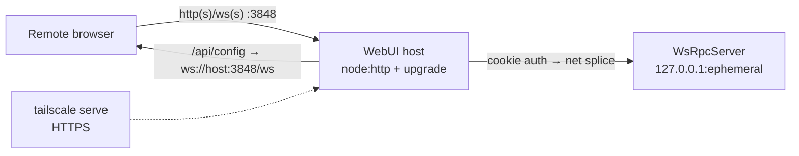

# PLAN-022 — WebUI remote access: single-port WS proxy, connection-error screen, bind settings, tailscale tunnel

## Goal

The packaged WebUI (PLAN-020) is reachable from another device through **one port**, fails loud (not into the onboarding walkthrough) when RPC is unreachable, exposes its bind address in Remote Access settings, and can be fronted by `tailscale serve` for HTTPS — shipped as v0.12.0.

## Context (diagnosed internally)

Remote access today half-works: `webui.host=0.0.0.0` lets a phone load the SPA and log in, but `/api/config` hands back `ws://<request-host>:<rpcPort>` while the in-process RPC WsRpcServer binds `127.0.0.1` only (`headless-start.ts` — `options.rpcHost ?? CRAFT_RPC_HOST ?? '127.0.0.1'`). Every RPC call fails, including `getSetupNeeds()`, and `App.tsx`'s catch ("if check fails, show onboarding to be safe") renders the onboarding walkthrough — a misleading dead end. Deliberately NOT fixed by binding the RPC server outward: the fix is to proxy WS through the already-exposed WebUI port.

## Scope

Four legs, three PRs:

1. **Single-port WS proxy (PR A).** `apps/electron/src/main/webui/host.ts` gains an `upgrade` handler (trigger-server `host.ts` pattern): authenticate the `craft_session` cookie (`validateSession` against the supervisor's per-run JWT secret), then splice the upgrade through to the loopback RPC listener (raw `net.connect` to `127.0.0.1:<rpcPort>`, replay the upgrade request + head, pipe both directions). `WsRpcServer` accepts any upgrade path and re-validates the forwarded cookie itself (`validateSessionCookie`), so auth holds at both hops. `/api/config` (desktop `handler.ts`) returns the WebUI's **own** origin (`ws(s)://<request-host>/ws` — same port the page loaded from) instead of the raw RPC port. `resolveWebSocketUrl` already upgrades ws→wss behind an https proxy. RPC protocol unchanged (wire-compat contract untouched; this is fork-owned surface).
2. **Connection-error screen (PR A).** RPC-unreachable must never render onboarding. The webui adapter surfaces `TransportConnectionState`; `App.tsx` init distinguishes "transport can't connect / getSetupNeeds threw" from "genuinely unconfigured" and renders a "can't reach your Vorno instance" screen with Retry. i18n keys in all 7 locales.
3. **WebUI bind settings (PR B).** Host dropdown in `WebUiSection.tsx` (127.0.0.1 / 0.0.0.0 + the trigger-server amber warning), wired through `WebUiRemoteConfig`/`updateConfig` with `configStale` restart semantics. A hand-edited specific-interface IP in `server-config.json` is surfaced truthfully (shown as a custom option, not clobbered). Per-interface binding stays a docs-only advanced pattern (`docs/webui-remote-access.md`).
4. **Tailscale serve tunnel (PR C).** `webui.tunnel: { provider: 'none' | 'tailscale' }` — an extensible secure-tunnel-provider shape (cloudflared et al. later; only tailscale implemented). Main process detects the `tailscale` CLI (PATH + `/Applications/Tailscale.app/...`), runs `tailscale serve` fronting the WebUI port on start, clears it on stop, surfaces the `https://<machine>.<tailnet>.ts.net` URL in settings; degrades with guidance when the CLI is absent. Single-port proxy (leg 1) means one serve rule covers HTTP+WS.
5. **Release v0.12.0** (features ⇒ MINOR; pre-authorized by the maintainer): consolidate release notes, full-cluster bump, tag on merge commit, verify feed assets.

## Non-goals

- Binding the RPC WsRpcServer to non-loopback interfaces (the proxy removes the need; smaller exposed surface).
- Per-interface bind UI (docs-only).
- Non-tailscale tunnel providers (config shape only).
- TLS termination inside the app (delegated to tailscale serve / user's reverse proxy).
- Any RPC wire-protocol change (compatibility.md contract).

## Approach

Key wiring facts (verified):
- Supervisor already owns the JWT secret and `validateSessionCookie`; `getWsEndpoint()` provides the loopback RPC port.
- `WsRpcClient` uses the `/api/config` `wsUrl` verbatim, and `WsRpcServer` (`WebSocketServer({ server })` / plain mode) does not restrict upgrade paths — cookie fallback auth at `server.ts:438` validates the forwarded Cookie header.
- Settings number inputs commit on blur/Enter (PR #88); WebUiSection copy is fully i18n'd (unlike the legacy trigger section) — keep it that way.

## Acceptance

- [ ] From a non-loopback client (phone or curl via LAN IP): login → `/api/config` returns the WebUI origin → WS connects through the proxy → app state loads (no onboarding).
- [ ] Same-host WebUI flow unchanged.
- [ ] Unauthenticated WS upgrade to the WebUI port is rejected (no cookie ⇒ socket destroyed/401).
- [ ] Killing the RPC endpoint (or blocking WS) renders the connection-error screen with working Retry — never onboarding.
- [ ] Host dropdown persists `webui.host`, shows the amber all-interfaces warning, honors `configStale`, and surfaces hand-edited custom IPs truthfully.
- [ ] Tailscale provider: with CLI present, enabling yields a working `https://…ts.net` URL (wss upgrades through one serve rule); without CLI, actionable guidance, no crash.
- [ ] i18n keys present in all 7 locales (CI gate).
- [ ] Unit tests for cookie-gated upgrade auth + `/api/config` origin; supervisor/tunnel tests per existing patterns.
- [ ] Release notes bullets appended per feature PR; v0.12.0 cut, feed assets verified.
- [ ] LEARNING captured for the loopback-RPC/onboarding-fallback trap (`vorno-internal:learnings/LEARNING-028-*` (private)).

## PLAN-005 disposition

PLAN-005 (done, 2026-05) was the **dev-tooling** answer: `webui:serve`/`daily-driver` scripts binding a headless server to the Tailscale IP. Leg 4 productizes the same intent inside the packaged app (managed `tailscale serve` + loopback bind + single-port proxy) and supersedes PLAN-005's approach for end users; the scripts remain for development.

## Status log

- `2026-07-15` — created in `planned/`
- `2026-07-15` — moved from planned to in-progress: a follow-up session picking up the earlier diagnosis; legs 1+2 → PR A, leg 3 → PR B, leg 4 → PR C, then v0.12.0
- `2026-07-15` — leg 4 implemented (PR C, stacks on PR #92 bind-settings). Tailscale serve tunnel provider: `webui.tunnel: { provider: 'none' | 'tailscale' }` (config.ts + second-level nested merge for files predating it); new `tunnel.ts` `TunnelManager` with injectable `exec`/`locateBinary` seams (execFile, no shell, 15s timeout), CLI detected via PATH probe + `/Applications/Tailscale.app/Contents/MacOS/Tailscale`; commands `tailscale serve --bg --https=443 http://127.0.0.1:<port>` (up), `tailscale serve --https=443 off` (down), `tailscale status --json` → `Self.DNSName` (URL). Supervisor brings the tunnel up on start (fire-and-forget, never fails the listener) and tears it down on stop/dispose; **provider changes apply LIVE** (tear old serve rule / bring new one up, no listener restart, so NO configStale — the tunnel fronts from outside the process). Degrades: CLI absent → `unavailable` + install guidance; serve fails → `error` + stderr-derived message. UI: "Secure tunnel" card in WebUiSection (i18n select none/tailscale, status line, ts.net URL + copy when running, unavailable guidance). 12 new i18n keys in all 7 locales (parity/sort/coverage gates green). Tests: `tunnel.test.ts` (detect/up/off/error via fake seams) + supervisor wiring tests (up on start, torn down on stop, live provider switch). Docs: "Secure tunnel (Tailscale serve)" section appended. tsc: 7 baseline → 7 (zero new). `vorno-internal:learnings/LEARNING-029-*` (private) captured (serve syntax + single-serve-rule-covers-WS + loopback-bind-is-fine).
- `2026-07-15` — legs 1+2 implemented (PR A). Single-port WS proxy: `host.ts` gained a `/ws` upgrade handler (cookie-auth → raw-TCP splice to loopback RPC), `handler.ts` `/api/config` now returns the WebUI's own origin `ws(s)://<host>/ws` (verbatim request Host, https⇒wss), supervisor wires `validateCookie`/`getWsTarget` seams. Connection-error screen: `App.tsx` `initialize()` distinguishes transport-unreachable (→ new `connection-error` state + `ConnectionErrorScreen` with Retry) from unconfigured (→ onboarding); catch never dead-ends into onboarding. Tests: new `host.test.ts` (upgrade auth + bidirectional splice), extended `handler.test.ts` (proxied `/ws` url, verbatim Host, `x-forwarded-proto` wss) + `supervisor.test.ts` (seam wiring). i18n `connectionError.*` in all 7 locales. `vorno-internal:learnings/LEARNING-028-*` (private) captured. tsc: 7 baseline → 7 (zero new). RPC wire protocol unchanged.
- `2026-07-15` — legs 1+2 merged (PR #93), leg 3 merged (PR #92), leg 4 merged (PR #94); e2e proxy verified from a non-loopback interface under real Node (auth reject + cookie splice + echo). v0.12.0 release prep (notes consolidation + full-cluster bump) in flight.
- `2026-07-15` — **v0.12.0 released** (PR #95 → tag v0.12.0 → release run 29437863410 success; latest-mac.yml + dmg/zip + blockmaps verified on vorno-releases). Remaining acceptance: the maintainer's real-device phone test of the shipped build.
- `2026-07-24` — **v0.12.3 follow-up fixes** (branch `jh/release-0.12.3`, ready-to-ship): three remote-access field bugs found while validating the shipped build — (1) the WebSocket URL is now upgraded `ws→wss` when the page is served over an HTTPS proxy (`apps/webui/adapter/ws-url.ts`, unit-tested), fixing mixed-content login/connect failures behind Tailscale; (2) the WebUI login password now persists across restarts and is user-settable via a new **LOCAL_ONLY** `craft-fork:webui:setPassword` channel (`WebUiSection.tsx` → `setWebUiPassword`), not only regenerable; (3) the Tailscale tunnel accepts a configurable HTTPS port (not hardcoded 443) and reliably clears its serve rule on stop/quit (`webui/tunnel.ts`, `supervisor.ts`). Adds a CI-gated **headless WebUI smoke suite** (`webui/__tests__/{smoke,settings}.e2e.test.ts` + `validate-pr.yml`) exercising a real HTTP host + login + single-port WS proxy, and settings-driven revert detectors for the three fixes. Compatibility audit line added (additive fork channel, wire-compatible). tsc baseline held. Real-device phone test of the shipped build still pending.

- 2026-07-25 — Shipped (WebUI remote access: single-port WS proxy + tunnel, v0.12.x); moved to `done/` per owner ratification. Open tail: real-device phone verification tracked separately, not blocking closure.
