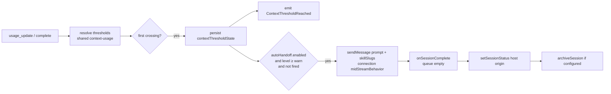

# PLAN-055 — Auto-handoff at the context warning threshold

## Goal

When an interactive session's context usage crosses the workspace's warning
threshold, Vorno can automatically inject a user-configured handoff prompt
(which may mention skills) into that session without interrupting it, and once
the handoff turn completes, optionally set a configured status and archive the
session.

## Scope

- **A host-side context-threshold watcher.** The session manager already
  receives every `usage_update` and `complete` event with the live input-token
  count and context window. It resolves the workspace's per-provider /
  per-model thresholds (PLAN-003) exactly as the renderer's indicator does, and
  detects the first crossing of `warn` and of `danger` per session. The
  crossing is persisted on the session so a restart never re-fires it.
- **A first-class automation app event, `ContextThresholdReached`.** Emitted on
  the workspace automation bus with `level`, `usedTokens`, `contextWindow`,
  `fraction`, the resolved thresholds, `model`, and `providerType`, so users can
  write ordinary automations against it (PLAN-030 / ADR-0021 govern the
  actions). Match value is the level (`warn` / `danger`).
- **The built-in consumer: auto-handoff.** A per-workspace setting under the
  token limits (`defaults.autoHandoff`) with: enabled, prompt (supports
  `@skill-slug` mentions, resolved the way automation prompts resolve them), an
  optional status to set afterwards, and an optional archive flag. On the first
  `warn` crossing of an interactive session, the prompt is delivered through the
  same path the composer uses mid-turn — the connection's `midStreamBehavior`
  (steer lands at the next tool-call boundary, queue lands after the turn) —
  never an abort. When the handoff turn completes (queue empty), the status is
  applied through the PLAN-031 choke point with a `host` origin (a
  human-configured workspace setting is declared intent) and the session is
  archived if requested. Archive is deferred to completion because the archive
  guard refuses mid-turn targets.
- **Settings UI** in AI settings, one card per workspace directly under its
  token-threshold card, with complete i18n across every locale.
- **Scope of sessions:** interactive sessions only. Hidden sessions, Tasks
  Conductor sessions (`taskSlug`), and automation-created sessions
  (`triggeredBy`) are excluded from both the event and the handoff.

## Non-goals

- Firing on `danger` for the handoff (the event carries both levels; the
  built-in consumer fires once at `warn`, or on the first crossing seen if a
  session lands above `warn` in one step).
- Re-arming within a session. One handoff per session; the latch is persisted.
- Creating the successor session on the user's behalf. The prompt (and the
  skills it mentions) does the handoff; `spawn_session` already exists for it.
- Changing how thresholds are configured or displayed (PLAN-003 stands).
- Any wire change. The new event is internal to the automation bus; the new
  settings key is an additive optional field on `WorkspaceSettings`.

## Approach

- The pure threshold math (`resolveThresholds`, `computeContextUsage`) moves
  from the renderer into a browser-safe `@craft-agent/shared/context-usage`
  module; the renderer re-exports it so its tests and imports stay put.
- `SESSION_PERSISTENT_FIELDS` gains `contextThresholdState` (first-crossing
  timestamps per level, handoff fired/pending markers).
- The consumer lives in `SessionManager` next to the emitter, not as a bus
  handler, so it works deterministically and cannot be rate-gated or looped
  away by the automation guards; the event is still emitted for user rules.

## Acceptance

- [x] `ContextThresholdReached` is emitted once per level per interactive
      session, with the documented payload, and is listed in the automations
      docs, renderer event labels, and shared event tables.
- [x] Threshold resolution on the host produces the same level the renderer
      indicator shows for the same `(providerType, model, used, limit)`.
- [x] `defaults.autoHandoff` persists through workspace config, DTO, and RPC
      validation (unknown status ids are rejected); the setting is off by default.
- [x] On the first `warn` crossing, the configured prompt reaches the session via
      `sendMessage` with resolved skill slugs and no abort; the latch survives a
      restart.
- [x] After the handoff turn completes, the configured status is applied (closed
      statuses included, via `host` origin) and the session is archived when
      requested; nothing is applied while the turn is still running.
- [x] Settings card renders under the token limits with every locale carrying
      the new keys; `bun run lint:i18n:parity`, `:sorted`, `:coverage` pass.
- [x] Tests added for the watcher, the event, the RPC validation, and the
      follow-through; release notes appended to `next.md`.

## Status log

- `2026-09-23` — created in `planned/`
- `2026-09-23` — moved from planned to in-progress: decomposed into SUV-0071/0072/0073; SUV-0071 starts first
- `2026-09-23` — moved from in-progress to done: SUV-0071 (event + watcher,
  PR #219), SUV-0072 (auto-handoff consumer), and SUV-0073 (settings card)
  landed as three stacked PRs. `documented/` follows the 0.22.0-beta.4 cut.
