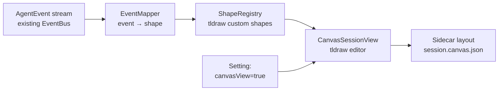

# PLAN-001 — Canvas Session — spectator v0.1

## Goal

Ship a feature-flagged, read-only canvas view of an active Craft session that renders the same `AgentEvent` stream the chat view consumes, as tldraw shapes connected by causal edges.

## Scope

- New renderer page/view: `CanvasSessionView`
- Three custom tldraw shape types:
  - `TextShape` — renders `text_complete` content
  - `ToolCallShape` — renders `tool_start` (collapsed) → expands to show tool, input, status
  - `ResultShape` — renders `tool_result` (reuses existing block renderers — html-preview, datatable, etc.)
- Causal edges:
  - `tool_start` ↔ `tool_result` paired by `tool_use_id`
  - `text_*` events anchored sequentially to the prior tool result
- Subscribed to the same EventBus / streaming source the chat view uses (no agent or server changes)
- Settings toggle: "Enable Canvas View (preview)"
- Layout: time-axis top-to-bottom on first paint; user drag is sticky (per-session sidecar `session.canvas.json`)
- Empty state: clear "no events yet" placeholder
- Smoke tests for shape registration and event-to-shape mapping

## Non-goals

- **No** writing back to the canvas (no agent-driven shape creation)
- **No** forking, branching, or re-running from a shape (deferred to v0.2)
- **No** Automerge / multiplayer (Direction 3)
- **No** mobile rendering optimization
- **No** zoom-into-modality interactions (deferred)
- **No** changes to upstream-shared agent core, server, or `MessageEnvelope` protocol

## Approach

**Stack**:

- `@xyflow/react` (React Flow) — node-graph SDK, MIT-licensed. See [ADR-0004](../../decisions/0004-canvas-sdk.md). The original plan was tldraw; tldraw 4.x is license-incompatible with our Apache-2.0 distribution.
- Existing block renderers (`html-preview`, `datatable`, etc.) embedded inside the `ResultNode`'s React component
- New file layout:
  - `apps/electron/src/renderer/pages/CanvasSessionPage.tsx` — page entry
  - `apps/electron/src/renderer/components/canvas/CanvasSession.tsx` — main editor (React Flow `<ReactFlow>` instance)
  - `apps/electron/src/renderer/components/canvas/nodes/` — custom node-type definitions
  - `apps/electron/src/renderer/components/canvas/event-mapper.ts` — event → React Flow node/edge pipeline
  - `apps/electron/src/renderer/components/canvas/__tests__/` — bun tests

**Risks**:

- React Flow bundle size (~50 KB gzipped core + 30–40 KB renderer). Smaller than tldraw would have been.
- React Flow is graph-focused, not free-form. Acceptable for v0.1 (sessions are causally-graph-shaped). Direction 2/3 may revisit.
- Embedding rich block renderers inside React Flow custom nodes (React-based; straightforward — custom node types are just React components).

## Acceptance

- [x] Canvas SDK selected — React Flow (MIT) per ADR-0004
- [ ] `@xyflow/react` installed in `apps/electron`
- [ ] `CanvasSessionView` mounts inside the app shell behind `settings.canvasView` flag
- [ ] Three custom node types render correctly for a sample session
- [ ] Causal edges drawn for tool_start → tool_result pairs
- [ ] Layout persists to `session.canvas.json` on user drag
- [ ] Setting toggle exposed in Settings → Appearance (or similar)
- [ ] At least one screenshot in PR description
- [ ] Bun tests for `event-mapper.ts` (covers each event type)
- [ ] Direction doc updated with v0.1 outcome (`directions/01-canvas-session.md`)
- [ ] Plan moved to `done/` (then `documented/` after release notes)

## Status log

- `2026-04-28` — created in `planned/`
- `2026-04-29` — moved to `in-progress/`; branch `jh/canvas-session-spectator-v0` opened
- `2026-04-29` — SDK pivot: tldraw 4.x license-incompatible (custom restrictive license vs our Apache-2.0 distribution); chose React Flow (MIT) per ADR-0004. See discussion `2026-04-29-canvas-sdk-license.md`.
