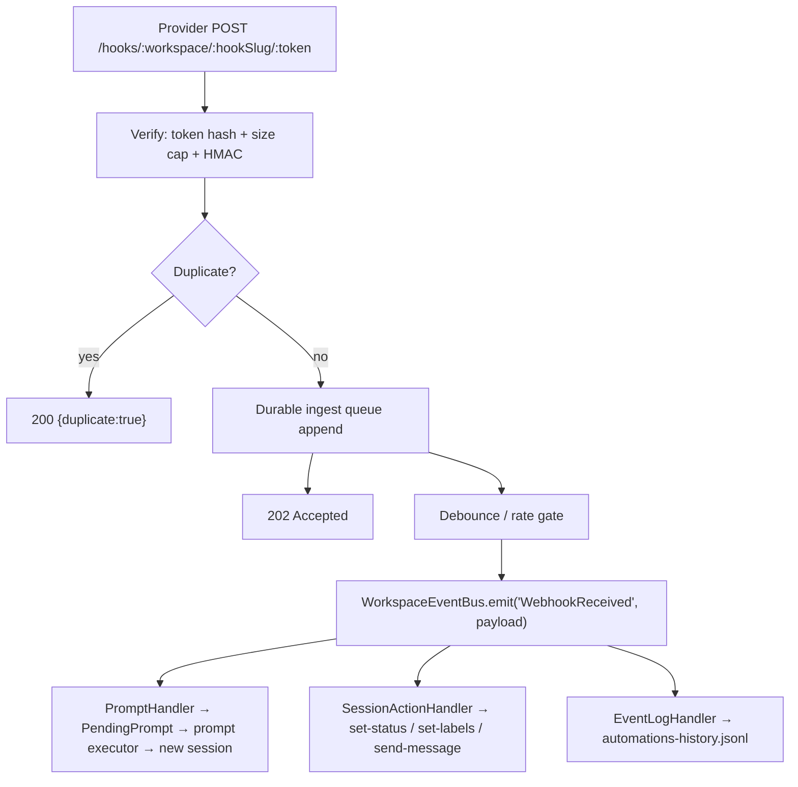

# PLAN-014 — Per-workspace webhooks

## Provenance

This plan ports and formalizes the approved design spec **"Inbound Webhooks & Headless Server — Design Spec"** (Notion, approved by Jeff 2026-07-06):
<https://app.notion.com/p/395d0b5898d8812fbdc4edf4b42d205c>

The architecture in that spec is **decided** and is not relitigated here: a webhook is a new automation event type (`WebhookReceived`) emitted onto the per-workspace `WorkspaceEventBus`, fed by a receiver endpoint on `apps/server`. This plan adds what the spec under-specifies for the M2 goal: first-class **per-workspace scoping** and an **action vocabulary beyond "trigger prompt"** (set status, set labels, message an existing session). Board ticket: **VOR-40** (this design), implementation tickets VOR-33/34/37 (see Phasing).

### Spec verification against current tree (main @ `ec74ea3e`, 2026-07-08)

Every code reference in the spec was re-verified. Drift notes:

| Spec claim | Current tree | Status |
|---|---|---|
| `AutomationMatcher` with `cron` exclusive to SchedulerTick at `packages/shared/src/automations/types.ts:156` | `types.ts:156–188`, `cron` at 163–164 | ✅ accurate |
| Rate limiter to lift from `apps/server/src/middleware/auth.ts:13-47` | `RateLimiter` class, sliding 60 s window keyed by API-key id, at exactly those lines | ✅ accurate |
| Token hashing "like `keyHash` in `apps/server/src/config.ts`" | `StoredApiKey.keyHash` (`config.ts:21–31`), `hashApiKey` sha256 (`config.ts:121–123`), `generateApiKey` (`config.ts:94–116`) | ✅ accurate |
| "Generalize the `automations-retry-queue.jsonl` machinery" | The machinery is `packages/shared/src/automations/retry-scheduler.ts` (deferred tiers 5 m/30 m/1 h confirmed at `retry-scheduler.ts:25–30`; queue file name from `constants.ts`). Immediate retries live in `webhook-utils.ts`/`webhook-handler.ts:191`. | ✅ accurate, sharper file pointer |
| "extend, don't fork, the validator" | Validation is two-layered: Zod `AutomationsConfigSchema` (`schemas.ts`) + semantic pass `runMatcherSemanticValidations` (`validation.ts:53+`, entry `validateAutomationsConfig` at `validation.ts:26–48`). Both layers need the `hook` extension. | ✅ accurate, two files not one |
| `matcher` regex against a payload field via new `matchField` | `matchField` does not exist today; `getMatchValue` (`utils.ts:86–108`) hardcodes per-event fields and default-cases to `JSON.stringify(data)` — a `WebhookReceived` case + generic `matchField` support is new code there | ✅ new as spec says |
| Receiver joins an "unauthenticated route class (like `/health`)" | `/health` is the only pre-auth route (`apps/server/src/router.ts:59`); the auth gate for everything else is `router.ts:64–69` | ✅ accurate |
| `onWebhookEvent` seam "same shape as `onPromptsReady`" | `AutomationSystemOptions` (`automation-system.ts:40–59`) is the existing callback-injection surface; `onPromptsReady` delivery at `prompt-handler.ts:133–136`; desktop wiring `SessionManager.ts:1703` → `executePromptAutomation` (`SessionManager.ts:8424`, input type `handlers/session-manager-interface.ts:274`) | ✅ accurate |
| — (not in spec) | v0.11.0's `backfillIds` already tolerates an `obj.hooks` top-level alias (`automation-system.ts:182`); we do **not** use it — hooks stay inside the canonical `automations` map | ℹ️ noted |
| — (not in spec) | ADR-0005 landed after the spec's framing: all config paths must route through `CONFIG_DIR` (`packages/shared/src/config/paths.ts`), which defaults to `~/.vorno-agent`. No literal `~/.craft-agent` anywhere in new code. | ℹ️ incorporated below |

## Goal

Each workspace can register custom inbound webhooks that perform specific actions — trigger a prompt (new session), send a message to an existing session, set session status, add/remove labels — authenticated, workspace-scoped, built on the existing `apps/server` trigger server and the automations system. Done = webhooks working end-to-end locally (curl → session spawned/mutated in the target workspace).

## Scope

- New automation event `WebhookReceived` + `hook` config on `AutomationMatcher` (per-workspace, in `automations.json`).
- Receiver endpoint on `apps/server`: `POST /hooks/:workspace/:hookSlug/:token` with 202-fast semantics, durable ingest queue, idempotency, per-hook rate limiting.
- Per-hook capability-URL token auth (hashed at rest), optional HMAC verification (Phase 2).
- Action vocabulary v1: `prompt` (existing) plus new `set-status`, `set-labels`, `send-message` action types with a clean extension point.
- Host-agnostic execution seam (`onWebhookEvent` + executor ports) so nothing assumes the Electron host exists.
- Token-minting management surface (minimal v1: script + hand-edited `automations.json`); `craft-fork:webhooks:*` RPC + settings UI reserved for Phase 3.
- Local end-to-end test plan.

## Non-goals

- **Server deployment/runtime/config/credentials** — owned by PLAN-013 (headless/hosted server mode, how/where `apps/server` runs, TLS/tunnel exposure, remote-access settings). See "Boundary with PLAN-013".
- **IAM/SSO for a hosted management plane** — VOR-36, explicitly **parked for M2**. Webhook ingress never uses SSO (providers can't); `craft_sk_*` keys remain the machine-to-machine story.
- Outbound webhooks — already exist (`WebhookAction`, `webhook-handler.ts`); untouched.
- Upstream wire/protocol changes — none needed; everything is fork-owned code.

## Approach

### Architecture (decided by the approved spec)

A webhook is **an externally-fired tick with a payload**. The cron path (SchedulerTick → matcher → `PendingPrompt` → `SessionManager.executePromptAutomation()`) is the exact pattern to parallel. The rejected alternative — a direct route → `SessionPool` path in `apps/server` — would bypass matchers, labels, permission modes, conditions, env-var expansion, and history logging, and would reimplement all of them badly.



Because `WebhookReceived` rides the same bus, existing conditions (time/state/logical, `conditions.ts`) apply unchanged — business-hours gating for free — and spawned sessions chain into downstream `LabelAdd`/`SessionStatusChange` automations exactly like cron-spawned ones.

### 1. Data model — hook registration (per-workspace by construction)

Hooks live in the workspace's `automations.json` (`{workspaceRoot}/automations.json`, `resolve-config-path.ts:20–22`) under the new event key, with a `hook` field that is to `WebhookReceived` what `cron` is to `SchedulerTick`:

```jsonc
{
  "automations": {
    "WebhookReceived": [
      {
        "id": "w1a2b3",
        "name": "Linear issue triage",
        "hook": {
          "slug": "linear-issues",                      // URL segment; unique per workspace
          "tokenHash": "sha256:<hex64>",                // capability-URL token, hashed at rest
          "tokenPrefix": "craft_whk_...f3a",            // display only
          "verification": {                              // Phase 2, optional
            "type": "hmac-sha256",
            "secretEnv": "CRAFT_WH_LINEAR",
            "signatureHeader": "linear-signature",
            "timestampToleranceMs": 300000
          },
          "idempotencyKey": { "source": "header", "name": "linear-delivery" },
          "debounce": { "windowMs": 30000, "maxWaitMs": 120000, "strategy": "collect" }, // Phase 2
          "rateLimit": { "perMinute": 30, "burst": 10 },
          "concurrency": { "maxActiveSessions": 1, "overflow": "queue" }                 // Phase 2
        },
        "matcher": "^Issue\\.(created|updated)$",
        "matchField": "$.type",
        "permissionMode": "safe",
        "labels": ["webhook", "linear"],
        "conditions": [],
        "actions": [
          { "type": "prompt", "prompt": "Triage this Linear event. Payload(s): $CRAFT_WEBHOOK_PAYLOAD_PATH" }
        ]
      }
    ]
  }
}
```

Type additions (all in fork-owned `packages/shared/src/automations/`):

- `types.ts` — `'WebhookReceived'` joins the `AppEvent` union (line 15–22) and `APP_EVENTS` (line 42); new `HookConfig` interface; `hook?: HookConfig` and `matchField?: string` on `AutomationMatcher` (sibling of `cron`, `types.ts:163`).
- `event-bus.ts` — `WebhookReceived: WebhookReceivedPayload` in `EventPayloadMap`. Payload: `{ workspaceId, timestamp, hookId, hookSlug, eventId, payloadPath, payloadCount, headers: Record<string,string> (allowlisted), body: unknown (parsed JSON or undefined) }`. `body` rides the in-process payload for matching only; prompts get the file path, never inlined content.
- `schemas.ts` + `validation.ts` — **extend, don't fork**: Zod shape for `hook` (slug format `[a-z0-9-]{1,64}`, tokenHash format, debounce/rateLimit bounds, `secretEnv` must match `^CRAFT_WH_[A-Z0-9_]+$`); semantic pass adds: `hook` required on `WebhookReceived` matchers and rejected on all other events (mirror of the existing cron↔SchedulerTick rule), slug uniqueness per workspace, `matchField` is a valid JSONPath-lite expression. Existing regex/ReDoS checks and ID backfill apply unchanged.

**Workspace scoping is first-class** (gap-fill over the spec):

- The URL carries the workspace: `POST /hooks/:workspace/:hookSlug/:token`. `:workspace` resolves via `getWorkspaceByNameOrId` (`packages/shared/src/config/storage.ts:753–759`); hook lookup reads **only** that workspace's `automations.json`. Slugs are unique per workspace, not globally — two workspaces can both have `linear-issues`.
- All durable state is per workspace root: `webhooks-dedup.jsonl`, `webhooks-ingest.jsonl` (below) live next to `automations-history.jsonl`.
- Rate-limit windows are keyed `workspaceId:hookId`.
- The future management RPC/API inherits the existing per-key `workspaceIds` scoping (`apps/server/src/config.ts:9–16`, `hasWorkspaceAccess` in `middleware/auth.ts:124–128`).

**Secrets:** endpoint tokens are hashed at rest (same sha256 pattern as `keyHash`, `apps/server/src/config.ts:121–123`); HMAC secrets are **never** stored in `automations.json` — referenced via `CRAFT_WH_*` env vars, matching the existing outbound-webhook convention. Token format `craft_whk_<base64url>` mirrors the `craft_sk_` generator (`config.ts:94–116`).

### 2. Receiver endpoint (`apps/server`)

`POST /hooks/:workspace/:hookSlug/:token` — a new **unauthenticated route class** (registered before the auth gate at `router.ts:64`, like `/health` at `router.ts:59`), since providers cannot send our `craft_sk_` bearer. Security = capability URL + optional HMAC; the URL is assumed leakable.

Processing pipeline (order matters):

1. Resolve workspace (`404` on miss) and hook by slug; token check by **constant-time hash compare** → `404` on any miss (uniform response; do not leak hook existence).
2. `enabled: false` matcher → `404` (same non-disclosure).
3. Body cap (256 KB default) → `413`.
4. HMAC verification if configured (Phase 2): generic HMAC-SHA256 over the **raw bytes, before JSON parse**; ±5 min timestamp tolerance where the provider signs one → `401`.
5. Idempotency check → `200 {"duplicate": true}`.
6. Per-hook rate limit → `429` + `Retry-After`.
7. Append to durable ingest queue, **then** respond `202 {"eventId": "..."}`. Never make the provider wait on session spawn — spawning takes seconds; providers time out at ~5–10 s and retry, manufacturing duplicates.

**Response-code contract (the inbound backoff story):** 2xx = durably accepted (provider stops retrying); 4xx = permanent rejection (do not retry); 5xx = only for failures **before** durable enqueue (the provider's own exponential backoff retries for us). Post-enqueue failures are retried internally, never by the provider.

Everything except the route adapter lives in a new fork-owned shared module `packages/shared/src/automations/webhook-ingest/` (verify, dedup, queue, rate gate, debounce — pure of HTTP, unit-testable, reusable by any future host). `apps/server` contributes only `src/routes/hooks.ts` (~parse URL, read body, call the module, map results to `Response`).

### 3. Authentication — per-hook capability token, not workspace API keys

Decision (from the spec, with justification made explicit):

- **Per-hook token in the URL path**, hashed at rest. Providers (GitHub, Linear, Stripe, ntfy) can be handed exactly one narrow, per-integration credential that authorizes only that hook's configured actions; revocation = rotate one hook, not a key that also grants the full `/api/sessions` surface. `craft_sk_` API keys stay for the management plane.
- **Optional HMAC signatures (Phase 2)** for providers that sign: covers GitHub/Linear/Stripe patterns with one generic HMAC-SHA256 verifier; replay protection via signed-timestamp tolerance where available. Worth it, but not required to replace polling — hence Phase 2.
- Constant-time comparisons everywhere; `404` for every auth-shaped failure on the ingest path.

### 4. Action vocabulary v1 (gap-fill over the spec)

The spec ships `prompt` only. Jeff's M2 goal requires status/label/message actions. These are new members of the `AutomationAction` union (`types.ts:107`) — additive, validator-extended, and executed through the same handler pattern:

```jsonc
// Target selector shared by the three new actions:
// { "id": "<literal or $.jsonpath into payload>" }  — explicit session id
// { "label": "<label or id::value, templated>" }    — most recently active session carrying the label
{ "type": "set-status",  "session": { "id": "$.sessionId" }, "status": "needs-review", "allowClosed": false }
{ "type": "set-labels",  "session": { "label": "task::$.issue.id" }, "add": ["ci-failed"], "remove": ["ci-green"] }
{ "type": "send-message", "session": { "id": "$.sessionId" }, "message": "CI finished: $CRAFT_WEBHOOK_PAYLOAD_PATH" }
```

- String fields support `$ENV` expansion (`expandEnvVars`, `utils.ts:37`) and `$.` JSONPath-lite extraction from the webhook body (same resolver as `matchField`/`idempotencyKey.source: "body"` — one tiny shared implementation, no dependency).
- **Closed-status guard:** `set-status` rejects closed statuses (`done`/`cancelled` per workspace status config) unless the action explicitly sets `allowClosed: true` — mirrors the house rule that agents never close tasks; an explicit opt-in at registration is user intent. Status values validated via `statuses/validation.ts`; labels via `labels/validation.ts:22–33` (valued `id::value` labels supported).
- **Execution pattern:** a new `SessionActionHandler` (`handlers/session-action-handler.ts`), a sibling of `PromptHandler`/`WebhookHandler`, subscribes to the bus, matches, expands, and delivers `PendingSessionAction[]` via a new `onSessionActions?` callback on `AutomationSystemOptions` (`automation-system.ts:40–59`). The handler computes; the **host executes** — identical to the `onPromptsReady` division of labor (`prompt-handler.ts:133–136`), which keeps `packages/shared` free of SessionManager dependencies and preserves the headless seam.
- **Extension point:** adding an action type = one union member + Zod branch + one executor registration in the host's action dispatcher. No handler or bus changes.
- Scoping: v1 validator accepts the three new action types **only on `WebhookReceived` matchers** (keeps the blast radius small; generalizing to LabelAdd/cron/etc. is a listed follow-up).

### 5. Execution path and the host seam

The receiver-to-automation seam is a constructor-injected callback — **nothing may assume the Electron host exists** (PLAN-013's headless mode depends on this):

```
createWebhookReceiver({
  resolveWorkspace,            // id/slug → { workspaceId, rootPath } | null
  loadHooks(workspaceRoot),    // read automations.json WebhookReceived matchers
  onWebhookEvent(workspaceId, envelope),  // deliver a verified, deduped, rate-admitted event
})
```

Host implementations:

1. **Standalone (`apps/server`, Phase 1 — the local E2E path):** the server lazily constructs one `AutomationSystem` per target workspace (`enableScheduler: false`) and wires:
   - `onWebhookEvent` → `automationSystem.emit('WebhookReceived', payload)` (the facade already exposes `emit`, `automation-system.ts:469–471`);
   - `onPromptsReady` → a `StandalonePromptExecutor`: shared `createSession()` (`sessions/storage.ts:177–250`) persists the session into the workspace (name, labels via `ensureLabelsExist`-equivalent path, permission mode), then runs the prompt through the existing `AgentSession`/`SessionPool` machinery (`orchestrator/agent-session.ts:61–75`, `services/session-pool.ts`) keyed to that session id. Sessions land on disk in the workspace exactly like cron-spawned ones and are visible in the desktop app.
   - `onSessionActions` → a `StandaloneSessionActionExecutor`: `setSessionStatus`/`setSessionLabels` (`sessions/storage.ts:600–606, 611–617`) after validation; `send-message` reaches sessions the server process hosts (its pool); for desktop-owned live sessions it enqueues-or-fails with a logged, history-visible result (see Risks #2).
2. **Embedded (Electron host):** wiring `onWebhookEvent`/executors to the desktop's `AutomationSystem` + `SessionManager.executePromptAutomation` (`SessionManager.ts:8424`) — full live-UI parity, `updateSessionMetadata` diff events, telegram binding, title suppression. **When and where that host runs is PLAN-013's runtime decision**; this plan freezes the seam so only the executor bindings differ.

**Payload delivery:** raw body written to the spawned session's `data/` folder (or a workspace `webhooks-payloads/` staging dir for non-prompt actions), exposed via env vars added to `buildEnvFromPayload` (`utils.ts`, consumed at `prompt-handler.ts:89`): `$CRAFT_WEBHOOK_PAYLOAD_PATH`, `$CRAFT_WEBHOOK_HOOK`, `$CRAFT_WEBHOOK_EVENT_ID`, `$CRAFT_WEBHOOK_COUNT` (for collected batches: N payloads → one JSON-array file → one session). Payloads are never inlined into prompts.

### 6. Idempotency

- **Key extraction ladder:** configured header (`X-GitHub-Delivery`, Stripe `id`, …) → configured JSONPath into body → fallback SHA-256 of raw body (content-level dedup when no delivery id exists).
- **Store:** `{workspaceRoot}/webhooks-dedup.jsonl`, 24 h TTL, startup compaction — same pattern as `automations-history.jsonl` retention (`history-store.ts`, invoked like `automation-system.ts:208–214`). In-memory `Map` hot path + JSONL for restart survival.
- Keys scoped `hookId:eventId` so two hooks receiving the same provider event don't collide.

### 7. Rate limiting, debounce, retry, concurrency

- **Rate limit (Phase 1):** per-hook sliding window lifted from `apps/server/src/middleware/auth.ts:13–47` (keyed `workspaceId:hookId` instead of API-key id) + small burst allowance — webhooks arrive in clumps. Note the bus itself also rate-limits per event type (`event-bus.ts`); the `WebhookReceived` bus limit must be set ≥ the per-hook ceiling so the gate lives at the receiver, not the bus.
- **Debounce/coalesce (Phase 2)** — the biggest polling-reduction win: `trailing` (fire once per window with last payload) and `collect` (accumulate all payloads in the window, spawn one session with the batch); `maxWaitMs` caps latency under sustained traffic; optional `debounceKey` (JSONPath) debounces per entity (e.g. per issue id) rather than per hook.
- **Session-spawn retry (Phase 1):** if the executor fails, retry from the ingest queue on the same tiers as outbound webhooks — immediate seconds-scale attempts, then deferred 5 m/30 m/1 h (**generalize `retry-scheduler.ts:25–35`** to carry a work-item union instead of only `WebhookAction`), persisted across restart in `{workspaceRoot}/webhooks-ingest.jsonl`.
- **Concurrency guard (Phase 2):** per-hook `maxActiveSessions` with `overflow: queue | coalesce | drop`, tracked via session labels — prevents a webhook storm from spawning dozens of concurrent agents.
- Every ingest decision (accepted/duplicate/rate-limited/verify-failed) and every action result writes to `automations-history.jsonl` via the existing `EventLogHandler`/history-store path — the delivery log Phase 3's UI will render.

### 8. Management surface

- **v1 (this plan):** hooks are edited in `automations.json` (the existing automations editing surface, including the desktop Automations UI's raw-config path, keeps working — the validator understands `hook`). A small script `apps/server/scripts/mint-hook-token.ts` generates a `craft_whk_` token, prints the full ingest URL once, and writes `tokenHash`/`tokenPrefix` into the named hook entry. That is enough to create/list/revoke by hand and is fully curl-testable.
- **Phase 3 (VOR-37):** `craft-fork:webhooks:*` RPC + Electron settings UI + delivery-log viewer (below).

### 9. Wire contract (`craft-fork:*`)

Phases 1–2 add **zero** protocol surface: the receiver is plain HTTP on the fork-owned trigger server (`apps/server` is already fork-owned per `compatibility.md` — "API key format… Owned by us"), and all automation changes are in fork-owned shared code. No `MessageEnvelope`/`AgentEvent`(wire)/channel changes; upstream parsers never see these files.

Phase 3 reserves, following the PLAN-011 precedent exactly:

```ts
// packages/shared/src/protocol/channels.ts — new group
webhooks: {
  LIST:   'craft-fork:webhooks:list',
  UPSERT: 'craft-fork:webhooks:upsert',
  REVOKE: 'craft-fork:webhooks:revoke',   // rotates/clears tokenHash
  DELIVERIES: 'craft-fork:webhooks:deliveries',
},
```

classified in `LOCAL_ONLY_CHANNELS` (`routing.ts`), entries added to `ipc-channels.test.ts` exhaustiveness gates, and logged in the `compatibility.md` audit table at the next merge audit. Token plaintext is returned exactly once from `UPSERT` and never persisted.

### 10. Boundary and sequencing with PLAN-013

PLAN-013 (parallel workstream) owns **server deployment/runtime/config/credentials**: how `apps/server` starts, headless/standalone hosting, `server-config.json` evolution, TLS/tunnel exposure, remote-access settings. PLAN-014 owns **the webhook feature**: endpoints, hook registration, auth scoping, action vocabulary, ingest semantics, management surface.

Collision surface and rules:

| File/area | PLAN-014 touch | Rule |
|---|---|---|
| `apps/server/src/router.ts` | one pre-auth route registration (`/hooks/...`) | Single insertion point, marked `// fork(PLAN-014)`; whichever PR merges second rebases — trivial. |
| `apps/server/src/index.ts` | receiver construction + workspace-`AutomationSystem` registry | Keep it to one `initWebhooks(pool, registry)` call so PLAN-013's startup refactors move one line. |
| `apps/server/src/config.ts` / `server-config.json` | **none** — all hook config is per-workspace in `automations.json` | Deliberate: keeps PLAN-013's config surface uncontested. Optional global knobs (body cap, default rate limit) deferred until PLAN-013's config shape settles. |
| Embedded/headless host wiring | consumes the frozen `onWebhookEvent`/executor seam | Seam defined here; host implementations beyond standalone are PLAN-013 deliverables. |

Sequencing: the two PRs are independent; if PLAN-013 lands a supervisor/daemon first, PLAN-014's standalone host slots under it unchanged.

### 11. Fork-retained-feature safety

- **Subprocess-env contract** (`packages/shared/src/agent/backend/claude/options.ts` semantics, `buildClaudeSubprocessEnv`) — untouched; webhook env vars flow through automation prompt expansion (`buildEnvFromPayload`), not the SDK subprocess env.
- **Config-dir isolation (ADR-0005)** — all new paths derive from workspace roots or `CONFIG_DIR` via `config/paths.ts`; no literals.
- **Branding gate** (`scripts/check-branding.ts`: `/Craft Agents?/`, `/craft\.do/i`, `/lukilabs/i`) — `craft_whk_`, `CRAFT_WH_*`, `craft-fork:webhooks:*` don't match; keep product names out of any new UI strings.
- **Token-usage indicator, fast mode, keep-alive toggle** — untouched code paths; `PromptAction.fastMode`/`thinkingLevel` plumb through `PendingPrompt` unchanged (`types.ts:240–268`).

### 12. Security model — trust boundary & prompt-injection posture

The ingest path is **unauthenticated by provider necessity** (§2–3): the capability URL is the only credential a provider can present, and the request body is fully attacker-controlled. Two distinct trust boundaries therefore matter, and they are defended differently.

**Boundary A — the network edge (data integrity / abuse).** Handled by the receiver gauntlet in fixed order (`webhook-ingest/receiver.ts`), each layer failing closed:

1. Workspace resolve, hook-by-slug, and constant-time token compare (`tokens.ts:tokensMatch` over `timingSafeEqual`) — **any** miss returns a uniform `404` (no existence disclosure); a hook with no stored `tokenHash` (un-minted or `REVOKE`-cleared) is uninvokable (`verify.ts:verifyToken`).
2. Body cap → `413` **before** JSON parse (`verify.ts:withinBodyCap`) — memory-exhaustion guard.
3. Idempotency dedup → `200 {duplicate:true}` (`dedup.ts`) and per-hook rate limit → `429` (`rate-gate.ts`) — replay/storm guards.

**Boundary B — untrusted body → agent prompt (prompt injection).** This is the load-bearing one, and the defense is **architectural: the raw body is never placed in the instruction channel.** Enforced at three points:

- **Body is excluded from env expansion.** `buildEnvFromPayload` (`utils.ts`) skips `WEBHOOK_PAYLOAD_KEYS` (`body`, `headers`, …) when minting `CRAFT_*` vars — the code comment is explicit that inlining body content is *"undesirable."* The prompt receives only references it controls: `$CRAFT_WEBHOOK_PAYLOAD_PATH` (a file path), `$CRAFT_WEBHOOK_HOOK` (the slug the operator named), `$CRAFT_WEBHOOK_EVENT_ID`, `$CRAFT_WEBHOOK_COUNT`. Reaffirms §1 (`event-bus.ts` payload note) and §5 ("Payloads are never inlined into prompts").
- **Body reaches the model only as data, only on demand.** The raw payload is staged to a file under the session's `data/` dir (`receiver.ts:stagePayloadFile`). It enters the model **only if** an automation's prompt explicitly reads that path — at which point it arrives through the tool-result (data) channel, never the system/user (instruction) channel. The framework guarantees no *automatic* inlining; it cannot stop an operator who deliberately writes a prompt that treats payload contents as instructions.
- **Match/extraction language is deliberately non-expressive.** `matchField`, `idempotencyKey.source:"body"`, and action `$.` selectors all resolve through JSONPath-lite (`jsonpath-lite.ts`), which supports only root/dot/index/bracket access — **no wildcards, filters, recursion, or slices** ("a security and complexity liability we don't want on an unauthenticated ingest path"); it returns `undefined` on any miss and never throws.

**Adjacent hardening (not prompt injection, same untrusted-body origin):** any payload value that *does* become an env var passes through `sanitizeForShell` (`automations/security.ts`), escaping shell metacharacters (`` ` ``, `$`, quotes, newlines) so a prompt that shells out with those vars is not exposed to command injection.

**Residual risk (documented, not eliminated).** Boundary B relies on the automation author. Guidance we surface to operators (and mirror in the public docs and the colocated `webhook-ingest/SECURITY.md`): treat payload contents as untrusted; never instruct an agent to execute or obey them; prefer extracting specific fields (`matchField`, `$.`-selectors) over dumping the whole body into a prompt. HMAC verification (§3, VOR-34) authenticates the *sender* but does not change Boundary B — a signed payload is still untrusted content.

## End-to-end local test plan

Setup: workspace `my-workspace` exists; `apps/server` enabled (`{CONFIG_DIR}/server-config.json`, i.e. `~/.vorno-agent/server-config.json`) and running on `127.0.0.1:3847`; a hook registered:

```bash
# 1. Register: add the WebhookReceived matcher above to
#    ~/.vorno-agent/workspaces/my-workspace/automations.json, then mint a token
bun apps/server/scripts/mint-hook-token.ts my-workspace linear-issues
# → prints: POST http://127.0.0.1:3847/hooks/my-workspace/linear-issues/craft_whk_XXXX (shown once)

# 2. Happy path: trigger a prompt session
curl -si -X POST http://127.0.0.1:3847/hooks/my-workspace/linear-issues/craft_whk_XXXX \
  -H 'content-type: application/json' -H 'linear-delivery: d-001' \
  -d '{"type":"Issue.created","issue":{"id":"LIN-42","title":"Crash on save"}}'
# → 202 {"eventId":...}; session appears under the workspace with labels [webhook, linear];
#   payload file exists in the session data/ dir; prompt contains its path

# 3. Idempotency: replay the same delivery id
curl -s -X POST .../craft_whk_XXXX -H 'linear-delivery: d-001' -d '{...}'   # → 200 {"duplicate":true}

# 4. Auth: bad token / unknown slug / unknown workspace → uniform 404
curl -s -o /dev/null -w '%{http_code}\n' -X POST http://127.0.0.1:3847/hooks/my-workspace/linear-issues/craft_whk_WRONG -d '{}'

# 5. Matcher precision: non-matching payload → 202 accepted, no session (history shows matched: 0)
curl -s -X POST .../craft_whk_XXXX -H 'linear-delivery: d-002' -d '{"type":"Comment.created"}'

# 6. Rate limit: burst past perMinute → 429 with Retry-After
for i in $(seq 1 40); do curl -s -o /dev/null -w '%{http_code} ' -X POST .../craft_whk_XXXX \
  -H "linear-delivery: rl-$i" -d '{"type":"Issue.created"}'; done

# 7. Body cap: 300 KB body → 413
head -c 300000 /dev/zero | tr '\0' 'a' | curl -s -X POST .../craft_whk_XXXX --data-binary @- -w '%{http_code}\n'

# 8. Session actions: a hook whose action is set-status/set-labels against an existing session id
curl -s -X POST http://127.0.0.1:3847/hooks/my-workspace/ci-status/craft_whk_YYYY \
  -H 'x-delivery: c-1' -d '{"sessionId":"<existing-session-id>","status":"needs-review"}'
# → session.jsonl header shows sessionStatus needs-review; closed status without allowClosed → action
#   rejected with history entry, 202 still returned (ingest succeeded; action outcome is in the log)

# 9. Durability: enqueue with the executor forced to fail (e.g. invalid model), restart server
#    → retry-scheduler drains the ingest queue and the session eventually spawns

# 10. Restart dedup: replay d-001 after a server restart within 24 h → still {"duplicate":true}
```

Automated coverage (bun test, `apps/server/tests/` conventions + `packages/shared` colocated tests): unit — token mint/verify (constant-time path), idempotency ladder + TTL compaction, JSONPath-lite resolver, hook schema/semantic validation (slug uniqueness, hook↔event exclusivity, secretEnv shape), rate window, `getMatchValue('WebhookReceived')` + `matchField`, session-action expansion + closed-status guard; integration — full router pipeline with a mocked executor (202-fast ordering: queue append before response), duplicate replay, 404 uniformity, ingest-queue drain after simulated crash.

## Implementation steps

### Phase 1 — VOR-33 (one implementation PR): safe polling replacement + M2 action vocabulary

1. `packages/shared/src/automations/types.ts` — `WebhookReceived` in `AppEvent`/`APP_EVENTS`; `HookConfig`; `hook`/`matchField` on `AutomationMatcher`; `SetStatusAction`/`SetLabelsAction`/`SendMessageAction` + `SessionTargetSelector` joining `AutomationAction`; `PendingSessionAction`; `WebhookReceivedPayload`.
2. `event-bus.ts` — `EventPayloadMap.WebhookReceived`; set its per-event bus rate limit ≥ receiver ceiling.
3. `schemas.ts` / `validation.ts` — Zod + semantic extensions (§1, §4). Extend, don't fork.
4. `utils.ts` — `getMatchValue` case for `WebhookReceived` honoring `matchField` (JSONPath-lite, shared resolver); `buildEnvFromPayload` case adding `$CRAFT_WEBHOOK_*` vars.
5. NEW `packages/shared/src/automations/webhook-ingest/` — `verify.ts` (token hash, size, HMAC stub for Phase 2), `dedup.ts` (ladder + JSONL store + compaction), `ingest-queue.ts` (durable append/drain; generalize `retry-scheduler.ts` work-item type), `rate-gate.ts`, `receiver.ts` (pipeline + `onWebhookEvent` seam), `jsonpath-lite.ts`. Unit tests colocated.
6. NEW `handlers/session-action-handler.ts` + `onSessionActions` on `AutomationSystemOptions`; register in `createHandlers()` (`automation-system.ts:246–280`).
7. `apps/server/src/routes/hooks.ts` (route adapter) + one pre-auth registration in `router.ts` marked `// fork(PLAN-014)`; `initWebhooks()` wiring in `index.ts`; `StandalonePromptExecutor` + `StandaloneSessionActionExecutor` in `apps/server/src/orchestrator/`.
8. `apps/server/scripts/mint-hook-token.ts`.
9. Tests per the plan above; `bun run typecheck`; `cd apps/server && bun test` (strict gate); build check; branding script.

### Phase 2 — VOR-34

HMAC verification (+ signed-timestamp tolerance), debounce/coalesce (`trailing`/`collect`/`debounceKey`), per-hook concurrency guards, batch payload files (`$CRAFT_WEBHOOK_COUNT`).

### Phase 3 — VOR-37

`craft-fork:webhooks:*` RPC (channels/routing/handlers per PLAN-011 pattern), Electron settings UI (hook CRUD + token rotate shown-once), delivery-log viewer over `automations-history.jsonl`. Compatibility.md audit-table entry.

Parked: VOR-36 (IAM/SSO research for the hosted management plane) — excluded from M2; its future ADR proposes a provider-agnostic OIDC/SAML abstraction.

## Acceptance

- [ ] `POST /hooks/:workspace/:hookSlug/:token` with a valid token and matching payload spawns a session in the target workspace with the matcher's labels/permission mode; payload delivered as a file via `$CRAFT_WEBHOOK_PAYLOAD_PATH` (curl steps 1–2 pass).
- [ ] `set-status`, `set-labels`, `send-message` actions mutate the targeted existing session on disk, with validation (valued labels, closed-status guard) enforced (step 8 passes).
- [ ] Duplicate deliveries return `200 {duplicate:true}` and execute nothing, surviving a restart within TTL (steps 3, 10).
- [ ] Bad token / unknown slug / unknown workspace are indistinguishable `404`s; oversized body `413`; over-limit `429` + `Retry-After` (steps 4, 6, 7).
- [ ] Provider-facing response is `202` within ~100 ms regardless of executor latency; enqueue precedes response; post-enqueue executor failure is retried from the durable queue across restart (step 9).
- [ ] All ingest decisions and action results appear in `automations-history.jsonl`.
- [ ] Hooks in one workspace are invisible/inert in every other workspace (state files, rate keys, lookup all workspace-scoped).
- [ ] No changes under `packages/shared/src/protocol/` in Phases 1–2; unavoidable upstream-file edits carry `// fork(PLAN-014)` markers; upstream automation tests pass unmodified.
- [ ] Tests added per plan; `bun run typecheck`, `apps/server` strict tests, build check, branding gate all green.
- [ ] Roadmap docs updated (this plan advanced; compatibility.md audit note at next merge).

## Risks / open questions

1. **Desktop visibility of standalone-host mutations.** Sessions spawned and metadata written by the `apps/server` process land correctly on disk, but a running desktop app doesn't watch session JSONL headers — UI reflects them on reload, and `LabelAdd`/`SessionStatusChange` chain-events fire only in the process that diffed. **Default:** accept for Phase 1 local E2E (spec's embedded host — PLAN-013 — is the full-parity answer); document plainly.
2. **`send-message` to desktop-owned live sessions from the standalone host** cannot inject into an in-flight desktop agent. **Default:** standalone executor handles server-hosted sessions; otherwise records a `deferred: host-unreachable` history entry. Full support arrives with the embedded/headless host (PLAN-013 seam).
3. **New action types beyond `WebhookReceived`** (e.g. `set-labels` on `SessionStatusChange`) are an obvious generalization. **Default:** validator-gated to `WebhookReceived` in v1; relax deliberately later.
4. **Bus-level event rate limit vs per-hook limits** could double-throttle. **Default:** receiver is the gate; `WebhookReceived` bus limit set high with a test pinning the invariant.
5. **automations.json write races** (backfillIds/token-mint script vs desktop edits). **Default:** mint script does read-modify-write with a `.tmp`+rename; same tolerance as existing `backfillIds` writes. Phase 3 RPC becomes the single writer.
6. **ADR:** none required — architecture was approved in the referenced spec, all code is fork-owned, no wire contract is touched (Phase 3's channels follow the established `craft-fork:*` rule from ADR-0001). If PLAN-013's deployment work elevates the hosted-server topology into a load-bearing commitment, that ADR belongs to PLAN-013 (next free number after PLAN-012's expected 0007 is 0008).

## Status log

- `2026-07-08` — created in `planned/`; ported from the approved 2026-07-06 Notion design spec (VOR-40); spec references re-verified against main @ `ec74ea3e`.
- `2026-07-08` — moved from planned to in-progress; Phase 1 (VOR-33) implementation started in worktree branch `jh/2026-07-08_plan-014-webhooks-impl`.
- `2026-07-09` — **Embedded host now serves webhooks with full desktop parity** (branch `jh/2026-07-09_embedded-hooks-receiver`; closes LEARNING-018, QA-blocking for M2 goal 3). Realized §5(2): the receiver composition was **extracted host-agnostic** into `packages/shared/src/automations/webhook-ingest/` — `dispatcher.ts` (`createWebhookDispatcher(executors)`, the per-workspace `AutomationSystem` registry parameterized by injected executors) + `host.ts` (`initWebhooks` + `WebhooksHandle`). `apps/server/src/webhooks/init.ts` is now a thin wrapper binding the DISK-ONLY standalone executors — standalone path byte-identical (182 strict tests green, build check green). The embedded Electron host (`apps/electron/src/main/trigger-server/`) composes the SAME dispatcher + receiver but binds `webhook-executors.ts` to the live `SessionManager`: prompt → `executePromptAutomation` (LIVE session, `waitForCompletion:false`), set-status/set-labels → `setSessionStatus`/`setSessionLabels` (UI-reflecting via `updateSessionMetadata`), send-message → `sendMessage` (the desktop-only case, PLAN-014 Risk #2 resolved for the embedded host). The supervisor gained a `webhooks?: WebhooksHandle` option threaded into `createTriggerServer`, and `index.ts` replaced the PLAN-012 log-only `onWebhookEvent` stub with `createEmbeddedWebhooks(instance.sessionManager)`. Also fixed the cosmetic trailing-"undefined" port-conflict ERROR log (LEARNING-018). No wire/protocol changes (host wiring only); `options.ts` subprocess-env untouched. New tests: shared dispatcher composition (3), CI-gated router-mounting regression guard (4, the inverse of LEARNING-018's 401 probe), desktop-executor unit tests (8), and a real-HTTP embedded E2E (`webhooks-e2e.test.ts`: 202→spawn, duplicate→200, wrong-token→404). GUI `electron:dev` launch wasn't available in the isolated worktree; the real-HTTP E2E through the actual embedded host stack stands in as reproducible evidence.
- `2026-07-09` — Phase 3 (VOR-37) management surface implemented on branch `jh/2026-07-09_webhook-mgmt-ui` (unparked by Jeff's QA: "Webhooks don't have a clear Automation UI so that they can be managed"). Reserved `craft-fork:webhooks:*` group (`list`/`upsert`/`revoke`/`deliveries`) landed exactly per §9, LOCAL_ONLY; shared host-agnostic `webhook-management.ts` (single-writer, validate-then-atomic-write, token minted once via `generateHookToken`); Electron-main handlers compose copyable ingest URLs from the trigger-server config; UI added as a native **Webhooks** sub-view under Automations (peer to Scheduled/Event-based/Agentic) plus a per-hook endpoint card on the automation detail page (URL copy, token generate/rotate/revoke show-once, delivery log) and a create dialog. `HookConfig.tokenHash` made optional to support `revoke(clear)`. i18n in all 7 locales; compatibility.md audit entry added. `apps/server` untouched (receiver from Phase 1 reused). Deferred: session-action-only hooks (no prompt/webhook action) don't yet appear in the parsed list — the create flow defaults to a prompt action, so UI-created hooks always list.
