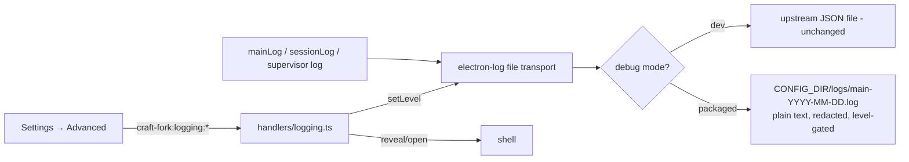

# PLAN-015 — Production file logging with runtime level control and Advanced settings

## Goal

Packaged builds write a grep-able, rotating log file by default, the log level (including debug) is changeable at runtime from a new Settings → Advanced page without restart, and the trigger-server supervisor's lifecycle messages are field-diagnosable — closing the observability gap documented in LEARNING-015.

## Scope

- Production (packaged) file logging ON by default at `info`, written under `CONFIG_DIR/logs/` (ADR-0005 fork config dir).
- Plain-text single-line format: `<ISO-8601 timestamp> LEVEL [scope] message` — consumable by grep/lnav/journald-style tooling.
- Date-based daily files (`main-2026-07-09.log`) with a 10 MiB per-file size cap as a safety valve (`main-2026-07-09.1.log`, `.2`, …) and automatic pruning of files older than 14 days.
- Runtime-changeable level (`error`/`warn`/`info`/`debug`), persisted in app-level `config.json`, applied live (no restart). `CRAFT_LOG_LEVEL` env var wins when set (house pattern from PLAN-011).
- Secret redaction (Anthropic/fork/GitHub/Slack/AWS key shapes, bearer tokens, `key=value` assignments) applied to every line before it hits disk, with unit tests.
- New `craft-fork:logging:*` IPC group (LOCAL_ONLY) + Settings → Advanced page: level selector, log dir path display, "Open log folder" / "Reveal current log" actions. i18n in all 7 locales.
- Shared, CI-tested helpers in `packages/shared/src/logging/` (naming, rotation-archive naming, pruning, formatting, redaction, level resolution).

## Non-goals

- OS-level log integration (macOS oslog / journald) — future work; the plain-text file is already `log stream`-adjacent and journald-friendly via `systemd-cat` if ever needed.
- Changing debug-mode (dev) logging — upstream's dev behavior (JSON file at electron-log's default location + console at debug) stays byte-identical. Reconciliation is deliberate: dev logs are for agents/devs parsing JSON locally; production logs are for field diagnosis with standard text tooling. The two live in different places and formats, and `getLogFilePath()` reports whichever is active.
- File logging for the standalone `apps/server` deployment (ADR-0008). It runs under systemd/launchd where stdout capture (journald) is the correct sink; it already logs to stdout. If field needs grow, it can adopt `@craft-agent/shared/logging` helpers — documented seam, deferred.
- Renderer-process log capture beyond what already flows through electron-log IPC into the main logger.

## Approach

### Why electron-log's own hooks suffice (no new dependency, no hand-rolled writer)

electron-log v5's file transport calls `resolvePathFn(pathVariables, message)` **per message** (`node/transports/file/index.js:getFile`), so returning a date-stamped path (`main-YYYY-MM-DD.log`) gives natural midnight rollover with zero timer code. Its `maxSize` + `archiveLogFn` hooks handle the size safety valve; the fork supplies an archive function that renames to the next free `main-YYYY-MM-DD.N.log` instead of the default `.old` clobber. Pruning is a small fork-owned helper run once at startup. This beats a fork-owned rotation daemon (less code, one writer, `sync: true` writes preserved) and beats the messaging-gateway/auto-update pattern of parallel `appendFileSync` loggers (which would leave `mainLog.*` call sites dark).

### Layout

- **`packages/shared/src/logging/`** (new, CI-tested): `file-log.ts` (level types + `resolveLogLevel(env, readStored)` + `dailyLogFileName` + `nextArchiveFileName` + `pruneDailyLogs` + `formatLogLine`), `redact.ts` (`redactSecrets`), `index.ts`, tests. New `./logging` subpath export (LEARNING-013).
- **`packages/shared/src/config/storage.ts`**: `logLevel?: 'error'|'warn'|'info'|'debug'` on `StoredConfig` + `getLogLevel`/`setLogLevel` (default `info`), mirrored in `config-defaults-schema.ts`, `apps/electron/resources/config-defaults.json`, `FALLBACK_CONFIG_DEFAULTS`.
- **`apps/electron/src/main/logger.ts`** (production branch only): enable file transport at the resolved level; plain-line format with redaction; `resolvePathFn` → `CONFIG_DIR/logs/main-<date>.log`; `maxSize` 10 MiB + fork archive fn; startup prune (14 days); console transport stays off. Exports `getLoggingState()` / `setRuntimeLogLevel()` / `getLogDirectory()`; `getLogFilePath()` now also answers in production.
- **IPC**: `craft-fork:logging:{getState,setLevel,openLogFolder,revealLogFile}` in `channels.ts`, LOCAL_ONLY in `routing.ts`, new `apps/electron/src/main/handlers/logging.ts` (modeled on PLAN-012's `trigger-server.ts`), registered beside the trigger-server handlers; `channel-map.ts` + `shared/types.ts` client entries; `ipc-channels.test.ts` updated.
- **UI**: new `advanced` settings page (registry + `AdvancedSettingsPage.tsx` + icon), level select, retention note, path display, open/reveal buttons, env-override + debug-build hints. i18n keys `settings.advanced.*` in en/de/es/hu/ja/pl/zh-Hans.
- **LEARNING-015 closure**: the supervisor already logs via `mainLog` (`index.ts:1092-1096`) — `[trigger-server] autostart/running on/start failed/stopped` land in the production file with no supervisor changes.

Level semantics: stored setting → live `log.transports.file.level`; `CRAFT_LOG_LEVEL` (error/warn/info/debug) overrides and disables the selector with a hint (PLAN-011 precedent). Changing the level takes effect on the next log call — no restart, no transport rebuild.

### Merge-conflict posture

Additive new files: `packages/shared/src/logging/*`, `handlers/logging.ts`, `AdvancedSettingsPage.tsx`. Unavoidable upstream-file edits, each marked `// fork(PLAN-015)`: `logger.ts` production branch (~40 lines), `channels.ts`/`routing.ts` (end-of-group inserts), `storage.ts` getters, `config-defaults-schema.ts`/`config-defaults.json`, `channel-map.ts`/`types.ts`, `settings-registry.ts`/`settings-pages.ts`/`SettingsIcons.tsx`, `index.ts` (one registration call), locale files.

## Acceptance

- [x] Packaged-mode run (`CRAFT_IS_PACKAGED=true`) writes `CONFIG_DIR/logs/main-<today>.log` with plain single-line entries including `[trigger-server]` lifecycle messages. *(Verified by the Bun harness — 16/16 checks; see LEARNING-016 for the harness recipe.)*
- [x] Level change via IPC/Settings takes effect without restart (debug lines appear/disappear live). *(Harness: debug suppressed at info, appears immediately after `setRuntimeLogLevel('debug')`, persisted to config.json.)*
- [x] Size cap rotates to `main-<date>.1.log`; date change rotates to a new daily file; files older than 14 days are pruned at startup. *(Harness: forced rotation produced `.1`–`.9`; 20-day-old seeded file pruned at import. Date rollover unit-tested via `dailyLogFileName` + per-message `resolvePathFn`.)*
- [x] Key material (sk-ant-, craft_sk_, bearer tokens, key=value secrets) never reaches disk — unit-tested. *(`redact.test.ts` + harness on-disk assertions.)*
- [x] `craft-fork:logging:*` channels LOCAL_ONLY; routing + ipc-channels exhaustiveness tests green. *(35/35.)*
- [x] i18n parity/sorted/coverage gates green across all 7 locales; branding gate green.
- [x] Tests added/updated (shared logging helpers, redaction, level resolution — 22 new tests).
- [x] Typecheck, shared tests (3081 pass / 0 fail), apps/server strict tests (172 pass / 0 fail), build check green.

## Status log

- `2026-07-09` — created in `planned/`
- `2026-07-09` — moved from planned to in-progress: implemented + verified in the same PR (design-and-implement task)
