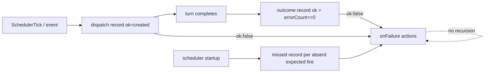

# PLAN-017 — Automation outcome records, missed-fire detection, and onFailure actions

## Goal

Make `automations-history.jsonl` report what actually happened, not just what was dispatched: a run that completes its turn with errors, or never fires at all, must produce a not-ok history record — and optionally trigger a per-automation `onFailure` action.

## Motivation

External audit (agentic-systems Wave H2, `platform-gap-automation-outcomes.md`) proved the gap: 240/240 history records read `ok:true` while a spawned session (`260712-coral-lagoon`) contained a `type:"error"` record (`invalid_api_key`). `ok` currently means "session created + turn threw no unhandled exception" — semantic failures, in-turn handled errors, and missed cron fires are all invisible. No on-failure hook exists.

## Scope

Three features, all in the automation history/runtime plane:

1. **Outcome reconciliation records.** When an automation-spawned session's (awaited) turn completes, append a second history record `{ id, ts, kind: "outcome", ok, sessionId, errorCount }` where `ok` = no error-role records were produced in the turn. Written by `onPromptsReady` in `SessionManager` right after the existing dispatch record, preserving file order (dispatch → outcome).
2. **Missed-fire detection.** On scheduler startup (`AutomationSystem.startScheduler`), for each enabled cron matcher on `SchedulerTick`, compute the most recent expected fire within a 24h lookback (croner, timezone-aware) and diff against actual dispatch records. If the latest expected fire has no dispatch record at/after it, append `{ id, ts, kind: "missed", ok: false, expectedTs }`. Deduplicate against existing `missed` records for the same `(id, expectedTs)`.
3. **Per-automation `onFailure` actions.** Optional `onFailure?: (PromptAction | WebhookAction)[]` on `AutomationMatcher`. Fired when a not-ok record (dispatch failure, outcome `ok:false`, or missed) is appended for that matcher. `onFailure` prompt sessions are never themselves outcome-reconciled and never trigger `onFailure` (no recursion).

## Non-goals

- No change to the dispatch record shape (back-compat: existing records have no `kind`; absence of `kind` = dispatch/webhook record).
- No persistent scheduler state file — missed-fire detection stays derived from history.
- No UI redesign; renderer just must not misrender/miscount the new kinds.
- No new automation *events* (`AutomationRunFailure` etc.) — `onFailure` is a matcher-level action list, not an event.

## Approach

- **Record kinds:** new helper `createOutcomeHistoryEntry` / `createMissedHistoryEntry` in `packages/shared/src/automations/webhook-utils.ts` (alongside `createPromptHistoryEntry`).
- **Outcome wiring:** `executePromptAutomation` returns `{ sessionId, errorCount }` for awaited runs (error count from the managed session's in-memory messages with role `error` produced during the turn). `onPromptsReady` writes the outcome record after the dispatch record.
- **Missed-fire:** new module `packages/shared/src/automations/missed-fire.ts` — pure function (config + history lines + now → missed entries) + integration call in `AutomationSystem` when the scheduler starts. 24h lookback (no created-at field exists on matchers; bounded window avoids flagging newly-created automations, mirroring the external eval engine's choice).
- **onFailure:** schema + semantic validation in `schemas.ts`/`validation.ts` (webhook + prompt actions only); execution reuses the existing webhook executor and `executePromptAutomation` (without `matcherId` ⇒ natural recursion guard).
- **Compaction:** retention key becomes `id + kind` so outcome/missed records don't evict dispatch history (per-matcher cap stays 20 per kind).
- **Read paths:** `GET_LAST_EXECUTED` must ignore `missed` records; history UI must render or safely ignore new kinds.
- **Docs:** update `apps/electron/resources/docs/automations.md` (onFailure field + record kinds).

## Acceptance

- [ ] A scheduler-spawned session whose turn contains error-role records produces `kind:"outcome", ok:false, errorCount>0` immediately after its dispatch record.
- [ ] A clean run produces `kind:"outcome", ok:true, errorCount:0`.
- [ ] Test runs (`waitForCompletion:false`) and `onFailure`-spawned sessions produce **no** outcome records.
- [ ] Scheduler startup with a missed cron fire in the last 24h appends exactly one `kind:"missed"` record per missed matcher; restart does not duplicate it.
- [ ] `onFailure` fires on dispatch-failure, outcome-failure, and missed records; never recurses.
- [ ] Config validation accepts `onFailure` with prompt/webhook actions, rejects other action types there.
- [ ] Compaction never lets outcome/missed records evict dispatch records (per-kind retention).
- [ ] `GET_LAST_EXECUTED` ignores `missed` records.
- [ ] Tests added/updated for every new code path (bun:test, shared + server-core).
- [ ] CI fully green (all seven validate-pr gates).
- [ ] Updated `apps/electron/resources/docs/automations.md`.

## Status log

- `2026-07-12` — created in `planned/`
- `2026-07-12` — moved from planned to in-progress: implementation starting same session (agentic-systems Wave H2 follow-up)
