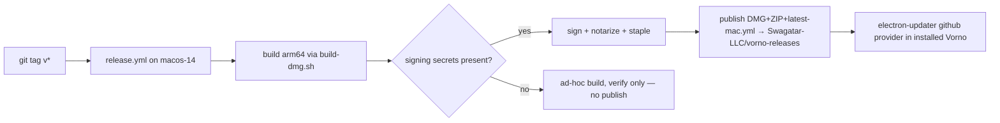

# PLAN-019 — Vorno rebrand + tag-triggered signed release pipeline publishing to vorno-releases

## Goal

The app builds, presents, and updates as **Vorno** (`appId co.swagatar.vorno`, artifacts `Vorno-${arch}`), with a tag-triggered GitHub Actions release workflow that signs + notarizes when CI secrets are present and publishes DMG + ZIP + `latest-mac.yml` to the public `Swagatar-LLC/vorno-releases` feed — implementing ADR-0009.

## Scope

1. **Branding flip** (`packages/core/src/branding.ts` — the one-module flip VOR-3 built for):
   - `PRODUCT_NAME` → `Vorno`, `PRODUCT_NAME_SINGULAR` → `Vorno`, `BRAND_NAME` → `Vorno`, `WINDOW_TITLE` → `Vorno`, `BACKEND_DISPLAY_NAME` derives.
   - `COMPANY_NAME` → `Swagatar LLC`, `SUPPORT_EMAIL` → `support@swagatar.co`, `GIT_COAUTHOR_EMAIL` → `agents-noreply@swagatar.co`.
   - `UPDATE_MANIFEST_BASE_URL` decouples from `SERVICE_BASE_URL` → the vorno-releases releases URL; repoint consumers.
   - ASCII logo → VORNO art (text asset, done in-PR).
   - **Unchanged**: `SERVICE_BASE_URL` + viewer/docs/OAuth-relay derivatives, `OAUTH_CLIENT_NAME` (see ADR-0009 "Explicitly NOT rebranded").
   - FORK badge stays on; tooltip text updated to name Vorno.
2. **Static-file sweep** (the `flip-sync` / `flip-deferred` allowlist classes):
   - `apps/electron/electron-builder.yml` — `appId: co.swagatar.vorno`, `productName: Vorno`, copyright, `NSLocalNetworkUsageDescription`, artifact names `Vorno-${arch}.${ext}` (mac + dmg + win + linux), dmg title, linux maintainer, **mac targets drop x64** (arm64-only dmg + zip), `publish:` → `{ provider: github, owner: Swagatar-LLC, repo: vorno-releases }`.
   - `apps/electron/scripts/afterPack.cjs` — packaged bundle path `Vorno.app`.
   - `apps/electron/package.json` — description/author/homepage; other apps' static metadata per allowlist.
   - `apps/electron/src/renderer/index.html` title; i18n locale values containing "Craft Agents" (all locales, parity-safe).
3. **Branding gate tightened** — `scripts/branding-allowlist.json`: remove entries the flip resolves (flip-sync/flip-deferred), narrow wire-contract entries that referenced the old appId, keep genuine wire-contract entries (`craft_sk_*`, `craft-fork:*`, `~/.craft-agent` migration sources, `CRAFT_CONFIG_DIR`). Gate must fail on any reintroduced "Craft Agents" user-facing string.
4. **Release workflow** — `.github/workflows/release.yml`, triggered on `v*` tags:
   - `macos-14` (arm64) runner; pinned Bun; build via the `build-dmg.sh` path (arm64).
   - **Signing gated on secrets** (`CSC_LINK`, `CSC_KEY_PASSWORD`, `APPLE_ID`, `APPLE_APP_SPECIFIC_PASSWORD`, `APPLE_TEAM_ID`): all present → sign + notarize + staple + publish; any absent → build ad-hoc for verification and **skip publish entirely** (never feed an ad-hoc build to updaters).
   - Publish DMG + ZIP + `latest-mac.yml` to `Swagatar-LLC/vorno-releases` using a `VORNO_RELEASES_TOKEN` secret (fine-grained PAT, `contents: write` on vorno-releases only). Squirrel.Mac updates from the ZIP — the ZIP target and `latest-mac.yml` are mandatory feed assets; the DMG is for manual installs.
5. **One-shot install script** — minimal `scripts/install-vorno.sh`: fetch (or take a local path to) the latest signed Vorno build and place it in `/Applications`. First-install only; Squirrel owns updates afterward.
6. **Icons** — keep existing icon assets; Vorno icon art is a **flagged human/design step** (PR checklist + release-blocker note), not silently shipped.

## Non-goals

- No changes to wire contracts, config dir (done — ADR-0005), `SERVICE_BASE_URL`-derived OAuth/docs/viewer endpoints, or `OAUTH_CLIENT_NAME`.
- No Windows/Linux release lanes (config retained, nothing published; mac arm64 only per upstream's v0.10.1+ posture).
- No icon artwork creation.
- No runtime updater code changes (PLAN-018's surface; this plan only changes the packaged `publish:` default).
- No in-place migration/uninstall of existing "Craft Agents" installs (clean break per ADR-0009).

## Approach

Order of operations inside the PR: flip `branding.ts` → sweep static files in the same commit series (the gate enforces yml/branding sync) → tighten allowlist → add workflow + install script. Rebrand rides its own branch so the large rename diff can't block PLAN-018's smaller PR; PLAN-018 merges first if both are ready (it touches runtime updater code this plan deliberately avoids).

Human steps (before first publish, flagged in the PR):
- Create the public repo `Swagatar-LLC/vorno-releases`.
- Add CI secrets: `CSC_LINK`, `CSC_KEY_PASSWORD`, `APPLE_ID`, `APPLE_APP_SPECIFIC_PASSWORD`, `APPLE_TEAM_ID` (when the cert lands), `VORNO_RELEASES_TOKEN` (now).
- Confirm `appId = co.swagatar.vorno` at PR review — permanent once first-published (ADR-0009).
- Commission Vorno icon art.

## Acceptance

- [ ] `bun run scripts/check-branding.ts` green with a tightened allowlist; reintroducing "Craft Agents" in a scanned surface fails the gate.
- [ ] Local `dist:mac` produces `Vorno-arm64.dmg` + `Vorno-arm64.zip` containing `Vorno.app` with `CFBundleIdentifier co.swagatar.vorno`; no x64 artifacts.
- [ ] Window title, dock/menu name, about box, and fork-badge tooltip say Vorno; FORK badge still visible.
- [ ] `publish:` block = github provider, owner `Swagatar-LLC`, repo `vorno-releases`; packaged `app-update.yml` reflects it.
- [ ] `release.yml`: tag build on a fork branch runs end-to-end; with secrets absent it completes without publishing; publish steps are demonstrably gated (workflow logic reviewable, dry-runnable).
- [ ] OAuth relay URLs, docs/viewer URLs, `OAUTH_CLIENT_NAME`, `craft_sk_*`, `craft-fork:*`, config-dir paths byte-identical to before.
- [ ] i18n locale sweep keeps parity/sort/coverage gates green.
- [ ] `install-vorno.sh` present, minimal, documented as first-install-only.
- [ ] All seven validate-pr gates green.
- [ ] PR description flags the two confirm-before-merge decisions (appId, vorno-releases feed) and lists the human steps above.
- [ ] `roadmap/upstream/delta.md` updated (rebrand widens the static-file delta).

## Status log

- `2026-07-13` — created in `planned/`
- `2026-07-13` — moved from planned to in-progress: Opus implementation session spawned same day (branch `jh/2026-07-13_vorno-rebrand-release-pipeline`)
