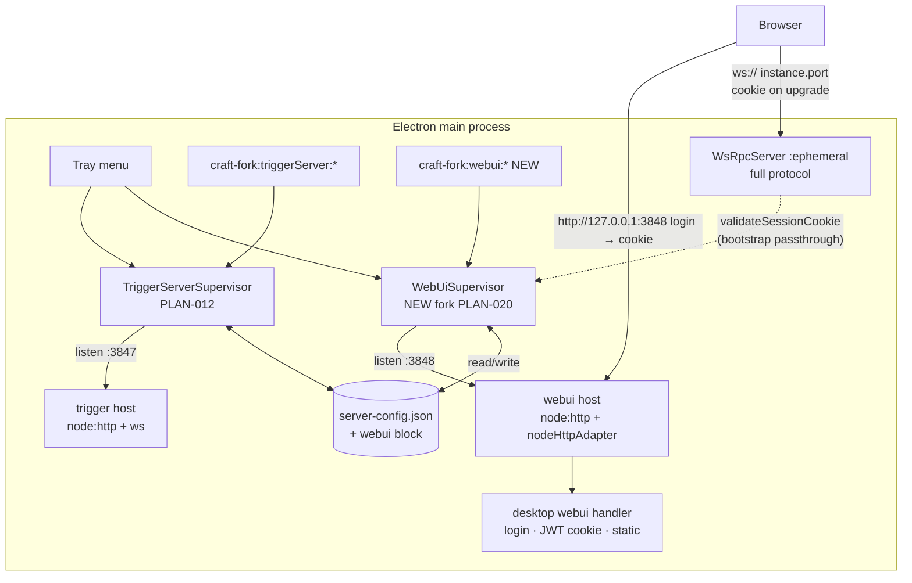

# PLAN-020 — Desktop WebUI: zero-config autostart, tray control, configurable port

> **Plan numbering note:** the orchestrator provisionally assigned PLAN-018, but PLAN-018
> (updater feed config + port0 health fix) and PLAN-019 (Vorno rebrand + signed release
> pipeline) are already claimed by session `260713-quiet-orchid` (worktrees
> `craft-agents-oss-plan018` / `craft-agents-oss-plan019`). This plan is **PLAN-020**;
> all fork markers in code use `fork(PLAN-020)`.

## Goal

On a fresh install with zero additional configuration, the packaged Electron app autostarts
**both** the embedded HTTP trigger-server (Remote Access / webhooks, PLAN-012/014) **and** a
locally-served browser WebUI; the tray can start/stop the WebUI independently of the
trigger-server; and the Remote Access settings page gains a WebUI section with a persisted,
configurable port.

## Scope

- A supervised **WebUI listener** in the Electron main process (fork-owned
  `WebUiSupervisor`, mirroring `TriggerServerSupervisor` from PLAN-012): own port, own
  state machine, own start/stop, autostart via `reconcile()`.
- A fork-owned, Node-portable desktop WebUI HTTP handler (login + JWT session cookie +
  `/api/config` + static SPA serving) reusing upstream `packages/server-core/src/webui`
  primitives where portable.
- Browser WS-RPC access to the **existing in-process `WsRpcServer`** (`instance.wsServer`)
  authenticated via session cookie (`validateSessionCookie` bootstrap passthrough — the
  option already exists upstream, Electron just never passed it).
- Tray: WebUI status line + Start/Stop + Copy URL + Copy password, independent of the
  trigger-server items.
- Remote Access settings: new WebUI section (enable toggle, port field with
  restart-to-apply, generated password display/copy/regenerate, status + URL).
- Config: `webui { enabled, port, host, password }` block added to the fork-owned
  trigger-server `ServerConfig` (`apps/server/src/config.ts`, persisted in
  `server-config.json`); trigger-server `enabled` default flipped to `true`.
- Packaging: `apps/webui/dist` bundled into the packaged Electron app under
  `dist/resources/webui/`.

## Non-goals

- TLS/HTTPS for the WebUI listener (loopback default; tailnet/reverse-proxy remains the
  PLAN-005 pattern — `resolveWebSocketUrl` already honors `x-forwarded-proto`).
- Remote (non-loopback) WebUI binding UI. `webui.host` exists in config (default
  `127.0.0.1`) but v1 exposes only the port in settings. Reaching the WebUI from another
  device additionally requires the upstream "server mode" (wsServer on `0.0.0.0`) — out of
  scope; documented limitation.
- OAuth callback route (`/api/oauth/callback`) in the desktop WebUI handler — desktop
  handles source OAuth in-app; revisit if browser-initiated source auth is wanted.
- Windows/Linux tray parity (tray is macOS-only today, PLAN-012 §non-goals).
- Rebranded WebUI assets — ships with current branding; PLAN-019 owns the rebrand sweep
  (see §Coordination).
- `safeStorage` encryption of the WebUI password at rest (follow-up; see §Security).

---

## Resolved architectural questions

### Q1 — WebUI auth in desktop mode (the crux)

**Decision: the browser connects to the Electron app's existing in-process full-protocol
`WsRpcServer`, authenticated by the WebUI session cookie.**

Verified mechanics:

- Electron main already runs the **full** upstream RPC server: `bootstrapServer(...)` at
  `apps/electron/src/main/index.ts:668` returns `ServerInstance` with `wsServer`, bound
  `port` (ephemeral by default — `rpcPort = 0` unless `CRAFT_RPC_PORT`/server-mode), and a
  runtime `token` (UUID). The renderer authenticates with `instance.token`; all
  `registerCoreRpcHandlers` + fork handlers are mounted on this server. A browser client
  speaking `MessageEnvelope` gets the identical surface — this is exactly what the upstream
  WebUI SPA speaks (verified in `apps/webui/src/App.tsx` + `adapter/web-api.ts`).
- Upstream `WsRpcServer` supports **cookie fallback auth on the WS upgrade**
  (`packages/server-core/src/transport/server.ts:429–449`): if the handshake has no
  `token`, it calls `validateSessionCookie(upgradeRequestCookie)`. The browser SPA sends no
  token (`apps/webui/src/adapter/web-api.ts:66–77`); the `craft_session` cookie rides the
  upgrade request automatically (cookies are host-scoped, not port-scoped, so a cookie set
  by `http://127.0.0.1:<webuiPort>` is sent on `ws://127.0.0.1:<rpcPort>`).
- `ServerBootstrapOptions.validateSessionCookie` **already exists** as an optional
  passthrough (`packages/server-core/src/bootstrap/headless-start.ts:18–56`) and is simply
  not populated by Electron. **One tiny fork edit** adds it at the `bootstrapServer` call
  site: `validateSessionCookie: (cookie) => webUiSupervisor?.validateSessionCookie(cookie) ?? Promise.resolve(false)`
  (late-bound module ref; the supervisor is constructed after bootstrap). Zero server-core
  changes.
- **Login flow:** `POST /api/auth {password}` → verify against the persisted WebUI
  password → sign a JWT (HS256 via upstream `createSessionToken`) with a **per-app-run
  random secret** held by the supervisor → `Set-Cookie: craft_session=<jwt>` (upstream
  `buildSessionCookie`). `/api/config` (cookie-gated) returns
  `wsUrl = resolveWebSocketUrl(req, { wsProtocol: instance.protocol, wsPort: instance.port })`
  — i.e. the live in-process RPC port, derived against the request host so proxied setups
  keep working. `/api/config/workspaces` mirrors upstream (reads `getActiveWorkspace()`).
- **Password:** desktop mode has no `CRAFT_SERVER_TOKEN`. On first supervisor start, if
  `webui.password` is unset, generate a random 20-char base62 password and persist it in
  `server-config.json`. It is displayable/copyable in settings + tray and regenerable
  (`regeneratePassword` invalidates nothing server-side beyond future logins; live JWT
  sessions expire at 24 h or app relaunch since the signing secret is per-run).
- **JWT secret:** per-app-run `crypto.randomUUID()` (in-memory only). App relaunch →
  re-login. Deliberate: no signing material at rest.

**Bun-portability constraint:** upstream `createWebuiHandler` calls `Bun.file` (static
serving) and `auth.ts` uses `Bun.password` (argon2) — both unavailable in Electron main
(Node). Rather than editing upstream `http-server.ts`, we ship a **fork-owned handler**
(`apps/electron/src/main/webui/handler.ts`) that reimplements the small route surface
(login page, `/api/auth`, `/api/auth/logout`, `/api/config`, `/api/config/workspaces`,
`/health`, static + SPA fallback) using `node:fs` and `node:crypto` (scrypt +
`timingSafeEqual`), while **reusing upstream exports** for everything portable:
`validateSession`, `extractSessionCookie`, `nodeHttpAdapter`, and (via a one-line additive
barrel export, see file list) `createSessionToken`, `buildSessionCookie`,
`buildLogoutCookie`, `RateLimiter`, `resolveWebSocketUrl`. The cookie name/JWT shape are
upstream's, so `validateSession` works unmodified on both the HTTP side and the WS-upgrade
side.

### Q2 — Port model

**Decision: separate supervised WebUI listener on its own configurable port, default
`3848`.**

- Justification: the tray must start/stop the WebUI **independently**; the trigger-server
  (3847) must keep running for webhooks when the WebUI is off, and vice versa. Sharing the
  trigger-server host would couple both lifecycles and both ports. Sharing the
  `wsServer` port (headless single-port pattern) is worse: that port is **ephemeral** by
  default and the wsServer is the renderer's lifeline — stopping the WebUI must never
  touch it.
- The listener is `node:http` + `nodeHttpAdapter(handler.fetch)` — no WS upgrade handling
  needed (the browser's WS goes to `instance.wsServer` directly).
- Default `3848`: adjacent to trigger-server 3847, verified unused in the repo (as are
  3846/3849; 9100 is headless RPC). Pending PLAN-019 port-reservation confirmation from
  quiet-orchid (§Coordination).
- Validation mirrors the trigger-server IPC handler: 1024–65535, and reject equality with
  the trigger-server's configured port.

### Q3 — webuiDir in dev vs packaged

- **Dev:** `<repoRoot>/apps/webui/dist` (built by `bun run webui:build`). If missing, the
  supervisor enters `error` state with an actionable message ("WebUI assets not built —
  run bun run webui:build"), never crashes the app.
- **Packaged:** the build chain gains a webui step: root `electron:build` runs
  `webui:build`, and `apps/electron/scripts/copy-assets.ts` additionally copies
  `apps/webui/dist` → `apps/electron/dist/resources/webui/`. `electron-builder.yml`
  already packages `dist/**/*` — **no electron-builder.yml change** (deliberately, to stay
  off PLAN-019's packaging surface). Runtime resolution uses the existing pattern from
  `main/index.ts:160–169`: `app.isPackaged ? join(resourcesBase, 'resources', 'webui') : join(repoRoot, 'apps/webui/dist')`,
  computed in the fork bootstrap block and passed to the supervisor. `validate-assets.ts`
  gains a `resources/webui/index.html` + `login.html` check.

### Q4 — Zero-config autostart + migration

- `DEFAULT_CONFIG.enabled` (trigger-server) flips `false → true`, and the new
  `webui.enabled` defaults `true` — both in fork-owned `apps/server/src/config.ts`.
- Fresh install (no `server-config.json`): both autostart on `reconcile()`. Safe because:
  trigger-server with zero API keys **denies every request** (auth middleware) and binds
  `127.0.0.1`; `/hooks/*` 404s with no hooks configured (PLAN-014); WebUI binds
  `127.0.0.1` and requires the generated password.
- Existing users: `enabled`/`webui.enabled` are **desired state** persisted by
  start()/stop() (PLAN-012 semantics). A user who explicitly stopped the trigger-server has
  `enabled: false` on disk — respected, no migration rewrite. Users whose file predates
  `webui` get defaults via deep-merge (below), i.e. WebUI turns on at next launch — that is
  the intended "zero-config both-on" behavior; the tray/settings toggle-off persists.
- Env overrides for containers/CI mirror the existing pattern: `CRAFT_WEBUI_ENABLED`,
  `CRAFT_WEBUI_PORT` join `CRAFT_TRIGGER_ENABLED/HOST/PORT` in `applyEnvOverrides`.

### Q5 — Config additions (exact schema)

Extend the **fork-owned** trigger-server config (`apps/server/src/config.ts`,
`server-config.json` under `CONFIG_DIR`). No new config file; the Remote Access page is the
single pane of glass and the supervisor already owns this store. `apps/server` has no
upstream counterpart → zero upstream conflict surface.

```ts
export interface WebUiConfig {
  enabled: boolean          // default true  — desired state, persisted by start/stop
  port: number              // default 3848
  host: string              // default '127.0.0.1' (not surfaced in v1 UI)
  password: string | null   // default null — generated + persisted on first start
}

export interface ServerConfig {
  enabled: boolean          // default flips false → true (fork(PLAN-020))
  port: number              // 3847
  host: string
  apiKeys: StoredApiKey[]
  rateLimits: RateLimits
  webui: WebUiConfig        // NEW fork(PLAN-020)
}
```

`loadServerConfig()` currently shallow-merges file over defaults — it gains a nested merge
for `webui` (`{ ...DEFAULT_CONFIG.webui, ...parsed.webui }`) so older files pick up new
sub-fields. `saveServerConfig` is a plain JSON round-trip; unknown fields survive.

---

## Architecture



## Pinned contracts (for parallel workstreams)

**IPC channels** (`craft-fork:webui:*`, all LOCAL_ONLY):
`getConfig`, `updateConfig`, `getStatus`, `start`, `stop`, `regeneratePassword` → wire
names `craft-fork:webui:getConfig` … `craft-fork:webui:regeneratePassword`.

**Renderer DTOs** (`apps/electron/src/shared/types.ts`):

```ts
export interface WebUiRemoteConfig {           // sanitized for renderer
  enabled: boolean
  port: number
  password: string | null                       // local IPC only; displayable in settings
}
export interface WebUiStatus {
  running: boolean
  state: RemoteAccessState                      // reuse existing union
  port?: number
  url?: string                                  // http://127.0.0.1:<port> when running
  startedAt?: number
  configStale?: boolean
  lastError?: string
}
```

**ElectronAPI methods** (channel-map + types): `getWebUiConfig()`,
`updateWebUiConfig(updates)`, `getWebUiStatus()`, `startWebUi()` → `RemoteAccessStartResult`,
`stopWebUi()`, `regenerateWebUiPassword()` → `string`.

**`WebUiSupervisor` public API** (`apps/electron/src/main/webui/supervisor.ts`):

```ts
constructor(opts: {
  webuiDir: string
  getWsEndpoint: () => { port: number; protocol: 'ws' | 'wss' } | undefined
  log?: SupervisorLogger
  onStateChange?: (status: WebUiStatus) => void
  hostFactory?: ...; healthProbe?: ...          // test seams, PLAN-012 style
})
getStatus(): WebUiStatus
getConfig(): WebUiRemoteConfig
updateConfig(u: Partial<Pick<WebUiConfig,'enabled'|'port'>>): WebUiRemoteConfig  // configStale on live port change
regeneratePassword(): string
validateSessionCookie(cookieHeader: string | null): Promise<boolean>
reconcile(): Promise<void>                       // autostart iff webui.enabled
start(): Promise<RemoteAccessStartResult>        // persists webui.enabled=true
stop(): Promise<void>                            // persists webui.enabled=false
dispose(): Promise<void>                         // quit path; desired state untouched
```

---

## File-by-file change list

**NEW fork-owned files**

| File | Contents |
|---|---|
| `apps/electron/src/main/webui/supervisor.ts` | `WebUiSupervisor` — state machine, config persistence, password generation, JWT secret, self health check (`/health`), one auto-restart, mirrors PLAN-012 supervisor |
| `apps/electron/src/main/webui/handler.ts` | Portable fetch handler: `/login`, `/login-assets/*`, `/favicon.ico`, `POST /api/auth` (scrypt verify + RateLimiter), `POST /api/auth/logout`, `GET /api/config` (wsUrl), `GET /api/config/workspaces`, `/health`, static + SPA fallback with path-traversal guard (`resolve()` prefix check) |
| `apps/electron/src/main/webui/host.ts` | `node:http` listener wrapping `nodeHttpAdapter(fetch)`; `listen/close`, EADDRINUSE rejection, `onError` seam (trigger-server `host.ts` minus WS) |
| `apps/electron/src/main/handlers/webui.ts` | `registerWebUiHandlers(server, supervisor)` — 6 channels, port validation (1024–65535, ≠ trigger port) |
| `apps/electron/src/renderer/pages/settings/remote-access/WebUiSection.tsx` | Settings section component (toggle, status, port + restart-to-apply, password show/copy/regenerate, URL) |
| `apps/electron/src/main/webui/__tests__/supervisor.test.ts`, `handler.test.ts` | Unit tests (seam-injected host/probe; auth, rate-limit, traversal, cookie round-trip) |

**EDIT upstream / shared files** (each tiny + `fork(PLAN-020)`-marked)

| File | Diff intent | Size |
|---|---|---|
| `apps/electron/src/main/index.ts` | (a) `validateSessionCookie:` line in `bootstrapServer` options (~:668); (b) inside the existing `fork(PLAN-012)` block (~:1077–1137): resolve webuiDir, construct `WebUiSupervisor`, `registerWebUiHandlers`, pass to tray, `reconcile()`; (c) `webUiSupervisor.dispose()` beside `triggerServerSupervisor.dispose()` in before-quit | ~25 lines, all inside/adjacent existing fork block |
| `packages/server-core/src/webui/index.ts` | Additive barrel exports: `createSessionToken`, `buildSessionCookie`, `buildLogoutCookie`, `RateLimiter` (auth), `resolveWebSocketUrl` (http-server) | 2 lines |
| `packages/shared/src/protocol/channels.ts` | `webui:` group beside existing `triggerServer:`/`webhooks:` fork groups | ~9 lines |
| `packages/shared/src/protocol/routing.ts` | 6 channels appended to `LOCAL_ONLY_CHANNELS` fork block | 6 lines |
| `apps/electron/src/transport/channel-map.ts` | 6 `invoke(...)` entries beside PLAN-012 block | 8 lines |
| `apps/electron/src/shared/types.ts` | `WebUiRemoteConfig`/`WebUiStatus` + 6 ElectronAPI methods in fork region | ~30 lines |
| `apps/electron/src/main/trigger-server/tray.ts` | (fork-owned file) WebUI submenu: status line, Start/Stop WebUI, Open WebUI (shell.openExternal), Copy URL, Copy password; options gain `webUiSupervisor` | ~50 lines |
| `apps/electron/src/renderer/pages/settings/RemoteAccessSettingsPage.tsx` | (fork-diverged since PLAN-012) import + `<WebUiSection/>` mount | 2 lines |
| `apps/server/src/config.ts` | (fork-owned) `WebUiConfig` type, `webui` in `ServerConfig` + `DEFAULT_CONFIG`, nested merge in `loadServerConfig`, `CRAFT_WEBUI_ENABLED/PORT` in `applyEnvOverrides`, flip `enabled` default → `true` | ~35 lines |
| `apps/electron/scripts/copy-assets.ts` | copy `apps/webui/dist` → `dist/resources/webui` (skip-with-warning if absent in dev) | ~10 lines |
| `apps/electron/scripts/validate-assets.ts` | require `resources/webui/{index.html,login.html}` | 2 lines |
| root `package.json` | `electron:build` chain gains `webui:build` before electron bundling | 1 line |
| `packages/shared/src/i18n/locales/*.json` (7 files) | `settings.remoteAccess.webui.*` keys (≈12 strings), alphabetical, all locales | additive |
| `apps/electron/src/shared/__tests__/ipc-channels.test.ts` | regenerate via `bun run scripts/ipc-inventory.ts` (do not hand-edit) | generated |
| `roadmap/upstream/compatibility.md` | audit-log entry: additive `craft-fork:webui:*` LOCAL_ONLY group | doc |

---

## Fan-out workstreams (independent; contracts pinned above)

1. **WS-1 — Protocol & type surface.**
   Files: `packages/shared/src/protocol/channels.ts`, `routing.ts`,
   `apps/electron/src/transport/channel-map.ts`, `apps/electron/src/shared/types.ts`,
   regenerate `ipc-channels.test.ts` via `scripts/ipc-inventory.ts`.
   Accept: `routing.test.ts` + `ipc-channels.test.ts` pass; six `craft-fork:webui:*`
   channels exactly as pinned; typecheck clean.
2. **WS-2 — Config schema + WebUI core (supervisor/handler/host).**
   Files: `apps/server/src/config.ts`, `apps/electron/src/main/webui/*` (+ tests).
   Codes against pinned supervisor API and local type mirrors (no imports from WS-1
   output; DTO types land in WS-1's `types.ts`, supervisor uses structural types).
   Accept: unit tests green — state machine transitions, autostart reconcile, password
   generation+persistence, scrypt verify + rate limit, JWT cookie round-trip via upstream
   `validateSession`, static traversal guard, nested config merge + env overrides +
   default flips.
3. **WS-3 — Main-process wiring + tray.**
   Files: `apps/electron/src/main/index.ts` (three fork-marked touches),
   `apps/electron/src/main/handlers/webui.ts`, `apps/electron/src/main/trigger-server/tray.ts`.
   Accept: dev app boot autostarts both servers; tray shows independent WebUI controls;
   quit disposes both without persisting desired-state; `validateSessionCookie` wired
   late-bound.
4. **WS-4 — Settings UI + i18n.**
   Files: `WebUiSection.tsx` (new), 2-line mount in `RemoteAccessSettingsPage.tsx`,
   7 locale JSONs.
   Accept: all three i18n gates pass (`lint:i18n:parity|sorted|coverage`); port edit shows
   restart-to-apply (`configStale`); password display/copy/regenerate works; no hardcoded
   strings.
5. **WS-5 — Packaging & build chain.**
   Files: root `package.json`, `apps/electron/scripts/copy-assets.ts`,
   `validate-assets.ts`; note in `.agents/skills/electron-prod-build/SKILL.md`.
   Accept: `bun run electron:build` produces `dist/resources/webui/index.html` +
   `login.html`; `validate-assets` fails loudly if missing; dev build without webui:build
   degrades to supervisor `error` state, not a crash.
6. **WS-6 — Integration verification + docs (after 1–5).**
   Files: this plan's status log, `roadmap/upstream/compatibility.md` audit entry,
   packaged-build smoke per LEARNING-011 recipe.
   Accept: packaged app fresh-profile run → both listeners up; browser login →
   workspace/sessions visible; trigger-server stop leaves WebUI running and vice versa;
   `apps/server` tests + typecheck + full CI matrix green.

File-collision check: `index.ts` only WS-3; `types.ts`/protocol files only WS-1;
`config.ts` + `main/webui/*` only WS-2; settings page + locales only WS-4; build scripts
only WS-5. Root `package.json` (WS-5) is the single file PLAN-019 might also touch —
sequence that one edit with quiet-orchid.

## Test plan

- **Unit (bun test, apps/electron + apps/server):** supervisor state machine
  (start/stop/reconcile/dispose/error/auto-restart, EADDRINUSE with fork-fingerprint
  probe on `/health`), handler auth (bad password 401, rate limit 429 after 5/min, cookie
  issued/validated/logout-cleared), static serving (MIME, traversal `../` blocked, SPA
  fallback), config (nested merge, env overrides, defaults `enabled=true`/`webui.enabled=true`/
  `port=3848`, persistence round-trip).
- **Wire-format:** `ipc-channels.test.ts` (regenerated) + `routing.test.ts`
  exhaustiveness — LEARNING-013 gates.
- **i18n:** parity/sorted/coverage gates across 7 locales.
- **Manual dev smoke:** `bun run webui:build` → launch dev Electron → tray shows both;
  `curl -X POST 127.0.0.1:3848/api/auth` with settings password → cookie → browser loads
  SPA → sessions list renders (proves WS cookie auth against ephemeral-port wsServer).
- **Packaged smoke (LEARNING-011 recipe):** fresh `CRAFT_CONFIG_DIR`, packaged DMG:
  both autostart; WebUI login from Safari; stop WebUI from tray (trigger-server stays up);
  change port in settings → restart-to-apply → new port serves.
- **CI:** all seven `validate-pr.yml` gates; branding gate unaffected (new files scanned,
  no raw brand strings — route any product names through the branding module).

## Upstream-conflict-risk assessment

| Surface | Risk | Rationale |
|---|---|---|
| `apps/server/**`, `apps/electron/src/main/webui/**`, `main/trigger-server/**`, `handlers/webui.ts`, `WebUiSection.tsx` | **None** | Fork-owned; no upstream counterpart |
| `channels.ts` / `routing.ts` / `channel-map.ts` / `shared/types.ts` | **Low** | Established additive fork-block pattern (PLAN-012/014 precedent, two clean merges since) |
| `server-core/webui/index.ts` barrel | **Low** | 2 additive export lines; worst case upstream reshapes the barrel → trivial re-add |
| `main/index.ts` | **Medium** | Upstream churns this file; all edits sit inside/adjacent the existing fork(PLAN-012) block + one option line at the bootstrap call — conflicts resolve by re-applying the marked block |
| `RemoteAccessSettingsPage.tsx` | **Low-medium** | Already fork-diverged since PLAN-012; our delta is a 2-line mount |
| `copy-assets.ts` / `validate-assets.ts` / root `package.json` | **Low-medium** | Small scripts upstream occasionally touches; edits are additive blocks. Root `package.json` shared with PLAN-019 — coordinate merge order |
| Wire protocol | **None** | New channels are `craft-fork:*` LOCAL_ONLY (compatibility.md contract: additive namespace, never proxied). `validateSessionCookie`/cookie-WS auth uses upstream's own mechanism — no envelope/close-code changes |

## Coordination with PLAN-018/PLAN-019 (session 260713-quiet-orchid)

Questions sent 2026-07-13 (config-key renames, tray identity, port reservations, PLAN
numbers, WebUI branding timing, packaging surface). **Reply pending at time of writing** —
assumptions to reconcile on receipt:

1. `CRAFT_*` env names and `server-config.json` filename **retained** (rebrand renames
   deferred or aliased by PLAN-019; ADR-0005 already moved CONFIG_DIR to `~/.vorno-agent`).
2. Port **3848 reserved** for the WebUI (3847 trigger, 9100 headless RPC).
3. Tray menu structure is ours to extend (`tray.ts` is fork-owned); PLAN-019 may swap
   icons/product strings independently.
4. WebUI ships with **current branding**; PLAN-019 sweeps it later (branding-gate keeps
   strings centralized).
5. PLAN-018 (quiet-orchid) touches updater feed + a port0 health fix — if that fix lands in
   `TriggerServerSupervisor`/health-probe code, WS-2 mirrors the corrected pattern.

## Security considerations

- WebUI login grants the **full RPC surface** (session spawn ⇒ code execution) — same
  trust level as the headless server's token. Mitigations: loopback-only default bind,
  mandatory generated password (never empty), 5/min login rate limit, HttpOnly +
  SameSite=Strict cookie, 24 h JWT expiry, per-run signing secret.
- Password stored plaintext (0600 file in `CONFIG_DIR`) because it must be displayable in
  settings/tray. Follow-up: Electron `safeStorage` encryption at rest.
- Static serving must guard path traversal (`resolve(webuiDir, path)` prefix check) —
  upstream's `Bun.file(join(...))` relied on Bun semantics; our Node port makes the guard
  explicit and unit-tested.

## Acceptance

- [ ] Fresh install (empty `CONFIG_DIR`), packaged build: trigger-server on 3847 **and**
      WebUI on 3848 are running with zero configuration; browser login works with the
      password shown in Remote Access settings.
- [ ] Tray: WebUI Start/Stop operates independently of trigger-server Start/Stop (all four
      combinations reachable).
- [ ] Remote Access settings: WebUI port editable + persisted; restart-to-apply surfaced
      via `configStale`; password visible/copyable/regenerable.
- [ ] Explicitly-disabled state survives relaunch (desired-state semantics preserved for
      both servers).
- [ ] Browser WS connects to the in-process `WsRpcServer` via session cookie; renderer
      token auth unaffected.
- [ ] Unit + wire-format + i18n tests added/updated; all seven CI gates green.
- [ ] compatibility.md audit-log entry recorded.

## Status log

- `2026-07-13` — created in `planned/` (architect session 260713-swift-shoal; renumbered
  from provisional PLAN-018 → PLAN-020, 018/019 claimed by rebrand/updater tracks)
- `2026-07-13` — implemented on branch `jh/2026-07-13_PLAN-020_webui-autostart`
  (orchestrator session 260713-fit-moor) via 5 fan-out workstreams:
  - WS-1 protocol/types + WS-2 config/supervisor/handler/host (commit `5fb57a1a`)
  - WS-3 main wiring/tray + WS-4 settings UI/i18n (commit `9705cdf7`)
  - WS-5 packaging/build chain (commit `07ad0aa9`)
  Auth crux verified against source before build: `validateSessionCookie` bootstrap
  passthrough (`transport/server.ts:439`) + tokenless WS upgrade in the webui adapter.
  Coordinated with 260713-quiet-orchid (PLAN-018/019): port 3848 reserved, CRAFT_* env
  + `server-config.json` names retained, no `electron-builder.yml` edit (root
  `package.json` webui:build add is conflict-free), new strings routed through i18n +
  branding module. PR sequencing agreed: PLAN-018 first, then this.
  Validation green: `apps/server` tsc + config tests (16), webui unit tests (27),
  ipc-channels (5) + routing (8), i18n parity/sorted/coverage, electron main bundle,
  and `webui:build → copy-assets → validate-assets` producing `dist/resources/webui/`.
  **Deferred to WS-6 follow-up:** after PLAN-018 merges to `main`, align
  `main/webui/host.ts` with the `EmbeddedHost.listen() → Promise<number>` signature;
  packaged fresh-profile smoke per LEARNING-011 (browser login → session list); then
  move to `done/`.
