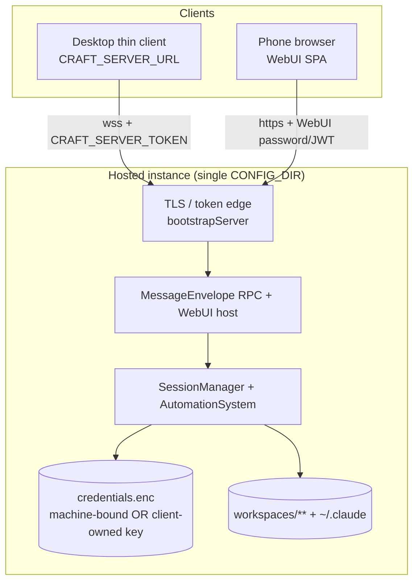

# PLAN-023 — Hosted Workspace Server

## Goal

Productize a self-hosted server that **hosts a user's workspaces** — the full app-server, not just the trigger surface — so the desktop app can attach as a thin client and phones reach the same workspaces over the WebUI, with one durable place that owns config, credentials, and session state.

## Why the app-server (not the trigger server)

The repo has two server stacks. PLAN-013 / ADR-0008 already picked `apps/server` (fork trigger surface) as the *headless trigger* deployment unit and **explicitly deferred hosting workspaces**. Hosting workspaces is the *other* stack's job:

| | `apps/server` (fork trigger surface) | `packages/server` + `packages/server-core` (app-server) |
|---|---|---|
| Role | REST+SSE+WS trigger surface; create sessions, stream events | Serves WebUI + full `MessageEnvelope` RPC for Electron thin-client / phone WebUI / CLI |
| Entry | `apps/server/src/index.ts` (PLAN-013 standalone host) | `bootstrapServer()` at `packages/server-core/src/bootstrap/headless-start.ts:266` |
| Auth | Per-key `craft_sk_*` (hashed in `server-config.json`) | Bearer `CRAFT_SERVER_TOKEN` + WebUI password/JWT cookie |
| TLS | None (proxy in front) | Built in — `WsRpcTlsOptions` (`packages/server-core/src/transport/server.ts:68`), env `CRAFT_RPC_TLS_CERT/KEY` (`packages/server/src/index.ts:100`) |
| Lock | None | `bootstrapServer` acquires `{CONFIG_DIR}/.server.lock` (`headless-start.ts:122`) |
| Client | Machine-to-machine only | Desktop thin client via `CRAFT_SERVER_URL` (`apps/electron/src/main/index.ts:509`) + WebUI |

**Decision: `packages/server` (via `bootstrapServer`) is the hosted-workspace unit.** It already serves the WebUI static SPA and the RPC both clients speak (`packages/server-core/src/webui/http-server.ts`), has TLS and the single-writer lock, and is the surface the desktop thin-client mode was built to attach to. This plan reuses PLAN-013's deployment machinery (Docker, machine-id, provisioning CLI, ADR-0005 config-dir discipline) rather than re-deriving it.

## Scope

- **Phase 0** — AuthN/AuthZ + instance/workspace-management architecture (design-first; architecture doc + ADR).
- **Phase 1** — single-user hosted app-server over Tailscale/TLS: Docker/systemd deploy of `bootstrapServer`; workspace migration procedure; server/desktop config-dir coexistence; close PLAN-013's two open checkpoints.
- **Phase 2** — server-side source auth: Vorno-owned OAuth client IDs and/or self-hosted relay, headless OAuth completion, client-owned vault-key option, provider-agnostic git-sync fabric.
- **Phase 3** — non-technical setup: one-command install/compose with a setup wizard; desktop first-run "Connect to your online Vorno?" (extends PLAN-022's connection-error screen).

## Non-goals

- **Multi-user implementation.** Phase 0 designs the architecture so we are not painted out of it; no multi-user AuthN / per-workspace AuthZ code ships here.
- Horizontal scaling, k8s, multi-node session sharding — single instance owns one CONFIG_DIR.
- Managed cloud offering / billing / SSO-as-a-service.
- Replacing PLAN-013's trigger deployment; the two can coexist on one host but that is a separate topology question (see Open questions).
- File-syncing working trees between hosts — **git push/pull is the only sanctioned sync fabric** (Phase 2).

## What is portable vs host-bound (the migration constraint)

| State | Portable? | Notes |
|---|---|---|
| `workspaces/**`, `config.json`, session metadata, sources config, skills, automations | **Yes** | Plain files under CONFIG_DIR; rsync-able. |
| `credentials.enc` (AES-256-GCM, PBKDF2 key from `getStableMachineId()`, `secure-storage.ts:47/67`) | **No** | Machine-bound by design; decryption fails on a different host. Re-provision server-side. |
| `~/.claude` SDK resume store | **Paired** | Must stay paired with CONFIG_DIR (ADR-0005). Moving workspaces means moving it *or* accepting a resume-state reset. |

Everything host-bound already has a mitigation in PLAN-013 (server-side provisioning; bind-mounted `/etc/machine-id`). This plan builds on those, it does not re-invent them.

## Phase 0 — AuthN/AuthZ + instance/workspace architecture (design-first)

Deliverable: an architecture doc (`docs/hosted-workspace-architecture.md`) plus an ADR (next free number at authoring time — 0010 is taken). No implementation. The "boxes and arrows" must nail down:

- **Server instance identity** — how a hosted instance names/identifies itself (used in connection URLs, QR, and desktop "known instances"). Distinct from user identity.
- **User identity** — single-user *now* (the app-server's existing `CRAFT_SERVER_TOKEN` bearer + WebUI password/JWT cookie is the whole model). Small-business / shared-workspace is an **explicit future**: multi-user AuthN at the edge, per-workspace AuthZ inside. The doc must show where a user principal would thread through `bootstrapServer` handler deps and `SessionManager` (`packages/server-core/src/sessions/SessionManager.ts`) without reshaping today's single-token path.
- **Token / credential trust boundaries** — three trust zones drawn explicitly: (a) the transport token(s) that admit a client to the RPC/WebUI, (b) the vault (`credentials.enc`) holding LLM + source credentials, (c) the per-source OAuth tokens. Which zone each secret lives in, who can read it, and what a compromise of each grants.
- **Onboarding surface** — how "connect to your online Vorno" appears in desktop first-run (feeds Phase 3; extends PLAN-022's connection-error screen and the `CRAFT_SERVER_URL` thin-client path).

**Phase 0 acceptance**
- [ ] `docs/hosted-workspace-architecture.md` merged: instance identity, single-user-now / multi-user-future user identity, the three trust boundaries, onboarding surface.
- [ ] ADR authored + accepted stating: app-server is the hosted-workspace unit; single bearer/password model now; multi-user is a named future the design does not preclude.
- [ ] Reviewed against ADR-0005 (config-dir / `~/.claude` pairing) and ADR-0008 (trigger unit) for coexistence.

## Phase 1 — single-user hosted server over Tailscale/TLS

Ship a reproducible deployment of `bootstrapServer` that a technical user can stand up, migrate their workspaces onto, and attach the desktop + a phone to.

- **Deployment.** Reuse PLAN-013's `deploy/` shape (Dockerfile, `compose.yaml`, `systemd/vorno-server.service`, machine-id mitigation) but target the app-server entrypoint. `packages/server` boots via `bootstrapServer`; repo-root `Dockerfile.server` already exists for it — adapt or fold into `deploy/`. TLS either terminated by the app-server (`CRAFT_RPC_TLS_CERT/KEY`) or by `tailscale serve` / a reverse proxy (PLAN-022 leg 4 already manages `tailscale serve` for the packaged WebUI; document the standalone equivalent).
- **Workspace migration procedure** (documented, scripted where safe):
  1. `rsync` `workspaces/**` + `config.json` (+ sources/skills/automations) from the source CONFIG_DIR into the server's CONFIG_DIR volume.
  2. **Provision credentials server-side** — do not copy `credentials.enc`; re-seed via PLAN-013's provisioning path on the target host (machine-bound key).
  3. **Resume-state policy** — either bring `~/.claude` along paired with CONFIG_DIR, or accept a resume reset (new `claudeSessionId` lineage). Document both; default to reset for a clean migration, paired-copy for continuity.
- **Coexistence (server vs desktop config dirs).** The server owns *its* CONFIG_DIR (volume / service home). The desktop keeps a **separate local config dir** for any local-only workspaces; in thin-client mode (`CRAFT_SERVER_URL`) it does not bootstrap locally and reads workspaces from the server. Confirm the desktop's local CONFIG_DIR and the server's never alias (ADR-0005 default `~/.vorno-agent` on the desktop; explicit `CRAFT_CONFIG_DIR` volume on the server).
- **Close PLAN-013's two open checkpoints** — required here because the app-server actually runs LLM turns for interactive clients:
  1. **Live LLM turn in-container** (PLAN-013 deferred step 4 / PONG) — verify a real turn completes end-to-end against the hosted app-server.
  2. **SDK node-subprocess resolution under bun-on-Linux** — verify the Claude Agent SDK CLI subprocess resolves from `node_modules` in the container image.

**Phase 1 acceptance**
- [ ] `bootstrapServer` runs headless in a container over Tailscale/TLS; `.server.lock` acquired; desktop thin client (`CRAFT_SERVER_URL`) attaches and lists the migrated workspaces.
- [ ] A phone browser loads the WebUI and reaches the same workspaces (auth via WebUI password/JWT).
- [ ] Migration doc reproduces from a clean host: rsync workspaces + config, provision credentials server-side, apply the chosen resume-state policy.
- [ ] Server CONFIG_DIR and desktop local CONFIG_DIR verified non-aliasing; local-only desktop workspaces unaffected.
- [ ] PLAN-013 checkpoints closed: a live LLM turn completes in-container; SDK subprocess resolution under bun-on-Linux confirmed.
- [ ] `docs/server-deployment.md` extended (or a sibling doc) for the app-server topology.

## Phase 2 — server-side source auth

Make source connections (Google, GitHub, git remotes) work when the browser is on a phone/desktop but the token must land in the *server's* vault.

- **Vorno-owned OAuth clients / relay.** Today the relay callback is upstream's: `OAUTH_RELAY_CALLBACK_URL` derives from `SERVICE_BASE_URL = 'https://agents.craft.do'` (`packages/core/src/branding.ts:68/96`). Self-hosting needs **Vorno-owned OAuth client IDs + redirect URIs** (Google, GitHub) and/or a **Vorno-owned relay**. Decide per provider: some allow arbitrary `redirect_uri` (self-host directly against `/api/oauth/callback`, `packages/server-core/src/webui/http-server.ts:295`); others need a stable public relay.
- **Headless OAuth completion.** Auth happens in the phone/desktop browser; the resulting token must land in the **server** vault. The plumbing partially exists: `credential-manager.ts` `prepareOAuth(source, { callbackUrl })` (`packages/shared/src/sources/credential-manager.ts:414`) + the server's `/api/oauth/callback`. Wire the callback URL to the hosted instance's own origin so the token is written server-side.
- **Client-owned encryption-key option (zero-trust direction).** Alongside the machine-bound default (`getStableMachineId()`), support a **user-supplied / generated vault key**: shown in the UI for a limited window, then never again; retention is the user's responsibility; **lost key = re-auth everything**. This decouples the vault from the host machine-id and is the migration-friendly, zero-trust path. Machine-bound stays the default; client-owned is opt-in.
- **Pluggable git remotes (git push/pull is the sync fabric — never file-sync working trees).** GitHub first-class via **fine-grained PAT or GitHub App**, but the git-sync convention must be **provider-agnostic**: git-over-HTTPS + a per-provider token-acquisition step, so GitLab/others are first-class, not bolted on. Define the provider interface (token acquisition + remote URL construction) once.

**Phase 2 acceptance**
- [ ] A Google/GitHub OAuth flow initiated from a phone/desktop browser lands the token in the *server's* vault via `/api/oauth/callback` against the hosted origin.
- [ ] Vorno-owned OAuth client IDs/redirects (or relay) documented and used — no dependency on `agents.craft.do` for self-hosted auth.
- [ ] Client-owned vault-key option works: key shown once, vault decrypts on restart with it, machine-id independence verified; lost-key re-auth path documented.
- [ ] Git sync via provider-agnostic interface: GitHub (PAT or App) push/pull works; a second provider (GitLab) proven against the same interface; no working-tree file-sync anywhere in the path.

## Phase 3 — non-technical setup

Designed *after* Phase 1 teaches the sharp edges (deliberately sequenced last).

- **One-command install / compose with a setup wizard** — generates a WebUI password + server token, prints/QR-encodes the connection URL, walks the browser OAuth steps.
- **Desktop first-run "Connect to your online Vorno?"** — extends PLAN-022's connection-error screen work and the `CRAFT_SERVER_URL` thin-client path into an explicit onboarding choice (local vs hosted instance).

**Phase 3 acceptance**
- [ ] One command (installer or `compose up`) yields a running instance with generated credentials and a printed/QR connection URL.
- [ ] A non-technical user completes source OAuth via the wizard's guided browser walk.
- [ ] Desktop first-run offers "Connect to your online Vorno?"; choosing it connects the thin client without manual `CRAFT_SERVER_URL` editing.

## Open questions

- **SessionPool vs SessionManager convergence** (carried from PLAN-013 / ADR-0008): the trigger server's `SessionPool` and the app-server's `SessionManager` remain two stacks. Hosting workspaces is squarely `SessionManager`; does the trigger surface eventually compose over the same `SessionManager`, or do they stay parallel on one host?
- **Single-writer `.server.lock`** (`headless-start.ts:122`): one `bootstrapServer` per CONFIG_DIR. What happens if a PLAN-013 trigger deployment and this app-server want the same CONFIG_DIR? Confirm the lock arbitrates or that they use distinct dirs.
- **Upgrade story for a hosted instance** — PLAN-013's answer is redeploy; a hosted instance holding live workspaces + resume state needs a defined upgrade (image bump + CONFIG_DIR/volume compatibility guarantee, migration of `config.json` schema).
- **Backup/restore of server CONFIG_DIR** — the volume now holds the user's whole working life. Define a backup story, including whether `credentials.enc` (machine-bound) is restorable on the same host vs needs re-provision, and whether the client-owned key (Phase 2) makes restore portable.

## Risks

- **Resume-state drift on migration** — splitting `~/.claude` from CONFIG_DIR breaks `claudeSessionId` lineage (ADR-0005 §4). Migration doc must make the pairing explicit; default-to-reset avoids silent breakage.
- **OAuth redirect ownership** — depending on `agents.craft.do` for a self-hosted box is a hidden coupling and a trust leak; Phase 2 must remove it. Some providers disallow non-registered redirects → a Vorno relay may be unavoidable for those.
- **Client-owned key loss** — "lost key = re-auth everything" is a real footgun; UI must make the one-time reveal and the consequence unmistakable.
- **Container vault weakness** — same as PLAN-013: without the bind-mounted `/etc/machine-id`, the machine-bound key degrades to `username:homedir`. The client-owned key option is the stronger answer; document both.
- **Two clients, one session** — desktop thin client + phone WebUI hitting the same workspace concurrently exercises `SessionManager` multi-client paths under real network conditions; verify no lost-update / interleaving surprises.
- **Scope creep into multi-user** — Phase 0 must resist designing multi-user *code*; the guardrail is "architecture must not preclude it," not "build it."

## Status log

- `2026-07-17` — created in `planned/`
- `2026-07-18` — moved from planned to in-progress: Phase 0 (architecture doc + ADR-0013) underway
