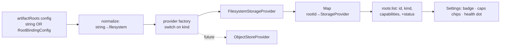

# PLAN-029 — Storage-provider config, management, and documentation surfaces

## Goal

Evolve the filesystem-only `artifactRoots` config, the settings UI, and the docs into a
provider-kind-aware set of surfaces so a future object-store backend plugs in with **no config
migration and no wire break** — without building a second provider.

## Scope

Three surfaces, design-first (ADR-0019), all additive:

1. **Config surface** — `artifactRoots` value widens to `string | RootBindingConfig` (tolerant,
   migration-free; `string` ≡ `{kind:'filesystem', path}`); a provider **factory** in
   `resolveRootBindings` becomes the single plug-in point for future kinds; `kind` becomes a
   reserved ADR-0016 §3 open-string space.
2. **Management surface** — settings UI shows per-root `kind` badge, `StorageCapabilities` chips,
   and a health/status dot; `roots:list` gains an additive optional `status?` field; kind-first
   "add root" menu (filesystem = existing pick-a-folder flow); remote-eligible behavior preserved
   (no absolute paths to remote clients).
3. **Documentation surface** — user-facing (create/host/manage roots) + contributor-facing (the
   `StorageProvider` contract, containment invariant, pure `isAdmissible` precondition, how to add
   a kind).

## Non-goals

- **No second provider implementation** (object-store, memory, presign). Interfaces + factory seam
  only. Object-store lands with the hosted track (ADR-0013 / PLAN-023).
- No write path — the plane stays read-only (`WriteCapable`/`CopyCapable`/`PresignCapable` remain
  unimplemented interfaces).
- No credential/vault mechanism — ADR-0019 §4 only forbids the inline-secret anti-shape; the real
  mechanism is ADR-0013's.
- No upstream wire contract touched.

## Approach

Governance: **ADR-0019** (proposed) carries the four doors; build starts only after PR #114 merges
(seals ADR-0018) **and** Jeff signs ADR-0019.

### Door list (ADR-0019 — needs owner sign-off, not self-approved)

| # | Door | Route |
|---|------|-------|
| 1 | `artifactRoots` value widens in place to `string \| RootBindingConfig` (vs. new sibling key) | ADR-0019 (new ADR, refines ADR-0018) |
| 2 | Provider `kind` = reserved ADR-0016 §3 open-string space (un-prefixed = system, third-party prefixed) | ADR-0019 (extends ADR-0016 §3) |
| 3 | Additive optional `status?: 'ok'\|'missing'\|'unreadable'\|'truncated'` on `roots:list` root entries (semantics freeze on ship) | ADR-0019 + compatibility.md row |
| 4 | Forward constraint: no inline secrets in root config; secret-bearing kinds → ADR-0013 vault, gated on hosted track | ADR-0019 (constraint only; impl deferred) |

Non-doors (two-way, decided in build): exact factory member names, the `status` probe cadence, chip
copy/iconography, whether health also reuses index `skippedRoots` in the UI.

## Build spec — implement node

**Types** (`packages/core/src/types/artifacts.ts`, additive):
- Add `FilesystemRootConfig`, `RootBindingConfig`, `ArtifactRootsConfig` (see ADR-0019 §1).
- Extend the `roots:list` result root-entry type with `status?: RootHealth` where
  `type RootHealth = 'ok' | 'missing' | 'unreadable' | 'truncated'`.

**Settings schema mirror** (additive value-union widening — old shape is a subset):
- `packages/shared/src/workspaces/types.ts` → `artifactRoots?: Record<string, string | RootBindingConfig>`
- `packages/shared/src/protocol/dto.ts` (WorkspaceSettings DTO) → same widening.

**Config reader / factory** (`packages/shared/src/artifacts/roots.ts`):
- `normalizeRootConfig(v): RootBindingConfig | null` — `string → {kind:'filesystem', path}`; object
  with string `kind` passes through; else `null` (skip + `debug`).
- `createProvider(rootId, cfg): StorageProvider | null` — `switch(cfg.kind)`: `'filesystem' → new
  FilesystemStorageProvider(rootId, cfg.path)` (absolute-path check moves here); unknown/prefixed →
  `null` + debug (tolerant, never throw). This is the future-kind plug point.
- `resolveRootBindings` param type → `Record<string, string | RootBindingConfig>`; loop calls
  `normalizeRootConfig` then `createProvider`.

**Validation** (server-authoritative, `rpc/artifacts.ts` save path / settings update):
- Reject on save: invalid rootId, reserved `workspace` id, filesystem kind with non-absolute path,
  unknown kind (clear reason for the settings toast). Resolution stays tolerant (skip unknown) so a
  newer config never bricks an older Vorno.

**Wire — `roots:list` handler** (`packages/server-core/src/handlers/rpc/artifacts.ts`):
- After building `Map<rootId, StorageProvider>`, probe each root once (`provider.stat` on the root
  / `exists`) → map to `status`. Emit `{ id, kind, capabilities, status }`. Absolute paths still
  never leave the server (ADR-0016 §2).

**UI components** (`apps/electron/src/renderer/pages/settings/WorkspaceSettingsPage.tsx`):
- Evolve `ArtifactRootsEditor` row → `rootId · <KindBadge> · target · <HealthDot> · <CapabilityChips> · remove`.
- New small components: `KindBadge` (smart chip, DIR-04 tenet 6), `HealthDot` (green/amber/red +
  tooltip fed by `roots:list` `status`), `CapabilityChips` (read/list/write/presign from
  `StorageCapabilities`; all C2 roots render read-only).
- Load capabilities/status via a `roots:list` call in the editor (or lift into the page's settings
  load). Filesystem rows keep the pick-a-folder-first flow (ADR-0015 §7); "Add root" becomes a menu
  whose only live item is "Local folder…" — the seam for "Object storage…" later.
- Remote clients: render `rootId + kind + capabilities + status` only; show the absolute path solely
  for local filesystem rows (server omits paths from the payload regardless).
- i18n: add keys for kind labels, capability chips, health states, and the add-root menu across all
  locale files (bun i18n gate — remember `_one`/`_other` for any plural).

**Tests**:
- `roots.test.ts` equivalent: string value ≡ `{kind:'filesystem',path}`; unknown kind skipped;
  reserved id skipped; non-absolute filesystem path skipped.
- Handler test: `roots:list` emits `status`; no absolute path in payload.
- Existing 102 artifact tests stay green; typecheck + build check clean.

**Compatibility**: one `compatibility.md` row — additive `status?` on `roots:list`; config value-union
widening is fork-owned config, tolerated-absent, no upstream contract touched.

## Build spec — docs node

**Contributor doc** — `docs/artifact-storage-providers.md` (new):
1. `StorageProvider` core (`stat/read/list/exists` + `kind` + `capabilities`) — the only path from
   `vorno-artifact://` URI to bytes.
2. Optional capabilities (`WriteCapable`/`CopyCapable`/`PresignCapable`) — type-guarded in-process,
   declared in the wire descriptor.
3. **Containment invariant** (ADR-0018 door 2): no raw physical path leaves the provider; realpath +
   segment guard (fs) / prefix + trailing-delimiter (object store) — same predicate, two address
   spaces.
4. **Pure `isAdmissible` precondition** (ADR-0018 door 1): canonical URI in; policy-only; provider
   enforces containment + size cap at read.
5. **Adding a kind**: implement `StorageProvider`; register a `kind` (prefixed if third-party);
   add a `RootBindingConfig` variant + a `createProvider` case; declare capabilities honestly; obey
   the containment invariant; secrets → vault, never inline.

**User-facing help** (workspace-settings help content — locate the `helpFeature="workspaces"` source
and extend, or the bundled in-app docs set):
1. What an artifact root is; the implicit zero-config `workspace` root; why add more.
2. Adding a local-folder root (pick-first).
3. Reading the panel: kind badge, capability chips (what "read-only" means), health status.
4. Forward note: object-store roots arrive with hosted workspaces; credentials via vault, never
   pasted inline.

## Acceptance

- [x] `artifactRoots` accepts `string | RootBindingConfig`; existing string configs resolve unchanged.
- [x] `resolveRootBindings` dispatches through a provider factory; unknown kinds skip, never throw.
- [x] `kind` documented as a reserved ADR-0016 §3 string space (contributor doc + ADR-0019 §2).
- [x] `roots:list` emits additive optional `status`; no absolute path on the wire.
- [x] Settings UI shows kind badge, capability chips, health dot; kind-first add menu.
- [x] Contributor `docs/artifact-storage-providers.md` + user-facing help written (merged PRs #117/#122).
- [x] Tests added/updated; 110 artifact tests + typecheck + build check green.
- [x] Behind the existing `artifactsEnabled` flag.
- [x] `roadmap/upstream/compatibility.md` updated (ADR-0019 index row landed with the ADR on PR #117).
- [x] ADR-0019 accepted (doors signed) before merge.

## Status log

- `2026-07-24` — created in `planned/` (design session 260724-ready-shark; ADR-0019 drafted proposed).
- `2026-07-25` — both gates cleared (PR #114 merged, `93a82f32`; ADR-0019 accepted). Implementation
  built end-to-end on `jh/plan-029-impl` off merged main (session 260724-focal-nova): `RootBindingConfig`
  /`ArtifactRootsConfig`/`RootHealth` core types; `normalizeRootConfig` + `createProvider` factory +
  `probeRootHealth` in `roots.ts` (value-union widened, migration-free); consumer signatures
  (`scan`/`read`/`projection-obsidian`) widened; `roots:list` emits `status`; save-validation accepts
  string ∪ `{kind:filesystem}` and rejects other kinds + inline secrets (door 4); provider-aware
  `ArtifactRootsEditor` (KindBadge/HealthDot/CapabilityChips + kind-first add menu) behind
  `artifactsEnabled`; +14 i18n keys × 7 locales; +8 artifact tests. All seven validate-pr gates green.
  Moved to `in-progress/`.
