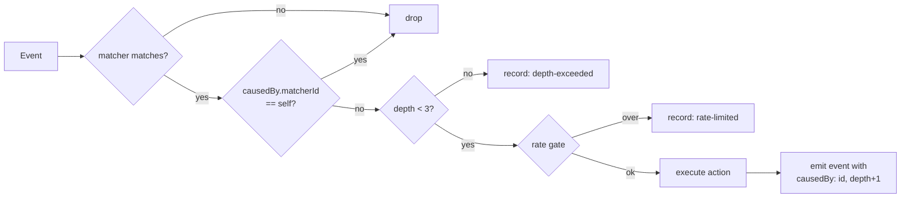

# PLAN-030 — Session lifecycle automation

## Goal

Make session-lifecycle rules (`LabelAdd` → status, label, context) actually executable and
loudly diagnosable, per ADR-0021, without weakening the rule that a model never closes a task.

## Scope

- **Phase 0 — Fail loud.** Unknown action types and unknown matcher keys become diagnostics
  instead of silence. Ships independently of everything below and is the highest-leverage slice.
- **Phase 1 — Lift transport scoping with loop safety.** Session actions on any app event,
  guarded by provenance depth cap, self-trigger suppression, and a rate gate.
- **Phase 2 — Effect-accurate history.** Session actions record what happened, not that they
  were dispatched.
- **Phase 3 — Context profiles.** One `apply-context` action referencing a named, reviewable
  profile (working directory, skills, sources, permission mode) — replacing the invented
  `addWorkingDirectory` / `enableSkill` action types that motivated this.

## Non-goals

- Changing the agent-facing `set_session_status` MCP guard. It stays unconditional; models
  never close tasks. ADR-0021 §2.
- Any new automation *event* type. The existing `APP_EVENTS` set is sufficient.
- Prompt-action outcome tracking. A prompt action whose downstream tool call is rejected is a
  different problem (the prompt did run); noted in Phase 2 but not solved here.
- Upstream contribution. This is fork-owned surface with no upstream analog; revisit later.

## Approach

### Phase 0 — Fail loud

Three changes, all in `packages/shared/src/automations/`:

1. `validation.ts` — add a known-action-type check. An action whose `type` is not one of
   `prompt | webhook | set-status | set-labels | send-message` produces a **validation error**
   naming the type, with a near-miss suggestion (`setSessionStatus` → `set-status`).
2. `schemas.ts` — keep the `.passthrough()` catch-all (lenient parse, per ADR-0021 §4) but add a
   `superRefine` on `AutomationMatcherSchema` that emits a **warning** for unknown top-level
   keys, with a near-miss suggestion (`labelId` → `matcher`).
3. Handlers — a matcher containing an unknown action type is skipped at runtime **with a history
   record**, so a dead rule is visible in history rather than absent from it.

The near-miss suggestions matter more than they look: both live defects were plausible-sounding
invented names, and the current surface confirmed them as valid.

### Phase 1 — Event-triggered session actions

Delete `WEBHOOK_ONLY_ACTION_TYPES` (`validation.ts:24`) and the `event !== 'WebhookReceived'`
early return (`session-action-handler.ts:80`) **in the same commit** — validation and runtime
must not drift.

Loop safety replaces them:



- **Provenance.** `BaseEventPayload` gains an optional `causedBy: { matcherId, depth }`. Session
  mutations performed by an action emit their resulting event with the marker set. This is the
  invasive part — it threads through `SessionManager` status/label mutation sites, not just the
  automations package.
- **Depth cap** of 3, constant, not configurable.
- **Rate gate** — reuse `webhook-ingest/rate-gate.ts` keyed per matcher.

`allowClosed` semantics are unchanged and now reachable from `LabelAdd`.

#### Two findings from the Phase 0 review invalidated the plan above (2026-08-04)

Both were verified against the code on 2026-08-04, before any Phase 1 work started. Neither is
a coding difficulty; each changes what Phase 1 has to *be*. Kept as the record; the decision
that resolves them follows.

**1. Deleting the transport restriction first would re-create the exact failure Phase 0 closes.**

`onSessionActions` is supplied in exactly one place: the webhook dispatcher
(`webhook-ingest/dispatcher.ts:96`). The `AutomationSystem` that SessionManager constructs
(`SessionManager.ts:1718-1728`) passes `onPromptsReady` and `onError` — **not**
`onSessionActions`. So the moment `WEBHOOK_ONLY_ACTION_TYPES` is deleted, a `set-status` under
`LabelAdd` starts passing validation, gets computed into a `PendingSessionAction`, reaches
`session-action-handler.ts:153`, finds the callback undefined, and is dropped in silence.

That is a rule that validates clean and can never run — the precise defect Phase 0 exists to
make impossible. The ADR's "in the same commit" instruction is directionally right but names
the wrong pair: the deletion must land with **an executor wired into SessionManager's
AutomationSystem**, not merely with the handler's early-return. Until that executor exists,
the validation error is the only thing preventing a silent dead rule, and removing it is a
strict regression.

**2. `causedBy` cannot be threaded through the mutation sites, because the mutation and the
event are separated by a filesystem watcher.**

The ADR describes provenance as threading through `SessionManager` status/label mutation sites.
It cannot, because those sites do not emit the events:

```mermaid
graph LR
    A[executor calls<br/>sm.setSessionStatus] --> B[persist to<br/>session.jsonl]
    B --> C[notifyFileChange]
    C -.fs.watch.-> D[ConfigWatcher<br/>onSessionMetadataChange]
    D --> E[automationSystem<br/>.updateSessionMetadata]
    E --> F[diff → emit<br/>SessionStatusChange]
```

`setSessionStatus` (`SessionManager.ts:4664`) and `setSessionLabels` (`:7135`) write to disk and
poke the watcher; neither calls `updateSessionMetadata`. The **only** caller of
`automationSystem.updateSessionMetadata` is the `ConfigWatcher` callback
`onSessionMetadataChange` (`SessionManager.ts:1663-1709`), which receives a session *header* read
back off disk and diffs it against the last known snapshot.

By the time the event is emitted, the causal context is gone: different call stack, different
tick, no shared async context (the repo uses no `AsyncLocalStorage`). There is no parameter to
thread. The dotted edge above is where provenance dies.

#### ✅ Decided 2026-08-05 — direct emit with provenance (correlation amendment withdrawn)

An earlier draft of this section proposed a correlation side-channel (short-TTL provenance
claims matched across the disk round-trip). Jeff's review found the simpler answer: **nothing
forces the watcher to be `updateSessionMetadata`'s only caller.** The mutation sites can call
the automation differ directly — the diff-against-snapshot design makes the watcher echo a
natural no-op (the direct call updates `lastKnownMetadata`, so the echo diffs to empty). The
codebase already endorses exactly this idiom: `setKanbanColumn` and `setTaskNodeCount` both
push live events directly because "self-writes don't re-emit through the file watcher"
(`SessionManager.ts:7256-7276`). Provenance becomes **exact, not heuristic** — the TTL/claim
machinery, and its stated false-positive-suppression property, are unnecessary.

The mechanism (now also in ADR-0021 §3, amended):

- **Mutation sites emit directly.** `setSessionStatus`, `setSessionLabels`,
  `setSessionPermissionMode`, `renameSession`, and the task-promotion reconcile paths call
  `automationSystem.updateSessionMetadata` after their flush, passing a **complete snapshot**
  spread from `managed` (permissionMode, labels, isFlagged, sessionStatus, sessionName). Full
  snapshot is load-bearing: the differ treats absent fields as removed, so a partial snapshot
  would emit phantom `LabelRemove`s.
- **The watcher demotes to external-writes-only.** `onSessionMetadataChange` skips the
  automation notify on `isSelfWrite` (signature machinery already existed at
  `SessionManager.ts:1671-1673`; the notify just ignored it). The external notify moves into
  `applyExternalSessionMetadata`, so deferred headers (write-guard / processing-active) feed
  the differ **when applied**, not when the possibly-stale read fired. This also fixes a
  pre-existing hazard: a stale header read during the atomic unlink+rename was fed to the
  differ unconditionally and could emit a phantom revert/reapply pair.
- **Per-session serialization.** `updateSessionMetadata` is read-modify-write with
  `await eventBus.emit` in the middle; with two caller classes (direct + external), overlapping
  calls could read the same `prev` and double-emit. Calls are chained per session.
- **`causedBy` rides the direct call.** The executor passes `{ matcherId, depth }` into
  `updateSessionMetadata`, which stamps it on the emitted events. External writes carry no
  provenance and are treated as user-origin for depth-capping — correct, since they genuinely
  have none.
- **Dispatch stays deferred.** The Phase 1 executor is fire-and-forget like `onPromptsReady`
  already is, so a rule can never reenter `setSessionStatus` while it is on the stack.

**Groundwork shipped 2026-08-05 on the Phase 0 branch** (no rule-visible behavior change:
same events, same diffs, now emitted at the mutation site and immune to stale-read phantoms):
direct emits at the mutation sites, watcher demotion, per-session serialization, and tests.
The `causedBy` parameter, executor, guards, and the flip remain Phase 1 proper.

**Phase 1 ordering** (implemented 2026-08-05, see the Status log):
1. Wire a session-action executor into SessionManager's `AutomationSystem` — behind the existing
   transport restriction, so behavior is unchanged and testable in isolation.
2. Add `causedBy` plumbing + depth cap + self-trigger suppression + rate gate.
3. *Only then* delete `WEBHOOK_ONLY_ACTION_TYPES` and the handler early-return together.

Steps 1 and 2 are independently reviewable and carry no behavior change; step 3 is the flip.

### Phase 2 — Effect-accurate history

`sessionActionHistoryEntry` already records outcomes (`set-status:done`,
`rejected:closed-status:done`). Extend the same discipline to the new event paths, and add the
Phase 0/1 refusal outcomes (`skipped:unknown-action`, `skipped:depth-exceeded`,
`skipped:self-trigger`, `skipped:rate-limited`).

Separately: surface prompt-action tool rejections in the session transcript rather than letting
them read as success. Investigation only in this plan — `next-step-spawn-followup` is the
worked example (8 `ok: true` records, zero successful closures).

### Phase 3 — Context profiles

Rather than one action type per context knob, a single action against a named profile stored in
workspace config (`context-profiles/config.json`):

```jsonc
// automations.json
{ "type": "apply-context", "profile": "steward" }
```

```jsonc
// context-profiles/config.json
{ "id": "steward", "workingDirectory": "/Users/jeffhampton/dev/steward",
  "skills": ["steward-repo"], "sources": ["dev"], "permissionMode": "allow-all" }
```

A label becomes a declarative context activator — reviewed once, reused everywhere, auditable
in one place. This is the DIR-04 surface-plane idea applied to sessions, and it is why
`addWorkingDirectory`/`enableSkill` should *not* be added as action types: N knobs × M rules is
the thing to avoid.

Phase 3 is separable and may be split into its own plan if Phases 0–2 ship first.

## Live workspace remediation (immediate, no code)

Independent of the phases, three rules in Jeff's workspace need attention now:

**Done 2026-08-04.** Backup at `automations.json.bak-20260804-172638`; config now
validates clean and all 23 working matchers are preserved.

| Rule | Defect | Resolution |
|---|---|---|
| `auto-close-set-done` | `setSessionStatus`; `labelId`; webhook-only; `done` is closed | `enabled: false` + inline `comment`. Revisit at Phase 1. |
| `steward-context-activate` | Same, plus status `in_progress` (real id is `in-progress`) and label `steward-mnemos-flywheel` does not exist | `enabled: false` + inline `comment`. Revisit at Phase 3. |
| `next-step-spawn-followup` | Fired 8× with `ok: true`; step 4 (`set_session_status done`) rejected every run | Retargeted to `needs-review`, with an explicit "do NOT attempt done" note in the prompt. |

## Acceptance

- [x] Phase 0: an unknown action type produces a validation **error** with a near-miss
      suggestion; `config_validate` on the live `automations.json` reported all four dead
      actions across both rules instead of passing.
- [x] Phase 0: an unknown matcher key produces a **warning** naming the key; `labelId` suggests
      `matcher` *and* states the rule is unfiltered.
- [x] Phase 0: a matcher with an unknown action type is logged and written to history as a
      `config-diagnostic` entry, once per load.
- [x] Phase 0: a disabled matcher is exempt from all three scans.
- [x] Phase 0: a malformed *known* action (`set-status` with no `session`) is reported, not
      swallowed by the union catch-all; a typo'd event name is reported with the matcher count
      it discards.
- [x] Phase 0: the diagnostics are visible in the Automations run history, not only in
      `console.warn` and the JSONL file.
- [x] Phase 0: the report fires on `reloadConfig` (config-watcher path), not only on cold load.
- [x] Phase 0: the `KNOWN_ACTION_TYPES` drift guard fails when the list and the schema union
      disagree — verified by mutation, not by assertion alone.
- [x] Phase 1 groundwork: automation metadata events are emitted directly at the
      `SessionManager` mutation sites (full snapshot), the watcher is demoted to
      external-writes-only, and `updateSessionMetadata` is serialized per session — no
      rule-visible behavior change, stale-read phantom events eliminated.
- [x] Phase 1: a session-action executor is wired into SessionManager's `AutomationSystem`
      (behind the existing transport restriction, so no behavior change).
- [x] Phase 1: `WEBHOOK_ONLY_ACTION_TYPES` and the `SessionActionHandler` transport guard are
      both gone — **and** the executor above exists, on the same branch (executor + guards in
      one commit, both deletions together in the next; neither deletion ever ships without
      the executor).
- [x] Phase 1: `set-status` under `LabelAdd` with `allowClosed: true` moves a session to `done`;
      without `allowClosed` it is rejected and recorded.
- [x] Phase 1: a self-feeding rule (`set-status` on `SessionStatusChange` targeting itself)
      terminates — regression test asserts bounded firing, not just "no crash".
- [x] Phase 1: the agent-facing MCP closed-status guard is unchanged; a test asserts a model
      still cannot close a task.
- [ ] Phase 2: refusal outcomes appear in `automations-history.jsonl` with a reason.
- [ ] Phase 3: `apply-context` activates working directory, skills, sources, and permission mode
      from a named profile.
- [ ] Tests added/updated for each phase.
- [x] `automations.md` documents all five action types, the `session` selector, `allowClosed`
      (with the models-never-close house rule), `WebhookReceived`, the `config-diagnostic`
      history kind, the dispatch-vs-effect distinction, and all three dead-rule classes.
      Source of truth is `apps/electron/resources/docs/automations.md`, which is installed to
      `~/.craft-agent/docs/`.
- [ ] `automations.md` documents the loop guards (Phase 1) and context profiles (Phase 3).
      *(Phase 1 half done: lifted scoping + all three guards documented; Phase 3 pending.)*

## Status log

- `2026-08-04` — created in `planned/`; ADR-0021 proposed alongside.
- `2026-08-04` — **Phase 0 implemented**, moved to `in-progress/`. `scanUnknownActionTypes` /
  `scanUnknownMatcherKeys` / `findMatchersWithUnknownActions` in `validation.ts`,
  `KNOWN_ACTION_TYPES` in `schemas.ts`, `createConfigDiagnosticHistoryEntry` in
  `webhook-utils.ts`, `AutomationSystem.reportDeadMatchers`. 22 new tests
  (`dead-rule-diagnostics.test.ts`); shared suite 3309 pass / 0 fail; `typecheck:ci` clean.
  Live workspace remediated. Phases 1–3 remain.
- `2026-08-04` — **Phase 0 hardened** after adversarial review, which found the branch did not
  deliver its own headline. Two blocking defects: the `config-diagnostic` records were filtered
  out of the only history UI (`useAutomations.ts` dropped every entry carrying a `kind`), so the
  net visibility gain over the pre-branch state was one `console.warn`; and `reportDeadMatchers`
  was never called from `reloadConfig`, so the config-watcher path — the moment an operator is
  actually looking for feedback — produced no diagnostic at all. Both fixed. The
  `KNOWN_ACTION_TYPES` drift guard was also a tautology (the union's `.passthrough()` accepts any
  `{type: string}`, so the parse-based assertion passed unconditionally); it now reads the
  union's literal members back out of the schema, with a guard-the-guard test, and was verified
  by mutation.

  Two further dead-rule classes closed in the same pass: malformed *known* actions (which also
  used to discard every sibling action queued for the same event when they threw — now isolated
  per action) and typo'd event names. The `disabled` → `enabled` suggestion was inverting user
  intent and now explains the value flip. `automations.md` written — the acceptance item PLAN-030
  names as a root cause. Shared 3340 pass, webui 936+246 pass, server 193 pass, branding clean,
  `typecheck:ci` clean; `apps/electron` type-error count unchanged from baseline (107, all
  pre-existing).

  **Phase 1 stopped before implementation** — see the blocked section under Phase 1. Two findings
  verified against the code mean it cannot be built as ADR-0021 §3 specifies. Awaiting a decision
  on the proposed correlation-based provenance amendment.
- `2026-08-05` — **Provenance decided: direct emit, correlation withdrawn.** Jeff's review of the
  blocked section asked the right question — why not call the automation differ from the mutation
  sites directly? Verified against the code: the diff-against-snapshot design makes the watcher
  echo a natural no-op, and `setKanbanColumn`/`setTaskNodeCount` already use the
  direct-push-on-self-write idiom. ADR-0021 §3 amended (correlation → direct emit; provenance is
  exact). Groundwork implemented on the Phase 0 branch: direct emits at mutation sites, watcher
  demoted to external-writes-only via the existing `isSelfWrite` signature, external notify moved
  to `applyExternalSessionMetadata` (deferred headers feed the differ when applied), per-session
  serialization in `updateSessionMetadata`. Fixes the pre-existing stale-read phantom-event
  hazard as a side effect. Phase 1 proper (executor, `causedBy`, guards, flip) still pending.
- `2026-08-05` — **Phase 1 implemented** (branch `jh/plan-030-phase1-session-action-executor`).
  Two commits, in the plan's order.

  *Steps 1–2 (no behavior change, everything behind the transport restriction).*
  `handleAutomationSessionActions` in `SessionManager` — sibling of
  `handleAutomationPromptsReady`, resolves the selector, applies the three action types
  against the live session, records outcomes, fire-and-forget so an action can never reenter
  the mutator whose event is on the stack. The `set-status` pre-check extracted to a shared
  `checkStatusAction` so this executor and the desktop webhook executor cannot drift on the
  history outcome they record for the same rejection; it is the *recording* gate, with
  enforcement still at the PLAN-031 choke point (called with an `automation` origin carrying
  the rule's `allowClosed`). `causedBy` rides the direct `updateSessionMetadata` call from
  PR #136, so provenance is exact. `causation.ts` holds the two pure guards (self-trigger
  suppression, checked first and unconditionally so the refusal reason stays honest; depth
  cap of 3) plus the rate-gate constant, and `onSessionActionSkipped` is wired now rather
  than retrofitted — three of Phase 2's four refusal outcomes come from these guards.

  *Step 3 (the flip).* `WEBHOOK_ONLY_ACTION_TYPES` and the handler's `event !==
  'WebhookReceived'` early-return deleted together, on the same branch as the executor —
  which is the pairing the amended ADR-0021 §1 actually requires. `allowClosed` semantics
  unchanged and now reachable from `LabelAdd`; the agent-facing MCP guard untouched and
  separately pinned (no `allowClosed` escape hatch, refusal independent of the targeted
  session).

  **The rate gate was nearly dead code.** It was first set to 30/min per matcher, but
  `WorkspaceEventBus` already drops app events at `DEFAULT_RATE_LIMIT = 10`/min per type,
  workspace-wide — so any per-matcher ceiling at or above 10 can never engage. Correct code,
  fully wired, unreachable. Now 5/min, with `DEFAULT_RATE_LIMIT` exported and a test pinning
  the ordering so neither constant can move alone. Sitting below the bus limit is also the
  justification for having a second limiter at all: the bus drops events for *every* rule on
  that type, silently, so one runaway rule starves the rest with no diagnosable trace; the
  per-matcher gate refuses the offending rule specifically, with a reason. `LEARNING-051`
  (vorno-internal) generalizes it — a new limit is only meaningful relative to the limits
  already on the path. Caught only because the handler test drives the real bus rather than
  calling `handleEvent` directly.

  The per-matcher gate deliberately does **not** apply to `WebhookReceived`: those deliveries
  already pass the receiver's per-hook gate, and a second tighter ceiling would silently drop
  deliveries the hook admitted — a regression on a working path dressed as loop safety. Not
  transport-as-trust-boundary; the gate is already applied there, upstream.

  Wire compatibility confirmed unaffected: `BaseEventPayload` and `PendingSessionAction` are
  in-process types in a fork-owned layer with no upstream analog, and no entry in
  `roadmap/upstream/compatibility.md` is touched.

  Tests: 15 guard cases (mutation-proved — each asserts the predicate actually flips), 17
  handler cases (self-feeding rule closes the cycle for real and fires exactly **once**;
  ping-pong terminates at the depth cap, which self-trigger suppression structurally cannot
  see), 12 executor cases, 3 added MCP-guard cases. All eight CI gates green locally: shared
  3403, server-core 289, apps/server 193, webui, `typecheck:ci`, branding, three i18n, doc
  tools.

  Phases 2–3 remain.
