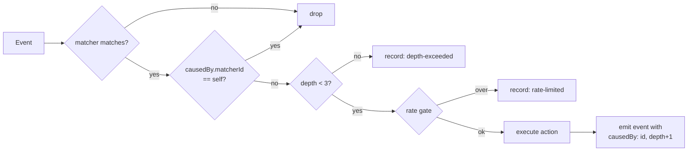

# PLAN-030 — Session lifecycle automation

## Goal

Make session-lifecycle rules (`LabelAdd` → status, label, context) actually executable and
loudly diagnosable, per ADR-0021, without weakening the rule that a model never closes a task.

## Scope

- **Phase 0 — Fail loud.** Unknown action types and unknown matcher keys become diagnostics
  instead of silence. Ships independently of everything below and is the highest-leverage slice.
- **Phase 1 — Lift transport scoping with loop safety.** Session actions on any app event,
  guarded by provenance depth cap, self-trigger suppression, and a rate gate.
- **Phase 2 — Effect-accurate history.** Session actions record what happened, not that they
  were dispatched.
- **Phase 3 — Context profiles.** One `apply-context` action referencing a named, reviewable
  profile (working directory, skills, sources, permission mode) — replacing the invented
  `addWorkingDirectory` / `enableSkill` action types that motivated this.

## Non-goals

- Changing the agent-facing `set_session_status` MCP guard. It stays unconditional; models
  never close tasks. ADR-0021 §2.
- Any new automation *event* type. The existing `APP_EVENTS` set is sufficient.
- Prompt-action outcome tracking. A prompt action whose downstream tool call is rejected is a
  different problem (the prompt did run); noted in Phase 2 but not solved here.
- Upstream contribution. This is fork-owned surface with no upstream analog; revisit later.

## Approach

### Phase 0 — Fail loud

Three changes, all in `packages/shared/src/automations/`:

1. `validation.ts` — add a known-action-type check. An action whose `type` is not one of
   `prompt | webhook | set-status | set-labels | send-message` produces a **validation error**
   naming the type, with a near-miss suggestion (`setSessionStatus` → `set-status`).
2. `schemas.ts` — keep the `.passthrough()` catch-all (lenient parse, per ADR-0021 §4) but add a
   `superRefine` on `AutomationMatcherSchema` that emits a **warning** for unknown top-level
   keys, with a near-miss suggestion (`labelId` → `matcher`).
3. Handlers — a matcher containing an unknown action type is skipped at runtime **with a history
   record**, so a dead rule is visible in history rather than absent from it.

The near-miss suggestions matter more than they look: both live defects were plausible-sounding
invented names, and the current surface confirmed them as valid.

### Phase 1 — Event-triggered session actions

Delete `WEBHOOK_ONLY_ACTION_TYPES` (`validation.ts:24`) and the `event !== 'WebhookReceived'`
early return (`session-action-handler.ts:80`) **in the same commit** — validation and runtime
must not drift.

Loop safety replaces them:



- **Provenance.** `BaseEventPayload` gains an optional `causedBy: { matcherId, depth }`. Session
  mutations performed by an action emit their resulting event with the marker set. This is the
  invasive part — it threads through `SessionManager` status/label mutation sites, not just the
  automations package.
- **Depth cap** of 3, constant, not configurable.
- **Rate gate** — reuse `webhook-ingest/rate-gate.ts` keyed per matcher.

`allowClosed` semantics are unchanged and now reachable from `LabelAdd`.

### Phase 2 — Effect-accurate history

`sessionActionHistoryEntry` already records outcomes (`set-status:done`,
`rejected:closed-status:done`). Extend the same discipline to the new event paths, and add the
Phase 0/1 refusal outcomes (`skipped:unknown-action`, `skipped:depth-exceeded`,
`skipped:self-trigger`, `skipped:rate-limited`).

Separately: surface prompt-action tool rejections in the session transcript rather than letting
them read as success. Investigation only in this plan — `next-step-spawn-followup` is the
worked example (8 `ok: true` records, zero successful closures).

### Phase 3 — Context profiles

Rather than one action type per context knob, a single action against a named profile stored in
workspace config (`context-profiles/config.json`):

```jsonc
// automations.json
{ "type": "apply-context", "profile": "steward" }
```

```jsonc
// context-profiles/config.json
{ "id": "steward", "workingDirectory": "/Users/jeffhampton/dev/steward",
  "skills": ["steward-repo"], "sources": ["dev"], "permissionMode": "allow-all" }
```

A label becomes a declarative context activator — reviewed once, reused everywhere, auditable
in one place. This is the DIR-04 surface-plane idea applied to sessions, and it is why
`addWorkingDirectory`/`enableSkill` should *not* be added as action types: N knobs × M rules is
the thing to avoid.

Phase 3 is separable and may be split into its own plan if Phases 0–2 ship first.

## Live workspace remediation (immediate, no code)

Independent of the phases, three rules in Jeff's workspace need attention now:

**Done 2026-08-04.** Backup at `automations.json.bak-20260804-172638`; config now
validates clean and all 23 working matchers are preserved.

| Rule | Defect | Resolution |
|---|---|---|
| `auto-close-set-done` | `setSessionStatus`; `labelId`; webhook-only; `done` is closed | `enabled: false` + inline `comment`. Revisit at Phase 1. |
| `steward-context-activate` | Same, plus status `in_progress` (real id is `in-progress`) and label `steward-mnemos-flywheel` does not exist | `enabled: false` + inline `comment`. Revisit at Phase 3. |
| `next-step-spawn-followup` | Fired 8× with `ok: true`; step 4 (`set_session_status done`) rejected every run | Retargeted to `needs-review`, with an explicit "do NOT attempt done" note in the prompt. |

## Acceptance

- [x] Phase 0: an unknown action type produces a validation **error** with a near-miss
      suggestion; `config_validate` on the live `automations.json` reported all four dead
      actions across both rules instead of passing.
- [x] Phase 0: an unknown matcher key produces a **warning** naming the key; `labelId` suggests
      `matcher` *and* states the rule is unfiltered.
- [x] Phase 0: a matcher with an unknown action type is logged and written to history as a
      `config-diagnostic` entry, once per load.
- [x] Phase 0: a disabled matcher is exempt from all three scans.
- [ ] Phase 1: `WEBHOOK_ONLY_ACTION_TYPES` and the `SessionActionHandler` transport guard are
      both gone, in one commit.
- [ ] Phase 1: `set-status` under `LabelAdd` with `allowClosed: true` moves a session to `done`;
      without `allowClosed` it is rejected and recorded.
- [ ] Phase 1: a self-feeding rule (`set-status` on `SessionStatusChange` targeting itself)
      terminates — regression test asserts bounded firing, not just "no crash".
- [ ] Phase 1: the agent-facing MCP closed-status guard is unchanged; a test asserts a model
      still cannot close a task.
- [ ] Phase 2: refusal outcomes appear in `automations-history.jsonl` with a reason.
- [ ] Phase 3: `apply-context` activates working directory, skills, sources, and permission mode
      from a named profile.
- [ ] Tests added/updated for each phase.
- [ ] `~/.craft-agent/docs/automations.md` documents all five action types, `allowClosed`, loop
      guards, and context profiles. (The docs currently cover only `prompt` and `webhook` — this
      gap is a root cause of the invented action types, not an afterthought.)

## Status log

- `2026-08-04` — created in `planned/`; ADR-0021 proposed alongside.
- `2026-08-04` — **Phase 0 implemented**, moved to `in-progress/`. `scanUnknownActionTypes` /
  `scanUnknownMatcherKeys` / `findMatchersWithUnknownActions` in `validation.ts`,
  `KNOWN_ACTION_TYPES` in `schemas.ts`, `createConfigDiagnosticHistoryEntry` in
  `webhook-utils.ts`, `AutomationSystem.reportDeadMatchers`. 22 new tests
  (`dead-rule-diagnostics.test.ts`); shared suite 3309 pass / 0 fail; `typecheck:ci` clean.
  Live workspace remediated. Phases 1–3 remain.
