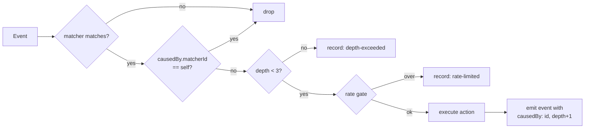

# PLAN-030 — Session lifecycle automation

## Goal

Make session-lifecycle rules (`LabelAdd` → status, label, context) actually executable and
loudly diagnosable, per ADR-0021, without weakening the rule that a model never closes a task.

## Scope

- **Phase 0 — Fail loud.** Unknown action types and unknown matcher keys become diagnostics
  instead of silence. Ships independently of everything below and is the highest-leverage slice.
- **Phase 1 — Lift transport scoping with loop safety.** Session actions on any app event,
  guarded by provenance depth cap, self-trigger suppression, and a rate gate.
- **Phase 2 — Effect-accurate history.** Session actions record what happened, not that they
  were dispatched.
- **Phase 3 — Context profiles.** One `apply-context` action referencing a named, reviewable
  profile (working directory, skills, sources, permission mode) — replacing the invented
  `addWorkingDirectory` / `enableSkill` action types that motivated this.

## Non-goals

- Changing the agent-facing `set_session_status` MCP guard. It stays unconditional; models
  never close tasks. ADR-0021 §2.
- Any new automation *event* type. The existing `APP_EVENTS` set is sufficient.
- Prompt-action outcome tracking. A prompt action whose downstream tool call is rejected is a
  different problem (the prompt did run); noted in Phase 2 but not solved here.
- Upstream contribution. This is fork-owned surface with no upstream analog; revisit later.

## Approach

### Phase 0 — Fail loud

Three changes, all in `packages/shared/src/automations/`:

1. `validation.ts` — add a known-action-type check. An action whose `type` is not one of
   `prompt | webhook | set-status | set-labels | send-message` produces a **validation error**
   naming the type, with a near-miss suggestion (`setSessionStatus` → `set-status`).
2. `schemas.ts` — keep the `.passthrough()` catch-all (lenient parse, per ADR-0021 §4) but add a
   `superRefine` on `AutomationMatcherSchema` that emits a **warning** for unknown top-level
   keys, with a near-miss suggestion (`labelId` → `matcher`).
3. Handlers — a matcher containing an unknown action type is skipped at runtime **with a history
   record**, so a dead rule is visible in history rather than absent from it.

The near-miss suggestions matter more than they look: both live defects were plausible-sounding
invented names, and the current surface confirmed them as valid.

### Phase 1 — Event-triggered session actions

Delete `WEBHOOK_ONLY_ACTION_TYPES` (`validation.ts:24`) and the `event !== 'WebhookReceived'`
early return (`session-action-handler.ts:80`) **in the same commit** — validation and runtime
must not drift.

Loop safety replaces them:



- **Provenance.** `BaseEventPayload` gains an optional `causedBy: { matcherId, depth }`. Session
  mutations performed by an action emit their resulting event with the marker set. This is the
  invasive part — it threads through `SessionManager` status/label mutation sites, not just the
  automations package.
- **Depth cap** of 3, constant, not configurable.
- **Rate gate** — reuse `webhook-ingest/rate-gate.ts` keyed per matcher.

`allowClosed` semantics are unchanged and now reachable from `LabelAdd`.

#### Two findings from the Phase 0 review invalidated the plan above (2026-08-04)

Both were verified against the code on 2026-08-04, before any Phase 1 work started. Neither is
a coding difficulty; each changes what Phase 1 has to *be*. Kept as the record; the decision
that resolves them follows.

**1. Deleting the transport restriction first would re-create the exact failure Phase 0 closes.**

`onSessionActions` is supplied in exactly one place: the webhook dispatcher
(`webhook-ingest/dispatcher.ts:96`). The `AutomationSystem` that SessionManager constructs
(`SessionManager.ts:1718-1728`) passes `onPromptsReady` and `onError` — **not**
`onSessionActions`. So the moment `WEBHOOK_ONLY_ACTION_TYPES` is deleted, a `set-status` under
`LabelAdd` starts passing validation, gets computed into a `PendingSessionAction`, reaches
`session-action-handler.ts:153`, finds the callback undefined, and is dropped in silence.

That is a rule that validates clean and can never run — the precise defect Phase 0 exists to
make impossible. The ADR's "in the same commit" instruction is directionally right but names
the wrong pair: the deletion must land with **an executor wired into SessionManager's
AutomationSystem**, not merely with the handler's early-return. Until that executor exists,
the validation error is the only thing preventing a silent dead rule, and removing it is a
strict regression.

**2. `causedBy` cannot be threaded through the mutation sites, because the mutation and the
event are separated by a filesystem watcher.**

The ADR describes provenance as threading through `SessionManager` status/label mutation sites.
It cannot, because those sites do not emit the events:

```mermaid
graph LR
    A[executor calls<br/>sm.setSessionStatus] --> B[persist to<br/>session.jsonl]
    B --> C[notifyFileChange]
    C -.fs.watch.-> D[ConfigWatcher<br/>onSessionMetadataChange]
    D --> E[automationSystem<br/>.updateSessionMetadata]
    E --> F[diff → emit<br/>SessionStatusChange]
```

`setSessionStatus` (`SessionManager.ts:4664`) and `setSessionLabels` (`:7135`) write to disk and
poke the watcher; neither calls `updateSessionMetadata`. The **only** caller of
`automationSystem.updateSessionMetadata` is the `ConfigWatcher` callback
`onSessionMetadataChange` (`SessionManager.ts:1663-1709`), which receives a session *header* read
back off disk and diffs it against the last known snapshot.

By the time the event is emitted, the causal context is gone: different call stack, different
tick, no shared async context (the repo uses no `AsyncLocalStorage`). There is no parameter to
thread. The dotted edge above is where provenance dies.

#### ✅ Decided 2026-08-05 — direct emit with provenance (correlation amendment withdrawn)

An earlier draft of this section proposed a correlation side-channel (short-TTL provenance
claims matched across the disk round-trip). Jeff's review found the simpler answer: **nothing
forces the watcher to be `updateSessionMetadata`'s only caller.** The mutation sites can call
the automation differ directly — the diff-against-snapshot design makes the watcher echo a
natural no-op (the direct call updates `lastKnownMetadata`, so the echo diffs to empty). The
codebase already endorses exactly this idiom: `setKanbanColumn` and `setTaskNodeCount` both
push live events directly because "self-writes don't re-emit through the file watcher"
(`SessionManager.ts:7256-7276`). Provenance becomes **exact, not heuristic** — the TTL/claim
machinery, and its stated false-positive-suppression property, are unnecessary.

The mechanism (now also in ADR-0021 §3, amended):

- **Mutation sites emit directly.** `setSessionStatus`, `setSessionLabels`,
  `setSessionPermissionMode`, `renameSession`, and the task-promotion reconcile paths call
  `automationSystem.updateSessionMetadata` after their flush, passing a **complete snapshot**
  spread from `managed` (permissionMode, labels, isFlagged, sessionStatus, sessionName). Full
  snapshot is load-bearing: the differ treats absent fields as removed, so a partial snapshot
  would emit phantom `LabelRemove`s.
- **The watcher demotes to external-writes-only.** `onSessionMetadataChange` skips the
  automation notify on `isSelfWrite` (signature machinery already existed at
  `SessionManager.ts:1671-1673`; the notify just ignored it). The external notify moves into
  `applyExternalSessionMetadata`, so deferred headers (write-guard / processing-active) feed
  the differ **when applied**, not when the possibly-stale read fired. This also fixes a
  pre-existing hazard: a stale header read during the atomic unlink+rename was fed to the
  differ unconditionally and could emit a phantom revert/reapply pair.
- **Per-session serialization.** `updateSessionMetadata` is read-modify-write with
  `await eventBus.emit` in the middle; with two caller classes (direct + external), overlapping
  calls could read the same `prev` and double-emit. Calls are chained per session.
- **`causedBy` rides the direct call.** The executor passes `{ matcherId, depth }` into
  `updateSessionMetadata`, which stamps it on the emitted events. External writes carry no
  provenance and are treated as user-origin for depth-capping — correct, since they genuinely
  have none.
- **Dispatch stays deferred.** The Phase 1 executor is fire-and-forget like `onPromptsReady`
  already is, so a rule can never reenter `setSessionStatus` while it is on the stack.

**Groundwork shipped 2026-08-05 on the Phase 0 branch** (no rule-visible behavior change:
same events, same diffs, now emitted at the mutation site and immune to stale-read phantoms):
direct emits at the mutation sites, watcher demotion, per-session serialization, and tests.
The `causedBy` parameter, executor, guards, and the flip remain Phase 1 proper.

**Phase 1 ordering** (implemented 2026-08-05, see the Status log):
1. Wire a session-action executor into SessionManager's `AutomationSystem` — behind the existing
   transport restriction, so behavior is unchanged and testable in isolation.
2. Add `causedBy` plumbing + depth cap + self-trigger suppression + rate gate.
3. *Only then* delete `WEBHOOK_ONLY_ACTION_TYPES` and the handler early-return together.

Steps 1 and 2 are independently reviewable and carry no behavior change; step 3 is the flip.

### Phase 2 — Effect-accurate history

`sessionActionHistoryEntry` already records outcomes (`set-status:done`,
`rejected:closed-status:done`). Extend the same discipline to the new event paths, and add the
Phase 0/1 refusal outcomes (`skipped:unknown-action`, `skipped:depth-exceeded`,
`skipped:self-trigger`, `skipped:rate-limited`).

Separately: surface prompt-action tool rejections in the session transcript rather than letting
them read as success. Investigation only in this plan — `next-step-spawn-followup` is the
worked example (8 `ok: true` records, zero successful closures).

### Phase 3 — Context profiles

Rather than one action type per context knob, a single action against a named profile stored in
workspace config (`context-profiles/config.json`):

```jsonc
// automations.json
{ "type": "apply-context", "profile": "steward" }
```

```jsonc
// context-profiles/config.json
{ "id": "steward", "workingDirectory": "/Users/jeffhampton/dev/steward",
  "skills": ["steward-repo"], "sources": ["dev"], "permissionMode": "allow-all" }
```

A label becomes a declarative context activator — reviewed once, reused everywhere, auditable
in one place. This is the DIR-04 surface-plane idea applied to sessions, and it is why
`addWorkingDirectory`/`enableSkill` should *not* be added as action types: N knobs × M rules is
the thing to avoid.

Phase 3 is separable and may be split into its own plan if Phases 0–2 ship first.

#### ✅ Implemented 2026-08-07 — three knobs shipped, skills split to PLAN-032 (ADR-0022)

`apply-context` ships covering **working directory, sources, and permission mode**. The
fourth knob this section names — skills — is split to **PLAN-032**, on a finding verified
against the code rather than a scope judgment: **skills are not session state.** There is no
`skills` field on `SessionHeader`, `ManagedSession`, or `SESSION_PERSISTENT_FIELDS`; no
`setSessionSkills`; and no RPC case for one. A skill is activated by a `[skill:<slug>]`
mention *in a message*, parsed by `base-agent.ts` out of the message text.
`sendMessage`'s `options.skillSlugs` is not an activation path — its only effect is
pre-enabling a skill's declared sources (`SessionManager.ts:6142`), so wiring a profile to it
would have produced a knob that looks like it works and does not.

A profile field named `skills` therefore needed a session-state knob invented underneath it
first, with its own questions (does the preamble go in the user's message or in hidden
context? every turn or once? how does the user see what is active?). Accepting the field and
no-oping it was rejected outright: a silently ignored field is the defect this whole plan
exists to eliminate. Instead the schema **declares `skills` in order to reject it with an
explanation** — the Phase 0 near-miss discipline applied to the new surface.

Design rulings, all recorded in **ADR-0022**:

- **Strict profile schema**, deliberately *not* following ADR-0021 §4's lenient-union
  ruling. An unknown action type must not take a whole config down with it; an unknown
  profile key means someone reached for a knob that does not exist. An invalid file loads
  **no** profiles — a profile carries a permission mode, so half-accepting one is worse than
  rejecting it, and `apply-context` then records `rejected:unknown-profile`.
- **`allowEscalation` on the profile**, mirroring `allowClosed`: lowering permission mode is
  always allowed, raising it needs a registration-time declaration. It sits on the profile
  rather than on the action so that the file declaring `"permissionMode": "allow-all"` is
  the same file that says whether that is authorized. Mutation-proved
  (`automations/context-action-gate.test.ts`): the shipped comparison is checked
  exhaustively across all nine mode pairs, then shown to disagree with a `>=` mutant and an
  inverted mutant on cases the suite actually asserts.
- **`apply-context` cannot close a session, structurally.** There is no status field on a
  profile, and permission mode is not an input to either closure rule — PLAN-031's choke
  point refuses on declared *origin*, and the MCP guard refuses closed categories
  unconditionally. Neither reads permission mode. Pinned by a test, so a future "just add a
  status knob" has to argue past it.
- **The five `null` aliases now suggest `apply-context`** — `addworkingdirectory`,
  `setworkingdirectory`, `enableskill`, `enablesource`, `applycontext`. `enableskill` is
  included even though profiles cannot carry skills: `apply-context` is still the right
  destination, and the profile schema explains the limitation on arrival, which is a better
  error than "valid action types are: …".

**A latent Phase 0 defect found on the way.** Both webhook executors ended their
`action.type` chain with a bare `return { ok: true }` — an action type a host did not
implement was reported as a **clean success with no history record anywhere**, sitting one
`if` away from the code Phase 0 added to prevent exactly that. Adding `apply-context` to
`KNOWN_ACTION_TYPES` would have walked straight into it, because the handler's dead-action
scan reads that list and would have counted the action as dispatched. Both fall-throughs now
record `skipped:unhandled-action:<type>` — the general fix, so the *next* action type cannot
repeat it.

`setSessionPermissionMode` gained an optional `cause`: without it the emitted metadata event
reads as user-originated, resets the chain to depth 0, and defeats the depth cap
(ADR-0021 §3). No `ConfigWatcher` entry and no cache — the config is read off disk per call
like `isValidStatusId`, so there is nothing to invalidate.

## Live workspace remediation (immediate, no code)

Independent of the phases, three rules in Jeff's workspace need attention now:

**Done 2026-08-04.** Backup at `automations.json.bak-20260804-172638`; config now
validates clean and all 23 working matchers are preserved.

| Rule | Defect | Resolution |
|---|---|---|
| `auto-close-set-done` | `setSessionStatus`; `labelId`; webhook-only; `done` is closed | `enabled: false` + inline `comment`. Revisit at Phase 1. |
| `steward-context-activate` | Same, plus status `in_progress` (real id is `in-progress`) and label `steward-mnemos-flywheel` does not exist | `enabled: false` + inline `comment`. Revisit at Phase 3. |
| `next-step-spawn-followup` | Fired 8× with `ok: true`; step 4 (`set_session_status done`) rejected every run | Retargeted to `needs-review`, with an explicit "do NOT attempt done" note in the prompt. |

## Acceptance

- [x] Phase 0: an unknown action type produces a validation **error** with a near-miss
      suggestion; `config_validate` on the live `automations.json` reported all four dead
      actions across both rules instead of passing.
- [x] Phase 0: an unknown matcher key produces a **warning** naming the key; `labelId` suggests
      `matcher` *and* states the rule is unfiltered.
- [x] Phase 0: a matcher with an unknown action type is logged and written to history as a
      `config-diagnostic` entry, once per load.
- [x] Phase 0: a disabled matcher is exempt from all three scans.
- [x] Phase 0: a malformed *known* action (`set-status` with no `session`) is reported, not
      swallowed by the union catch-all; a typo'd event name is reported with the matcher count
      it discards.
- [x] Phase 0: the diagnostics are visible in the Automations run history, not only in
      `console.warn` and the JSONL file.
- [x] Phase 0: the report fires on `reloadConfig` (config-watcher path), not only on cold load.
- [x] Phase 0: the `KNOWN_ACTION_TYPES` drift guard fails when the list and the schema union
      disagree — verified by mutation, not by assertion alone.
- [x] Phase 1 groundwork: automation metadata events are emitted directly at the
      `SessionManager` mutation sites (full snapshot), the watcher is demoted to
      external-writes-only, and `updateSessionMetadata` is serialized per session — no
      rule-visible behavior change, stale-read phantom events eliminated.
- [x] Phase 1: a session-action executor is wired into SessionManager's `AutomationSystem`
      (behind the existing transport restriction, so no behavior change).
- [x] Phase 1: `WEBHOOK_ONLY_ACTION_TYPES` and the `SessionActionHandler` transport guard are
      both gone — **and** the executor above exists, on the same branch (executor + guards in
      one commit, both deletions together in the next; neither deletion ever ships without
      the executor).
- [x] Phase 1: `set-status` under `LabelAdd` with `allowClosed: true` moves a session to `done`;
      without `allowClosed` it is rejected and recorded.
- [x] Phase 1: a self-feeding rule (`set-status` on `SessionStatusChange` targeting itself)
      terminates — regression test asserts bounded firing, not just "no crash".
- [x] Phase 1: the agent-facing MCP closed-status guard is unchanged; a test asserts a model
      still cannot close a task.
- [x] Phase 2a: refusal outcomes appear in `automations-history.jsonl` with a reason
      (`skipped:self-trigger` / `skipped:depth-exceeded` / `skipped:rate-limited` /
      `skipped:unknown-action`), in the same envelope as an executed action.
- [x] Phase 2a: refusals are visible in the Automations run history UI, not only in the JSONL —
      and every session-action outcome now renders a summary at all, where the timeline used to
      show an em-dash for all of them.
- [x] Phase 2a: the outcome vocabulary has exactly one producer (`sessionActionOutcome`), shared
      by all three executors; `apps/server` no longer carries its own copy of the status gate.
- [x] Phase 2b: investigated and closed with **no code change** — prompt-action tool rejections
      *are* already surfaced, in the spawned session's transcript (the failed call and its
      verbatim `[ERROR]` result are persisted messages). The history row is a dispatch ledger
      and cannot honestly carry the effect; every mechanical bridge misclassifies healthy
      probe→fail→retry runs. Recorded as LEARNING-052; the `ok` = dispatched, not achieved
      semantics are documented in `automations.md`. See the 2026-08-07 status-log entry.
- [x] Phase 3: `apply-context` activates working directory, sources, and permission mode from
      a named profile. **Skills deliberately excluded** — they are not session state (see the
      Phase 3 implementation note); split to PLAN-032, and the profile schema rejects a
      `skills` key with that explanation rather than ignoring it.
- [x] Phase 3: raising a session's permission mode requires `allowEscalation` on the profile;
      lowering it never does. Mutation-proved, not asserted alone.
- [x] Phase 3: `apply-context` cannot reach the closure path — a test pins that a profile at
      `allow-all` leaves the session's status untouched.
- [x] Phase 3: `addWorkingDirectory` / `setWorkingDirectory` / `enableSkill` / `enableSource` /
      `applyContext` all suggest `apply-context` instead of mapping to `null`.
- [x] Phase 3: an action type a host does not implement is recorded as
      `skipped:unhandled-action:<type>` rather than returning a bare `ok: true`.
- [x] Tests added/updated for each phase. Phase 0 22 cases, Phase 1 47, Phase 2a 23 (including
      the pipeline suite that starts from a real `automations.json`), Phase 3 42. Phase 2b is
      investigation-only and adds none by design.
- [x] `automations.md` documents all five action types, the `session` selector, `allowClosed`
      (with the models-never-close house rule), `WebhookReceived`, the `config-diagnostic`
      history kind, the dispatch-vs-effect distinction, and all three dead-rule classes.
      Source of truth is `apps/electron/resources/docs/automations.md`, which is installed to
      `~/.craft-agent/docs/`.
- [x] `automations.md` documents the loop guards (Phase 1), the Phase 2a refusal vocabulary
      (the four `skipped:*` outcomes, the prefix taxonomy, the diagnostic-vs-refusal
      distinction), and context profiles (Phase 3) — including the escalation rule, the skills
      exclusion and why, and the corrected action table (the "Valid on: `WebhookReceived` only"
      column was stale from Phase 1). Written across #142 and #143; the two edits are to
      disjoint sections but land in one file, so whichever merges second resolves the other's
      hunk.

## Status log

- `2026-08-04` — created in `planned/`; ADR-0021 proposed alongside.
- `2026-08-04` — **Phase 0 implemented**, moved to `in-progress/`. `scanUnknownActionTypes` /
  `scanUnknownMatcherKeys` / `findMatchersWithUnknownActions` in `validation.ts`,
  `KNOWN_ACTION_TYPES` in `schemas.ts`, `createConfigDiagnosticHistoryEntry` in
  `webhook-utils.ts`, `AutomationSystem.reportDeadMatchers`. 22 new tests
  (`dead-rule-diagnostics.test.ts`); shared suite 3309 pass / 0 fail; `typecheck:ci` clean.
  Live workspace remediated. Phases 1–3 remain.
- `2026-08-04` — **Phase 0 hardened** after adversarial review, which found the branch did not
  deliver its own headline. Two blocking defects: the `config-diagnostic` records were filtered
  out of the only history UI (`useAutomations.ts` dropped every entry carrying a `kind`), so the
  net visibility gain over the pre-branch state was one `console.warn`; and `reportDeadMatchers`
  was never called from `reloadConfig`, so the config-watcher path — the moment an operator is
  actually looking for feedback — produced no diagnostic at all. Both fixed. The
  `KNOWN_ACTION_TYPES` drift guard was also a tautology (the union's `.passthrough()` accepts any
  `{type: string}`, so the parse-based assertion passed unconditionally); it now reads the
  union's literal members back out of the schema, with a guard-the-guard test, and was verified
  by mutation.

  Two further dead-rule classes closed in the same pass: malformed *known* actions (which also
  used to discard every sibling action queued for the same event when they threw — now isolated
  per action) and typo'd event names. The `disabled` → `enabled` suggestion was inverting user
  intent and now explains the value flip. `automations.md` written — the acceptance item PLAN-030
  names as a root cause. Shared 3340 pass, webui 936+246 pass, server 193 pass, branding clean,
  `typecheck:ci` clean; `apps/electron` type-error count unchanged from baseline (107, all
  pre-existing).

  **Phase 1 stopped before implementation** — see the blocked section under Phase 1. Two findings
  verified against the code mean it cannot be built as ADR-0021 §3 specifies. Awaiting a decision
  on the proposed correlation-based provenance amendment.
- `2026-08-05` — **Provenance decided: direct emit, correlation withdrawn.** Jeff's review of the
  blocked section asked the right question — why not call the automation differ from the mutation
  sites directly? Verified against the code: the diff-against-snapshot design makes the watcher
  echo a natural no-op, and `setKanbanColumn`/`setTaskNodeCount` already use the
  direct-push-on-self-write idiom. ADR-0021 §3 amended (correlation → direct emit; provenance is
  exact). Groundwork implemented on the Phase 0 branch: direct emits at mutation sites, watcher
  demoted to external-writes-only via the existing `isSelfWrite` signature, external notify moved
  to `applyExternalSessionMetadata` (deferred headers feed the differ when applied), per-session
  serialization in `updateSessionMetadata`. Fixes the pre-existing stale-read phantom-event
  hazard as a side effect. Phase 1 proper (executor, `causedBy`, guards, flip) still pending.
- `2026-08-05` — **Phase 1 implemented** (branch `jh/plan-030-phase1-session-action-executor`).
  Two commits, in the plan's order.

  *Steps 1–2 (no behavior change, everything behind the transport restriction).*
  `handleAutomationSessionActions` in `SessionManager` — sibling of
  `handleAutomationPromptsReady`, resolves the selector, applies the three action types
  against the live session, records outcomes, fire-and-forget so an action can never reenter
  the mutator whose event is on the stack. The `set-status` pre-check extracted to a shared
  `checkStatusAction` so this executor and the desktop webhook executor cannot drift on the
  history outcome they record for the same rejection; it is the *recording* gate, with
  enforcement still at the PLAN-031 choke point (called with an `automation` origin carrying
  the rule's `allowClosed`). `causedBy` rides the direct `updateSessionMetadata` call from
  PR #136, so provenance is exact. `causation.ts` holds the two pure guards (self-trigger
  suppression, checked first and unconditionally so the refusal reason stays honest; depth
  cap of 3) plus the rate-gate constant, and `onSessionActionSkipped` is wired now rather
  than retrofitted — three of Phase 2's four refusal outcomes come from these guards.

  *Step 3 (the flip).* `WEBHOOK_ONLY_ACTION_TYPES` and the handler's `event !==
  'WebhookReceived'` early-return deleted together, on the same branch as the executor —
  which is the pairing the amended ADR-0021 §1 actually requires. `allowClosed` semantics
  unchanged and now reachable from `LabelAdd`; the agent-facing MCP guard untouched and
  separately pinned (no `allowClosed` escape hatch, refusal independent of the targeted
  session).

  **The rate gate was nearly dead code.** It was first set to 30/min per matcher, but
  `WorkspaceEventBus` already drops app events at `DEFAULT_RATE_LIMIT = 10`/min per type,
  workspace-wide — so any per-matcher ceiling at or above 10 can never engage. Correct code,
  fully wired, unreachable. Now 5/min, with `DEFAULT_RATE_LIMIT` exported and a test pinning
  the ordering so neither constant can move alone. Sitting below the bus limit is also the
  justification for having a second limiter at all: the bus drops events for *every* rule on
  that type, silently, so one runaway rule starves the rest with no diagnosable trace; the
  per-matcher gate refuses the offending rule specifically, with a reason. `LEARNING-051`
  (vorno-internal) generalizes it — a new limit is only meaningful relative to the limits
  already on the path. Caught only because the handler test drives the real bus rather than
  calling `handleEvent` directly.

  The per-matcher gate deliberately does **not** apply to `WebhookReceived`: those deliveries
  already pass the receiver's per-hook gate, and a second tighter ceiling would silently drop
  deliveries the hook admitted — a regression on a working path dressed as loop safety. Not
  transport-as-trust-boundary; the gate is already applied there, upstream.

  Wire compatibility confirmed unaffected: `BaseEventPayload` and `PendingSessionAction` are
  in-process types in a fork-owned layer with no upstream analog, and no entry in
  `roadmap/upstream/compatibility.md` is touched.

  Tests: 15 guard cases (mutation-proved — each asserts the predicate actually flips), 17
  handler cases (self-feeding rule closes the cycle for real and fires exactly **once**;
  ping-pong terminates at the depth cap, which self-trigger suppression structurally cannot
  see), 12 executor cases, 3 added MCP-guard cases. All eight CI gates green locally: shared
  3403, server-core 289, apps/server 193, webui, `typecheck:ci`, branding, three i18n, doc
  tools.

  Phases 2–3 remain.
- `2026-08-07` — **ADR-0021 accepted** and PR #139 rebased onto `main` after the v0.11.4 upstream
  merge (#140) landed. The ADR moved `proposed` → `accepted` on Jeff's call: the decision has
  shipped end to end (PLAN-031 for §2, Phases 0–1 here for §1/§3/§4) and no implementation finding
  contradicted it — both amendments corrected *mechanism*, never the ruling that loop safety
  replaces transport scoping. §5 stays open as Phase 2 and does not block acceptance.

  Added to ADR-0021 §3 at Jeff's request: a standing **security-review note**. The provenance
  model is a *correctness* mechanism, not a security boundary, and the two are easy to conflate.
  It assumes anything reaching the session store through the filesystem — rather than through a
  `SessionManager` mutator — has no automation ancestor and is safe to treat as user-origin at
  depth 0. A writer that edits `session.jsonl` directly bypasses the provenance path entirely, so
  a bot, an MCP server, or a future sync path could launder its own causation into apparent user
  intent and reset the depth counter. The guards still bound each *observed* chain; what is lost
  is the link between chains. `allowClosed` and the §2 choke point are unaffected — neither reads
  `causedBy`. Accepted for now because the threat needs local workspace write access, which
  already implies the ability to edit `automations.json`; revisit before session state can be
  written by anything less trusted than the local user (remote workspaces, a sync daemon, a
  sandboxed agent with scoped write access).

  The rebase was clean, but the full eight-gate set was re-run against the upstream merge rather
  than trusting that — v0.11.4 touched `packages/shared`. All green (shared 3404, server-core 289,
  session-tools-core 92, apps/server 193, webui, `typecheck:ci`, branding, i18n ×3, doc tools).

  **Phase 1 closed. Phases 2–3 remain, unstarted and untracked** — no sessions, no tasks, nothing
  in `planned/`. This plan is their tracking until Jeff creates them. Phase 2 has a ready entry
  point: `onSessionActionSkipped` is wired and logging, so it is a matter of turning those log
  lines into `skipped:<reason>` history records. Phase 3 (context profiles) remains separable and
  may become its own plan, per the note under its heading.
- `2026-08-07` — **Phase 2a implemented** (refusal history + visibility). Four changes:

  1. `handleAutomationSessionActionsSkipped` writes history instead of only logging, in the
     **same envelope as an executed action** — deliberately no `kind`. A `kind` would have put
     the record behind the very filter that made Phase 0's diagnostics write-only; the renderer
     classifies it by the `skipped:` outcome prefix instead and renders it `blocked`.
  2. `skipped:unknown-action` added at *dispatch*, for the half-dead case the load-time
     `config-diagnostic` structurally cannot report: a rule that fires normally while one of its
     actions names a type nothing dispatches. Its healthy actions still run. A matcher whose
     actions are *all* unknown never reaches this path, so a permanently dead rule still costs
     one record per load rather than one per event.
  3. **The outcome vocabulary got a single producer** (`session-action-outcome.ts`). It was eight
     literals × three executors; `checkStatusAction` only ever covered two of them. `apps/server`
     also had its own inline copy of the closed-status gate, now deleted in favor of the shared
     one. These strings are the interface operators diagnose from — drift in them is invisible
     because the record still writes, still says `ok: false`, and merely stops matching what the
     reader greps for.
  4. **The renderer was the real defect.** `RawHistoryEntry` had no `sessionAction` field at all,
     so *every* session-action record since PLAN-014 rendered with an empty summary — the
     timeline literally showed `—`, and a `set-status` refused for closing a task was
     indistinguishable from one that succeeded except by a red dot. `describeSessionAction` fixes
     the whole vocabulary, not just the new refusals. The field was also typed away at two
     boundaries (the RPC's `HistoryEntry`, `shared/types.ts`) while flowing fine at runtime.

  One near-miss worth recording: the entry key is `${id}-${ts}`, and an `unknown-action` refusal
  is written in the same tick, under the same matcher id, as the action that *did* run — so both
  rows carried the same React key and one would have silently stopped rendering. Phase 0's
  invisibility defect, reintroduced by a different mechanism. Keys are now suffixed per refusal
  reason, with a regression test.

  Testing follows the Phase 1 lesson (the rate gate shipped unreachable behind a green unit
  test): `automation-refusal-history.test.ts` starts from a real `automations.json`, calls the
  production `setupConfigWatcher`, emits on the real `WorkspaceEventBus`, and reads the JSONL —
  no direct call to the writer. Verified by mutation: deleting the `onSessionActionSkipped`
  wiring turns that suite fully red (4/4) while the direct-call unit suite stays green (19/19),
  which is exactly the gap it exists to cover. The `unknownActionTypes` predicate was mutation-
  tested three ways (neutered → 2 fail, inverted → 8 fail, over-eager `continue` → 1 fail).

  Gates: shared 3411 pass / 17 skip, server-core 300 pass, apps/server 193 pass,
  `test:webui` 395 + 24 + 310 + 300 pass, `typecheck:ci` clean, branding clean, i18n ×3 clean,
  doc tools 19 pass. **No wire contract
  touched** — no `packages/shared/src/protocol/` change; the history JSONL is local disk and the
  RPC `HistoryEntry` addition is additive on a fork-owned channel.

  **Phase 2b** (prompt-action tool rejections in the transcript) and **Phase 3** (context
  profiles) remain. Phase 3 is still greenfield: nothing named `apply-context` /
  `context-profile` exists in the tree beyond the `applycontext: null` alias.
- `2026-08-07` — **Phase 3 implemented** (branch `jh/plan-030-phase3-context-profiles`, built
  off `main` at 36d10b45 and independent of the Phase 2a lane).

  `apply-context` + `context-profiles/config.json` cover **three** of the four knobs this
  plan names. The fourth, skills, is split to **PLAN-032** — not on scope grounds but on a
  code finding: skills are not session state at all. `SESSION_PERSISTENT_FIELDS` has no
  entry, there is no `setSessionSkills`, and activation happens by a `[skill:<slug>]` mention
  in a *message* that `base-agent.ts` parses out of the text. `options.skillSlugs` looked
  like the hook and is not — it only pre-enables a skill's declared sources
  (`SessionManager.ts:6142`), so a profile wired to it would have shipped a knob that reads
  as working and does nothing. That is the failure mode this plan was written to eliminate,
  so the schema **names `skills` in order to reject it with an explanation** instead.

  Design recorded in **ADR-0022** (proposed): strict profile schema — deliberately *not*
  ADR-0021 §4's lenient-union ruling, because an unknown profile key means a knob that does
  not exist rather than a forward-compatibility problem; an invalid file loads no profiles at
  all; `allowEscalation` on the profile mirroring `allowClosed`, with lowering permission
  mode always free and raising it opt-in; and the five `null` aliases repointed at
  `apply-context`.

  **`apply-context` cannot close a session and this is structural, not guarded** — a profile
  has no status field, and neither closure rule reads permission mode (PLAN-031's choke point
  refuses on declared origin; the MCP handler refuses closed categories unconditionally).
  Escalating to `allow-all` buys an agent nothing on that path. The escalation guard exists
  because unreviewed escalation is bad on its own terms, and conflating the two would have
  produced a guard aimed at the wrong thing. A test pins the status-untouched property so a
  future "just add a status knob to the profile" has to argue past it.

  **A latent Phase 0 defect surfaced.** Both webhook executors ended their `action.type`
  chain with a bare `return { ok: true }`: an action type the host did not implement was
  reported as a clean success with no history record anywhere — one `if` away from the
  machinery Phase 0 added to make exactly that impossible. Adding `apply-context` to
  `KNOWN_ACTION_TYPES` would have walked into it, because `unknownActionTypes` reads that
  list and would have counted the action as dispatched. Fixed generally rather than for this
  action: both hosts now record `skipped:unhandled-action:<type>`.

  Also: `setSessionPermissionMode` gained an optional `cause` (without it the emitted metadata
  event reads as user-originated and the depth cap stops bounding anything); no
  `ConfigWatcher` entry and no cache, since the config is read per call like
  `isValidStatusId`; and the `automations.md` action table's "Valid on: `WebhookReceived`
  only" column, stale since the Phase 1 flip, was corrected in passing.

  Wire compatibility unaffected — no file under `packages/shared/src/protocol/`, no channel,
  DTO, or envelope change. `context-profiles/config.json` is a new local-disk config, and
  `PendingSessionAction` / `AutomationAction` are in-process types.

  Tests: 11 config-loading cases, 12 gate cases (including the mutation proof — exhaustive
  over all nine mode pairs, then shown to disagree with two mutants on cases the suite
  asserts), 6 handler cases driven through the real `WorkspaceEventBus`, 10 executor cases,
  and 3 webhook-executor cases across both hosts.

  **Phase 2 remains.** Phase 3 is done modulo PLAN-032.
- `2026-08-07` — **Closeout: all four phases implemented; the plan stays `in-progress` because
  two of them have not merged.**

  | Phase | What shipped | PR | State |
  |---|---|---|---|
  | 0 | Dead-rule diagnostics, near-miss suggestions, `config-diagnostic` history | [#136](https://github.com/Swagatar-LLC/vorno/pull/136) | merged |
  | 1 | Session-action executor, `causedBy` provenance, three loop guards, the flip | [#139](https://github.com/Swagatar-LLC/vorno/pull/139) | merged |
  | 2a | `skipped:*` refusal history + the renderer fix + one outcome producer | [#142](https://github.com/Swagatar-LLC/vorno/pull/142) | **open**, 8/8 CI green |
  | 2b | Investigation; no code change (LEARNING-052) | — | closed |
  | 3 | `apply-context` + context profiles, ADR-0022, PLAN-032 split | [#143](https://github.com/Swagatar-LLC/vorno/pull/143) | **open**, 8/8 CI green |

  The folder is the status, so it does not move: `done/` means *code landed*, and half of this
  plan's code is sitting in review. Advance with `[skill:roadmap-plan-advance] PLAN-030 done`
  once #142 and #143 are both merged — verify with `git merge-base --is-ancestor <sha>
  origin/main` rather than the `MERGED` badge (LEARNING-046).

  **Merge-order note.** #142 and #143 were built as independent lanes off `main` at `36d10b45`,
  and both edit `session-action-gate.ts`, `session-action-handler.ts`, `SessionManager.ts`,
  `automations.md`, both webhook executors, and this file. Whichever merges second will conflict
  and must re-run the full eight-gate set after resolution — a clean textual merge of two
  independently-green branches is not evidence either still passes. This closeout branch is a
  third editor of this file; its version is the **union** of both by construction, so resolve in
  its favour.

  **Phase 2b closed with no code change**, deliberately. The prompt-action refusal is already
  recorded losslessly in the spawned session's transcript; the history row is a dispatch ledger
  and `ok` means *dispatched*, not *achieved*. Every mechanical bridge from "tool refused inside
  the turn" to "history row" misclassifies healthy probe→fail→retry runs, and the alternative —
  making the guard emit upward — modifies `set-session-status.ts`, which is byte-identical to
  upstream. The invariant kept: **history rows record only decisions the automation layer itself
  made or structurally observed.** The live defect that motivated the investigation
  (`next-step-spawn-followup`) was a *misconfiguration*, fixed 2026-08-04. LEARNING-052.

  **Guard verification (read from the code, not from the phase reports).** All three untouchables
  confirmed unchanged on both open branches:

  - `packages/session-tools-core/src/handlers/set-session-status.ts` and its
    `set-session-status.test.ts` — not in either branch's changed-file set. The unconditional
    closed-category refusal is intact.
  - PLAN-031's choke point, `packages/shared/src/statuses/origin.ts` — not in either branch's
    changed-file set.
  - Phase 1's guards — `evaluateChainGuards` is byte-identical (self-trigger checked first and
    unconditionally, then `depth >= MAX_AUTOMATION_CHAIN_DEPTH`), `MAX_AUTOMATION_CHAIN_DEPTH`
    is still 3, `SESSION_ACTION_RATE_PER_MINUTE` is still 5 against `DEFAULT_RATE_LIMIT = 10`
    (`automations/event-bus.ts:164`), and `causation.test.ts` — the suite pinning that ordering
    — is unmodified on both branches. Phase 2a's only edit to `causation.ts` is additive: a
    fourth `SessionActionSkipReason` (`unknown-action`) and an `actionTypes` field on
    `SessionActionSkip`.

  **Wire compatibility: not touched.** Verified by diffing both branches against `origin/main` —
  no file under `packages/shared/src/protocol/`, no channel, DTO, or envelope change. The
  history JSONL and `context-profiles/config.json` are local disk; `BaseEventPayload`,
  `PendingSessionAction`, and `AutomationAction` are in-process types in a fork-owned layer with
  no upstream analog; the RPC `HistoryEntry` addition is additive on a fork-owned channel. No
  entry in `roadmap/upstream/compatibility.md` applies and none needs amending.

  **LEARNINGs earned by this plan** (all in `vorno-internal`, indexed): 049 (mutation and event
  separated by a file watcher), 050 (a defaults generator nobody checks), 051 (a guard above an
  existing ceiling is dead code), 052 (`ok` is a dispatch fact), **053** (an options field named
  like the knob is not the activation path — `skillSlugs` only pre-enables sources), **054** (a
  dispatch chain ending in a bare `return { ok: true }` reports unimplemented as success).

  **Follow-ups leaving this plan:** PLAN-032 (session-sticky skills, `planned/`, ships on #143);
  ADR-0022 is `proposed` and needs Jeff's acceptance call. Unrelated find worth its own one-line
  fix: **`bun.lock` on `main` is stale** — all 14 workspace entries still read `0.14.0` while
  `package.json` reads `0.15.0`, so the v0.15.0 bump never ran `bun install`. Nothing fails, which
  is why it persists.
