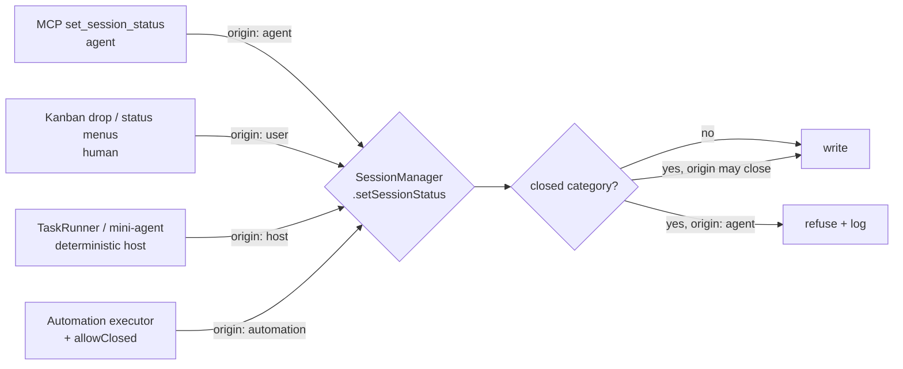

# PLAN-031 — Enforce status invariants at the single choke point

## Goal

Make "which statuses exist" and "who may close a session" system invariants enforced in one
place each, so PLAN-030 Phase 1 can be built and tested against a status channel that is neither
lossy nor selectively guarded.

## Why now

Two defects surfaced by the 2026-08-05 architecture review (seams #3 and #5), both re-verified
against `main` at `6131e6d5`. Neither is cosmetic: each is a **precondition for PLAN-030
Phase 1**.

**Seam #5 makes Phase 1 untestable.** `getDefaultStatusConfig` (`packages/shared/src/statuses/storage.ts:45-89`)
seeds exactly `backlog, todo, needs-review, done, cancelled` — **`in-progress` is not among
them**. Yet three other places assert it is built-in: `BuiltInStatusId`
(`packages/shared/src/sessions/types.ts:84`), `DEFAULT_ICON_SVGS`
(`packages/shared/src/statuses/default-icons.ts:32`), and `TaskRunner.ts:117` — whose own comment
declares "the fixed set is todo|in-progress|needs-review|done|cancelled", a set the default
generator does not produce. `validateStatusConfig` (`storage.ts:122-127`) only requires
`todo`/`done`/`cancelled`, so a workspace missing `in-progress` loads and validates clean; on
read, `validateSessionStatus` (`validation.ts:18-39`) falls it back to `'todo'` with a
`console.warn`. Net: on any workspace nobody hand-patched, **every TaskRunner-driven run silently
reads back as `todo`** — a board where nothing ever appears to be running. Two of PLAN-030
Phase 1's acceptance items assert observable status transitions; they cannot be honestly verified
through this channel. (Jeff's live workspace has a hand-added `in-progress` entry masking the
defect — itself evidence someone already hit this and patched locally rather than at the source.)

**Seam #3 is an ADR-0021 correctness gap.** ADR-0021 separates two trust models — models never
close, humans may declare closure via `allowClosed`. It does not account for a **third writer**:
the renderer. `packages/server-core/src/handlers/rpc/sessions.ts:316` routes `setSessionStatus`
straight into `SessionManager.setSessionStatus` (`:4721`), which performs **no validation of any
kind** — it writes whatever string it is handed. The guard exists only in the agent-facing MCP
handler (`packages/session-tools-core/src/handlers/set-session-status.ts:35-39`). Phase 1
deliberately sharpens `allowClosed` (the ADR says so in its own Negative consequences); shipping
that sharpening while the invariant is asserted in three places and enforced in one is the exact
"convention enforced by one caller remembering" pattern the review identifies as the root shape
of the system's accidental complexity.

## Scope

- One source of truth for the built-in status set, derived by the type, the icon table,
  `getDefaultStatusConfig`, and `TaskRunner` — with a drift guard proven by mutation.
- Idempotent backfill of missing built-in statuses on config load, reusing the existing
  `migrateStatusColors` write-back slot.
- An origin/intent parameter on `SessionManager.setSessionStatus`, with the closed-status check
  moved into that choke point and every existing call site classified.
- ADR-0021 amended to state the third writer explicitly.

## Non-goals

- **No confirmation dialog on drag-drop.** Decided 2026-08-05: dragging a card into a closed
  column *is* the declaration of intent — "when a task is done, it should be Done". The intent
  of this plan is to make that path legible to the choke point, not to obstruct it. Adding
  friction to the primary way a human closes a task would be a regression.
- No change to the agent-facing MCP guard's behavior. A model still may never close a task. The
  guard gains defense-in-depth at the choke point; its own unconditional refusal stays.
- No change to `kanbanColumn` semantics or the non-atomic drop (review seam #2). Separate plan.
- No new status IDs beyond reconciling `in-progress`, which every consumer already assumes.
- No renaming of the two "Task" systems (seam #6) or unification of the two "plan" concepts
  (seam #1).

## Approach

### Part A — one built-in status set

Introduce `BUILT_IN_STATUSES` in `packages/shared/src/statuses/` as the single ordered literal
array (id, label, category, isFixed, isDefault, order). Then:

- `getDefaultStatusConfig()` maps over it instead of hand-listing five object literals.
- `BuiltInStatusId` becomes `(typeof BUILT_IN_STATUSES)[number]['id']` rather than a hand-typed
  union.
- `TaskRunner`'s `RUNNING_STATUS` / `DONE_STATUS` / `FAILED_STATUS` import from it; its
  "the fixed set is…" comment stops being an independent assertion.
- A drift test asserts `DEFAULT_ICON_SVGS` covers exactly the built-in ids.

**The drift guard must be proven by mutation, not assertion.** PLAN-030's Phase 0 shipped a
`KNOWN_ACTION_TYPES` guard that was a tautology and passed unconditionally; that lesson applies
directly here. Each guard test gets a documented mutation check.

### Part B — backfill, not just defaults

Adding `in-progress` to the defaults only helps *new* workspaces. Existing ones need an
idempotent backfill inside `loadStatusConfig`, in the same write-back slot `migrateStatusColors`
already occupies (`storage.ts:156-162`):

- Missing built-in ids are appended (preserving any user-authored label, color, or order for ids
  already present — backfill never overwrites).
- Write-back happens only when something actually changed, matching the existing migration's
  discipline.
- Jeff's live workspace, which already carries a hand-added `in-progress` (`isFixed: false`,
  `isDefault: false`), must be a **no-op** under this backfill — verified against the real file
  before merge.

**Settled 2026-08-05 — `isFixed: false, isDefault: true`, against the recommendation drafted
above.** The draft proposed `isFixed: true`; reading `deleteStatus` (`crud.ts:107-113`) showed that
unnecessary. It refuses deletion on *either* flag, while `updateStatus` only restricts category
changes on `isFixed` — so `isDefault` already delivers the property TaskRunner needs (the id cannot
disappear) without taking away a user's ability to relabel or recolor it. `types.ts:57` had also
been documenting `in-progress` as a `isDefault` status all along, and `needs-review` sits in
exactly this position. Following the code's existing intent beat inventing a stricter one.

### Part C — origin at the choke point

`setSessionStatus(sessionId, status, origin)` gains a required-in-practice origin discriminator.
Design constraints:

- **The restrictive value is the default.** A call site that forgets the parameter must not be
  able to close a session. New code should fail closed, not open.
- `origin: 'agent'` is refused for `category: 'closed'` — the MCP handler keeps its own guard
  too (two independent refusals; the handler's produces the better error message for a model).
- `origin: 'user'` may close. This is the drag-drop and status-menu path, and per the decision
  above it is declared intent by construction.
- `origin: 'host'` may close — TaskRunner's DAG completion and mini-agent auto-complete. Already
  documented as the intentional bypass in the MCP guard's own comment.
- `origin: 'automation'` may close **only** with `allowClosed: true`, preserving ADR-0021 §2 and
  giving PLAN-030 Phase 1's executor its call shape ready-made.

Call sites to classify (census 2026-08-05, all verified): `SessionManager.ts:4289` (agent),
`:6684` (host, mini-agent → `done`), `TaskRunner.ts:202,459,499,540,542` (host),
`rpc/sessions.ts:316` (user), `apps/server/src/webhooks/executors.ts:126` and
`apps/electron/src/main/trigger-server/webhook-executors.ts:182` (automation, already
`allowClosed`-gated at `:121`/`:177`).

`SessionCommand` (`packages/shared/src/protocol/dto.ts:457`) carries no origin field. It does not
need one: everything arriving on that RPC *is* a human UI action. The origin is supplied by the
RPC handler, not the wire — so **no wire-format change and no `compatibility.md` amendment**.
Confirm this holds before merge.

### Part D — ADR-0021 amendment

ADR-0021's title is literally this plan's thesis ("gate on declared intent, not on transport"),
and §2 already reasons about closure — but it enumerates two writers where three exist. Amend
rather than open a competing ADR: add the renderer as a declared-intent writer, record the
no-confirmation-dialog decision and its rationale, and note that the guard moves to the choke
point while the MCP handler's own refusal stays.

## Acceptance

- [x] `BUILT_IN_STATUSES` is the only hand-written list of built-in statuses; `BuiltInStatusId`,
      `getDefaultStatusConfig`, `DEFAULT_ICON_SVGS` coverage, and `TaskRunner`'s status constants
      all derive from or are checked against it.
- [x] A fresh workspace's `getDefaultStatusConfig()` includes `in-progress`.
- [x] The drift guard fails when the list and any consumer disagree — **verified by mutation**,
      not by assertion alone (PLAN-030 Phase 0 shipped a tautological guard; this one is proven).
- [x] An existing workspace missing `in-progress` gains it on load, once, with write-back; a
      second load is a no-op.
- [x] Backfill preserves user-authored label/color/order for statuses already present, and is a
      verified no-op against Jeff's live `statuses/config.json`.
- [ ] A TaskRunner-driven run reads back as `in-progress`, not `todo`, on a workspace seeded from
      defaults — asserted end-to-end, not by unit-testing the constant.
- [x] `SessionManager.setSessionStatus` refuses a `closed`-category status for `origin: 'agent'`
      and for `origin: 'automation'` without `allowClosed`.
- [x] Omitting the origin parameter fails closed — a test asserts a defaulted call cannot close.
- [ ] Dragging a card into a closed column still closes it, with no added prompt — regression
      test, since the decision is explicitly to keep this path frictionless.
- [x] The agent-facing MCP guard is unchanged and still refuses closure unconditionally; the
      existing test asserting a model cannot close a task still passes untouched.
- [x] No `SessionCommand` wire change; `roadmap/upstream/compatibility.md` needs no amendment
      (confirmed, not assumed).
- [x] ADR-0021 amended with the third writer, the no-dialog decision, and the choke-point move.
- [x] Tests added/updated for each part.

## Status log

- `2026-08-05` — created in `planned/`. Grounded in the 2026-08-05 architecture review
  (seams #3 and #5, both re-verified against `main` at `6131e6d5`) and sequenced ahead of
  PLAN-030 Phase 1 per Jeff's decision the same day. Closure-path question settled at creation
  time: gate for stated intent, no confirmation dialog — the drag-to-Done path is the product's
  intended way to close a task and must stay frictionless.
- `2026-08-05` — moved from `planned` to `in-progress`; branch `jh/status-invariants-choke-point`
  off `main` at `6131e6d5` (PR #136 merged).
- `2026-08-05` — **Parts A–D implemented.** `statuses/built-in.ts` (`BUILT_IN_STATUSES`,
  `BuiltInStatusId` derived via `satisfies` — an annotation would have widened `id` back to
  `string` and silently re-created the drift this plan exists to remove) and `statuses/origin.ts`
  (`StatusChangeOrigin`, `mayCloseSession`). `getDefaultStatusConfig` now maps over the source of
  truth; `backfillBuiltInStatuses` runs in `loadStatusConfig`'s existing write-back slot;
  `TaskRunner`'s three status constants are typed `BuiltInStatusId` so a rename breaks the build.
  `mayApplyStatus` gates closure in `SessionManager.setSessionStatus`; all 11 call sites
  classified (agent / host ×6 / user / automation).

  **Verified, not assumed:** the backfill is a byte-identical no-op against Jeff's *live*
  `statuses/config.json` (which carries a hand-added `in-progress` plus custom `next-step` and
  `archived` statuses) — run against the real file, not a fixture. The fail-closed default proved
  itself immediately: three pre-existing `cold-session-metadata` tests that closed sessions with no
  origin began failing on contact, and were updated to declare `USER_ORIGIN` (they test durability,
  not authority). 21 built-in/backfill tests + 16 closure-gate tests, including mutation checks
  that each drift guard actually fails when its invariant breaks.

  One design point settled against the plan's own draft recommendation (see Part B): `in-progress`
  is `isDefault`, not `isFixed`, because `deleteStatus` already refuses on either flag.

  Gates green: typecheck:ci, shared 3370 pass, server-core 277 pass, test:webui 380+24+310+277
  pass, apps/server 193 pass, session-tools-core 89 pass, branding, i18n ×3, doc-tools 19 pass.

- `2026-08-07` — **Merged as PR #138** (`8b08a495`, merge `07c639a3`), and confirmed load-bearing
  for PLAN-030 Phase 1: the `automation` origin variant is what that phase's session-action
  executor declares, and the `in-progress` seeding fix is what made its status-transition
  acceptance items observable at all (on a defaults-seeded workspace every TaskRunner run
  previously read back as `todo`).

  **Stays `in-progress` — two acceptance items are genuinely open**, both end-to-end regressions
  that the shipped unit coverage deliberately does not stand in for:

  1. *A TaskRunner-driven run reads back as `in-progress` on a defaults-seeded workspace.* The
     constant is unit-tested and the gate is unit-tested; what is not tested is the whole path.
     That is the point of the item — the original defect was invisible precisely because every
     component was individually correct. PLAN-030's `status-closure-gate.test.ts` covers
     `setSessionStatus('in-progress', hostOrigin(...))` reaching disk, which is the seam, not the
     journey.
  2. *Dragging a card into a closed column still closes it, with no added prompt.* The decision to
     keep this path frictionless was explicit and is the easiest thing to regress by accident —
     someone tightening the gate later adds a confirm and the product's primary way of closing a
     task grows friction. Needs a renderer-level regression, which is why it did not land with the
     main-process work.

  Neither blocks ADR-0021 (accepted 2026-08-07 — §2's choke point is implemented and enforced) and
  neither is a bookkeeping lag. Recorded here rather than silently carried so the folder state
  keeps meaning what it says.
