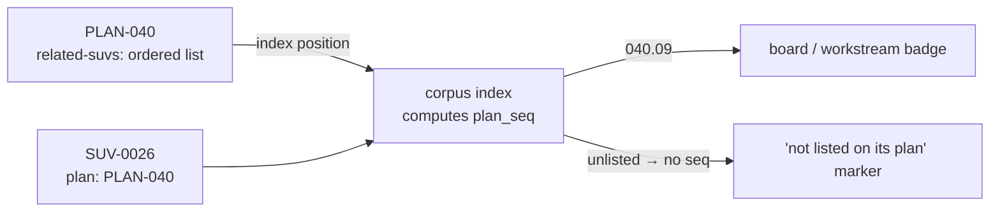

# PLAN-046 — SUV identity, collision-safe allocation, and per-plan coherence

## Goal

An SUV id can never be minted twice, and "which unit of this plan is this?" is
answerable at a glance — without changing what an SUV id *is*.

## Scope

- **[ADR-0030](../../decisions/0030-suv-identity-is-global-per-plan-coherence-is-derived.md)**
  — records the identity decision: global `SUV-NNNN` stays, per-plan coherence
  is computed, nesting and per-plan ids are rejected with their evidence.
- **Allocation, in the repo's own instructions.** `.agents/skills/roadmap-suv-create/SKILL.md:46`
  and `roadmap/suvs/README.md:65` both publish a working-tree-glob max+1 recipe.
  Both are wrong, and they are what an agent in this repo actually reads.
- **Allocation, in the console.** `suv_ids_on_candidate_branches`
  (`server.py:2872`) enumerates only `refs/heads/breakdown` and
  `refs/heads/feedback` — it misses `refs/heads/plan/*`, every remote ref, and
  every ad-hoc branch.
- **The derived view.** A per-plan sequence computed from the owning plan's
  `related-suvs:` order, exposed by the corpus index and rendered on the board
  and workstream views.

## Non-goals

- **Renumbering, nesting, or moving any SUV file.** Rejected in ADR-0030 with
  four verified silent-failure modes. Do not reopen without a superseding ADR.
- **An authored `plan-seq:` frontmatter field.** Rejected in ADR-0030 — a second
  ordering source of truth that nothing recomputes.
- **A reservation file, id lockfile, or allocator daemon.** Git history is the
  claim ledger.
- **Reopening PLAN-043.** Its four retrospective units (SUV-0019..0022) landed.
  This plan closes the gap they left, it does not revisit them.
- **`roadmap/suvs/<PLAN-NNN>/<status>/` per-plan storage.** Still open as a
  future option at unchanged cost; deliberately not taken here.

## Approach

### The defect, reproduced

A worktree cut from fresh `origin/main` on 2026-08-27 sees a maximum of
`SUV-0022`. The documented recipe therefore allocates `SUV-0023` — an id
PLAN-040 has already shipped on `plan/plan-040` (PR #180). The true maximum
across all refs is `SUV-0036`; 0034–0036 live on `plan/plan-039`.

SUV-0020 fixed this for the console's breakdown runner, but was written against
the `breakdown/*` / `feedback/*` convention — and `plan/*`, the convention
**SUV-0019 introduced one unit earlier**, is exactly where the unseen ids are.

### The rule

An id that has ever appeared on any ref is permanently claimed. Never reuse one,
including an id renumbered away. Gaps are normal.

```bash
git log --all --pretty=format: --name-only --diff-filter=A -- 'roadmap/suvs/*/SUV-*.md' \
  | grep -o 'SUV-[0-9]\{4\}' | sort -u | tail -1
```

Monotonic, no state file, no cleanup when a branch is abandoned, and defined
over history rather than over branch names — so no future naming convention can
silently invalidate it, which is the failure this plan exists to fix.

### The view



`plan_seq` is a display label only — never a filename, branch name, or lookup
key. An SUV whose owning plan does not list it gets no number and a visible
marker, so the missing reverse edge surfaces instead of being papered over.

## Acceptance

- [ ] ADR-0030 is accepted and indexed, and ADR-0028 points at it.
- [ ] No instruction file in this repo publishes a working-tree-only next-id
      recipe.
- [ ] The console allocator's floor accounts for SUVs on `plan/*`, on remote
      refs, and on ad-hoc branches — proven by a test that fails against the
      current implementation.
- [ ] The console board shows each SUV's per-plan sequence, and an SUV missing
      its reverse edge shows a marker rather than a number.
- [ ] Console test suite green; corpus validator reports 0 violations.
- [ ] `roadmap/suvs/README.md`, `roadmap-suv-create`, and `roadmap-plan-advance`
      agree with ADR-0030.

## Status log

- `2026-08-27` — created in `planned/`
- `2026-08-27` — moved from `planned` to `in-progress`: decomposed into
  SUV-0037..0039 in one allocation sweep, floor taken across every ref
  (`SUV-0036`) rather than the worktree glob (`SUV-0022`) — the plan's own rule
  applied to itself. ADR-0030 accepted on the owner's 2026-08-27 approval,
  resolving the open decision PLAN-043's final log entry left to the owner.
</content>
