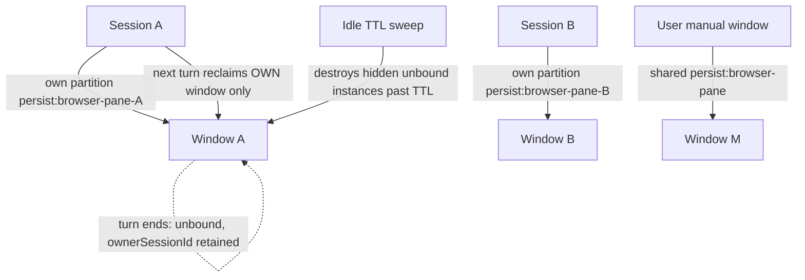

# PLAN-047 — Per-session browser isolation and lifecycle

## Goal

Concurrent agent sessions each get a genuinely private, stable in-app browser —
no shared cookie/login state, no cross-session window swapping, no
"Object has been destroyed" errors from windows another session adopted or
closed — and hidden browser windows stop accumulating unboundedly.

## Context

Vorno's browser isolation today is **per-window, not per-browser**. Traced on
2026-08-28 (session `260828-vivid-mountain`) against
`apps/electron/src/main/browser-pane-manager.ts`:

1. **One shared storage partition.** Every `BrowserInstance` — session-owned or
   manual — is created on `persist:browser-pane` (`SESSION_PARTITION`,
   line ~125). Cookies, logins, localStorage, service workers, and permission
   grants are shared across *all* sessions' browsers. Two sessions can never be
   logged into different accounts of the same site; one session's login/logout
   mutates every other session's browser mid-flight.
2. **Turn-boundary window pooling.** When a turn ends,
   `SessionManager.onProcessingStopped` calls `unbindAllForSession` — the
   window flips to `ownerType: 'manual'`, `boundSessionId: null`, and becomes
   adoptable by **any** session in the workspace via
   `findReusableUnboundInstance` (which prefers *visible* windows and does not
   prefer the session's own former window). Sessions swap windows across
   turns; remembered instance ids, `@eN` refs, and page state silently point
   at someone else's window.
3. **Destroyed-object races.** When an adopted window is closed (by another
   session's `close`, or by the user), stragglers throw Electron's raw
   "Object has been destroyed": `getInstance` returns without an alive check
   on the capability-invoke path, window/view event handlers can fire during
   teardown, and in-flight `executeJavaScript`/CDP calls race destroy.
   Non-`Error` rejections additionally render as `[object Object]` in tool
   results.
4. **No lifecycle bound.** `keepAliveOnWindowClose: true` intercepts close
   into hide, and nothing reaps idle hidden instances. Each is a full
   Chromium window + 3 BrowserViews + a CDP client — at scale, hidden windows
   accumulate the same way SDK subprocesses did before PLAN-038
   (LEARNING-061's browser-shaped cousin).

This is the architectural ceiling on running many concurrent browser-using
sessions — the DIR-05 durable-workflow story assumes N sessions can hold N
independent tool surfaces, and the browser is currently the one that can't.

## Scope

- Per-session Electron storage partition for **session-owned** browser
  windows (`persist:browser-pane-<sessionId>`); manual/user windows keep the
  existing shared partition.
- Window reuse scoped to the owning session: a session reclaims *its own*
  last window across turns; it never adopts another session's leftover.
- Alive-guards on the remaining unguarded instance paths; readable error text
  for non-`Error` rejections in the browser tool result path.
- Idle TTL reaping of hidden, unbound browser instances, reusing the
  PLAN-038 idle-sweep pattern and its per-workspace settings surface.

## Non-goals

- **Pre-authenticated isolated sessions.** Per-session partitions mean a
  session starts logged out; cookie seeding / auth hand-off from the user's
  manual browser is a separate, bigger conversation (candidate follow-up
  plan, not smuggled in here).
- A multi-profile manager abstraction or profile UI. The partition string
  *is* the profile boundary; management UI waits for demonstrated need.
- Changing manual (user-opened) window behavior, including their shared
  partition and keep-alive-on-close semantics.
- Remote/headless browser capability (`RemoteBrowserPaneManager`) changes
  beyond keeping its interface contract compiling.

## Approach

- `createInstance` derives the partition from `ownerSessionId` when
  `ownerType === 'session'`; `setupSessionPermissions`/`setupSessionObservers`
  already take the session object, so per-partition initialization
  parameterizes cleanly (the `partition*Initialized` booleans become per-name
  tracking).
- `findReusableUnboundInstance` matches `ownerSessionId === sessionId` (the
  retained last-owner edge) instead of any workspace window. This composes
  with the partition change — a foreign window on a foreign partition is
  useless to adopt anyway.
- Remaining `getInstance` consumers route through `requireAliveInstance`;
  the tool error path stringifies non-`Error` rejections usefully.
- The reaper follows PLAN-038: minute tick, per-workspace TTL setting,
  quiescence guards (never reap a bound window or one with in-flight work),
  destroy — not hide — on expiry for unbound session-owned instances.

Ordering: SUV-0041 and SUV-0042 are independent and land in either order;
SUV-0043 and SUV-0044 are independent of both. Each is one PR.

## Acceptance

- [ ] Two concurrent sessions can hold different logins on the same site;
      cookies set in one session's browser are invisible to the other's.
- [ ] Across alternating turns of two sessions in one workspace, each session
      re-binds the same window it used last turn; no cross-session adoption
      is observed in logs.
- [ ] Closing one session's window while another session runs produces a
      clear "window was closed" tool error — never a raw
      "Object has been destroyed" or "[object Object]".
- [ ] Hidden unbound session windows are destroyed after the idle TTL;
      manual windows are never reaped.
- [ ] Tests added/updated (`browser-pane-manager.test.ts` covers partition
      derivation, owner-scoped reuse, and reaper quiescence guards).
- [ ] Updated relevant docs (`browser-tools` guide notes per-session
      isolation and the logged-out-by-default consequence).

## Status log

- `2026-08-30` — created in `planned/`, from the 260828-vivid-mountain
  architecture trace; SUV-0041..0044 cut in the same pass.
- `2026-08-31` — moved from planned to in-progress: implementation started (session 260831-high-cascade)
