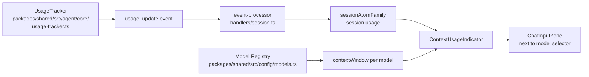

# PLAN-002 — Persistent token-usage display next to model selector

## Goal

Show a **persistent indicator next to the model selector** in the chat input zone that reports the session's current context-window consumption as `<used>K / <limit>K` plus a small horizontal progress bar that turns from green → yellow → burnt-orange as the session approaches its model's context window.

## Scope

- A new renderer-only component `ContextUsageIndicator`:
  - Reads the active session's current input-token count (from existing `UsageTracker` data already flowing through `usage_update` events)
  - Reads the active model's `contextWindow` (from the model registry / model metadata)
  - Renders `<used>K / <limit>K` (rounded to 1 decimal: `48.3K / 200K`)
  - Renders a 4-px-tall progress bar fixed-width (~80 px) showing `used / limit`
  - Color thresholds:
    - **<60%** → green (`#16a34a`)
    - **60–80%** → yellow (`#ca8a04`)
    - **≥80%** → burnt-orange (`#c2410c`)
  - Tooltip on hover shows raw numbers + cache breakdown if available
- Mounted **next to** the model selector inside the chat input zone (likely `ChatInputZone.tsx` or `FreeFormInput.tsx` — confirm during execution)
- Live-updates as `usage_update` events arrive (i.e., during streaming)
- Works for all providers (Claude, Pi-compat, Codex, etc.) — pulls from the unified usage stream
- Threshold values are **constants for v1**; PLAN-003 will surface them as workspace settings

## Non-goals

- **No** workspace-settings UI for thresholds (that's PLAN-003 — see related)
- **No** new `usage_update` event shape — reuse the existing `MessageUsage` and renderer plumbing
- **No** historical / per-turn usage chart — single live number + bar only
- **No** cost-in-USD display (separate concern)
- **No** model-context-window override UI — uses whatever the model registry exposes
- **No** mobile-responsive design pass — desktop Electron only

## Approach



**Data sources (all existing):**
- `packages/shared/src/agent/core/usage-tracker.ts` — `MessageUsage { inputTokens, outputTokens, cacheReadTokens, cacheCreationTokens }`
- `packages/shared/src/config/models.ts` + `models-pi.ts` — model registry with `contextWindow`
- `apps/electron/src/renderer/atoms/sessions.ts` — already has session-level usage data
- `apps/electron/src/renderer/event-processor/handlers/session.ts` — already processes `usage_update`

**Computation:**
- "Used" = the most recent `inputTokens` from `usage_update` (this is the prompt size the agent will send next, including conversation history). Fall back to running estimate if no usage event has arrived yet.
- "Limit" = `model.contextWindow` for the active session's selected model. Fall back to a documented default (e.g., 200_000) if the model registry returns undefined.
- Percentage = `used / limit`.

**Component sketch:**

```tsx
// apps/electron/src/renderer/components/chat/ContextUsageIndicator.tsx
export function ContextUsageIndicator({ sessionId }: Props) {
  const usage = useAtomValue(sessionUsageAtom(sessionId))
  const model = useActiveModel(sessionId)
  const used = usage?.lastInputTokens ?? 0
  const limit = model?.contextWindow ?? 200_000
  const pct = used / limit
  const color = pct < 0.6 ? '#16a34a' : pct < 0.8 ? '#ca8a04' : '#c2410c'
  return (
    <div title={`${used.toLocaleString()} / ${limit.toLocaleString()} tokens`} ...>
      <span>{fmtK(used)} / {fmtK(limit)}</span>
      <div style={{ width: 80, height: 4, ... }}>
        <div style={{ width: `${Math.min(100, pct * 100)}%`, background: color }} />
      </div>
    </div>
  )
}
```

**Mount location:** to be confirmed during execution. Best candidates:
- `apps/electron/src/renderer/components/app-shell/input/ChatInputZone.tsx` — wraps the input area, has the model selector
- `apps/electron/src/renderer/components/app-shell/input/FreeFormInput.tsx` — already imports `MessageUsage`-related types
- The exact placement is "to the right of the model picker" — read the JSX to find the model picker child.

**Tests (bun):**
- `__tests__/ContextUsageIndicator.test.ts` — pure logic: `pct → color` mapping at boundaries (59%, 60%, 79%, 80%, 100%, >100%)
- Manual smoke: open a session, observe the indicator updates in real time as a multi-tool turn streams.

**Risk areas:**
- Some providers may not emit `usage_update` until the message completes — initial display would show stale/zero. Handle gracefully (show `—` or last-known value).
- Model registry shape varies between Claude and Pi providers; the `contextWindow` resolution may need provider-specific handling.
- Over-100% case (we exceeded the context window) — clamp the bar at 100% but show the actual `used` number; let the user see they're over.

## Acceptance

- [ ] `ContextUsageIndicator` component exists with the documented props/behavior
- [ ] Rendered next to the model selector in the active chat input zone
- [ ] Updates live as `usage_update` events arrive during streaming
- [ ] Bar color changes at 60% and 80% boundaries
- [ ] Tooltip shows raw token counts on hover
- [ ] Bun tests cover the `pct → color` mapping at all boundaries
- [ ] Manual screenshot in PR description
- [ ] Behind no feature flag — this is a small additive UX win
- [ ] No new agent-side events; renderer-only change
- [ ] PR opened, CI green, merged, plan moved to `done/`

## Status log

- `2026-05-07` — created in `planned/`
