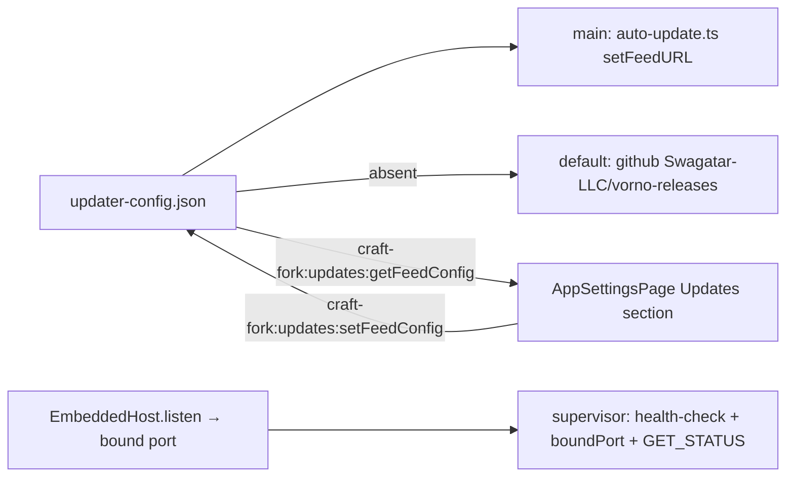

# PLAN-018 — Runtime-configurable auto-update feed + Updates settings UI + trigger-server port-0 health-check fix

## Goal

The update feed (provider/owner/repo/URL/channel) is readable from a fork-owned config file and editable in Settings — defaulting to the `Swagatar-LLC/vorno-releases` github feed — and the embedded trigger-server correctly health-checks and reports the actual bound port when `server-config.json` says `port: 0`.

## Motivation

Auto-update is structurally broken for fork builds: `electron-builder.yml`'s `publish:` block points at upstream's feed, which serves Craft-Docs-signed builds that Squirrel.Mac rejects against an ad-hoc-signed running app (LEARNING-020). ADR-0009 moves the feed to a fork-owned public releases repo; this plan makes the feed a runtime-configurable surface so feed changes never again require a rebuild, and gives it a Settings UI. Separately, the embedded trigger-server supervisor health-checks the *configured* port instead of the *bound* port, so `port: 0` (OS-assigned) always fails with "Server started but failed its health check" (LEARNING-021) — the same server-config surface the user was fighting; fixed here.

## Scope

1. **Updater config store** — new `updater-config.json` in `CONFIG_DIR`, owned by a new `packages/shared/src/config/updater.ts` module (load/save/validate, defaults applied on absent file/fields). Schema:
   - `provider: 'github' | 'generic'`
   - github: `owner: string`, `repo: string`
   - generic: `url: string` (https required)
   - `channel?: string` (default `latest`), `autoCheck?: boolean` (default `true`)
   - Default value: `{ provider: 'github', owner: 'Swagatar-LLC', repo: 'vorno-releases' }`.
2. **Main-process wiring** — `apps/electron/src/main/auto-update.ts` applies the config via `autoUpdater.setFeedURL()` before any check; runtime config overrides the packaged `app-update.yml` default. Dev/unpackaged behavior unchanged (no auto-update). Invalid config → log + fall back to default, never crash startup.
3. **RPC surface** — new `craft-fork:updates:getFeedConfig` / `craft-fork:updates:setFeedConfig` channels (fork namespace per compatibility.md), DTOs, main handlers with validation, `ipc-channels` EXPECTED_CHANNELS updated by hand (LEARNING-013).
4. **Settings UI** — a new **Updates section in `AppSettingsPage`** (next to the existing About/version + check-for-updates block), not a separate page: provider select, owner/repo or URL fields, channel, auto-check toggle; client-side validation; persisted via the new RPC. New i18n keys added to **all** locales (CI parity gate).
5. **Port-0 fix** — `EmbeddedHost.listen()` (`apps/electron/src/main/trigger-server/host.ts`) returns the actual bound port (`Promise<number>`, read from `httpServer.address()`, mirroring `packages/server-core/src/transport/server.ts`); the supervisor (`supervisor.ts`) health-checks, stores (`boundPort`), logs, and reports (GET_STATUS) the actual port. Configured non-zero ports (3847 default, 9100 in real use) behave byte-identically.
6. **Tests** — host returns bound port (incl. port 0); supervisor starts healthy with `port: 0` and reports the real port; updater config load/save/validation/defaults; RPC handler validation.

## Non-goals

- No rebrand, no `electron-builder.yml` changes, no release pipeline (PLAN-019 / ADR-0009).
- No signing work.
- No persistence of the bound port into `server-config.json` — the configured value (incl. `0`) is desired state; the bound port is runtime status, reported via GET_STATUS only. (Coordinated with the WebUI/tray workstream — flag before changing this.)
- No change to update-check cadence, download/install flow, or dismissal behavior.

## Approach

Why a new file rather than an existing store: `preferences.json` is user-identity preferences (name, timezone, language) and `server-config.json` is the trigger server's domain (and upstream-adjacent in shape). The update feed is machine-level app-infrastructure config — it gets its own `updater-config.json` beside `server-config.json`, same load/save/env-tolerant pattern.

Sequencing note: until PLAN-019 flips `publish:` in `electron-builder.yml`, packaged defaults (`app-update.yml`) still name upstream's generic feed — the runtime default takes precedence the moment this ships. An empty/nonexistent `vorno-releases` feed must degrade to a logged no-update, never an error state in the UI.

## Acceptance

- [ ] Fresh start with no `updater-config.json` → feed resolves to github `Swagatar-LLC/vorno-releases`; file is not required to exist.
- [ ] Editing the feed in Settings persists to `updater-config.json` and takes effect on the next check without restart.
- [ ] Invalid input (bad URL, missing owner/repo, unknown provider) is rejected at both the UI and the RPC handler; malformed file on disk falls back to defaults with a logged warning.
- [ ] `server-config.json` with `port: 0` → supervisor reaches `running`, health check passes against the OS-assigned port, GET_STATUS and the log line report the actual port; `port: 9100` behavior unchanged.
- [ ] `EmbeddedHost.listen()` returns the bound port; standalone server behavior untouched.
- [ ] New RPC channels live in the `craft-fork:updates:*` namespace; `ipc-channels` test updated; no wire-contract changes.
- [ ] i18n keys present in all locales (parity + sort + coverage gates green).
- [ ] Tests added/updated (host, supervisor port-0, updater config, RPC validation); shared + apps/server suites green.
- [ ] All seven validate-pr gates green; branding gate untouched.
- [ ] LEARNING-021 referenced from the fix commit/PR.

## Status log

- `2026-07-13` — created in `planned/`
