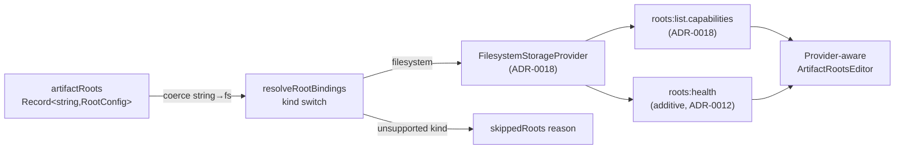

# PLAN-029 — Storage-provider config, management, and documentation surfaces

## Goal

Give the ADR-0018 `StorageProvider` seam its three human surfaces — a config schema a user declares roots/providers through, a management UI that surfaces capability + health, and the docs that cover both the user and contributor contracts — evolving `artifactRoots` into an additive schema that admits future provider kinds **without** implementing a second provider or breaking any wire contract.

## Scope

**Design-before-build.** ADR-0019 (proposed) carries the two door decisions; this plan builds the three surfaces once they are signed.

- **Config surface** — widen `WorkspaceSettings.artifactRoots` from `Record<string,string>` to `Record<string,RootConfig>` (string ∪ tagged object), with read-side coercion of the string form to `{ kind: 'filesystem', path }`. Reserve the `object-store` variant shape + `credentialRef` slot (no resolver, no backend). Update the settings-handler validator to accept both forms and the tagged fields.
- **Management surface** — evolve `ArtifactRootsEditor` into a provider-aware editor: per-root `kind` badge, capability affordances read from ADR-0018's `roots:list.capabilities`, and a health/containment status indicator. Add the additive `vorno:artifacts:roots:health` surface (channel or `roots:list` field — non-door choice) returning `rootId + status + reason` only (no paths/secrets, ADR-0016 §2).
- **Documentation surface** — user-facing (create / host / manage storage roots) and contributor-facing (the `StorageProvider` core + `WriteCapable`/`CopyCapable`/`PresignCapable` contract, the storage-agnostic containment invariant, the pure `isAdmissible` precondition).

## Non-goals

- **No second provider implementation.** `ObjectStoreRootConfig` is a *reserved shape*; the resolver skips unsupported kinds. Object-store backend, presign, and credential resolution stay gated on ADR-0013 / PLAN-023 (ADR-0017 §6).
- No credential/vault resolver — config carries `credentialRef` only; resolution is out of scope.
- No change to ADR-0018's admissibility predicate or containment contract (consumed, not modified).
- No change to the frozen `vorno:workbench:review:*` family or any upstream contract.

## Approach

The seam already exists (ADR-0018). This plan is the config/management/docs *layer* over it. `RootConfig` is a tagged union; the string form is coerced read-side so every pre-PLAN-029 config stays valid forever. `resolveRootBindings` gains a `kind` switch (filesystem builds today; unsupported kinds skip with a `skippedRoots` reason). The management UI consumes the serializable `StorageCapabilities` descriptor ADR-0018 already puts on `roots:list`; health is a small additive REMOTE_ELIGIBLE surface.

Door governance: the two one-way choices (config-schema widening; credential-by-reference + kind namespace) are **ADR-0019 doors** — owner-signed before build. Health-channel shape, field names, and UI layout are non-doors. See ADR-0019 for the full analysis and the reasoning for a new ADR over an ADR-0018 amendment.

## Acceptance

- [ ] ADR-0019 doors signed by owner (status → accepted) before implementation starts.
- [ ] PR #114 / ADR-0018 merged to main (seam present).
- [ ] `RootConfig` union defined in `@craft-agent/core/types`; `artifactRoots` DTO + `WorkspaceSettings` type widened additively.
- [ ] Read-side coercion: every existing `Record<string,string>` config resolves unchanged (regression test).
- [ ] Settings validator accepts string form, `filesystem` tagged form, and reserved `object-store` form (rejects inline-secret fields).
- [ ] `resolveRootBindings` kind-switch: filesystem builds; unsupported kind → `skippedRoots` reason, never throws.
- [ ] Management UI renders `kind`, capabilities (from `roots:list.capabilities`), and health per root.
- [ ] `vorno:artifacts:roots:health` (or `roots:list` health field) returns rootId+status+reason only — no paths/secrets (test).
- [ ] Tests added/updated (coercion, validator, resolver kind-switch, health payload redaction).
- [ ] Behind the existing `artifactsEnabled` flag.
- [ ] compatibility.md vorno-surface section updated (DTO widening + any new health channel).
- [ ] User + contributor docs written.

## Status log

- `2026-07-24` — created in `planned/` (session 260724-brave-falcon). Blocked on ADR-0019 sign-off + PR #114 merge.
