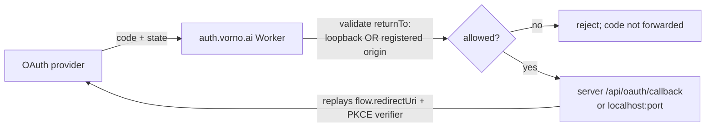

# PLAN-036 — Vorno-owned OAuth redirect relay (auth.vorno.ai)

## Goal

Stand up a Vorno-owned OAuth redirect relay at its own origin (`auth.vorno.ai`) implementing
the ADR-0025 security model, and cut Vorno's WebUI + Slack source OAuth over to it — removing
the dependency on upstream's `agents.craft.do` relay — without ever behaving as an open
redirector.

## Provenance

This plan implements **ADR-0025** (accepted 2026-08-17), which is PLAN-023 Phase 2's relay
sub-decision and discharges ADR-0013's SEC-004 (unsigned-state upstream relay transit). The
full threat model, options, and code-grounded migration analysis live in ADR-0025 and the
commissioning session brief (`sessions/260817-sunny-galaxy/data/oauth-relay-security-design.md`).
Nothing here re-derives that decision; this is execution.

The relay design is the mirror of Lane F's session-share backend (PLAN-035): both replace an
`agents.craft.do`-hosted surface with a Vorno-owned, own-origin Worker, and both share a
single provisioning ask and a single residual risk (dependence on upstream uptime for the
deprecated half of each migration — ADR-0025 "Shared cross-lane risk").

## Scope

- **The relay Worker** (`auth.vorno.ai`), a stateless Cloudflare Worker that:
  - receives the provider redirect at a fixed path, and forwards the authorization code
    **only** to a `returnTo` that is either (a) loopback (`localhost`/`127.0.0.1`/`[::1]`,
    any port) or (b) an origin **pre-registered for the requesting `instanceId`**. No
    wildcards, no raw-URL trust. (ADR-0025 decision 2.)
  - carries the registered-origin binding as a **relay-signed HMAC-SHA256 token** (`kid`-
    tagged for rotation), verified in-Worker within the Workers-Free 10 ms CPU budget.
    (ADR-0025 decision 3, §3.4.)
  - never receives anything that lets it redeem a code — the PKCE verifier stays server-side.
    (ADR-0025 decision 4.)
- **Slack tier**: the relay forwards Slack's `?port=` to `http://localhost:{port}/callback`
  **only**, rejecting any off-loopback target. (ADR-0025 decision 5, immediate hardening.)
- **Branding constants**: repoint `OAUTH_RELAY_CALLBACK_URL` / `SLACK_OAUTH_RELAY_CALLBACK_URL`
  off `SERVICE_BASE_URL` to `auth.vorno.ai` (`packages/core/src/branding.ts`), the same shape
  ADR-0023 used to split `DOCS_URL` — a clean flip for this lane per ADR-0025's resource-
  stranding analysis (tokens don't reference the relay; exchange replays `flow.redirectUri`).
- **Remote-tier registration**: a callback-origin registry keyed on `instanceId`, populated by
  the PLAN-023 Phase 0 pairing/registration flow (one ceremony, two consumers). KV-backed.
- **Migration path**: dual-registration window (users add the new callback to their own OAuth
  apps before the flip), plus keeping the old relay reachable through the short flow-completion
  window. Docs for the user-facing re-registration.

## Non-goals

- **No new relay trust of the PKCE verifier** — it must never transit the relay.
- **No wildcard allowlist** (`*.ts.net` etc.) — exact registered origins only.
- Moving Slack/Microsoft to per-user OAuth apps — a *separate*, opt-in migration (ADR-0025
  decision 5); tracked but not required to close this plan.
- Device Authorization Grant (RFC 8628) adoption — noted as a future door in ADR-0025, out of
  scope here.
- Standing up the public endpoint before `vorno.ai/privacy` exists — a hard gate, not a task.

## Approach

Phasing (each phase independently reviewable):

1. **Worker + code, no cutover.** Build and unit-test the Worker against the ADR-0025 rules;
   deploy to `auth.vorno.ai` behind the privacy-policy gate; branding constants unchanged.
   Relay is live but nothing points at it yet.
2. **Slack tier + localhost-only.** Point Slack's relay at `auth.vorno.ai`, constrained to
   loopback forwarding; verify a real Slack auth completes; old relay still honored.
3. **WebUI generic tier + registration.** Loopback + registered-origin binding; wire the
   registry to the PLAN-023 pairing flow; flip `OAUTH_RELAY_CALLBACK_URL` inside a dual-
   registration window.
4. **Slack-secret follow-up (separate track).** Evaluate per-user Slack apps to retire the
   build-baked shared client secret.

## Acceptance

- [ ] Worker rejects any `returnTo` that is neither loopback nor a registered origin; unit
      tests cover the wildcard-rejection and raw-URL-rejection cases.
- [ ] HMAC binding verified in-Worker; `kid` rotation window proven (old + new keys accepted
      during overlap); no client holds the signing key.
- [ ] PKCE verifier never present in any relay request (asserted by test).
- [ ] Slack relay forwards only to loopback; off-loopback target rejected.
- [ ] A real WebUI OAuth (Google/generic/MCP) completes against `auth.vorno.ai` from a
      loopback origin and from a registered remote origin.
- [ ] Branding constants repointed; a Slack + a Google flow both green post-flip; existing
      stored tokens unaffected (refresh path carries no `redirect_uri`).
- [ ] Migration doc: user re-registration steps; dual-registration window; old-relay
      reachability caveat (upstream-uptime dependency).
- [ ] `vorno.ai/privacy` exists before the public endpoint is announced/cut over.
- [ ] ADR-0013 SEC-004 marked addressed on completion.

## What Jeff must create (consolidated with Lane F / PLAN-035)

| # | Thing | Notes |
|---|---|---|
| 1 | Worker `vorno-auth-relay` + `auth.vorno.ai` custom domain | custom domain auto-creates DNS; own origin, separate from apex and `share.vorno.ai` |
| 2 | HMAC signing key as a Worker secret | remote-tier binding tokens; `kid`-tagged |
| 3 | KV namespace for the callback-origin registry | remote tier; registration is rare (1,000 writes/day free is ample) |
| 4 | `CLOUDFLARE_API_TOKEN` for deploys | **added as a GitHub Actions secret 2026-08-17 (Jeff)** — CI has a deploy path for phase 1. Separately, the IPv6 allowlist on the workspace `cloudflare` source token was removed, restoring the read/API path from rotating-IPv6 networks |
| 5 | Privacy policy at `vorno.ai/privacy` | **blocks cutover** — shared with Lane F |

## Risks

- **Upstream-uptime dependency (shared with PLAN-035).** In-flight auths complete only while
  Craft keeps serving `agents.craft.do`; we can't size that window, only keep it short.
  Strongest argument for cutting over sooner. (ADR-0025 "Shared cross-lane risk".)
- **Slack shared secret** remains exposed until the separate per-user-app track lands.
- **Registration UX** for the remote tier must not become a footgun; it reuses the PLAN-023
  pairing flow rather than inventing a second one.

## Status log

- `2026-08-17` — created in `planned/`. Implements ADR-0025 (accepted same day). Sequenced
  behind the privacy-policy gate and Cloudflare provisioning; Jeff added `CLOUDFLARE_API_TOKEN`
  to the repo and removed the IPv6 allowlist on the cloudflare source token.
