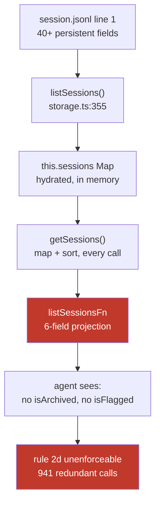
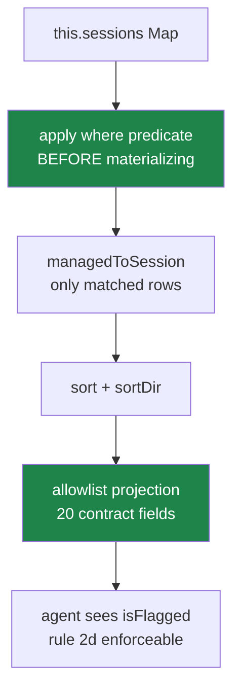

# PLAN-037 — Ship the session query predicate surface and retire the on-disk workarounds

## Goal

`list_sessions` accepts a composable `where` predicate over an allowlisted contract projection,
excludes archived sessions by default, and returns `isFlagged` — so the
`session-archive-sweeper`'s rule 2d becomes enforceable and both live automations can stop
reading `session.jsonl` headers off disk.

## Why now

The `session-archive-sweeper` has carried rule 2d — *"never archive a flagged session"* — since
it was written, and **could never once check it**, because the API returns no flagged field.
Two flagged sessions were archived as a result (`260607-lively-sparrow`, `260708-coral-tide`).
Exactly one unarchived flagged session remains in the workspace today (`260206-sunny-stone`),
protected only by the out-of-band disk read the sweeper had to grow. Remove that workaround
before this ships and the session is archived on the next run.

The cost argument is secondary but real and monotonic: a naive enumeration issues **941**
redundant `archive_session` calls to find **9** real ones, and the denominator is history, so
the ratio only worsens. `vshare-reaper`'s backlog grew 129 → 142 between 2026-08-17 morning and
evening, exactly as its own inline comment predicted.

See ADR-0026 for the full evidence, the measurements, and the decision.

## Scope

- `where` predicate map (conjunctive) on `ListSessionsOptions`, wired through
  `session-tools-core` → `SessionManager.listSessionsFn`.
- Absence-normalizing boolean semantics (`isArchived: false` matches *absent*, which is how all
  104 unarchived sessions are stored).
- `sortDir: 'asc' | 'desc'` alongside the existing `sortBy`.
- An enumerated allowlist projection replacing the six-field `.map()` — including `isArchived`
  and `isFlagged`, excluding `shareEditToken`, `preview`, `workingDirectory` and the rest of the
  internal set named in ADR-0026 §3.
- `isArchived: false` as the **default**, with explicit opt-in for history.
- Predicate evaluation moved ahead of `managedToSession` so selective queries do not materialize
  the whole corpus.
- The same `isArchived`/`isFlagged` fields added to `get_session_info`, which omits them too.
- An unbounded-fetch mode so a sweep can retrieve its whole work list in one call.
- Reverting `vshare-reaper` and `session-archive-sweeper` to the API.

## Non-goals

- **Disjunction (`$or`) and nested boolean algebra.** Both live consumers are pure conjunctions.
  The extension path is additive and named in ADR-0026 §1; building it now is speculative.
- **A SQLite or other index.** Filtering is 0.038 ms in memory and sub-millisecond at 10× the
  corpus. Measured, not assumed.
- **Any change to mutation paths.** ADR-0021's choke point, the `allowClosed` gate, and the
  `set_session_status` unconditional refusal are all untouched.
- **Read-side origin/caller gating.** No consumer needs it, and the row set it would protect is
  already fully open. Watch item in ADR-0026, not work here.
- **Unarchiving `260607-lively-sparrow` / `260708-coral-tide`.** Recoverable, but reversing an
  archive is Jeff's call on his own board. See open question 1.
- **Changing `SESSION_PERSISTENT_FIELDS` or the on-disk header format.** This work makes the
  header *less* load-bearing, not different.

## Approach

The data is already in memory at the line where it is discarded. `getSessions()` serves from a
hydrated `Map`; `headerToMetadata` spreads the entire header into `SessionMetadata`; then
`SessionManager.ts:4450` narrows it to six fields. The fix is concentrated at that projection
plus a predicate step in front of it.

### Phase 1 — Predicate surface and projection

Types in `session-tools-core` (`ListSessionsArgs`, `tool-defs.ts` JSON schema), evaluation in
`SessionManager.listSessionsFn`. Existing `status` / `label` / `search` / `sortBy` / `limit` /
`offset` retained verbatim; `status`+`where.status` together is an error, not a precedence rule.

The absence-normalization rule is the subtle part and gets its own tests: a boolean predicate
compares `value === true` against `Boolean(field)`, so `isArchived: false` matches the 104
sessions where the key is **absent**, never written as `false`.

### Phase 2 — Default flip and unbounded fetch

`where.isArchived` defaults to `false`. Add the "all matches" mode for sweeps — a sentinel
`limit` rather than a second argument, so pagination stays one concept.

Land Phase 2 behind the same release as Phase 1: shipping the fields without the default flip
leaves the trap armed, and shipping the flip without the fields breaks history retrieval with
no opt-in available.

### Phase 3 — `get_session_info` parity

Same allowlist, same omissions. A caller that filters a list and then fetches detail should not
lose fields on the second call.

### Phase 4 — Retire the workarounds

**This is the phase that pays off the debt, and it is deliberately last.** Both automations are
correct today; the revert is justified by decoupling them from a format with no compatibility
guarantee, not by fixing a live break.

- `vshare-reaper` step 3: drop the disk pre-filter; the label query with the new default returns
  1 row instead of 143 across two paginated calls.
- `session-archive-sweeper` step 1: replace the inline Python header scan with a single
  `list_sessions` call carrying the full predicate — `isArchived: false`, `isFlagged: false`,
  `status: { in: ['done','cancelled'] }`, `createdAt: { before: <now - 3d> }`.

Each revert keeps a timestamped `automations.json` backup and must pass `config_validate`.
Verify by comparing the API work list against the disk work list on the same corpus **before**
removing the disk path — they must match exactly, or the predicate is wrong.

`automations.json` is **not** edited by the session that drafts this plan; Phase 4 is
implementation work.

## Acceptance

- [ ] `where` accepts all ADR-0026 §1 fields; multiple keys AND correctly.
- [ ] `isArchived: false` matches sessions whose header **omits** the key — asserted against a
      fixture with an absent key, not a `false` one. (Guards the defect that would otherwise
      match zero of 104 sessions.)
- [ ] `list_sessions` with no arguments returns **no archived sessions** on a corpus that
      contains them.
- [ ] `isFlagged` is present in every returned record; a flagged session is excluded by
      `isFlagged: false`.
- [ ] The projection is an enumerated allowlist. A test asserts `shareEditToken`, `preview`,
      `workingDirectory`, `sdkSessionId` and `sdkCwd` are **absent** from results even when
      populated on the source record. (Regression guard against a future `...header` spread.)
- [ ] `total` remains post-filter — already true at `SessionManager.ts:4442`; a test pins it so
      the predicate refactor cannot regress it.
- [ ] `sortDir: 'asc'` on `sortBy: 'recent'` returns oldest-first; default behaviour unchanged
      when `sortDir` is omitted.
- [ ] A sweep can fetch its entire work list in one call, no offset loop.
- [ ] `get_session_info` returns `isArchived` and `isFlagged`.
- [ ] Existing callers passing only `status` / `label` / `search` / `limit` / `offset` behave
      identically **except** for the archived default; that one difference is named in the
      release notes.
- [ ] The sweeper's full predicate expressed through the API returns the same id set as the
      disk filter on the same corpus (9 ids as of 2026-08-17, cutoff-dependent).
- [ ] Both automations reverted to the API; `config_validate` passes; backups retained.
- [ ] Tool description in `packages/shared/src/prompts/system.ts:984` updated — it currently
      says "Always use filters (status, label, search)".
- [ ] Tests added/updated (shared + server-core suites).
- [ ] `roadmap/upstream/compatibility.md` checked: this changes an agent-facing tool schema, so
      confirm whether it is a wire-compatibility surface before merge.

## Risks

- **The default flip is a quiet behaviour change** for history retrieval. Loud in the release
  notes, silent at the call site. Accepted in ADR-0026 §4 with the reasoning; the alternative
  fails silently in production instead.
- **Wire compatibility.** Agent-facing tool schemas may fall under the upstream contract. If so
  the additive parts are safe and the default flip needs its own decision. Checked in acceptance,
  flagged as open question 2.
- **Predicate/disk divergence during Phase 4.** Mitigated by requiring an exact work-list match
  before the disk path is removed.
- **A wrong predicate silently archives more than intended.** Phase 4 lands with the sweeper's
  existing 150-archive cap untouched.

## Open questions

1. Unarchive `260607-lively-sparrow` and `260708-coral-tide`? Both were archived by the
   unenforceable rule and are recoverable. Reversing an archive is a board decision, so this
   plan does not assume it. **No-answer default:** leave archived.
2. Is the `list_sessions` tool schema a wire-compatibility surface under
   `roadmap/upstream/compatibility.md`? Additive `where`/`sortDir` are safe either way; the
   archived-default flip may need its own note. **No-answer default:** treat as compatible,
   ship additively, confirm before the default flip merges.
3. Should `archivedAt` and `kanbanColumn` join the contract set now? Held back in ADR-0026 §3
   as reviewable — no named consumer, and widening later is easy. **No-answer default:** hold.

## Status log

- `2026-08-17` — created in `planned/`, alongside ADR-0026 (proposed).
