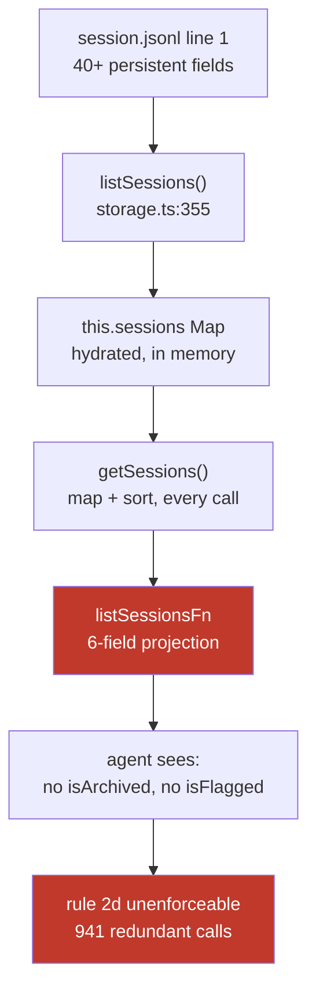
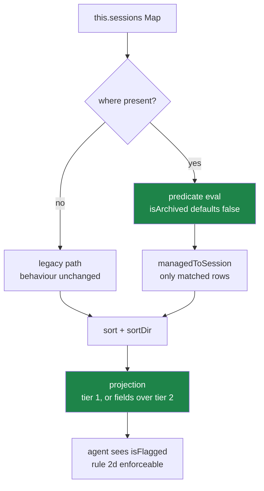

# PLAN-037 — Ship the session query predicate surface and retire the on-disk workarounds

## Goal

`list_sessions` accepts a composable `where` predicate and a `fields` shaping option over a
tiered allowlist, returns `isFlagged`, and defaults `where.isArchived` to `false` **within the
new surface only** — so the `session-archive-sweeper`'s rule 2d becomes enforceable, both live
automations can stop reading `session.jsonl` headers off disk, and no existing caller changes
behaviour.

## Why now

The `session-archive-sweeper` has carried rule 2d — *"never archive a flagged session"* — since
it was written, and **could never once check it**, because the API returns no flagged field.
Two flagged sessions were archived as a result. Both were unarchived 2026-08-17 at Jeff's
direction, so the workspace now holds three flagged sessions and zero flagged-and-archived ones.

**That repair is what makes this urgent rather than merely overdue.** `260607-lively-sparrow`
and `260708-coral-tide` are now unarchived, `status: done`, and older than the sweeper's 3-day
cutoff. They match every condition the sweeper archives on **except the flag** — the one
condition the API cannot express. They are protected today solely by the sweeper's out-of-band
disk read. Retire that workaround before this API ships and the 05:20 run re-archives the exact
two sessions we just restored. Hence Phase 4 is last, and gated.

The cost argument is secondary but real and monotonic: a naive enumeration issues **941**
redundant `archive_session` calls to find **9** real ones, and the denominator is history.

See ADR-0026 for the full evidence, measurements, and decision.

## Scope

- `where` predicate map (conjunctive) on `ListSessionsOptions`, wired through
  `session-tools-core` → `SessionManager.listSessionsFn`.
- Boolean normalization covering **all three** on-disk states: `true`, absent, and explicit
  `false` (unarchiving writes `false` rather than deleting the key).
- `sortDir: 'asc' | 'desc'` alongside the existing `sortBy`.
- `fields` shaping over the ADR-0026 §3 tiers: tier 1 default projection (today's six plus
  `isArchived` and `isFlagged`), tier 2 requestable, tier 3 never exposed.
- `where.isArchived` defaulting to `false` **when `where` is present**; legacy argument paths
  untouched.
- Predicate evaluation moved ahead of `managedToSession` so selective queries do not materialize
  the whole corpus.
- `isArchived`/`isFlagged` added to `get_session_info`, which omits them too.
- An unbounded-fetch mode so a sweep can retrieve its whole work list in one call.
- Reverting `vshare-reaper` and `session-archive-sweeper` to the API.

## Non-goals

- **A global archived-default flip.** Rejected in ADR-0026 §4 — non-additive, and its failure
  mode (empty result indistinguishable from "no such session") is the worst available. If the
  bare-call default later causes real bugs, it gets its own ADR.
- **Disjunction (`$or`) and nested boolean algebra.** Both live consumers are pure conjunctions.
  The extension path is additive and named in ADR-0026 §1.
- **A second, parallel query API.** Nothing has collided with the additive path yet. ADR-0026 §6
  names the condition under which this becomes right.
- **A SQLite or other index.** Filtering is 0.038 ms in memory and sub-millisecond at 10×.
- **Any change to mutation paths.** ADR-0021's choke point, the `allowClosed` gate, and the
  `set_session_status` unconditional refusal are untouched.
- **Read-side origin/caller gating.** No consumer needs it; the row set it would protect is
  already fully open. Watch item in ADR-0026, not work here.
- **Changing `SESSION_PERSISTENT_FIELDS` or the on-disk header format.** This work makes the
  header *less* load-bearing, not different.

## Approach

The data is already in memory at the line where it is discarded. `getSessions()` serves from a
hydrated `Map`; `headerToMetadata` spreads the entire header into `SessionMetadata`; then
`SessionManager.ts:4450` narrows it to six fields. The fix is concentrated at that projection
plus a predicate step in front of it.

### Phase 1 — Predicate surface, shaping, projection

Types in `session-tools-core` (`ListSessionsArgs`, `tool-defs.ts` JSON schema), evaluation in
`SessionManager.listSessionsFn`. Existing `status` / `label` / `search` / `sortBy` / `limit` /
`offset` retained verbatim; `status` together with `where.status` is an error, not a precedence
rule.

Two subtleties carry the risk:

- **Boolean normalization.** A boolean predicate compares against `Boolean(field)`, so
  `isArchived: false` matches both the 105 sessions where the key is absent and the 2 where it
  is explicitly `false`. A test written against absence alone silently mishandles every session
  that was ever unarchived.
- **`fields` validation is a security control.** Names are validated against tier 2; an unknown
  or tier-3 name is a hard error. A name-indexed projection over the header would hand
  `shareEditToken` to any caller that guessed the key.

### Phase 2 — `where`-scoped default and unbounded fetch

`where.isArchived` defaults to `false` when `where` is present. Add the "all matches" mode for
sweeps — a sentinel `limit` rather than a second argument, so pagination stays one concept.

Land with Phase 1: the fields without the safe default leave the trap armed for every new
consumer.

### Phase 3 — `get_session_info` parity

Same tiers, same omissions. A caller that filters a list then fetches detail should not lose
fields on the second call.

### Phase 4 — Retire the workarounds (gated)

**This phase pays off the debt and is deliberately last.** Both automations are correct today;
the revert is justified by decoupling them from a format with no compatibility guarantee.

**Gate: do not start Phase 4 until Phases 1–2 are merged and `isFlagged` is verified live.** The
two restored flagged sessions match every other sweeper condition; removing the disk read early
re-archives them on the next 05:20 run.

- `vshare-reaper` step 3: drop the disk pre-filter; the label query with `where` returns 1 row
  instead of 143 across two paginated calls.
- `session-archive-sweeper` step 1: replace the inline Python header scan with a single
  `list_sessions` call — `where: { isArchived: false, isFlagged: false, status: { in:
  ['done','cancelled'] }, createdAt: { before: <now - 3d> } }`.

Each revert keeps a timestamped `automations.json` backup and must pass `config_validate`.
Verify by comparing the API work list against the disk work list on the same corpus **before**
removing the disk path — they must match exactly, and must exclude both restored sessions.

`automations.json` is **not** edited by the session that drafts this plan; Phase 4 is
implementation work.

## Acceptance

- [ ] `where` accepts all ADR-0026 §1 fields; multiple keys AND correctly.
- [ ] `isArchived: false` matches sessions whose header **omits** the key **and** sessions where
      it is explicitly `false`. Both representations asserted separately. (Guards the defect that
      would otherwise match zero of 105, or silently drop every restored session.)
- [ ] A call passing `where` without `isArchived` returns no archived sessions.
- [ ] A call passing **no** `where` — including `list_sessions()` with no arguments and
      `{status:'done'}` — returns byte-identical results to pre-change `main`. This is the
      backwards-compatibility guarantee and gets an explicit regression test.
- [ ] `isFlagged` present in every returned record; a flagged session is excluded by
      `isFlagged: false`. Asserted against the three live flagged sessions.
- [ ] `fields` returns exactly the requested tier-1/tier-2 names, no more.
- [ ] Requesting a tier-3 field (`shareEditToken`, `preview`, `workingDirectory`, `sdkSessionId`,
      `sdkCwd`) is a **hard error**, and those names never appear in any response even when
      populated on the source record. Regression guard against a future `...header` spread or a
      name-indexed `fields`.
- [ ] `total` remains post-filter — already true at `SessionManager.ts:4442`; a test pins it so
      the predicate refactor cannot regress it.
- [ ] `sortDir: 'asc'` on `sortBy: 'recent'` returns oldest-first; default unchanged when
      `sortDir` is omitted.
- [ ] A sweep can fetch its entire work list in one call, no offset loop.
- [ ] `get_session_info` returns `isArchived` and `isFlagged`.
- [ ] The sweeper's full predicate expressed through the API returns the same id set as the disk
      filter on the same corpus, and **excludes** `260607-lively-sparrow` and `260708-coral-tide`.
- [ ] Both automations reverted to the API; `config_validate` passes; backups retained.
- [ ] Tool description in `packages/shared/src/prompts/system.ts:984` updated — it currently says
      "Always use filters (status, label, search)" and should steer callers to `where`.
- [ ] Tests added/updated (shared + server-core suites).
- [ ] `roadmap/upstream/compatibility.md` — add a note that `list_sessions` is treated as a
      compatibility surface in practice, and that this change is additive-only per ADR-0026 §6.

## Risks

- **The two restored flagged sessions are re-archivable until Phases 1–2 land.** Highest-impact
  risk in the plan. Mitigated by the Phase 4 gate and by an acceptance check naming both ids.
- **A lazy `fields` implementation leaks tier-3 fields.** Mitigated by making tier-3 rejection an
  explicit test rather than a convention.
- **Two archived-semantics on one tool** (`where` path safe, legacy path not) is a permanent
  comprehension cost. Accepted in ADR-0026 §4 as the price of strict additivity; the tool
  description carries the explanation.
- **Predicate/disk divergence during Phase 4.** Mitigated by requiring an exact work-list match
  before the disk path is removed.
- **A wrong predicate silently archives more than intended.** Phase 4 lands with the sweeper's
  existing 150-archive cap untouched.

## Decisions taken (2026-08-17, Jeff)

Four questions were raised when this plan was drafted; all four are answered and folded in.

1. **Unarchive `260607-lively-sparrow` and `260708-coral-tide`?** → **Yes, done.** Both restored
   2026-08-17; flagged-and-archived count is now 0. This is what makes the Phase 4 gate load-bearing.
2. **Is `list_sessions` a wire-compatibility surface?** → **Assume yes, silently, in the real
   world.** Ship additively so existing behaviour continues as-is; note in ADR-0026 §6 to revisit
   if upstream changes its contract. A parallel API is YAGNI today.
3. **Do `archivedAt` / `kanbanColumn` join the contract set?** → **Yes, via shaping.** Both are
   genuinely useful; the surface gains a `fields` return-shaping option (ADR-0026 §3) so they cost
   nothing when unrequested and the contract-set argument stops being fought at the default.
4. **Is the global archived-default flip acceptable?** → **No — superseded by 2.** The flip is
   non-additive by definition. Replaced with the `where`-scoped default, which gets the
   correctness win for all new consumers at zero compatibility cost.

## Open questions

None outstanding.

## Status log

- `2026-08-17` — created in `planned/`, alongside ADR-0026 (proposed).
- `2026-08-17` — revised after Jeff's answers: `fields` shaping added, global default flip
  replaced with a `where`-scoped default, wire-compat stance recorded as additive-only. The two
  flagged sessions were unarchived, which turned Phase 4's ordering into a hard gate.
