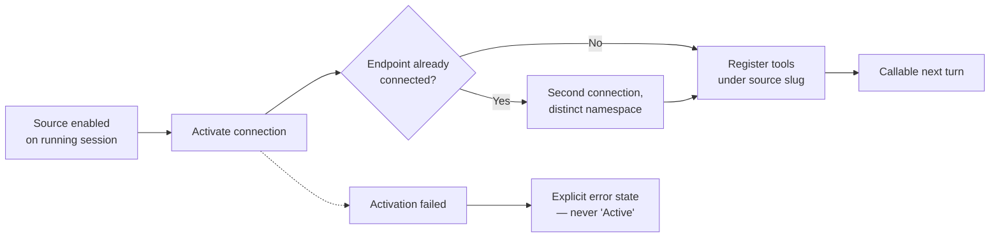

# PLAN-048 — Live session context activation

## Goal

Context changed on a running session takes effect on the next turn, instead of
requiring a new session.

## Context

[ADR-0022](../../decisions/0022-context-profiles-as-the-single-context-action.md)
made `apply-context` the one action that activates session context, with sources
as one of its knobs. PLAN-030 shipped the action. What neither settled is what
happens when that context changes **while a session is running** — and the answer
today is: nothing observable.

Enabling a source mid-session updates session state and the sources panel, but no
MCP connection is established and no tools are registered. The panel reports
`Active` for a source that cannot be called. The agent has no way to tell
"enabled but not connected" from "connected and the call genuinely failed."

A second defect compounds it. Tool namespaces are derived from the **provider**,
so two sources pointing at the same MCP endpoint collide: one connection wins and
registers `mcp__notion__*`, and the other source is shadowed entirely. Calls then
resolve against the wrong account and return `404 object_not_found`, which reads
as a permissions problem rather than a routing problem.

Observed 2026-09-01 (session `260901-dynamic-lagoon`): a session holding `notion`
(YouVersion workspace) needed a page in the Swagatar workspace. `notion-personal`
was enabled mid-session and showed `Active`. No `mcp__notion_personal__*` namespace
appeared, and re-fetching returned 404 carrying the *same* integration id as before
enablement — proving the original connection was still serving. The work could not
proceed and cost a handoff to a freshly-spawned session.

Fixing live activation alone does **not** fix that scenario: the source would
connect and its tools would still be shadowed. Both defects are load-bearing.

Project binding is the same shape of problem one level up. `projectId` is accepted
only by `spawn_session` and `create_task`; `get_session_info` reports a binding but
nothing sets one. A session that discovers mid-run which project it is working in
cannot say so.

## Scope

- Activate a source's MCP connection when it is enabled on a running session;
  register its tools so they are callable on the next turn.
- Tear down the connection and deregister tools on disable.
- Namespace MCP tools by **source slug** rather than provider, so multiple sources
  against one endpoint coexist.
- An explicit, intent-gated action for a running session to bind itself to a
  project.
- Honest source state in the panel: a source that failed to activate shows an
  error, never `Active`.

## Non-goals

- Changing the `apply-context` action shape or the context-profile schema.
  ADR-0022 stands; this plan makes its runtime honor it.
- Hot-reloading source *config* edits (credentials, URLs) — only enable/disable
  transitions are in scope.
- Cross-workspace project binding.
- Making self-binding a default or ambient behavior. Per Jeff, 2026-09-01: this is
  for sessions that are aware of the capability and deliberately invoke it, not
  something that happens most of the time.

## Approach

Self-binding follows
[ADR-0021](../../decisions/0021-session-actions-gated-by-declared-intent.md):
the gate is declared intent, not transport. A session that has not declared the
intent cannot bind itself, regardless of how the call arrives. This keeps the
capability deliberate and reviewable rather than ambient.

## Acceptance

- [ ] Enabling a source mid-session makes its tools callable on the next turn,
      with no restart
- [ ] Two sources sharing one MCP endpoint both work simultaneously; neither
      shadows the other
- [ ] The motivating scenario passes end to end (see SUV-0047)
- [ ] Disabling a source deregisters its tools
- [ ] A source that fails to activate surfaces an explicit error state
- [ ] A running session can bind itself to a project only with declared intent
- [ ] Tests added/updated, including regression coverage for the same-endpoint case
- [ ] Updated relevant docs in `roadmap/` or `docs/`

## Status log

- `2026-09-01` — created in `planned/`
